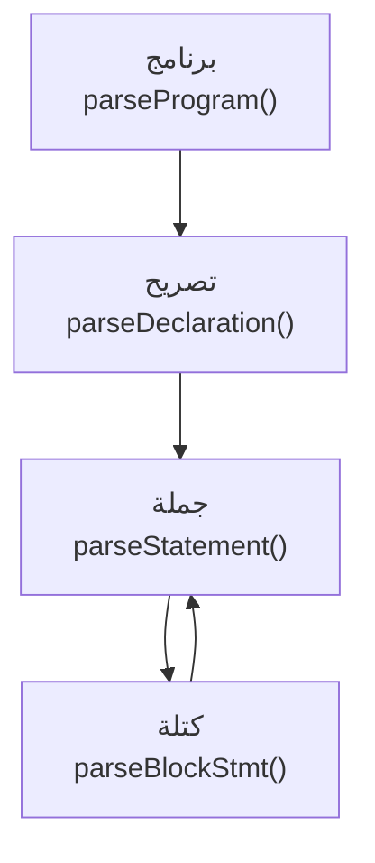
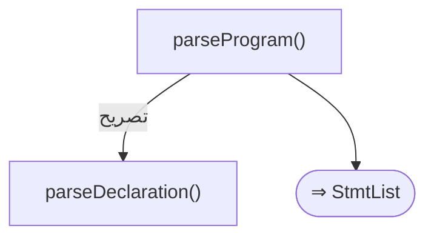
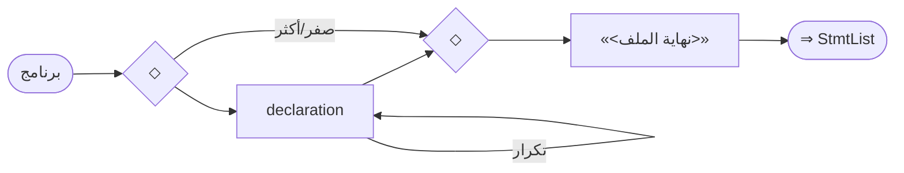
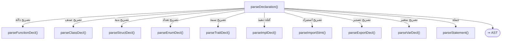
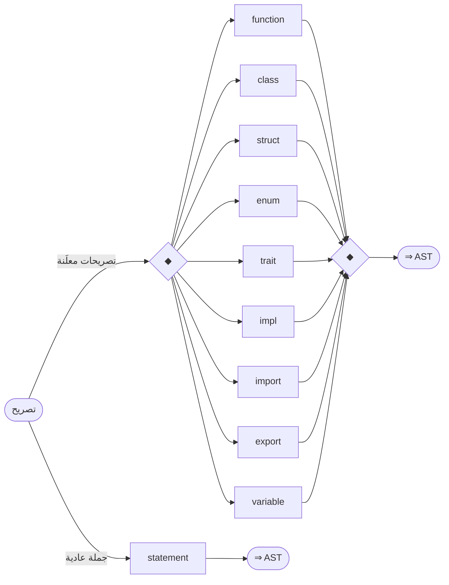
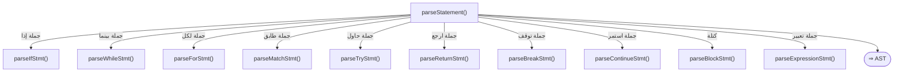
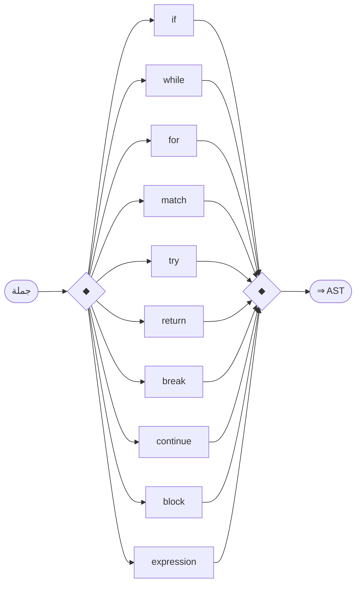
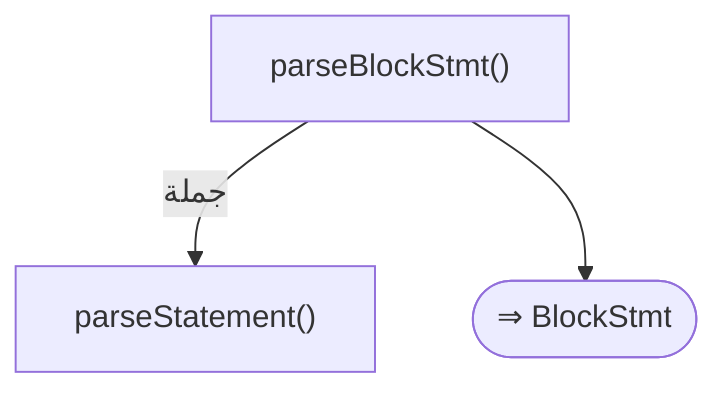
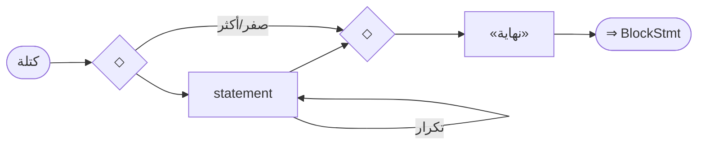

# قواعد المحلل — طبقة النواة (البرنامج)

> ⚠️ **هذا الملف مُولَّد آليًّا** من `language-truth/grammar/*.yaml` عبر
> `scripts/codegen/gen_parser_grammar_docs.py` — **لا تُحرِّره يدويًّا**.
> عدّل YAML المصدر ثم أعد التوليد.


- **الطبقة:** `program` · **ملف المصدر:** `language-truth/grammar/00_program.yaml`
- **الوصف:** البنية العليا — البرنامج، التصريح الأعلى، الجملة، الكتلة
- **عدد القواعد:** 4

> **قراءة المخطّطات:** «📊 مخطّط البنية النحويّة» يُظهر تسلسل الرموز (تكرار «تكرار»، اختياري «تخطّي»، بدائل ◆). «مخطّط مسار الدوال» يُظهر دوال المحلل التي تُستدعى حتى بناء عقدة AST.

## نظرة عامّة — مسار دوال الطبقة
> الاستدعاءات الداخليّة بين دوال قواعد هذه الطبقة (الروابط عبر الطبقات مذكورة في كل قاعدة).


---

<a id="gr.program.program"></a>
### gr.program.program — برنامج <span dir="ltr">(Program)</span>

- **الرقم التسلسليّ:** `ق-001` · **المعرّف الموحَّد:** `gr.program.program` · **الحالة:** stable · **منذ:** 1.0.0
- **الوصف:** نقطة الجذر — يقرأ المُحلِّل تصريحات متتالية حتى نهاية الملف

#### 📐 BNF
```bnf
Program = { Declaration } EOF ;
```

#### 🧩 تفصيل البدائل
- `{ declaration } «<نهاية الملف>»`

#### 🔻 المسار إلى المحلل (دوال التحليل) ⇒ AST
**دالة (دوال) الدخول:**
1. [`ParserCore::parseProgram`](../../../shared/parser/src/core/parser_main.cpp) — `shared/parser/src/core/parser_main.cpp`
- **عقدة AST المُنتَجة:** `StmtList`
- **يستدعي دوال:** [`parseDeclaration`](00_program.md#gr.program.declaration)

##### مخطّط مسار الدوال (حتى AST)


#### 📊 مخطّط البنية النحويّة (Mermaid)


#### مثال
```sad
متغير س = 1
دالة جمع(أ، ب) ارجع أ + ب نهاية
```

---

<a id="gr.program.declaration"></a>
### gr.program.declaration — تصريح <span dir="ltr">(Declaration)</span>

- **الرقم التسلسليّ:** `ق-002` · **المعرّف الموحَّد:** `gr.program.declaration` · **الحالة:** stable · **منذ:** 1.0.0
- **الوصف:** المُحلِّل يميّز التصريح بالكلمة المفتاحية الأولى؛ وإلا يُفوّض للجملة. قائمة alternatives أعلاه هي الإنتاجات القانونية الأساسية، وليست حصراً لفروع الموزّع: الموزّع الفعلي يوجّه أيضاً — بكلمات سياقية — إلى إنتاجات موثّقة في طبقتها: القالب (gr.adv.template_decl)، الواجهة (gr.adv.ui_decl)، الامتداد (gr.oop.extension)، الماكرو (gr.adv.macro)، العقد (gr.adv.contract)، الاختبار (gr.adv.property_test)، عرض عنصر الواجهة (gr.adv.widget)، والتصريح الخارجي (gr.decl.extern). وثلاثُ بنى حيّة **بلا قاعدة SoT بعد** (فجوة مُسجَّلة، موطنها ملفّا 20/60): فضاء الأسماء («فضاء … نهاية»)، الاسم المستعار للنوع («نوع اسم = هدف»)، والتوجيهات الكتلية «@غير_آمن/@وقت_الترجمة/@متطاير» وسمات «[[…]]». كما يستهلك الموزّع صيغاً قديمة ويرفضها برسالة توجيهية (غير_متزامن دالة، دالة مولّد، مجرد/محكم قبل صنف) — حواجز هجرة لا قواعد لغة.

#### 📐 BNF
```bnf
Declaration = FunctionDecl | ClassDecl | StructDecl | EnumDecl
            | TraitDecl | ImplDecl | ImportDecl | ExportDecl
            | VarDecl | Statement ;
```

#### 🧩 تفصيل البدائل
**1.** *تصريحات معلَنة:* `( function | class | struct | enum | trait | impl | import | export | variable )`
**2.** *جملة عادية:* `statement`

#### 🔻 المسار إلى المحلل (دوال التحليل) ⇒ AST
**دالة (دوال) الدخول:**
1. [`ParserCore::parseDeclaration`](../../../shared/parser/src/core/parser_main.cpp) — `shared/parser/src/core/parser_main.cpp`
- **عقدة AST المُنتَجة:** `—`
- **يستدعي دوال:** [`parseFunctionDecl`](20_declarations.md#gr.decl.function)، [`parseClassDecl`](30_oop.md#gr.oop.class)، [`parseStructDecl`](30_oop.md#gr.oop.struct)، [`parseEnumDecl`](30_oop.md#gr.oop.enum)، [`parseTraitDecl`](30_oop.md#gr.oop.trait)، [`parseImplDecl`](30_oop.md#gr.oop.impl)، [`parseImportStmt`](20_declarations.md#gr.decl.import)، [`parseExportDecl`](20_declarations.md#gr.decl.export)، [`parseVarDecl`](20_declarations.md#gr.decl.variable)، [`parseStatement`](00_program.md#gr.program.statement)
- **مُستدعى من:** [`parseProgram`](00_program.md#gr.program.program)، [`parseExportDecl`](20_declarations.md#gr.decl.export)، [`parseGoStmt`](60_advanced.md#gr.adv.go)

##### مخطّط مسار الدوال (حتى AST)


#### 📊 مخطّط البنية النحويّة (Mermaid)


---

<a id="gr.program.statement"></a>
### gr.program.statement — جملة <span dir="ltr">(Statement)</span>

- **الرقم التسلسليّ:** `ق-003` · **المعرّف الموحَّد:** `gr.program.statement` · **الحالة:** stable · **منذ:** 1.0.0
- **الوصف:** موزّع الجمل التنفيذية — يختار حسب الرمز الحالي. قائمة alternatives أعلاه أساسية وليست حصراً: الموزّع الفعلي يوجّه أيضاً — بكلمات سياقية — إلى جمل موثّقة في طبقتها: الحالة/switch (gr.stmt.switch)، أنتِج (gr.adv.yield)، باستخدام (gr.adv.with)، أجّل (gr.adv.defer)، أطلِق (gr.adv.go)، اختر (gr.adv.select)، ارمِ (gr.stmt.throw). وله فرعٌ خاصٌّ يفكّ التباس «{» على مستوى الجملة بين كتلة وخريطة حرفية واستيعاب قاموس/مجموعة (يفوّض إلى gr.expr.map_literal) — سلوكٌ حيّ يُوثَّق تفصيلاً في طبقة التعبيرات (40).

#### 📐 BNF
```bnf
Statement = IfStatement | WhileStatement | ForStatement | MatchStatement
          | TryStatement | ReturnStatement | BreakStatement | ContinueStatement
          | BlockStatement | ExpressionStatement ;
```

#### 🧩 تفصيل البدائل
- `( if | while | for | match | try | return | break | continue | block | expression )`

#### 🔻 المسار إلى المحلل (دوال التحليل) ⇒ AST
**دالة (دوال) الدخول:**
1. [`ParserCore::parseStatement`](../../../shared/parser/src/core/parser_main.cpp) — `shared/parser/src/core/parser_main.cpp`
- **عقدة AST المُنتَجة:** `—`
- **يستدعي دوال:** [`parseIfStmt`](10_statements.md#gr.stmt.if)، [`parseWhileStmt`](10_statements.md#gr.stmt.while)، [`parseForStmt`](10_statements.md#gr.stmt.for)، [`parseMatchStmt`](10_statements.md#gr.stmt.match)، [`parseTryStmt`](10_statements.md#gr.stmt.try)، [`parseReturnStmt`](10_statements.md#gr.stmt.return)، [`parseBreakStmt`](10_statements.md#gr.stmt.break)، [`parseContinueStmt`](10_statements.md#gr.stmt.continue)، [`parseBlockStmt`](00_program.md#gr.program.block)، [`parseExpressionStmt`](10_statements.md#gr.stmt.expression)
- **مُستدعى من:** [`parseDeclaration`](00_program.md#gr.program.declaration)، [`parseBlockStmt`](00_program.md#gr.program.block)، [`parseMatchStmt`](10_statements.md#gr.stmt.match)، [`parseTryStmt`](10_statements.md#gr.stmt.try)، [`parseSwitchStmt`](10_statements.md#gr.stmt.switch)، [`parseWithStmt`](60_advanced.md#gr.adv.with)، [`parseDeferStmt`](60_advanced.md#gr.adv.defer)، [`parseSelectStmt`](60_advanced.md#gr.adv.select)، [`parseMacroDecl`](60_advanced.md#gr.adv.macro)، [`parseTestDecl`](60_advanced.md#gr.adv.property_test)

##### مخطّط مسار الدوال (حتى AST)


#### 📊 مخطّط البنية النحويّة (Mermaid)


---

<a id="gr.program.block"></a>
### gr.program.block — كتلة <span dir="ltr">(Block)</span>

- **الرقم التسلسليّ:** `ق-004` · **المعرّف الموحَّد:** `gr.program.block` · **الحالة:** stable · **منذ:** 1.0.0
- **الوصف:** الكتلة هي العمود الفقري لبنية لغة ص: لا أقواس {} — كل كتلة تنتهي بالكلمة المحجوزة «نهاية». بعض الكتل (مثل if) قد تُغلَق ضمنياً عبر «وإلا» بدل «نهاية».

#### 📐 BNF
```bnf
Block = { Statement } 'نهاية' ;
```

#### 🧩 تفصيل البدائل
- `{ statement } «نهاية»`

#### 🔻 المسار إلى المحلل (دوال التحليل) ⇒ AST
**دالة (دوال) الدخول:**
1. [`ParserCore::parseBlockStmt`](../../../shared/parser/src/statements/parser_statements.cpp) — `shared/parser/src/statements/parser_statements.cpp`
- **عقدة AST المُنتَجة:** `BlockStmt`
- **يستدعي دوال:** [`parseStatement`](00_program.md#gr.program.statement)
- **مُستدعى من:** [`parseStatement`](00_program.md#gr.program.statement)، [`parseIfStmt`](10_statements.md#gr.stmt.if)، [`parseWhileStmt`](10_statements.md#gr.stmt.while)، [`parseForStmt`](10_statements.md#gr.stmt.for)، [`parseFunctionDecl`](20_declarations.md#gr.decl.function)، [`parseMethodDeclaration`](30_oop.md#gr.oop.method)، [`parseConstructorDeclaration`](30_oop.md#gr.oop.constructor)، [`parseDestructorDeclaration`](30_oop.md#gr.oop.destructor)، [`parsePropertyDeclaration`](30_oop.md#gr.oop.property)، [`parseOperatorDecl`](30_oop.md#gr.oop.operator)، [`parseLambda`](40_expressions.md#gr.expr.lambda)
- **روابط المعجم:** كلمات: «نهاية»

##### مخطّط مسار الدوال (حتى AST)


#### 📊 مخطّط البنية النحويّة (Mermaid)


#### مثال
```sad
إذا (س > 0)
    اطبع("موجب")
نهاية
```

---
