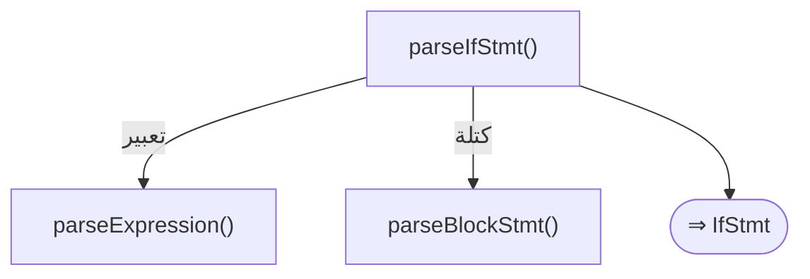
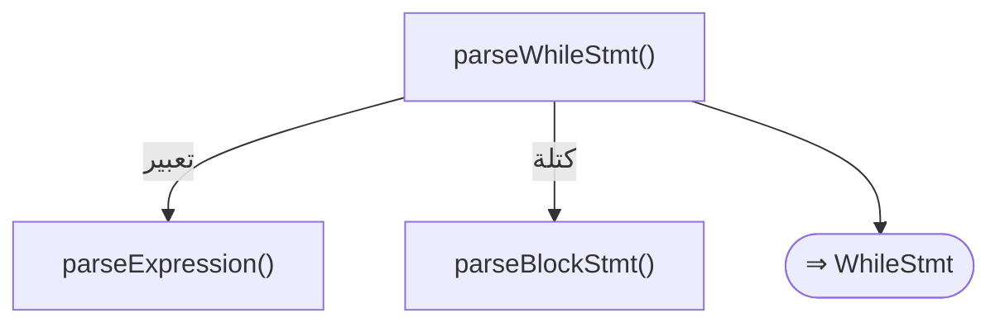
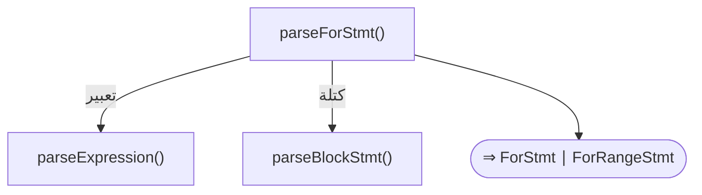
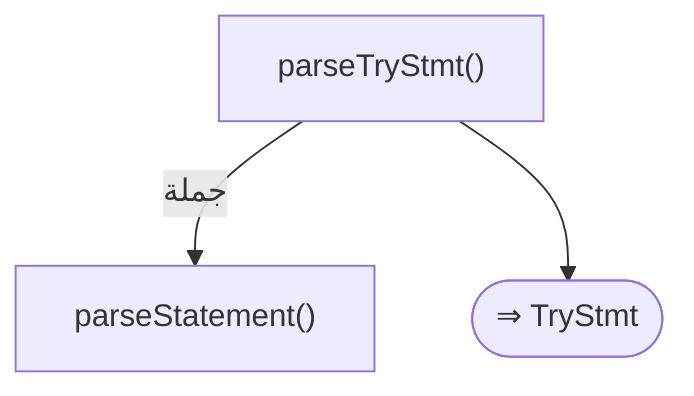
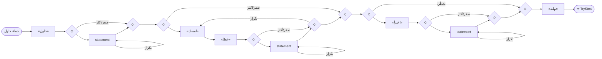
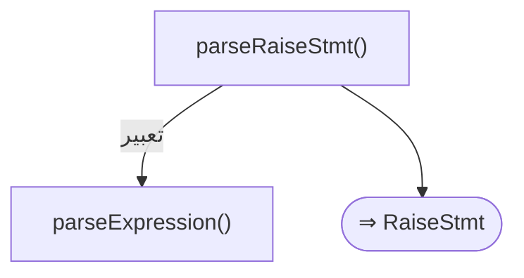
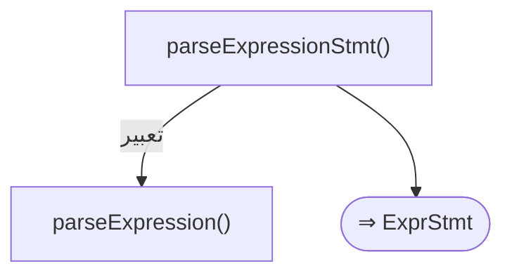
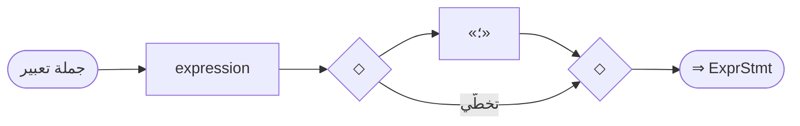

```mermaid
flowchart LR
  n1(["جملة طابق"])
  n2["«طابق»"]
  n3{"◇"}
  n4{"◇"}
  n5["«(»"]
  n3 --> n5
  n5 --> n4
  n3 -- "تخطّي" --> n4
  n2 --> n3
  n6["expression"]
  n4 --> n6
  n7{"◇"}
  n8{"◇"}
  n9["«)»"]
  n7 --> n9
  n9 --> n8
  n7 -- "تخطّي" --> n8
  n6 --> n7
  n10{"◇"}
  n11{"◇"}
  n12["«عندما»"]
  n13["pattern"]
  n12 --> n13
  n14{"◇"}
  n15{"◇"}
  n16["«إذا»"]
  n17["expression"]
  n16 --> n17
  n14 --> n16
  n17 --> n15
  n14 -- "تخطّي" --> n15
  n13 --> n14
  n18{"◇"}
  n19{"◇"}
  n20["«:»"]
  n18 --> n20
  n20 --> n19
  n18 -- "تخطّي" --> n19
  n15 --> n18
  n21{"◇"}
  n22{"◇"}
  n23["statement"]
  n21 --> n23
  n23 --> n22
  n23 -- "تكرار" --> n23
  n21 -- "صفر/أكثر" --> n22
  n19 --> n21
  n10 --> n12
  n22 --> n11
  n22 -- "تكرار" --> n12
  n8 --> n10
  n24{"◇"}
  n25{"◇"}
  n26["«افتراضي»"]
  n27{"◇"}
  n28{"◇"}
  n29["«:»"]
  n27 --> n29
  n29 --> n28
  n27 -- "تخطّي" --> n28
  n26 --> n27
  n30{"◇"}
  n31{"◇"}
  n32["statement"]
  n30 --> n32
  n32 --> n31
  n32 -- "تكرار" --> n32
  n30 -- "صفر/أكثر" --> n31
  n28 --> n30
  n24 --> n26
  n31 --> n25
  n24 -- "تخطّي" --> n25
  n11 --> n24
  n33["«نهاية»"]
  n25 --> n33
  n1 --> n2
  n34(["⇒ MatchStmt"])
  n33 --> n34
```

# قواعد المحلل — طبقة الجمل

> ⚠️ **هذا الملف مُولَّد آليًّا** من `language-truth/grammar/*.yaml` عبر
> `scripts/codegen/gen_parser_grammar_docs.py` — **لا تُحرِّره يدويًّا**.
> عدّل YAML المصدر ثم أعد التوليد.


- **الطبقة:** `statements` · **ملف المصدر:** `language-truth/grammar/10_statements.yaml`
- **الوصف:** الجمل التنفيذية — إذا/بينما/لكل/طابق/حاول/ارمي/ارجع/توقف/استمر/تعبير
- **عدد القواعد:** 11

> **قراءة المخطّطات:** «📊 مخطّط البنية النحويّة» يُظهر تسلسل الرموز (تكرار «تكرار»، اختياري «تخطّي»، بدائل ◆). «مخطّط مسار الدوال» يُظهر دوال المحلل التي تُستدعى حتى بناء عقدة AST.

---

<a id="gr.stmt.if"></a>
### gr.stmt.if — جملة إذا <span dir="ltr">(IfStatement)</span>

- **الرقم التسلسليّ:** `ق-005` · **المعرّف الموحَّد:** `gr.stmt.if` · **الحالة:** stable · **منذ:** 1.0.0
- **الوصف:** تفرّع شرطي. **الأقواس حول الشرط إلزامية** — يستدعي المحلّل consume(PAREN_LEFT) وconsume(PAREN_RIGHT)؛ فإسقاطها ليس صيغة مقبولة بل **خطأ يُسترَد منه**: يُبلَّغ SYN003 «إدراج ( المفقودة» و«إدراج ) المفقودة»، ويُدرِج المحلّل القوسين ويُكمل التحليل، لكنّ التنفيذ يخرج بالرمز 1 (يُطبَع جسم then رغم ذلك). هذا يخالف «حالة/ طابق» حيث الأقواس اختيارية نظيفة (خروج 0). ثلاثة أشكال: (أ) «إذا» مفرد؛ (ب) «إذا… وإلا»؛ (ج) سلسلة «إذا… وإلا إذا… [وإلا]». تُكتب «وإلا إذا» ككلمتين متتاليتين **على السطر نفسه**: يستهلك المحلّل «وإلا» ثمّ يتقدّم فوق «إذا» ويُعامِلهما سلسلة else-if تعاوديّاً بـ«نهاية» واحدة للسلسلة (لا توجد كلمة مفردة «وإلا_إذا» في المعجم؛ والرمز المفرد KEYWORD_ELSE_IF رمزٌ قديم لا يُنتجه المعجم). إن كانت «إذا» على سطر مختلف عن «وإلا» فهي «إذا» متداخلة داخل كتلة «وإلا» (تحتاج «نهاية» خاصّتها). إن أُغلقت كتلة «إذا» بـ«نهاية» صريحة فلا يُلتمَس «وإلا» تالٍ (يُنسَب لسلسلة if خارجية).

#### 📐 BNF
```bnf
IfStatement = 'إذا' '(' Expression ')' Block
              { 'وإلا' 'إذا' '(' Expression ')' Block }
              [ 'وإلا' Block ] ;
```

#### 🧩 تفصيل البدائل
- `«إذا» «(» expression «)» block { «وإلا» «إذا» «(» expression «)» block } [ «وإلا» block ]`

#### 🔻 المسار إلى المحلل (دوال التحليل) ⇒ AST
**دالة (دوال) الدخول:**
1. [`ParserCore::parseIfStmt`](../../../shared/parser/src/statements/parser_statements.cpp) — `shared/parser/src/statements/parser_statements.cpp`
- **عقدة AST المُنتَجة:** `IfStmt`
- **يستدعي دوال:** [`parseExpression`](40_expressions.md#gr.expr.expression)، [`parseBlockStmt`](00_program.md#gr.program.block)
- **مُستدعى من:** [`parseStatement`](00_program.md#gr.program.statement)
- **روابط المعجم:** كلمات: «إذا»، «وإلا»

##### مخطّط مسار الدوال (حتى AST)


#### 📊 مخطّط البنية النحويّة (Mermaid)


#### مثال
```sad
# (أ) مفرد
إذا (س > 0)
    اطبع_سطر("موجب")
نهاية

# (ب) إذا/وإلا
إذا (س > 0)
    اطبع_سطر("موجب")
وإلا
    اطبع_سطر("غير موجب")
نهاية

# (ج) سلسلة وإلا إذا (كلمتان على السطر نفسه، نهاية واحدة)
إذا (ن == 1)
    اطبع_سطر("واحد")
وإلا إذا (ن == 2)
    اطبع_سطر("اثنان")
وإلا
    اطبع_سطر("غيرهما")
نهاية
```

---

<a id="gr.stmt.while"></a>
### gr.stmt.while — جملة بينما <span dir="ltr">(WhileStatement)</span>

- **الرقم التسلسليّ:** `ق-006` · **المعرّف الموحَّد:** `gr.stmt.while` · **الحالة:** stable · **منذ:** 1.0.0
- **الوصف:** حلقة تُكرّر جسمها ما دام الشرط صحيحاً؛ يُعاد تقييم الشرط قبل كلّ تكرار. **الأقواس حول الشرط إلزامية** — يستدعي المحلّل consume(PAREN_LEFT)/consume(PAREN_RIGHT) تماماً كـ«إذا». إسقاطها ليس صيغة مقبولة: يُبلَّغ SYN003 «إدراج ( و) المفقودة» ويخرج التنفيذ بالرمز 1؛ بل إنّ استرداد «بينما» أهشّ من «إذا» — قد يُدرَج «)» متأخّراً فيبتلع الشرطُ أوّلَ جملة من الجسم ولا تُنفَّذ الحلقة نظيفاً. الجسم كتلة تُغلَق بـ«نهاية». يتحكّم بها «توقف» (خروج فوريّ) و«استمر» (قفز للتكرار التالي بعد إعادة تقييم الشرط). لا صيغة do-while.

#### 📐 BNF
```bnf
WhileStatement = 'بينما' '(' Expression ')' Block ;
```

#### 🧩 تفصيل البدائل
- `«بينما» «(» expression «)» block`

#### 🔻 المسار إلى المحلل (دوال التحليل) ⇒ AST
**دالة (دوال) الدخول:**
1. [`ParserCore::parseWhileStmt`](../../../shared/parser/src/statements/parser_statements.cpp) — `shared/parser/src/statements/parser_statements.cpp`
- **عقدة AST المُنتَجة:** `WhileStmt`
- **يستدعي دوال:** [`parseExpression`](40_expressions.md#gr.expr.expression)، [`parseBlockStmt`](00_program.md#gr.program.block)
- **مُستدعى من:** [`parseStatement`](00_program.md#gr.program.statement)
- **روابط المعجم:** كلمات: «بينما»

##### مخطّط مسار الدوال (حتى AST)


#### 📊 مخطّط البنية النحويّة (Mermaid)


#### مثال
```sad
# عدّاد بسيط
متغير ع = 0
بينما (ع < 3)
    اطبع_سطر(ع)
    ع = ع + 1
نهاية

# مع توقف/استمر
متغير ك = 0
بينما (صحيح)
    ك = ك + 1
    إذا (ك == 3) توقف نهاية
    اطبع_سطر(ك)
نهاية
```

---

<a id="gr.stmt.for"></a>
### gr.stmt.for — جملة لكل <span dir="ltr">(ForStatement)</span>

- **الرقم التسلسليّ:** `ق-007` · **المعرّف الموحَّد:** `gr.stmt.for` · **الحالة:** stable · **منذ:** 1.0.0
- **الوصف:** حلقة تكرار بصيغتين، وكلتاهما **بلا أقواس** (صيغة الأقواس «لكل (...)» مرفوضة برسالة صريحة): (أ) «لكل اسم في تعبير» تتكرّر على عناصر مصفوفة أو مدى أو خريطة؛ عند التكرار على خريطة يأخذ المتغيّر المفاتيح. وتدعم **تفكيك زوج** «لكل مفتاح، عنصر في …»: على خريطة يعطي المتغيّر الأوّل المفتاح والثاني القيمة (وعلى مصفوفة قيَمها قيَمٌ مفردة يأخذ المتغيّر الأوّل العنصر كاملاً لا الفهرس). (ب) «لكل اسم من بداية الى نهاية» تبني RangeExpr ضمنياً وتتكرّر عدّياً شاملةً الطرفين (تقبل «الى» أو «إلى»). يتحكّم بها «توقف»/«استمر». اسم متغيّر الحلقة يقبل معرّفاً أو كلمة نوع/ مفتاحيّة كاسم (مثل «لكل خطأ في …»).

#### 📐 BNF
```bnf
ForStatement = 'لكل' Identifier [ ',' Identifier ] 'في' Expression Block
             | 'لكل' Identifier 'من' Expression 'الى' Expression Block ;
```

#### 🧩 تفصيل البدائل
**1.** *تكرار على مجموعة (مع تفكيك اختياري):* `«لكل» «IDENTIFIER» [ «،» «IDENTIFIER» ] «في» expression block`
**2.** *نطاق «من ... الى ...» ⇒ ForRangeStmt:* `«لكل» «IDENTIFIER» «من» expression «الى» expression block`

#### 🔻 المسار إلى المحلل (دوال التحليل) ⇒ AST
**دالة (دوال) الدخول:**
1. [`ParserCore::parseForStmt`](../../../shared/parser/src/statements/parser_statements.cpp) — `shared/parser/src/statements/parser_statements.cpp`
- **عقدة AST المُنتَجة:** `ForStmt | ForRangeStmt`
- **يستدعي دوال:** [`parseExpression`](40_expressions.md#gr.expr.expression)، [`parseBlockStmt`](00_program.md#gr.program.block)
- **مُستدعى من:** [`parseStatement`](00_program.md#gr.program.statement)
- **روابط المعجم:** كلمات: «لكل»، «في»

##### مخطّط مسار الدوال (حتى AST)


#### 📊 مخطّط البنية النحويّة (Mermaid)


#### مثال
```sad
# (أ) على مصفوفة
لكل ن في [1، 2، 3]
    اطبع_سطر(ن)
نهاية

# تفكيك زوج على خريطة (مفتاح، قيمة)
لكل مفتاح، قيمة في {"أ": 1، "ب": 2}
    اطبع_سطر(مفتاح + "=" + نص(قيمة))
نهاية

# (ب) نطاق عدّي شامل الطرفين
لكل ي من 1 الى 3
    اطبع_سطر(ي)
نهاية
```

---

<a id="gr.stmt.match"></a>
### gr.stmt.match — جملة طابق <span dir="ltr">(MatchStatement)</span>

- **الرقم التسلسليّ:** `ق-008` · **المعرّف الموحَّد:** `gr.stmt.match` · **الحالة:** stable · **منذ:** 1.0.0
- **الوصف:** مطابقة **أنماط** بكلمة «طابق»: كلّ فرع «عندما نمط» يطابق المُطابَق ببنية النمط (حرفيّ، نطاق «أ..ب» شامل/غير شامل، تفكيك قائمة/بنية، عضو تعداد، ربط «@»، بدائل «|») لا بالمساواة القيميّة — هذا **الفرق الجوهريّ عن «حالة»** (gr.stmt.switch) التي تقارن بالمساواة. النقطتان «:» بعد النمط **اختيارية** (يُغلَق جسم الذراع ضمنياً بوصول «عندما»/«افتراضي»/«نهاية»). حارس اختياري «عندما نمط إذا شرط:» يزيد قيداً منطقياً. يشترك مع «حالة» في كلمتَي الفرع «عندما» والافتراضي «افتراضي». الأقواس حول المُطابَق **اختيارية** («طابق عمر» و«طابق (عمر)» سِيّان). تفاصيل الأنماط في gr.pattern.*. «حالة» داخل «طابق» مرفوضة برسالة. و«افتراضي» آخرُ الأذرع: ذراعُ «عندما» بعده تُرفَض برمز **SYN032** (وكان جسمُ «افتراضي» يبتلعها فيقع SYN001 على نقطتَي السطر التالي — ISSUE-109). **قيد الذراع:** جسم ذراع «عندما» يحلّل جملاً لا تصريحات — «متغير» داخله يفشل (SEM001)؛ استعمل متغيّراً مُعرَّفاً قبل «طابق».

#### 📐 BNF
```bnf
MatchStatement = 'طابق' [ '(' ] Expression [ ')' ]
                 { 'عندما' Pattern [ 'إذا' Expression ] [ ':' ] { Statement } }
                 [ 'افتراضي' [ ':' ] { Statement } ] 'نهاية' ;
```

#### 🧩 تفصيل البدائل
- `«طابق» [ «(» ] expression [ «)» ] ( «عندما» pattern [ «إذا» expression ] [ «:» ] { statement } )+ [ «افتراضي» [ «:» ] { statement } ] «نهاية»`

#### 🔻 المسار إلى المحلل (دوال التحليل) ⇒ AST
**دالة (دوال) الدخول:**
1. [`ParserCore::parseMatchStmt`](../../../shared/parser/src/statements/parser_advanced.cpp) — `shared/parser/src/statements/parser_advanced.cpp`
- **عقدة AST المُنتَجة:** `MatchStmt`
- **يستدعي دوال:** [`parseExpression`](40_expressions.md#gr.expr.expression)، [`parsePattern`](50_patterns.md#gr.pattern.pattern)، [`parseStatement`](00_program.md#gr.program.statement)
- **مُستدعى من:** [`parseStatement`](00_program.md#gr.program.statement)
- **روابط المعجم:** كلمات: «طابق»، «عندما»، «افتراضي»، «نهاية»

##### مخطّط مسار الدوال (حتى AST)


#### 📊 مخطّط البنية النحويّة (Mermaid)


#### مثال
```sad
# أنماط متنوّعة: بدائل، نطاق محروس، أيّما (_)، والأقواس اختيارية
طابق ن
    عندما 1 | 2 | 3:
        اطبع_سطر("صغير")
    عندما 4..9 إذا ن > 5:
        اطبع_سطر("كبير محروس")
    عندما _:
        اطبع_سطر("أيّما")
نهاية

# بأقواس (مكافئ) وبنقطتين محذوفتين
طابق (عمر)
    عندما 0
        اطبع_سطر("صفر")
    افتراضي
        اطبع_سطر("غير")
نهاية
```

---

<a id="gr.stmt.try"></a>
### gr.stmt.try — جملة حاول <span dir="ltr">(TryStatement)</span>

- **الرقم التسلسليّ:** `ق-009` · **المعرّف الموحَّد:** `gr.stmt.try` · **الحالة:** stable · **منذ:** 1.0.0
- **الوصف:** معالجة الأخطاء. **الصيغة النظيفة الوحيدة للبند هي «امسك اسم» بلا أقواس** (الاسم متغيّر يلتقط القيمة المرميّة، وقد يكون كلمة مفتاحيّة مثل «خطأ»). يدعم **عدّة بنود «امسك»** متتالية (حلقة) وكتلة «أخيراً» اختيارية تُنفَّذ في كلّ الأحوال. **تحذير دقيق:** صيغة الأقواس «امسك (اسم)» و«امسك (نوع متغير)» تُبلَّغ خطأً SYN001 «بأقواس لم تعد مدعومة» ويخرج التنفيذ بالرمز 1؛ إلّا أنّ المحلّل **يسترد** (يتخطّى «(»، ومع وجود معرّفين يجعل الأوّل اسم نوع الاستثناء والثاني اسم المتغيّر، ثمّ يستهلك «)») فيبني AST بنوع — لكنّ هذا مسار استرداد لا صيغة مدعومة (لا يوجد التقاط مُنوَّع بلا أقواس). إغلاق كتلة «امسك» بـ«نهاية» يُنهي البنية كلّها ويمنع «امسك» خارجيّاً متداخلاً من سرقة البند، كما يمنع «أخيراً» بعده.

#### 📐 BNF
```bnf
TryStatement = 'حاول' Block
               { 'امسك' Identifier Block }
               [ 'أخيراً' Block ] 'نهاية' ;
```

#### 🧩 تفصيل البدائل
- `«حاول» { statement } { «امسك» «خطأ» { statement } } [ «أخيراً» { statement } ] «نهاية»`

#### 🔻 المسار إلى المحلل (دوال التحليل) ⇒ AST
**دالة (دوال) الدخول:**
1. [`ParserCore::parseTryStmt`](../../../shared/parser/src/statements/parser_statements.cpp) — `shared/parser/src/statements/parser_statements.cpp`
- **عقدة AST المُنتَجة:** `TryStmt`
- **يستدعي دوال:** [`parseStatement`](00_program.md#gr.program.statement)
- **مُستدعى من:** [`parseStatement`](00_program.md#gr.program.statement)
- **روابط المعجم:** كلمات: «حاول»، «امسك»، «أخيراً»، «نهاية»

##### مخطّط مسار الدوال (حتى AST)


#### 📊 مخطّط البنية النحويّة (Mermaid)


#### مثال
```sad
# حاول/امسك/أخيراً
حاول
    ارمي "عطل"
امسك خطأ
    اطبع_سطر("أُمسك")
أخيراً
    اطبع_سطر("تنظيف")
نهاية

# عدّة بنود امسك متتالية
حاول
    ارمي "س"
امسك أ
    اطبع_سطر("أوّل")
امسك ب
    اطبع_سطر("ثانٍ")
نهاية
```

---

<a id="gr.stmt.throw"></a>
### gr.stmt.throw — جملة ارمي <span dir="ltr">(ThrowStatement)</span>

- **الرقم التسلسليّ:** `ق-010` · **المعرّف الموحَّد:** `gr.stmt.throw` · **الحالة:** stable · **منذ:** 1.0.0
- **الوصف:** إطلاق استثناء بقيمة تعبيرية (نصّ أو رقم أو كائن…)؛ يُفكّ نطاق التنفيذ صعوداً حتى أقرب بند «امسك» في «حاول» محيطة يلتقط القيمة في متغيّره. إن لم يُلتقَط انتهى البرنامج بخطأ تنفيذ «UserThrown» وخروج 1. يأخذ «ارمي» تعبيراً إلزاميّاً (لا «ارمي» فارغة لإعادة الرمي).

#### 📐 BNF
```bnf
ThrowStatement = 'ارمي' Expression ;
```

#### 🧩 تفصيل البدائل
- `«ارمي» expression`

#### 🔻 المسار إلى المحلل (دوال التحليل) ⇒ AST
**دالة (دوال) الدخول:**
1. [`ParserCore::parseRaiseStmt`](../../../shared/parser/src/statements/parser_statements.cpp) — `shared/parser/src/statements/parser_statements.cpp`
- **عقدة AST المُنتَجة:** `RaiseStmt`
- **يستدعي دوال:** [`parseExpression`](40_expressions.md#gr.expr.expression)
- **روابط المعجم:** كلمات: «ارمي»

##### مخطّط مسار الدوال (حتى AST)


#### 📊 مخطّط البنية النحويّة (Mermaid)


#### مثال
```sad
# رمي نصّ يُلتقَط
حاول
    ارمي "حدث خطأ"
امسك خطأ
    اطبع_سطر("عولج")
نهاية

# رمي غير ملتقَط ⇒ خطأ تنفيذ UserThrown وخروج 1
ارمي "بوم"
```

---

<a id="gr.stmt.return"></a>
### gr.stmt.return — جملة ارجع <span dir="ltr">(ReturnStatement)</span>

- **الرقم التسلسليّ:** `ق-011` · **المعرّف الموحَّد:** `gr.stmt.return` · **الحالة:** stable · **منذ:** 1.0.0
- **الوصف:** إرجاع من دالة، بتعبير اختياريّ. «ارجع تعبير» يُنهي الدالة فوراً بقيمته (لا تُنفَّذ الجمل التالية). «ارجع» في المستوى الأعلى مقبولة (لا تُخطئ). **سلوك دقيق (ISSUE-056، مُصلَح):** «ارجع» الفارغة **نهِمة** — إن تلاها تعبير على السطر التالي ابتلعه المحلّل كقيمة إرجاع (لأنّ المعجم يتخطّى الأسطر فلا يُنهي «ارجع»)؛ يُقيَّم التعبير **مرّة واحدة** ثمّ تُنهى الدالة، **متطابقاً بين المفسّر والمترجم** (كان المترجم يُنفّذه مرّتين قبل الإصلاح). للإرجاع الفارغ الصريح ضعها آخر الكتلة قبل «نهاية»/«وإلا». **المواضع الآمنة كاملةً (م-٦):** «ارجع» الفارغة تتوقّف عند «نهاية» و«وإلا» و«وإلا إذا» و«امسك» و«أخيراً» ونهاية الملفّ، وكذلك عند **«عندما» و«افتراضي»** (ذراعا «طابق»). أُضيفت الحالتان لأنّ «ارجع» الفارغة آخر ذراع «طابق» كانت تبتلع الذراع التالية فيُبلَّغ SYN001 عند نقطتَي الذراع لا عند «ارجع». والكلمتان **محجوزتان** (KW-RES-020/021) فلا تصلح واحدة منهما بداية تعبير، ووجود الرمز وحده فاصل قاطع. **دَين سابق موثَّق:** المحلّل يقبل الكلمة المحجوزة اسمَ متغيّر («متغير عندما = 9» يعمل ويطبع 9) — عيب في تحليل التصريح لا في «ارجع»، ومتى سُدَّ زال آخر لبس.

#### 📐 BNF
```bnf
ReturnStatement = 'ارجع' [ Expression ] ;
```

#### 🧩 تفصيل البدائل
- `«ارجع» [ expression ]`

#### 🔻 المسار إلى المحلل (دوال التحليل) ⇒ AST
**دالة (دوال) الدخول:**
1. [`ParserCore::parseReturnStmt`](../../../shared/parser/src/statements/parser_statements.cpp) — `shared/parser/src/statements/parser_statements.cpp`
- **عقدة AST المُنتَجة:** `ReturnStmt`
- **يستدعي دوال:** [`parseExpression`](40_expressions.md#gr.expr.expression)
- **مُستدعى من:** [`parseStatement`](00_program.md#gr.program.statement)
- **روابط المعجم:** كلمات: «ارجع»

##### مخطّط مسار الدوال (حتى AST)


#### 📊 مخطّط البنية النحويّة (Mermaid)


#### مثال
```sad
# إرجاع بقيمة (يُنهي الدالة)
دالة جمع(أ، ب)
    ارجع أ + ب
نهاية

# إرجاع فارغ آمن: آخر جملة في فرع، تليه نهاية
دالة تحقّق(ن)
    إذا (ن < 0)
        ارجع
    نهاية
    اطبع_سطر("موجب")
نهاية
```

---

<a id="gr.stmt.break"></a>
### gr.stmt.break — جملة توقف <span dir="ltr">(BreakStatement)</span>

- **الرقم التسلسليّ:** `ق-012` · **المعرّف الموحَّد:** `gr.stmt.break` · **الحالة:** stable · **منذ:** 1.0.0
- **الوصف:** الخروج الفوريّ من **أقرب حلقة محيطة فقط** (بينما/لكل)؛ في الحلقات المتداخلة يكسر الداخليّة دون الخارجيّة. كلمة مفردة بلا وسائط (لا break بعنوان/مستوى). تُستعمل عادةً داخل «إذا» شرطيّة. و«أقرب حلقة محيطة» مقصودٌ حرفيّاً — قِيس في المحرّكين: «حالة» و«طابق» ليستا حلقتين، فـ«توقف» في ذراعٍ منهما **تكسر الحلقة المحيطة بهما** لا الذراع؛ فلا تُختَم بها الأذرع كما يُفعل في سي. وهي في «امسك» كذلك. والحلقة **لا تعبر حدّ الاستدعاء**: «توقف» في جسم دالّة أو طريقة تُنادى من داخل حلقة خطأٌ (SEM013) لا كسرٌ لحلقة المُنادي — **وهذا مقيسٌ للدالّة والطريقة حصراً**؛ أمّا بقيّة أجسام المُستدعَيات (البواني، تحميل العوامل، الخصائص، الماكرو، الكائن القابل للنداء) فلم تُقَسْ بعدُ ويبقى فيها التباعُد قائماً — ISSUE-107. وعبورها «حاول» يُنفّذ «أخيراً» قبل الخروج (المفسّر؛ والمصرّف يتخطّاها — ISSUE-104)، و«توقف» **مكتوبةً داخل «أخيراً»** تكسر الحلقة كأيّ موضعٍ آخر.

#### 📐 BNF
```bnf
BreakStatement = 'توقف' ;
```

#### 🧩 تفصيل البدائل
- `«توقف»`

#### 🔻 المسار إلى المحلل (دوال التحليل) ⇒ AST
**دالة (دوال) الدخول:**
1. [`ParserCore::parseBreakStmt`](../../../shared/parser/src/statements/parser_statements.cpp) — `shared/parser/src/statements/parser_statements.cpp`
- **عقدة AST المُنتَجة:** `BreakStmt`
- **مُستدعى من:** [`parseStatement`](00_program.md#gr.program.statement)
- **روابط المعجم:** كلمات: «توقف»

##### مخطّط مسار الدوال (حتى AST)


#### 📊 مخطّط البنية النحويّة (Mermaid)


#### مثال
```sad
# يكسر الحلقة الداخلية فقط
لكل أ في [1، 2]
    لكل ب في [1، 2]
        إذا (ب == 1) توقف نهاية
        اطبع_سطر("ب")
    نهاية
    اطبع_سطر("أ")
نهاية
```

---

<a id="gr.stmt.continue"></a>
### gr.stmt.continue — جملة استمر <span dir="ltr">(ContinueStatement)</span>

- **الرقم التسلسليّ:** `ق-013` · **المعرّف الموحَّد:** `gr.stmt.continue` · **الحالة:** stable · **منذ:** 1.0.0
- **الوصف:** تخطّي بقيّة جسم التكرار الحاليّ والقفز إلى التكرار التالي في **أقرب حلقة محيطة** (في «بينما» يُعاد تقييم الشرط أوّلاً). كلمة مفردة بلا وسائط. تُستعمل عادةً داخل «إذا» شرطيّة لتخطّي عناصر بعينها. وحدودها حدودُ «توقف» نفسها — قِيست في المحرّكين: «حالة» و«طابق» ليستا حلقتين فـ«استمر» في ذراعٍ منهما تتخطّى بقيّة **جسم الحلقة** المحيطة؛ والحلقة لا تعبر حدّ الاستدعاء فـ«استمر» في جسم دالّة أو طريقة خطأٌ (SEM013) — **مقيسٌ لهذين المسارين حصراً**، وبقيّة أجسام المُستدعَيات ما زالت مُتباعِدة (ISSUE-107)؛ وعبورها «حاول» يُنفّذ «أخيراً» (المفسّر؛ والمصرّف يتخطّاها — ISSUE-104)، وهي مكتوبةً داخل «أخيراً» تتخطّى بقيّة جسم التكرار.

#### 📐 BNF
```bnf
ContinueStatement = 'استمر' ;
```

#### 🧩 تفصيل البدائل
- `«استمر»`

#### 🔻 المسار إلى المحلل (دوال التحليل) ⇒ AST
**دالة (دوال) الدخول:**
1. [`ParserCore::parseContinueStmt`](../../../shared/parser/src/statements/parser_statements.cpp) — `shared/parser/src/statements/parser_statements.cpp`
- **عقدة AST المُنتَجة:** `ContinueStmt`
- **مُستدعى من:** [`parseStatement`](00_program.md#gr.program.statement)
- **روابط المعجم:** كلمات: «استمر»

##### مخطّط مسار الدوال (حتى AST)


#### 📊 مخطّط البنية النحويّة (Mermaid)


#### مثال
```sad
# يتخطّى 2 فيطبع 1 و3
لكل ن في [1، 2، 3]
    إذا (ن == 2) استمر نهاية
    اطبع_سطر(ن)
نهاية
```

---

<a id="gr.stmt.expression"></a>
### gr.stmt.expression — جملة تعبير <span dir="ltr">(ExpressionStatement)</span>

- **الرقم التسلسليّ:** `ق-014` · **المعرّف الموحَّد:** `gr.stmt.expression` · **الحالة:** stable · **منذ:** 1.0.0
- **الوصف:** تعبير يُقيَّم كجملة لأثره الجانبيّ: استدعاء دالة، إسناد «س = قيمة»، إسناد مركّب «س += قيمة»، استدعاء طريقة «كائن.طريقة()»، تعبير حسابيّ… الإسناد نفسه تعبير فيصلح جملةً. المنقوطة «؛» في آخر الجملة **اختيارية** (السطر يفصل الجمل عادةً).

#### 📐 BNF
```bnf
ExpressionStatement = Expression [ ';' ] ;
```

#### 🧩 تفصيل البدائل
- `expression [ «؛» ]`

#### 🔻 المسار إلى المحلل (دوال التحليل) ⇒ AST
**دالة (دوال) الدخول:**
1. [`ParserCore::parseExpressionStmt`](../../../shared/parser/src/statements/parser_statements.cpp) — `shared/parser/src/statements/parser_statements.cpp`
- **عقدة AST المُنتَجة:** `ExprStmt`
- **يستدعي دوال:** [`parseExpression`](40_expressions.md#gr.expr.expression)
- **مُستدعى من:** [`parseStatement`](00_program.md#gr.program.statement)

##### مخطّط مسار الدوال (حتى AST)


#### 📊 مخطّط البنية النحويّة (Mermaid)


#### مثال
```sad
# استدعاء
اطبع_سطر("مرحبا")
# إسناد
متغير ع = 5
ع = ع + 1
# إسناد مركّب
ع += 3
اطبع_سطر(ع)
```

---

<a id="gr.stmt.switch"></a>
### gr.stmt.switch — جملة حالة <span dir="ltr">(SwitchStatement)</span>

- **الرقم التسلسليّ:** `ق-015` · **المعرّف الموحَّد:** `gr.stmt.switch` · **الحالة:** stable · **منذ:** 1.0.0
- **الوصف:** «حالة» (KEYWORD_CASE) بناءٌ شقيقٌ لـ«طابق»، لكنّهما يختلفان جوهرياً: • «حالة» تقارن المُطابَق بقيمة كلّ فرع «عندما» **بالمساواة** (==) — الفروع
  قيَمٌ لا أنماط؛ فـ«عندما 1..10» في «حالة» يُقيَّم النطاق ككائن ويُقارَن
  مساواةً (لا يطابق العضوية).
• «طابق» تقارن بـ**الأنماط** (حرفيات، نطاقات، تفكيك، حارس) — انظر gr.stmt.match. يشترك البناءان في كلمة الفرع «عندما» وكلمة الافتراضي «افتراضي». «حالة» ليست بديلاً عن «عندما»: «حالة» تفتتح البناء، و«عندما» تفتتح كلّ فرع بداخله. النقطتان «:» **اختياريّة** بعد قيمة الفرع وبعد «افتراضي» (يُغلَق جسم الفرع ضمنياً بوصول «عندما»/«افتراضي»/«نهاية»). «افتراضي» يجب أن يكون الأخير، وبندُ «عندما» بعده يُرفَض برمز **SYN032** عند التحليل (وكان جسمُ «افتراضي» يبتلعه فيُقرأ «عندما» اسمَ متغيّر ⇒ تشخيصٌ مضلِّلٌ بعد تنفيذِ جسمَي البندين — ISSUE-109). الأقواس «حالة (تعبير)» مُزالة (مرفوضة). «حالة» سياقيّة (تُستثنى إذا تلاها ( . [ أو عامل إسناد). **قيد الذراع:** جسم الذراع يحلّل **جملاً لا تصريحات** — «متغير» داخل ذراع يفشل (SEM001)؛ استعمل متغيّراً مُعرَّفاً قبل «حالة» ثمّ أسنِد إليه. «حالة» بـ«افتراضي» فقط بلا أيّ «عندما» صحيحة (تُنفّذ الافتراضيّ)، و«ارجع» من داخل ذراع يُرجع القيمة — كلاهما بتكافؤ مزدوج (كانا تباعدَي ISSUE-054/055، أُصلِحا في المترجم).

#### 📐 BNF
```bnf
SwitchStatement = 'حالة' Expression
                  { 'عندما' Expression [ ':' ] { Statement } }
                  [ 'افتراضي' [ ':' ] { Statement } ] 'نهاية' ;
```

#### 🧩 تفصيل البدائل
- `«حالة» expression { «عندما» expression [ «:» ] { statement } } [ «افتراضي» [ «:» ] { statement } ] «نهاية»`

#### 🔻 المسار إلى المحلل (دوال التحليل) ⇒ AST
**دالة (دوال) الدخول:**
1. [`ParserCore::parseSwitchStmt`](../../../shared/parser/src/statements/parser_statements.cpp) — `shared/parser/src/statements/parser_statements.cpp`
- **عقدة AST المُنتَجة:** `SwitchStmt`
- **يستدعي دوال:** [`parseExpression`](40_expressions.md#gr.expr.expression)، [`parseStatement`](00_program.md#gr.program.statement)
- **روابط المعجم:** كلمات: «عندما»، «افتراضي»، «نهاية»

##### مخطّط مسار الدوال (حتى AST)
```mermaid
flowchart TD
  f1["parseSwitchStmt()"]
  f2["parseExpression()"]
  f1 -- "تعبير" --> f2
  f3["parseStatement()"]
  f1 -- "جملة" --> f3
  f4(["⇒ SwitchStmt"])
  f1 --> f4
```

#### 📊 مخطّط البنية النحويّة (Mermaid)
```mermaid
flowchart LR
  n1(["جملة حالة"])
  n2["«حالة»"]
  n3["expression"]
  n2 --> n3
  n4{"◇"}
  n5{"◇"}
  n6["«عندما»"]
  n7["expression"]
  n6 --> n7
  n8{"◇"}
  n9{"◇"}
  n10["«:»"]
  n8 --> n10
  n10 --> n9
  n8 -- "تخطّي" --> n9
  n7 --> n8
  n11{"◇"}
  n12{"◇"}
  n13["statement"]
  n11 --> n13
  n13 --> n12
  n13 -- "تكرار" --> n13
  n11 -- "صفر/أكثر" --> n12
  n9 --> n11
  n4 --> n6
  n12 --> n5
  n12 -- "تكرار" --> n6
  n4 -- "صفر/أكثر" --> n5
  n3 --> n4
  n14{"◇"}
  n15{"◇"}
  n16["«افتراضي»"]
  n17{"◇"}
  n18{"◇"}
  n19["«:»"]
  n17 --> n19
  n19 --> n18
  n17 -- "تخطّي" --> n18
  n16 --> n17
  n20{"◇"}
  n21{"◇"}
  n22["statement"]
  n20 --> n22
  n22 --> n21
  n22 -- "تكرار" --> n22
  n20 -- "صفر/أكثر" --> n21
  n18 --> n20
  n14 --> n16
  n21 --> n15
  n14 -- "تخطّي" --> n15
  n5 --> n14
  n23["«نهاية»"]
  n15 --> n23
  n1 --> n2
  n24(["⇒ SwitchStmt"])
  n23 --> n24
```

#### مثال
```sad
# مقارنة بالمساواة، نقطتان حاضرتان
حالة الرقم
    عندما 1: اطبع_سطر("واحد")
    عندما 2: اطبع_سطر("اثنان")
    افتراضي: اطبع_سطر("آخر")
نهاية

# النقطتان محذوفتان، وذراع بعدّة جمل (لا تصريحات داخل الذراع — إسناد فقط)
متغير ر = ""
حالة الرقم
    عندما 1
        ر = "واحد"
        اطبع_سطر(ر)
    افتراضي
        اطبع_سطر("آخر")
نهاية
```

---
