# قواعد المحلل — طبقة الجمل

> ⚠️ **هذا الملف مُولَّد آليًّا** من `language-truth/grammar/*.yaml` عبر
> `scripts/codegen/gen_parser_grammar_docs.py` — **لا تُحرِّره يدويًّا**.
> عدّل YAML المصدر ثم أعد التوليد.


- **الطبقة:** `statements` · **ملف المصدر:** `language-truth/grammar/10_statements.yaml`
- **الوصف:** الجمل التنفيذية — إذا/بينما/لكل/طابق/حاول/ارمي/ارجع/توقف/استمر/تعبير
- **عدد القواعد:** 11

> **قراءة المخطّطات:** «📊 مخطّط البنية النحويّة» يُظهر تسلسل الرموز (تكرار «تكرار»، اختياري «تخطّي»، بدائل ◆). «مخطّط مسار الدوال» يُظهر دوال المحلل التي تُستدعى حتى بناء عقدة AST.

---

<a id="gr.stmt.if"></a>
### gr.stmt.if — جملة إذا <span dir="ltr">(IfStatement)</span>

- **الرقم التسلسليّ:** `ق-005` · **المعرّف الموحَّد:** `gr.stmt.if` · **الحالة:** stable · **منذ:** 1.0.0
- **الوصف:** تفرّع شرطي؛ الكتلة قد تُغلَق بـ«نهاية» أو ضمنياً بـ«وإلا». تُكتب «وإلا إذا» ككلمتين متتاليتين **على السطر نفسه**: يستهلك المحلّل «وإلا» ثمّ يتقدّم فوق «إذا» ويُعامِلهما سلسلة else-if تعاوديّاً (لا توجد كلمة مفردة «وإلا_إذا» في المعجم؛ والرمز المفرد KEYWORD_ELSE_IF رمزٌ قديم لا يُنتجه المعجم). إن أُغلقت كتلة «إذا» بـ«نهاية» صريحة فلا يُلتمَس «وإلا» تالٍ (يُنسَب لسلسلة if خارجية). الأقواس حول الشرط إلزامية.

#### 📐 BNF
```bnf
IfStatement = 'إذا' '(' Expression ')' Block
              { 'وإلا' 'إذا' '(' Expression ')' Block }
              [ 'وإلا' Block ] ;
```

#### 🧩 تفصيل البدائل
- `«إذا» «(» expression «)» block { «وإلا» «إذا» «(» expression «)» block } [ «وإلا» block ]`

#### 🔻 المسار إلى المحلل (دوال التحليل) ⇒ AST
**دالة (دوال) الدخول:**
1. [`ParserCore::parseIfStmt`](../../../shared/parser/src/statements/parser_statements.cpp) — `shared/parser/src/statements/parser_statements.cpp`
- **عقدة AST المُنتَجة:** `IfStmt`
- **يستدعي دوال:** [`parseExpression`](40_expressions.md#gr.expr.expression)، [`parseBlockStmt`](00_program.md#gr.program.block)
- **مُستدعى من:** [`parseStatement`](00_program.md#gr.program.statement)
- **روابط المعجم:** كلمات: «إذا»، «وإلا»

##### مخطّط مسار الدوال (حتى AST)


#### 📊 مخطّط البنية النحويّة (Mermaid)
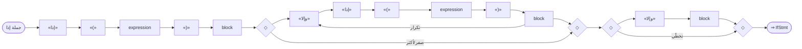

#### مثال
```sad
إذا (س > 0)
    اطبع_سطر("موجب")
وإلا
    اطبع_سطر("غير موجب")
نهاية
```

---

<a id="gr.stmt.while"></a>
### gr.stmt.while — جملة بينما <span dir="ltr">(WhileStatement)</span>

- **الرقم التسلسليّ:** `ق-006` · **المعرّف الموحَّد:** `gr.stmt.while` · **الحالة:** stable · **منذ:** 1.0.0
- **الوصف:** حلقة تتكرّر ما دام الشرط صحيحاً

#### 📐 BNF
```bnf
WhileStatement = 'بينما' '(' Expression ')' Block ;
```

#### 🧩 تفصيل البدائل
- `«بينما» «(» expression «)» block`

#### 🔻 المسار إلى المحلل (دوال التحليل) ⇒ AST
**دالة (دوال) الدخول:**
1. [`ParserCore::parseWhileStmt`](../../../shared/parser/src/statements/parser_statements.cpp) — `shared/parser/src/statements/parser_statements.cpp`
- **عقدة AST المُنتَجة:** `WhileStmt`
- **يستدعي دوال:** [`parseExpression`](40_expressions.md#gr.expr.expression)، [`parseBlockStmt`](00_program.md#gr.program.block)
- **مُستدعى من:** [`parseStatement`](00_program.md#gr.program.statement)
- **روابط المعجم:** كلمات: «بينما»

##### مخطّط مسار الدوال (حتى AST)


#### 📊 مخطّط البنية النحويّة (Mermaid)
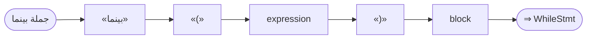

#### مثال
```sad
متغير ع = 0
بينما (ع < 3)
    اطبع_سطر(ع)
    ع = ع + 1
نهاية
```

---

<a id="gr.stmt.for"></a>
### gr.stmt.for — جملة لكل <span dir="ltr">(ForStatement)</span>

- **الرقم التسلسليّ:** `ق-007` · **المعرّف الموحَّد:** `gr.stmt.for` · **الحالة:** stable · **منذ:** 1.0.0
- **الوصف:** حلقة تكرار بصيغتين (بلا أقواس): (أ) «لكل اسم في تعبير» على مصفوفة/مدى/خريطة، وتدعم التفكيك «لكل فهرس، عنصر في ...»؛ (ب) «لكل اسم من بداية الى نهاية» تبني RangeExpr ضمنياً (تقبل «الى» أو «إلى»). صيغة الأقواس «لكل (...)» مرفوضة برسالة.

#### 📐 BNF
```bnf
ForStatement = 'لكل' Identifier [ ',' Identifier ] 'في' Expression Block
             | 'لكل' Identifier 'من' Expression 'الى' Expression Block ;
```

#### 🧩 تفصيل البدائل
**1.** *تكرار على مجموعة (مع تفكيك اختياري):* `«لكل» «IDENTIFIER» [ «،» «IDENTIFIER» ] «في» expression block`
**2.** *نطاق «من ... الى ...» ⇒ ForRangeStmt:* `«لكل» «IDENTIFIER» «من» expression «الى» expression block`

#### 🔻 المسار إلى المحلل (دوال التحليل) ⇒ AST
**دالة (دوال) الدخول:**
1. [`ParserCore::parseForStmt`](../../../shared/parser/src/statements/parser_statements.cpp) — `shared/parser/src/statements/parser_statements.cpp`
- **عقدة AST المُنتَجة:** `ForStmt | ForRangeStmt`
- **يستدعي دوال:** [`parseExpression`](40_expressions.md#gr.expr.expression)، [`parseBlockStmt`](00_program.md#gr.program.block)
- **مُستدعى من:** [`parseStatement`](00_program.md#gr.program.statement)
- **روابط المعجم:** كلمات: «لكل»، «في»

##### مخطّط مسار الدوال (حتى AST)


#### 📊 مخطّط البنية النحويّة (Mermaid)
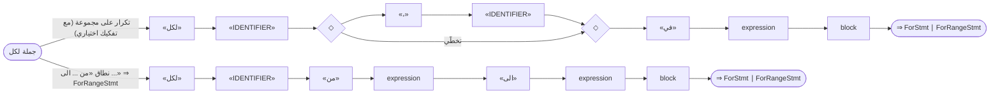

#### مثال
```sad
لكل ن في [1، 2، 3]
    اطبع_سطر(ن)
نهاية
```

---

<a id="gr.stmt.match"></a>
### gr.stmt.match — جملة طابق <span dir="ltr">(MatchStatement)</span>

- **الرقم التسلسليّ:** `ق-008` · **المعرّف الموحَّد:** `gr.stmt.match` · **الحالة:** stable · **منذ:** 1.0.0
- **الوصف:** مطابقة **أنماط** بكلمة «طابق»: كلّ فرع «عندما نمط» يطابق المُطابَق ببنية النمط (حرفيّ، نطاق «أ..ب» شامل/غير شامل، تفكيك قائمة/بنية، عضو تعداد، ربط «@»، بدائل «|») لا بالمساواة القيميّة — هذا **الفرق الجوهريّ عن «حالة»** (gr.stmt.switch) التي تقارن بالمساواة. النقطتان «:» بعد النمط **اختيارية** (يُغلَق جسم الذراع ضمنياً بوصول «عندما»/«افتراضي»/«نهاية»). حارس اختياري «عندما نمط إذا شرط:» يزيد قيداً منطقياً. يشترك مع «حالة» في كلمتَي الفرع «عندما» والافتراضي «افتراضي». تفاصيل الأنماط في gr.pattern.*. «حالة» داخل «طابق» مرفوضة برسالة.

#### 📐 BNF
```bnf
MatchStatement = 'طابق' '(' Expression ')'
                 { 'عندما' Pattern [ 'إذا' Expression ] [ ':' ] { Statement } }
                 [ 'افتراضي' [ ':' ] { Statement } ] 'نهاية' ;
```

#### 🧩 تفصيل البدائل
- `«طابق» «(» expression «)» ( «عندما» pattern [ «إذا» expression ] [ «:» ] { statement } )+ [ «افتراضي» [ «:» ] { statement } ] «نهاية»`

#### 🔻 المسار إلى المحلل (دوال التحليل) ⇒ AST
**دالة (دوال) الدخول:**
1. [`ParserCore::parseMatchStmt`](../../../shared/parser/src/statements/parser_advanced.cpp) — `shared/parser/src/statements/parser_advanced.cpp`
- **عقدة AST المُنتَجة:** `MatchStmt`
- **يستدعي دوال:** [`parseExpression`](40_expressions.md#gr.expr.expression)، [`parsePattern`](50_patterns.md#gr.pattern.pattern)، [`parseStatement`](00_program.md#gr.program.statement)
- **مُستدعى من:** [`parseStatement`](00_program.md#gr.program.statement)
- **روابط المعجم:** كلمات: «طابق»، «عندما»، «افتراضي»، «نهاية»

##### مخطّط مسار الدوال (حتى AST)
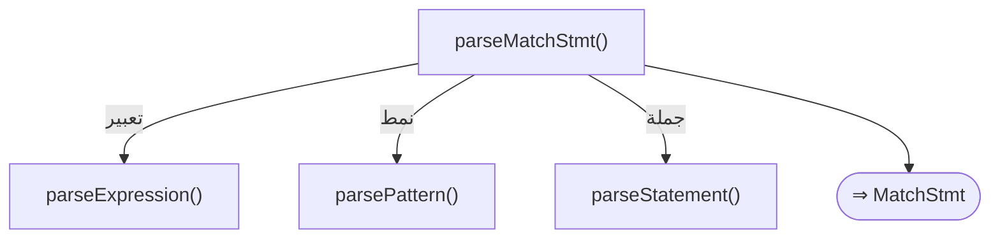

#### 📊 مخطّط البنية النحويّة (Mermaid)
```mermaid
flowchart LR
  n1(["جملة طابق"])
  n2["«طابق»"]
  n3["«(»"]
  n2 --> n3
  n4["expression"]
  n3 --> n4
  n5["«)»"]
  n4 --> n5
  n6{"◇"}
  n7{"◇"}
  n8["«عندما»"]
  n9["pattern"]
  n8 --> n9
  n10{"◇"}
  n11{"◇"}
  n12["«إذا»"]
  n13["expression"]
  n12 --> n13
  n10 --> n12
  n13 --> n11
  n10 -- "تخطّي" --> n11
  n9 --> n10
  n14{"◇"}
  n15{"◇"}
  n16["«:»"]
  n14 --> n16
  n16 --> n15
  n14 -- "تخطّي" --> n15
  n11 --> n14
  n17{"◇"}
  n18{"◇"}
  n19["statement"]
  n17 --> n19
  n19 --> n18
  n19 -- "تكرار" --> n19
  n17 -- "صفر/أكثر" --> n18
  n15 --> n17
  n6 --> n8
  n18 --> n7
  n18 -- "تكرار" --> n8
  n5 --> n6
  n20{"◇"}
  n21{"◇"}
  n22["«افتراضي»"]
  n23{"◇"}
  n24{"◇"}
  n25["«:»"]
  n23 --> n25
  n25 --> n24
  n23 -- "تخطّي" --> n24
  n22 --> n23
  n26{"◇"}
  n27{"◇"}
  n28["statement"]
  n26 --> n28
  n28 --> n27
  n28 -- "تكرار" --> n28
  n26 -- "صفر/أكثر" --> n27
  n24 --> n26
  n20 --> n22
  n27 --> n21
  n20 -- "تخطّي" --> n21
  n7 --> n20
  n29["«نهاية»"]
  n21 --> n29
  n1 --> n2
  n30(["⇒ MatchStmt"])
  n29 --> n30
```

#### مثال
```sad
طابق (عمر)
    عندما 0:
        اطبع_سطر("صفر")
    افتراضي:
        اطبع_سطر("غير")
نهاية
```

---

<a id="gr.stmt.try"></a>
### gr.stmt.try — جملة حاول <span dir="ltr">(TryStatement)</span>

- **الرقم التسلسليّ:** `ق-009` · **المعرّف الموحَّد:** `gr.stmt.try` · **الحالة:** stable · **منذ:** 1.0.0
- **الوصف:** معالجة الأخطاء؛ «امسك خطأ» بلا أقواس (خطأ = اسم المتغير الملتقَط). يدعم **عدّة بنود «امسك»** متتالية (حلقة)؛ صيغة الأقواس «امسك (خطأ)» مرفوضة برسالة.

#### 📐 BNF
```bnf
TryStatement = 'حاول' Block
               { 'امسك' Identifier Block }
               [ 'أخيراً' Block ] 'نهاية' ;
```

#### 🧩 تفصيل البدائل
- `«حاول» { statement } { «امسك» «خطأ» { statement } } [ «أخيراً» { statement } ] «نهاية»`

#### 🔻 المسار إلى المحلل (دوال التحليل) ⇒ AST
**دالة (دوال) الدخول:**
1. [`ParserCore::parseTryStmt`](../../../shared/parser/src/statements/parser_statements.cpp) — `shared/parser/src/statements/parser_statements.cpp`
- **عقدة AST المُنتَجة:** `TryStmt`
- **يستدعي دوال:** [`parseStatement`](00_program.md#gr.program.statement)
- **مُستدعى من:** [`parseStatement`](00_program.md#gr.program.statement)
- **روابط المعجم:** كلمات: «حاول»، «امسك»، «أخيراً»، «نهاية»

##### مخطّط مسار الدوال (حتى AST)


#### 📊 مخطّط البنية النحويّة (Mermaid)


#### مثال
```sad
حاول
    ارمي "عطل"
امسك خطأ
    اطبع_سطر("أُمسك")
نهاية
```

---

<a id="gr.stmt.throw"></a>
### gr.stmt.throw — جملة ارمي <span dir="ltr">(ThrowStatement)</span>

- **الرقم التسلسليّ:** `ق-010` · **المعرّف الموحَّد:** `gr.stmt.throw` · **الحالة:** stable · **منذ:** 1.0.0
- **الوصف:** إطلاق استثناء بقيمة/رسالة — يُلتقَط بأقرب «حاول/امسك»

#### 📐 BNF
```bnf
ThrowStatement = 'ارمي' Expression ;
```

#### 🧩 تفصيل البدائل
- `«ارمي» expression`

#### 🔻 المسار إلى المحلل (دوال التحليل) ⇒ AST
**دالة (دوال) الدخول:**
1. [`ParserCore::parseRaiseStmt`](../../../shared/parser/src/statements/parser_statements.cpp) — `shared/parser/src/statements/parser_statements.cpp`
- **عقدة AST المُنتَجة:** `RaiseStmt`
- **يستدعي دوال:** [`parseExpression`](40_expressions.md#gr.expr.expression)
- **روابط المعجم:** كلمات: «ارمي»

##### مخطّط مسار الدوال (حتى AST)


#### 📊 مخطّط البنية النحويّة (Mermaid)


#### مثال
```sad
ارمي "حدث خطأ"
```

---

<a id="gr.stmt.return"></a>
### gr.stmt.return — جملة ارجع <span dir="ltr">(ReturnStatement)</span>

- **الرقم التسلسليّ:** `ق-011` · **المعرّف الموحَّد:** `gr.stmt.return` · **الحالة:** stable · **منذ:** 1.0.0
- **الوصف:** إرجاع قيمة من دالة (أو إرجاع فارغ)

#### 📐 BNF
```bnf
ReturnStatement = 'ارجع' [ Expression ] ;
```

#### 🧩 تفصيل البدائل
- `«ارجع» [ expression ]`

#### 🔻 المسار إلى المحلل (دوال التحليل) ⇒ AST
**دالة (دوال) الدخول:**
1. [`ParserCore::parseReturnStmt`](../../../shared/parser/src/statements/parser_statements.cpp) — `shared/parser/src/statements/parser_statements.cpp`
- **عقدة AST المُنتَجة:** `ReturnStmt`
- **يستدعي دوال:** [`parseExpression`](40_expressions.md#gr.expr.expression)
- **مُستدعى من:** [`parseStatement`](00_program.md#gr.program.statement)
- **روابط المعجم:** كلمات: «ارجع»

##### مخطّط مسار الدوال (حتى AST)
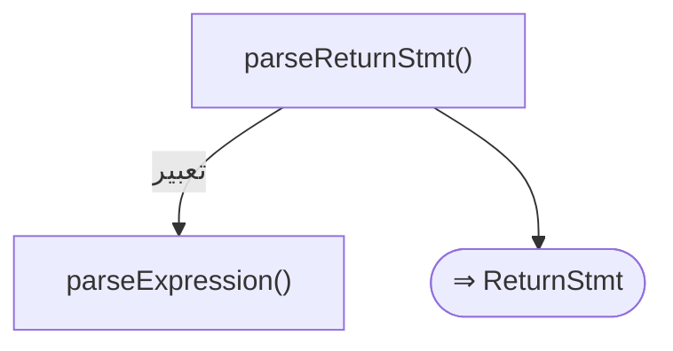

#### 📊 مخطّط البنية النحويّة (Mermaid)
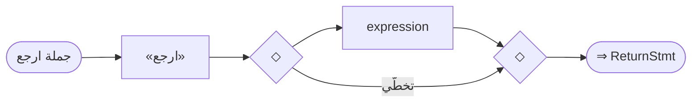

#### مثال
```sad
دالة جمع(أ، ب) ارجع أ + ب نهاية
```

---

<a id="gr.stmt.break"></a>
### gr.stmt.break — جملة توقف <span dir="ltr">(BreakStatement)</span>

- **الرقم التسلسليّ:** `ق-012` · **المعرّف الموحَّد:** `gr.stmt.break` · **الحالة:** stable · **منذ:** 1.0.0
- **الوصف:** الخروج من أقرب حلقة محيطة

#### 📐 BNF
```bnf
BreakStatement = 'توقف' ;
```

#### 🧩 تفصيل البدائل
- `«توقف»`

#### 🔻 المسار إلى المحلل (دوال التحليل) ⇒ AST
**دالة (دوال) الدخول:**
1. [`ParserCore::parseBreakStmt`](../../../shared/parser/src/statements/parser_statements.cpp) — `shared/parser/src/statements/parser_statements.cpp`
- **عقدة AST المُنتَجة:** `BreakStmt`
- **مُستدعى من:** [`parseStatement`](00_program.md#gr.program.statement)
- **روابط المعجم:** كلمات: «توقف»

##### مخطّط مسار الدوال (حتى AST)
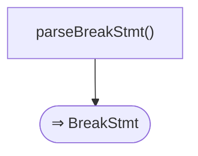

#### 📊 مخطّط البنية النحويّة (Mermaid)
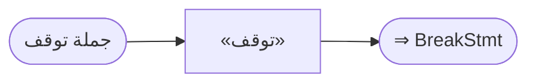

#### مثال
```sad
بينما (صحيح)
    توقف
نهاية
```

---

<a id="gr.stmt.continue"></a>
### gr.stmt.continue — جملة استمر <span dir="ltr">(ContinueStatement)</span>

- **الرقم التسلسليّ:** `ق-013` · **المعرّف الموحَّد:** `gr.stmt.continue` · **الحالة:** stable · **منذ:** 1.0.0
- **الوصف:** تخطّي بقية التكرار الحالي والانتقال للتالي

#### 📐 BNF
```bnf
ContinueStatement = 'استمر' ;
```

#### 🧩 تفصيل البدائل
- `«استمر»`

#### 🔻 المسار إلى المحلل (دوال التحليل) ⇒ AST
**دالة (دوال) الدخول:**
1. [`ParserCore::parseContinueStmt`](../../../shared/parser/src/statements/parser_statements.cpp) — `shared/parser/src/statements/parser_statements.cpp`
- **عقدة AST المُنتَجة:** `ContinueStmt`
- **مُستدعى من:** [`parseStatement`](00_program.md#gr.program.statement)
- **روابط المعجم:** كلمات: «استمر»

##### مخطّط مسار الدوال (حتى AST)
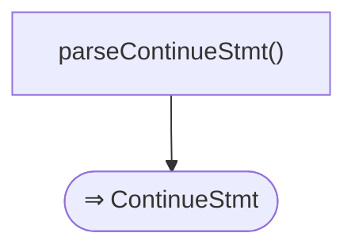

#### 📊 مخطّط البنية النحويّة (Mermaid)
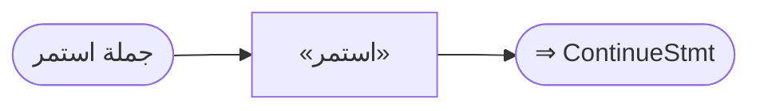

#### مثال
```sad
لكل ن في [1، 2، 3]
    إذا (ن == 2) استمر نهاية
    اطبع_سطر(ن)
نهاية
```

---

<a id="gr.stmt.expression"></a>
### gr.stmt.expression — جملة تعبير <span dir="ltr">(ExpressionStatement)</span>

- **الرقم التسلسليّ:** `ق-014` · **المعرّف الموحَّد:** `gr.stmt.expression` · **الحالة:** stable · **منذ:** 1.0.0
- **الوصف:** تعبير يُقيَّم كجملة (استدعاء دالة، إسناد، ...)؛ المنقوطة اختيارية

#### 📐 BNF
```bnf
ExpressionStatement = Expression [ ';' ] ;
```

#### 🧩 تفصيل البدائل
- `expression [ «؛» ]`

#### 🔻 المسار إلى المحلل (دوال التحليل) ⇒ AST
**دالة (دوال) الدخول:**
1. [`ParserCore::parseExpressionStmt`](../../../shared/parser/src/statements/parser_statements.cpp) — `shared/parser/src/statements/parser_statements.cpp`
- **عقدة AST المُنتَجة:** `ExprStmt`
- **يستدعي دوال:** [`parseExpression`](40_expressions.md#gr.expr.expression)
- **مُستدعى من:** [`parseStatement`](00_program.md#gr.program.statement)

##### مخطّط مسار الدوال (حتى AST)


#### 📊 مخطّط البنية النحويّة (Mermaid)


#### مثال
```sad
اطبع_سطر("مرحبا")
```

---

<a id="gr.stmt.switch"></a>
### gr.stmt.switch — جملة حالة <span dir="ltr">(SwitchStatement)</span>

- **الرقم التسلسليّ:** `ق-015` · **المعرّف الموحَّد:** `gr.stmt.switch` · **الحالة:** stable · **منذ:** 1.0.0
- **الوصف:** «حالة» (KEYWORD_CASE) بناءٌ شقيقٌ لـ«طابق»، لكنّهما يختلفان جوهرياً: • «حالة» تقارن المُطابَق بقيمة كلّ فرع «عندما» **بالمساواة** (==) — الفروع
  قيَمٌ لا أنماط؛ فـ«عندما 1..10» في «حالة» يُقيَّم النطاق ككائن ويُقارَن
  مساواةً (لا يطابق العضوية).
• «طابق» تقارن بـ**الأنماط** (حرفيات، نطاقات، تفكيك، حارس) — انظر gr.stmt.match. يشترك البناءان في كلمة الفرع «عندما» وكلمة الافتراضي «افتراضي». «حالة» ليست بديلاً عن «عندما»: «حالة» تفتتح البناء، و«عندما» تفتتح كلّ فرع بداخله. النقطتان «:» **اختياريّة** بعد قيمة الفرع وبعد «افتراضي» (يُغلَق جسم الفرع ضمنياً بوصول «عندما»/«افتراضي»/«نهاية»). «افتراضي» يجب أن يكون الأخير. الأقواس «حالة (تعبير)» مُزالة (مرفوضة). «حالة» سياقيّة (تُستثنى إذا تلاها ( . [ أو عامل إسناد).

#### 📐 BNF
```bnf
SwitchStatement = 'حالة' Expression
                  { 'عندما' Expression [ ':' ] { Statement } }
                  [ 'افتراضي' [ ':' ] { Statement } ] 'نهاية' ;
```

#### 🧩 تفصيل البدائل
- `«حالة» expression { «عندما» expression [ «:» ] { statement } } [ «افتراضي» [ «:» ] { statement } ] «نهاية»`

#### 🔻 المسار إلى المحلل (دوال التحليل) ⇒ AST
**دالة (دوال) الدخول:**
1. [`ParserCore::parseSwitchStmt`](../../../shared/parser/src/statements/parser_statements.cpp) — `shared/parser/src/statements/parser_statements.cpp`
- **عقدة AST المُنتَجة:** `SwitchStmt`
- **يستدعي دوال:** [`parseExpression`](40_expressions.md#gr.expr.expression)، [`parseStatement`](00_program.md#gr.program.statement)
- **روابط المعجم:** كلمات: «عندما»، «افتراضي»، «نهاية»

##### مخطّط مسار الدوال (حتى AST)
```mermaid
flowchart TD
  f1["parseSwitchStmt()"]
  f2["parseExpression()"]
  f1 -- "تعبير" --> f2
  f3["parseStatement()"]
  f1 -- "جملة" --> f3
  f4(["⇒ SwitchStmt"])
  f1 --> f4
```

#### 📊 مخطّط البنية النحويّة (Mermaid)
```mermaid
flowchart LR
  n1(["جملة حالة"])
  n2["«حالة»"]
  n3["expression"]
  n2 --> n3
  n4{"◇"}
  n5{"◇"}
  n6["«عندما»"]
  n7["expression"]
  n6 --> n7
  n8{"◇"}
  n9{"◇"}
  n10["«:»"]
  n8 --> n10
  n10 --> n9
  n8 -- "تخطّي" --> n9
  n7 --> n8
  n11{"◇"}
  n12{"◇"}
  n13["statement"]
  n11 --> n13
  n13 --> n12
  n13 -- "تكرار" --> n13
  n11 -- "صفر/أكثر" --> n12
  n9 --> n11
  n4 --> n6
  n12 --> n5
  n12 -- "تكرار" --> n6
  n4 -- "صفر/أكثر" --> n5
  n3 --> n4
  n14{"◇"}
  n15{"◇"}
  n16["«افتراضي»"]
  n17{"◇"}
  n18{"◇"}
  n19["«:»"]
  n17 --> n19
  n19 --> n18
  n17 -- "تخطّي" --> n18
  n16 --> n17
  n20{"◇"}
  n21{"◇"}
  n22["statement"]
  n20 --> n22
  n22 --> n21
  n22 -- "تكرار" --> n22
  n20 -- "صفر/أكثر" --> n21
  n18 --> n20
  n14 --> n16
  n21 --> n15
  n14 -- "تخطّي" --> n15
  n5 --> n14
  n23["«نهاية»"]
  n15 --> n23
  n1 --> n2
  n24(["⇒ SwitchStmt"])
  n23 --> n24
```

#### مثال
```sad
حالة الرقم
    عندما 1: اطبع_سطر("واحد")
    افتراضي: اطبع_سطر("آخر")
نهاية
```

---
