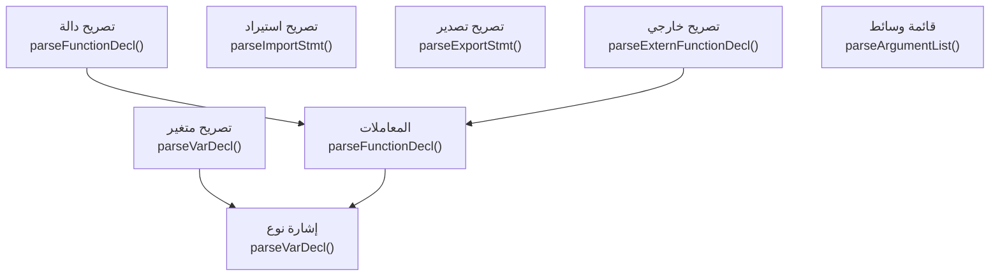
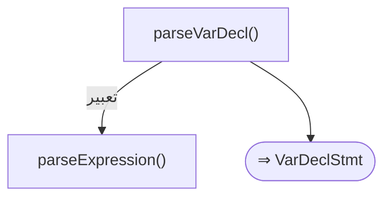
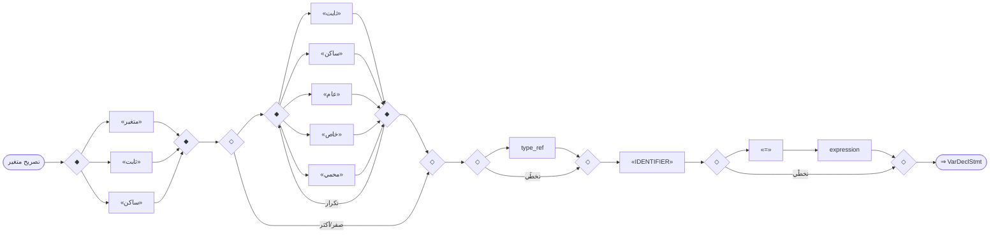
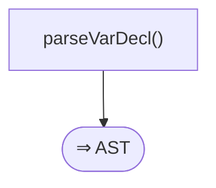
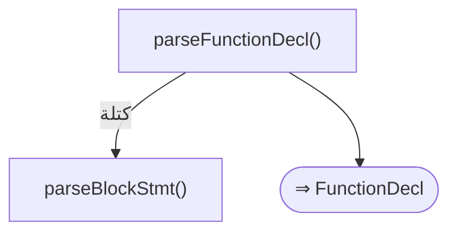
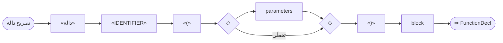
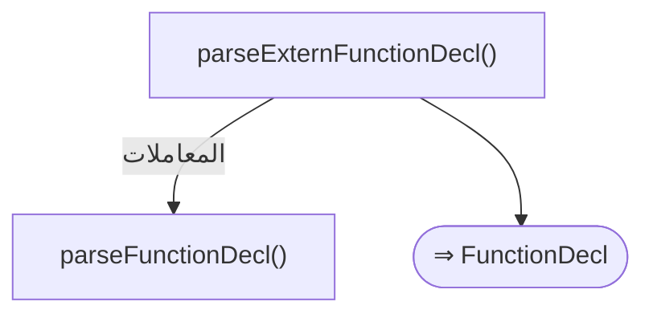
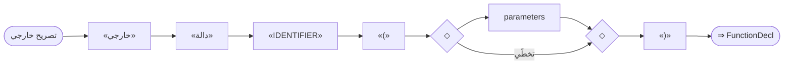
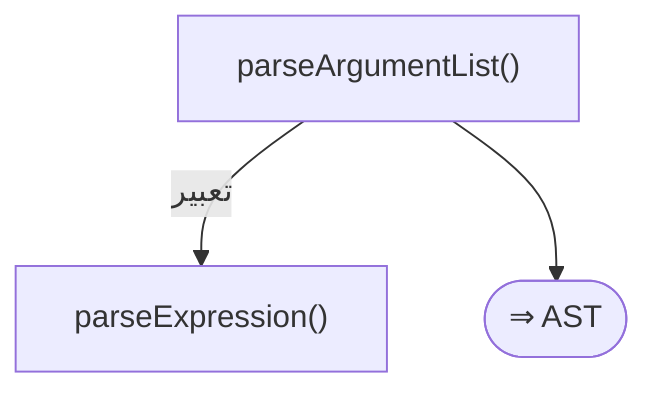
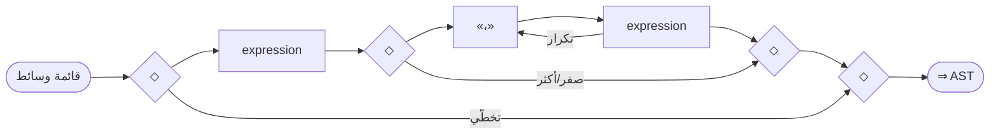

# قواعد المحلل — طبقة التصريحات والوحدات

> ⚠️ **هذا الملف مُولَّد آليًّا** من `language-truth/grammar/*.yaml` عبر
> `scripts/codegen/gen_parser_grammar_docs.py` — **لا تُحرِّره يدويًّا**.
> عدّل YAML المصدر ثم أعد التوليد.


- **الطبقة:** `declarations` · **ملف المصدر:** `language-truth/grammar/20_declarations.yaml`
- **الوصف:** التصريحات — متغير/ثابت/ساكن، دالة، معاملات، استيراد، تصدير، خارجي
- **عدد القواعد:** 8

> **قراءة المخطّطات:** «📊 مخطّط البنية النحويّة» يُظهر تسلسل الرموز (تكرار «تكرار»، اختياري «تخطّي»، بدائل ◆). «مخطّط مسار الدوال» يُظهر دوال المحلل التي تُستدعى حتى بناء عقدة AST.

## نظرة عامّة — مسار دوال الطبقة
> الاستدعاءات الداخليّة بين دوال قواعد هذه الطبقة (الروابط عبر الطبقات مذكورة في كل قاعدة).


---

<a id="gr.decl.variable"></a>
### gr.decl.variable — تصريح متغير <span dir="ltr">(VarDeclaration)</span>

- **الرقم التسلسليّ:** `ق-016` · **المعرّف الموحَّد:** `gr.decl.variable` · **الحالة:** stable · **منذ:** 1.0.0
- **الوصف:** تصريح متغير قابل للتغيير (متغير)، ثابت (ثابت)، أو ساكن. اسم النوع اختياري قبل المعرّف (متغير رقم س)؛ التهيئة اختيارية. ⭐ قاعدة «الصفة بعد الموصوف»: تأتي المُعدِّلات بعد الكلمة المفتاحية: «متغير ثابت ص = 10»، «متغير عام س»، «متغير خاص س»، «متغير ساكن عام ك». ملاحظات سلوك: «متغير ثابت» لا يمنع إعادة الإسناد حالياً (ISSUE-030)؛ وبعض تركيبات المُعدِّلات تفشل مثل «متغير ثابت عام» (ISSUE-031).

#### 📐 BNF
```bnf
VarDeclaration = ('متغير' | 'ثابت' | 'ساكن') { Modifier } [ Type ] Identifier [ '=' Expression ] ;
```

#### 🧩 تفصيل البدائل
- `( «متغير» | «ثابت» | «ساكن» ) { ( «ثابت» | «ساكن» | «عام» | «خاص» | «محمي» ) } [ type_ref ] «IDENTIFIER» [ «=» expression ]`

#### 🔻 المسار إلى المحلل (دوال التحليل) ⇒ AST
**دالة (دوال) الدخول:**
1. [`ParserCore::parseVarDecl`](../../../shared/parser/src/declarations/parser_declarations.cpp) — `shared/parser/src/declarations/parser_declarations.cpp`
- **عقدة AST المُنتَجة:** `VarDeclStmt`
- **يستدعي دوال:** [`parseExpression`](40_expressions.md#gr.expr.expression)
- **مُستدعى من:** [`parseDeclaration`](00_program.md#gr.program.declaration)
- **روابط المعجم:** كلمات: «متغير»، «ثابت»، «ساكن»، «عام»، «خاص»، «محمي»

##### مخطّط مسار الدوال (حتى AST)


#### 📊 مخطّط البنية النحويّة (Mermaid)


#### مثال
```sad
متغير س = 5
ثابت ع = 7
متغير ثابت ص = 10        # الصفة بعد الموصوف
متغير عام رقم ك = 3
```

---

<a id="gr.decl.type_ref"></a>
### gr.decl.type_ref — إشارة نوع <span dir="ltr">(TypeRef)</span>

- **الرقم التسلسليّ:** `ق-017` · **المعرّف الموحَّد:** `gr.decl.type_ref` · **الحالة:** stable · **منذ:** 1.0.0
- **الوصف:** اسم نوع مدمج أو معرّف صنف — يُلفظ كـIDENTIFIER (الأنواع غير محجوزة)

#### 📐 BNF
```bnf
TypeRef = ('رقم' | 'عشري' | 'نص' | 'منطقي' | 'مصفوفة' | 'خريطة' | 'أي' | Identifier) ;
```

#### 🧩 تفصيل البدائل
- `«<اسم نوع>»`

#### 🔻 المسار إلى المحلل (دوال التحليل) ⇒ AST
**دالة (دوال) الدخول:**
1. [`ParserCore::parseVarDecl`](../../../shared/parser/src/declarations/parser_declarations.cpp) — `shared/parser/src/declarations/parser_declarations.cpp`
- **عقدة AST المُنتَجة:** `—`
- **مُستدعى من:** [`parseVarDecl`](20_declarations.md#gr.decl.variable)، [`parseFunctionDecl`](20_declarations.md#gr.decl.parameters)

##### مخطّط مسار الدوال (حتى AST)


#### 📊 مخطّط البنية النحويّة (Mermaid)


#### مثال
```sad
متغير نص اسم = "ص"
```

---

<a id="gr.decl.function"></a>
### gr.decl.function — تصريح دالة <span dir="ltr">(FunctionDeclaration)</span>

- **الرقم التسلسليّ:** `ق-018` · **المعرّف الموحَّد:** `gr.decl.function` · **الحالة:** stable · **منذ:** 1.0.0
- **الوصف:** تصريح دالة باسم ومعاملات وجسم. الصفة «غير_متزامن» تأتي بعد الاسم (سياقية). ملاحظة: نوع الإرجاع بصيغة «-> نوع» غير مدعوم حالياً (ISSUE-023).

#### 📐 BNF
```bnf
FunctionDeclaration = 'دالة' Identifier '(' [ Parameters ] ')' Block ;
```

#### 🧩 تفصيل البدائل
- `«دالة» «IDENTIFIER» «(» [ parameters ] «)» block`

#### 🔻 المسار إلى المحلل (دوال التحليل) ⇒ AST
**دالة (دوال) الدخول:**
1. [`ParserCore::parseFunctionDecl`](../../../shared/parser/src/declarations/parser_declarations.cpp) — `shared/parser/src/declarations/parser_declarations.cpp`
- **عقدة AST المُنتَجة:** `FunctionDecl`
- **يستدعي دوال:** [`parseBlockStmt`](00_program.md#gr.program.block)
- **مُستدعى من:** [`parseDeclaration`](00_program.md#gr.program.declaration)، [`parseImplDecl`](30_oop.md#gr.oop.impl)، [`parseExtensionDecl`](30_oop.md#gr.oop.extension)، [`parseTemplateDecl`](60_advanced.md#gr.adv.template_decl)، [`parseUIDeclaration`](60_advanced.md#gr.adv.ui_decl)
- **روابط المعجم:** كلمات: «دالة»

##### مخطّط مسار الدوال (حتى AST)


#### 📊 مخطّط البنية النحويّة (Mermaid)


#### مثال
```sad
دالة جمع(أ، ب)
    ارجع أ + ب
نهاية
```

---

<a id="gr.decl.parameters"></a>
### gr.decl.parameters — المعاملات <span dir="ltr">(Parameters)</span>

- **الرقم التسلسليّ:** `ق-019` · **المعرّف الموحَّد:** `gr.decl.parameters` · **الحالة:** stable · **منذ:** 1.0.0
- **الوصف:** قائمة معاملات مفصولة بفواصل؛ يدعم النوع الاختياري (رقم س) والقيمة الافتراضية (س = 10). ملاحظة: المعامل المتغير «...اسم» غير مدعوم في الدوال حالياً (ISSUE-022).

#### 📐 BNF
```bnf
Parameters = Parameter { ',' Parameter } ;  Parameter = [ Type ] Identifier [ '=' Expression ] ;
```

#### 🧩 تفصيل البدائل
- `( [ type_ref ] «IDENTIFIER» [ «=» expression ] )+`

#### 🔻 المسار إلى المحلل (دوال التحليل) ⇒ AST
**دالة (دوال) الدخول:**
1. [`ParserCore::parseFunctionDecl`](../../../shared/parser/src/declarations/parser_declarations.cpp) — `shared/parser/src/declarations/parser_declarations.cpp`
- **عقدة AST المُنتَجة:** `—`
- **يستدعي دوال:** [`parseVarDecl`](20_declarations.md#gr.decl.type_ref)، [`parseExpression`](40_expressions.md#gr.expr.expression)
- **مُستدعى من:** [`parseFunctionDecl`](20_declarations.md#gr.decl.function)، [`parseExternFunctionDecl`](20_declarations.md#gr.decl.extern)، [`parseMethodDeclaration`](30_oop.md#gr.oop.method)، [`parseConstructorDeclaration`](30_oop.md#gr.oop.constructor)، [`parseOperatorDecl`](30_oop.md#gr.oop.operator)، [`parseTraitDecl`](30_oop.md#gr.oop.trait)، [`parseLambda`](40_expressions.md#gr.expr.lambda)، [`parseMacroDecl`](60_advanced.md#gr.adv.macro)

##### مخطّط مسار الدوال (حتى AST)


#### 📊 مخطّط البنية النحويّة (Mermaid)


#### مثال
```sad
دالة ت(رقم س، ب = 10)
    ارجع س + ب
نهاية
```

---

<a id="gr.decl.import"></a>
### gr.decl.import — تصريح استيراد <span dir="ltr">(ImportDeclaration)</span>

- **الرقم التسلسليّ:** `ق-020` · **المعرّف الموحَّد:** `gr.decl.import` · **الحالة:** stable · **منذ:** 1.0.0
- **الوصف:** استيراد وحدة كاملة (مع اسم مستعار اختياري «كـ»)، أو أسماء محددة عبر «من ... استورد». ملاحظة: «من ... استورد» يفشل حالياً في بعض الحالات (ISSUE-024).

#### 📐 BNF
```bnf
ImportDeclaration = 'استورد' ModulePath [ 'كـ' Identifier ]
                  | 'من' ModulePath 'استورد' (Identifier { ',' Identifier } | '*') ;
```

#### 🧩 تفصيل البدائل
**1.** *استيراد وحدة:* `«استورد» «<وحدة>» [ «كـ» «IDENTIFIER» ]`
**2.** *استيراد محدد من وحدة:* `«من» «<وحدة>» «استورد» «<اسم|*>»`

#### 🔻 المسار إلى المحلل (دوال التحليل) ⇒ AST
**دالة (دوال) الدخول:**
1. [`ParserCore::parseImportStmt`](../../../shared/parser/src/declarations/parser_modules.cpp) — `shared/parser/src/declarations/parser_modules.cpp`
- **عقدة AST المُنتَجة:** `ImportStmt | FromImportStmt`
- **مُستدعى من:** [`parseDeclaration`](00_program.md#gr.program.declaration)
- **روابط المعجم:** كلمات: «استورد»، «من»، «كـ»

##### مخطّط مسار الدوال (حتى AST)


#### 📊 مخطّط البنية النحويّة (Mermaid)


#### مثال
```sad
استورد رياضيات
استورد رياضيات كـ ر
```

---

<a id="gr.decl.export"></a>
### gr.decl.export — تصريح تصدير <span dir="ltr">(ExportDeclaration)</span>

- **الرقم التسلسليّ:** `ق-021` · **المعرّف الموحَّد:** `gr.decl.export` · **الحالة:** stable · **منذ:** 1.0.0
- **الوصف:** تصدير تصريح (دالة/صنف/متغير) من وحدة لإتاحته للاستيراد

#### 📐 BNF
```bnf
ExportDeclaration = 'صدّر' Declaration ;
```

#### 🧩 تفصيل البدائل
- `«صدّر» declaration`

#### 🔻 المسار إلى المحلل (دوال التحليل) ⇒ AST
**دالة (دوال) الدخول:**
1. [`ParserCore::parseExportStmt`](../../../shared/parser/src/declarations/parser_declarations.cpp) — `shared/parser/src/declarations/parser_declarations.cpp`
- **عقدة AST المُنتَجة:** `ExportStmt`
- **يستدعي دوال:** [`parseDeclaration`](00_program.md#gr.program.declaration)
- **مُستدعى من:** [`parseDeclaration`](00_program.md#gr.program.declaration)
- **روابط المعجم:** كلمات: «صدّر»

##### مخطّط مسار الدوال (حتى AST)


#### 📊 مخطّط البنية النحويّة (Mermaid)


#### مثال
```sad
صدّر دالة جمع(أ، ب) ارجع أ + ب نهاية
```

---

<a id="gr.decl.extern"></a>
### gr.decl.extern — تصريح خارجي <span dir="ltr">(ExternDeclaration)</span>

- **الرقم التسلسليّ:** `ق-022` · **المعرّف الموحَّد:** `gr.decl.extern` · **الحالة:** stable · **منذ:** 1.0.0
- **الوصف:** ربط دالة خارجية (C/C++ ABI) — تصريح بلا جسم

#### 📐 BNF
```bnf
ExternDeclaration = 'خارجي' 'دالة' Identifier '(' [ Parameters ] ')' ;
```

#### 🧩 تفصيل البدائل
- `«خارجي» «دالة» «IDENTIFIER» «(» [ parameters ] «)»`

#### 🔻 المسار إلى المحلل (دوال التحليل) ⇒ AST
**دالة (دوال) الدخول:**
1. [`ParserCore::parseExternFunctionDecl`](../../../shared/parser/src/declarations/parser_declarations.cpp) — `shared/parser/src/declarations/parser_declarations.cpp`
- **عقدة AST المُنتَجة:** `FunctionDecl`
- **يستدعي دوال:** [`parseFunctionDecl`](20_declarations.md#gr.decl.parameters)
- **مُستدعى من:** [`parseDeclaration`](60_advanced.md#gr.adv.ffi_extern_block)
- **روابط المعجم:** كلمات: «خارجي»، «دالة»

##### مخطّط مسار الدوال (حتى AST)


#### 📊 مخطّط البنية النحويّة (Mermaid)


#### مثال
```sad
خارجي دالة printf(نص)
```

---

<a id="gr.decl.arg_list"></a>
### gr.decl.arg_list — قائمة وسائط <span dir="ltr">(ArgList)</span>

- **الرقم التسلسليّ:** `ق-023` · **المعرّف الموحَّد:** `gr.decl.arg_list` · **الحالة:** stable · **منذ:** 1.0.0
- **الوصف:** وسائط الاستدعاء مفصولة بفواصل (عربيّة أو لاتينيّة)؛ مساعِدة لاستدعاءات gr.expr.postfix والمُزخرِفات والعناصر

#### 📐 BNF
```bnf
ArgList = [ Expression { ( ',' | '،' ) Expression } ] ;
```

#### 🧩 تفصيل البدائل
- `[ expression { «،» expression } ]`

#### 🔻 المسار إلى المحلل (دوال التحليل) ⇒ AST
**دالة (دوال) الدخول:**
1. [`ParserCore::parseArgumentList`](../../../shared/parser/src/core/parser_helpers.cpp) — `shared/parser/src/core/parser_helpers.cpp`
- **عقدة AST المُنتَجة:** `—`
- **يستدعي دوال:** [`parseExpression`](40_expressions.md#gr.expr.expression)
- **مُستدعى من:** [`parseConstructorDeclaration`](30_oop.md#gr.oop.constructor)، [`parseNewExpr`](30_oop.md#gr.oop.new)، [`parsePostfix`](40_expressions.md#gr.expr.postfix)، [`parseDecorator`](40_expressions.md#gr.expr.decorator)، [`parseDirectiveExpr`](40_expressions.md#gr.expr.directive)، [`parseWidgetExpression`](60_advanced.md#gr.adv.widget)، [`parseModifierChain`](60_advanced.md#gr.adv.ui_modifier_chain)

##### مخطّط مسار الدوال (حتى AST)


#### 📊 مخطّط البنية النحويّة (Mermaid)


---
