# قواعد المحلل — طبقة التصريحات والوحدات

> ⚠️ **هذا الملف مُولَّد آليًّا** من `language-truth/grammar/*.yaml` عبر
> `scripts/codegen/gen_parser_grammar_docs.py` — **لا تُحرِّره يدويًّا**.
> عدّل YAML المصدر ثم أعد التوليد.


- **الطبقة:** `declarations` · **ملف المصدر:** `language-truth/grammar/20_declarations.yaml`
- **الوصف:** التصريحات — متغير/ثابت/ساكن، دالة، معاملات، استيراد، تصدير، خارجي
- **عدد القواعد:** 9

> **قراءة المخطّطات:** «📊 مخطّط البنية النحويّة» يُظهر تسلسل الرموز (تكرار «تكرار»، اختياري «تخطّي»، بدائل ◆). «مخطّط مسار الدوال» يُظهر دوال المحلل التي تُستدعى حتى بناء عقدة AST.

## نظرة عامّة — مسار دوال الطبقة
> الاستدعاءات الداخليّة بين دوال قواعد هذه الطبقة (الروابط عبر الطبقات مذكورة في كل قاعدة).
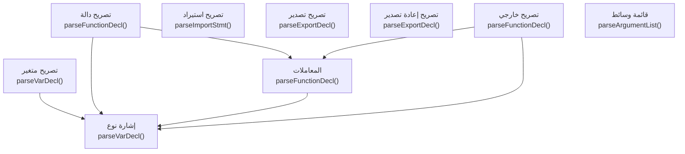

---

<a id="gr.decl.variable"></a>
### gr.decl.variable — تصريح متغير <span dir="ltr">(VarDeclaration)</span>

- **الرقم التسلسليّ:** `ق-016` · **المعرّف الموحَّد:** `gr.decl.variable` · **الحالة:** stable · **منذ:** 1.0.0
- **الوصف:** تصريح متغير قابل للتغيير («متغير»)، أو ثابت («ثابت»)، أو ساكن («ساكن»). ⭐ **للتصريح صيغتان معتمَدتان، كلتاهما داخل المواصفة (قرار مالك 2026-08-11، ISSUE-114):** **① الصيغة المفتاحيّة** «متغير رقم س = 10» — تبدأ بكلمةٍ مفتاحيّة، وتقبل المُعدِّلات، والنوع فيها اختياريّ. **② الصيغة النوعيّة** «رقم س = 10» — تبدأ بالنوع مباشرةً بلا كلمةٍ مفتاحيّة. 🔴 **وصيغةٌ ثالثةٌ «متغير س: رقم» حُذِفت من المحلّل (قرارُ مالك، 2026-08-16).** لم تكن يومًا في هذه القواعد — كانت **قدرةً في المحلّلِ لا يذكرها مصدرُ الحقيقة**، فحذفُها يُطابِق المحلّلَ بالمواصفةِ ولا يُضيّق اللغة. وعلّةُ الحذفِ أنّ العربيّةَ تُقدّم النوعَ على الاسم («رقم س»)، وأنّ صيغتَين لمعنًى واحدٍ تُضاعِفان ما يجب أن يُحرَس ويُوثَّق ويُخفَّض في المحرّكَين. ⚠️ **ولها ثمنٌ مقيسٌ يجب أن يُقرأ لا أن يُطوى:** كانت ③ هي المسلكَ الوحيدَ الذي تعمل فيه **لاحقةُ «؟»** («متغير س: رقم؟ = 5»)، و«رقم؟ س» مرفوضةٌ بـSYN001. فبحذفِ ③ **سقطت لاحقةُ «؟» من تصريحِ المتغيّرِ كلِّه** — وبقيت عاملةً في **وسمِ المُعامِل** («دالة جد(م: رقم؟)») فتلك قاعدةٌ أخرى لم يُحكَم عليها. والبديلُ المقيسُ في التصريح هو الصفةُ العربيّة: «رقم عدمي س = 5» تُعطي ما كانت تُعطيه ③ حرفًا بحرفٍ في المحرّكَين، وبها هُوجِرت سبعُ بذورٍ من عائلةِ أمانِ العدمِ يومَ الحذف. ⚠️ والحذفُ **مقصورٌ على تصريحِ المتغيّرِ والثابت**: النقطتان تبقيان على معناهنّ في نوعِ الإرجاعِ ووسمِ المُعامِلِ ومفاتيحِ الخرائطِ والشرائح. ⚠️ والتشخيصُ بعد الحذفِ **عامٌّ لا موجِّه**: SYN001 «وجدتُ ':' لكن كنت أتوقّع بدايةَ جملةٍ أو تصريح» — يرفض ولا يدلّ على «رقم س». سُجِّل كما هو ولم يُدَّعَ له إرشاد. والصيغة ② تعني «متغير» دائماً (لا ثبات ولا سكون)، ولا تقبل مُعدِّلات: «عام رقم س = 10» **مرفوضة** (يُقرأ «عام» جملةَ تعبيرٍ فيُبلَّغ «المتغير 'عام' غير معرَّف») — فمن أراد مُعدِّلاً لزمته الصيغة ①. **النوع إلزاميّ في ②** لأنّه هو ما يفصل التصريحَ عن جملةِ تعبير، ويقبل أيَّ نوعٍ مدمجٍ أو **اسمَ صنفٍ من المستخدم** («شخص ك = شخص()» مقيسةٌ حيّة). والتهيئة اختياريّة في الصيغتين («رقم س» وحدها تصريحٌ صحيح). ⚠️ الصيغة ② **لا تدعم لاحقةَ الاختياريّ «؟»** بعدُ. 🆕 **وسلسلةُ التصاريحِ بفاصلةٍ صارت مدعومةً في الصيغتَين (2026-08-15):** «رقم أ، ب» تُعطي الخانتَين قيمةَ النوعِ الافتراضيّة، ونوعُ التصريحِ **يسري على السلسلةِ كلِّها** ما لم يُصرَّح لعنصرٍ نوعُه صراحةً («أ، ب: نص» تُبقي لـ«ب» نوعَه المكتوب) — كما تسري المُعدِّلاتُ سلفًا (ISSUE-120). وقد كان هذا السطرُ ينفي الدعمَ بينما كان المحلّلُ يقبل الصيغةَ ويعطي الخانةَ الثانيةَ **فراغًا** (ع-٨ في تقريرِ المصفوفة): نفيٌ في الوثيقةِ وقبولٌ معطوبٌ في المحرّك، وهو أسوأُ من الحالَين. ⚠️ **والعدميّةُ تُورَث مع النوع** — «نص عدمية أ، ب» تعطي «لاشيء» للخانتَين في المحرّكَين. وكانت الوراثةُ تنقل النوعَ الأساسَ وحدَه فتفقد الخانةُ الثانيةُ عدميّتَها؛ سُدَّ ذلك. ⚠️ **وتصويبُ سطرٍ في هذه الفقرةِ نفسِها:** كُتِب هنا أوّلًا أنّ فقدَ العدميّةِ «حدٌّ مقيسٌ باقٍ … محروسٌ ببذرة» — وكلا الشقَّين كان خطأ: الحدُّ **مسدودٌ** (أُعيد قياسُه فلم يتكرّر)، ولا بذرةَ كانت تحرسه. أي أنّ فقرةَ حالةِ التنفيذِ وصفت **ما قبلَ الرقعةِ** بعد تطبيقِها، وادّعت حراسةً لا وجودَ لها. 🔑 **والدرسُ للمرّةِ الثانيةِ في هذا الملفّ:** حالةُ التنفيذِ تُكتَب **بقياسٍ بعدَ الرقعة** لا بذاكرةِ ما دفع إليها؛ وادّعاءُ «محروسٌ ببذرة» يُتحقَّق منه **باسمِ البذرة**، وإلّا فهو وعدٌ بحارسٍ لا يوجد. ⚠️ **والحدُّ الباقي مسمًّى بغيرِه:** «رقم عدمي أ، ب» **داخلَ دالّةٍ** يُخرِج في المترجّمِ الحارسَ خامًّا `-9223372036854775807` للخانتَين — وهو تسريبُ الرمزِ الداخليِّ المُدوَّنُ سلفًا، لا فقدُ العدميّة. تحرسه `VE043`. اسم النوع في ① اختياريّ **بعد** الكلمة المفتاحية وقبل المعرّف («متغير رقم س») والأنواع غير محجوزة (تُلفَظ IDENTIFIER)؛ التهيئة «= تعبير» اختياريّة (تصريح بلا قيمة مسموح). ⭐ قاعدة «الصفة بعد الموصوف»: تأتي المُعدِّلات **بعد** الكلمة المفتاحية لا قبلها: «متغير ثابت ص = 10»، «متغير عام س»، «متغير خاص س»، «متغير محمي س»، «متغير ساكن عام ك». **حالة المُعدِّلات — مقيسةٌ في المحرّكين (ISSUE-120، 2026-08-13):** المُعدِّلات كانت **لا تُحلَّل البتّة** في مسار الجملة، فيُقرأ المُعدِّلُ نفسُه اسماً للمتغيّر ويبقى ما بعده جملةَ إسنادٍ حرّة: «متغير ثابت ص = 10» كان يُصرِّح «ثابت» ثمّ يُسنِد إلى «ص» بلا ثبات. وذلك أصلُ ISSUE-030 وISSUE-031 وISSUE-032 الثلاثة — عَرَضٌ واحدٌ لعلّةٍ واحدة، وقد أُغلقت جميعاً بحلقةِ مُعدِّلاتٍ في `parseVarDecl`. فالآن: «متغير ثابت ص = 10» ثمّ «ص = 20» ⇒ **SEM007**، و«متغير ثابت عام س = 5» ⇒ 5، و«متغير ساكن عام مشترك = 0» ⇒ 0 — الثلاثةُ بتكافؤٍ مزدوجٍ مقيس. ⚠️ **«ساكن» ثلاثةُ معانٍ لا واحد، وحدُّها مقيسٌ لا مُدَّعى:** ① **مستوى الوحدة المباشر** («ساكن ك = 9» أو «متغير ساكن ك = 9» ابناً مباشراً للبرنامج) يعمل، ومدّةُ التخزين هناك ساكنةٌ فعلاً لأنّ التصريح يصير عامّاً. ⚠️ و«المباشر» قيدٌ مقيسٌ لا تزيُّد: تسجيلُ العوامّ يمسح أبناءَ البرنامج المباشرين وحدهم، فـ«متغير ساكن ب = 7» داخل «إذا … نهاية» في أعلى الملفّ يهبط alloca ولا يصير عامّاً ⇒ SEM039. ② **مصفوفة تخزينٍ مصفَّرة** («متغير ساكن اسم مصفوفة[N]»، اللبنة 3.16) — صيغةٌ **تُحلَّل ولا تصلح للاستعمال بعدُ في أيٍّ من المحرّكين (ISSUE-122، مقيسٌ 2026-08-13)**: التصريحُ يمرّ، ثمّ أوّلُ فهرسةٍ تُخفِق — المفسّرُ يكون قد بنى الاسمَ **عددًا صحيحًا** (RUN018)، والمترجمُ خانةً **بطولٍ صفر** («array index out of bounds (length: 0)»). وداخلَ الدوالِّ يتباعد التشخيصان: المترجم SEM023 («المستوى الأعلى حصرًا») والمفسّر RUN018. فهي مستثناةٌ من بوّابة SEM039 (المِجَسُّ يسبقها) لكنّ الاستثناءَ يفتح بابًا لا يوصل إلى تخزين. ⚠️ الادّعاءُ السابق «تعمل داخل الدوالّ وخارجها» **كان خطأً**: اختبارُه الوحيدُ كان يُصرِّح ولا يستعمل، فقاس التحليلَ وظُنَّ به قياسُ التخزين. ③ **ساكنٌ خارج مستوى الوحدة المباشر** — داخل دالّة أو داخل أيّ كتلة ⇒ **SEM039**: مدّةُ التخزين الساكنة **غير منفَّذة** لغير العوامّ في أيٍّ من المحرّكين (المفسّر يعرّف بالنسخ في نطاق النداء، والمترجم يبني الخانة بـalloca في الإطار). قبولُها صامتةً متغيّراً عاديّاً كان سيكون قياساً صادقاً لشيءٍ لا يعني ما يُظنّ به، فسُمِّي الحدُّ صراحةً. والبوّابة تقيس **عمق الكتلة** لا عمق الدالّة، لأنّ السؤال «أيصير عامّاً؟». والعدُّ في `parseBlockStmt` **وحدَه لا يكفي**: ثلاثةُ أجسامٍ تُبنى باليد بحلقةِ `parseStatement` ولا تمرُّ به — جسمُ الماكرو، والجسمُ الافتراضيُّ للسمة، وكتلةُ «اختبر» — فكانت تقبل «متغير ساكن» صامتةً حتّى حُرِست هي أيضاً (مقيسٌ 2026-08-13). وتُقاس البوّابةُ الآن في ثمانيةِ أجسام: دالّة، دالّةٌ متداخلة، طريقة، لامدا، «عامل»، دالّةٌ قالبيّة، ماكرو، وجسمُ سمةٍ افتراضيّ — مع كتلِ إذا/بينما/حاول/طابق. ⚠️ وذكرُ «طابق» أعلاه كان **سابقاً للقياس**: ذراعا «طابق» جسمان يُبنيان باليد ولا يمرّان بـ`parseBlockStmt`، وكان `parser_advanced.cpp` بلا حارسٍ واحد. كشفته مراجعةُ أميليا (ع-١، 2026-08-13) وقِيس بالتشغيل: «عندما 1: متغير ساكن ن = 0» يطبع `0` بلا SEM039. وُصِلت ستّةُ أجسامٍ أخرى — ذراعا «طابق»، «أطلق»، «فضاء_اسم»، @غير_آمن، @وقت_الترجمة — وتقيسها العيّناتُ السالبةُ 083–086. والدرسُ أنّ سطراً في مصدرِ الحقيقة يصف تغطيةً لم تُقَس يصير هو نفسُه مصدرَ الوهم. ⚠️ **«عام»/«خاص»/«محمي» تُحلَّل وتُسجَّل ولا أثرَ لها على الرؤية** على مستوى الوحدة — التصديرُ محكومٌ بـ«صدّر» وحدَه. تُقبل لأنّ الصيغة تقبلها، ولا يُدّعى لها أثر. وحقلا `isStatic` و`access` في العقدة **مُخزَّنان بلا قارئٍ في أيِّ محرّك** (ISSUE-127) — تسجيلٌ للصيغةِ لا وعدٌ بدلالة. ⚠️ **«متطاير» ليست من الخمسِ الحرّةِ الترتيب** (ISSUE-128): فحصُها يسبق الحلقةَ، فتلزمُها الصدارة — «متغير متطاير ساكن س» تمرّ و«متغير ساكن متطاير س» تُبلَّغ SYN016. ⚠️ **والتشخيصُ هناك ليس تشخيصَ ترتيب** (مقيسٌ 2026-08-16): SYN016 هو `SYN_NAME_HAS_SPACE`، ونصُّه «اسم المتغير 'متطاير س' يحتوي على مسافة». فلا حارسَ ترتيبٍ في هذا الموضعِ أصلًا — بل يُقرأ «متطاير» اسمًا ثمّ يُرى «س» اسمًا ثانيًا. والرفضُ صحيحٌ **بالمصادفة**، والرسالةُ تطلب من الكاتبِ أن يُعيد تسميةَ متغيّرِه بينما علّتُه ترتيبُ صفةٍ. (SYN015 `SYN_ADJECTIVE_ORDER` موجودٌ ولا يُرفَع هنا.) وتُسجَّل الحالُ كما هي: **الحدُّ منفَّذٌ والتشخيصُ مضلّل** — ولا يُدَّعى حارسٌ لا يبلغه المسار. ⚠️ و«متطاير» تعمل **بلا كلمةٍ مفتاحيّة** أيضًا: «متطاير س = 1» و«متطاير رقم س = 1» كلتاهما تمرّان (مقيس) — وهو مدخلٌ ثالثٌ لم يكن في القواعد. أمّا «متطاير متغير س» فتُبلَّغ SEM001: الصدارةُ المطلقةُ مرفوضة. وتكرارُ المُعدِّلِ نفسِه («متغير عام عام س») مقبولٌ بنصِّ الصيغة: `{ Modifier }` تكرارٌ لبديلٍ لا اختيارٌ لمرّةٍ واحدة. **نطاق التصريح — قرار مقصود لا سهو:** «متغير» بالاسم نفسه داخل كتلة (إذا/بينما/لكل) **لا يُظلّل** الخارجيّ بل **يكتب فوقه**، ما دام التصريحان داخل حدود الدالّة نفسها؛ وهذا ما يجعل «متغير عداد = عداد + 1» داخل حلقة يعمل بدل أن يقرأ متغيّراً غير مهيّأ. أمّا **حدّ الدالّة فيعزل عزلاً تامّاً**: «متغير ع» داخل دالّة لا يمسّ «ع» خارجها. مطبَّق في المفسّر والمترجم معاً بالسلوك ذاته. ⭐ **قيمةُ التصريحِ بلا تهيئة — قرارُ مالكٍ (2026-08-14): التصريحُ بلا تهيئةٍ اختصارٌ لإسنادِ القيمةِ الافتراضيّةِ للنوع، لا خانةٌ غيرُ مهيّأة.** فـ«رقم س» تعني «رقم س = 0» حرفاً بحرف، ولا وجودَ في اللغة لخانةٍ محجوزةٍ لم تُكتَب. والقيمةُ الافتراضيّةُ تتبع **قابليّةَ النوعِ للعدم** لا النوعَ وحدَه — وهذا ما يجعل القاعدةَ متّسقةً مع أمانِ العدم لا مجرّدَ تصفيرٍ أعمى: نوعٌ يقبل العدم («رقم عدمي») ⇒ **لاشيء**، لأنّ العدمَ قيمةٌ صالحةٌ له؛ ونوعٌ لا يقبله ⇒ قيمتُه الصفريّة: رقم/بايت ⇒ 0، عشري ⇒ 0.0، منطقي ⇒ خطأ، نص ⇒ "" (نصٌّ فارغٌ لا «لاشيء»). ⚠️ وملءُ «نص» غيرِ عدميٍّ بـ«لاشيء» نقضٌ للعقدِ الذي يقوم عليه أمانُ العدم، وقد كان ذلك هو سلوكَ المترجم قبل هذا القرار. **حالةُ التنفيذ — مقيسةٌ في المحرّكين (2026-08-14):** كان المترجّمُ يحجز alloca ولا يكتب، فيقرأ مكدَّساً غيرَ مهيّأ: «رقم س» داخل دالّةٍ طبعت `140733877452800` وقيمةً **تختلف في كلِّ تشغيل**، و«منطقي ج» طبعت «صحيح»، بينما المفسّرُ يطبع 0 وخطأ — ورمزُ خروجِ البناءِ صفرٌ في الحالتين فلا شيءَ يشي بالتباعد. أُصلح في `StatementBuilder::buildLocalVariable`، والحالاتُ التسعُ (مستوى الوحدة وداخلَ الدوالّ) متطابقةٌ الآن في المحرّكين. ⭐ **صنفُ المستخدم — قرارُ مالكٍ (2026-08-15): «الصنفُ مركّبٌ من متغيّراتٍ للغةِ ص، لذلك يُنشَأ صنفٌ ويأخذ كلُّ متغيّرٍ في داخلِ الصنفِ القيمةَ الافتراضيّةَ لنوعِ المتغيّر».** فـ«شخص ك» بلا تهيئةٍ تكافئ «شخص ك = شخص()» حرفاً بحرف: يُخصَّص الكائنُ ولا يبقى فراغاً. وهو اطّرادُ القاعدةِ العامّةِ أعلاه لا استثناءٌ منها — الحقلُ خانةٌ كالخانةِ المحلّيّة، فيتبع الجدولَ نفسَه. **وترتيبُ الإنشاءِ محدَّدٌ لا مسكوتٌ عنه (قرارُ مالكٍ 2026-08-15):** (١) تُملأ الحقولُ كلُّها بقيمِ أنواعِها الافتراضيّة **تعاوديّاً** — فحقلٌ نوعُه صنفٌ آخرُ يُنشَأ بدورِه بالقاعدةِ ذاتِها؛ (٢) ثمّ يُستدعى الباني إن وُجد، فيكتب فوقَ ما شاء. فصنفٌ فيه «رقم سن» و«باني() … سن = 42 … نهاية» ثمّ «شخص ك» تعطي «سن = 42» لا 0 — نيّةُ كاتبِ الباني تسبق التصفير. **وقيدٌ لازمٌ عن هذا الترتيب:** صنفٌ **بانيه يشترط وسائط** لا سبيلَ إلى إنشائه ضمنيّاً، فـ«شخص ك» فيه **تُرفَض بـSEM041** بتشخيصٍ يقترح الصيغةَ الصريحةَ «شخص ك = شخص(…)». والرفضُ هنا سلوكٌ مقصودٌ لا نقصُ تنفيذ. ⚠️ **وموضعُ الرفضِ يُذكَر بحالِه:** يقع في **المحلّل** (`parseVarDecl` و `parseFieldDeclaration` و`parseStructDecl`) لا في طورٍ دلاليٍّ مستقلّ — كنظيرتِه SEM040. وكانت هذه الفقرةُ تقول «عند التحليلِ الدلاليّ» بينما تصف القاعدةُ المجاورةُ الموضعَ بدقّة، فجملتان متجاورتان تصفان المرحلةَ نفسَها بلفظَين متضادَّين. **والمراحلُ الثلاثُ محروسةٌ كلُّها**، إذ كان بابُ البنيةِ مفتوحاً فأنتج قبولاً صامتاً rc=0 بقيمةٍ كاذبة. **حالةُ التنفيذ — مقيسةٌ في المحرّكين (2026-08-15 مساءً، بعد التنفيذ):** القاعدةُ **مطبَّقةٌ في المفسّرِ** للصنفِ وحقولِه ولحقلِ البنيةِ الصنفيّ، وفي المترجّمِ **إلّا الحقلَ الصنفيّ**. ⚠️ **وسُحِب لفظُ «كاملةً» عن المفسّر — كان مبالغةً نقضها أوّلُ مِجَسٍّ خارجَ البذور:** حقلٌ نوعُه **بنيةٌ** داخلَ بنيةٍ يُخفِق في **المفسّرِ أيضًا** بـRUN033، لأنّ البنى لا تُسجَّل في سجلِّ الأصنافِ وقتَ التحليلِ فلا يعرفها `isClassName`. فالتعشيشُ مكسورٌ في المحرّكَين حين يكون الحقلُ بنيةً، وفي المترجّمِ وحدَه حين يكون صنفًا. **ولفظُ الإطلاقِ في وصفِ حالةِ التنفيذِ دَينٌ يُستحَقُّ سريعًا.** و«شخص ك» تُنشِئ الكائنَ وتملأ حقولَه بجدولِ الأنواعِ ويُنفَّذ بانيه، وقد قِيس ذلك في المحرّكين: «بسيط ك» ⇒ 0/0، و«ذو_بان ك» ⇒ 42/42. **والفجوةُ الباقيةُ مسمّاةٌ لا مسكوتٌ عنها:** حقلٌ نوعُه صنفٌ داخلَ صنفٍ (تعشيش) يعمل في المفسّرِ ويُبنى في المترجّمِ بـrc=0 ثمّ ينهار البرنامجُ المُنتَجُ بـrc=139 — لأنّ المترجّمَ لا يخفض مُهيّئَ الإنشاءِ لحقل. تحرسها البذرةُ `VE035` حمراءَ في المحرّكِ المترجِّم. ⚠️ **وتصويبُ سجلٍّ:** كانت هذه الفقرةُ تقول «غيرُ مطبَّقةٍ في أيٍّ من المحرّكين»، وقد **كُتبت في الرقعةِ التي تطبّقها** فصارت تنفي شيفرتَها ساعةَ إيداعِها. والدرسُ يُدوَّن حيث وقع: مصدرُ الحقيقةِ يوصَف بحالِه **بعد** التنفيذِ لا بحالِ القياسِ الذي دفع إليه، وإلّا ورَّثت الوثيقةُ المولَّدةُ الكذبةَ إلى كلِّ قارئ. ⚠️ **حدٌّ مُعلَنٌ لا مسكوتٌ عنه:** الأنواعُ المركّبةُ الباقية (مصفوفة · خريطة · أي) **بلا قيمةٍ افتراضيّةٍ بعد** — قيمتُها ليست ثابتاً بسيطاً، وتصفيرُها ادّعاءٌ لا قياسَ له. فالتصريحُ بلا تهيئةٍ فيها يبقى غيرَ محدَّدِ القيمة. ⚠️ **وحدُّها هذا يُنفَّذ اليومَ انهياراً لا «قيمةً غيرَ محدَّدة»:** «مصفوفة س» ثمّ استعمالُها، و«خريطة س» ثمّ الفهرسة، و«مصفوفة عدمية س = لاشيء» (بمُهيّئٍ صريح) تُبنى كلُّها بنجاحٍ ثمّ ينهار البرنامجُ المُنتَجُ بـ`0xC0000005`. فالحدُّ يصف غيابَ قيمةٍ، والتنفيذُ يعطي وصولاً محظوراً — وسدُّ الفجوةِ واجبٌ أيّاً كان القرارُ في القيمةِ الافتراضيّة.

#### 📐 BNF
```bnf
VarDeclaration = ( ('متغير' | 'ثابت' | 'ساكن') [ 'متطاير' ] { Modifier } [ Type ]
                 | 'متطاير' [ Type ] | Type ) Identifier [ '=' Expression ] ;
```

#### 🧩 تفصيل البدائل
**1.** `( «متغير» | «ثابت» | «ساكن» ) [ «متطاير» ] { ( «ثابت» | «ساكن» | «عام» | «خاص» | «محمي» ) } [ type_ref ] «IDENTIFIER» [ «=» expression ]`
**2.** `type_ref «IDENTIFIER» [ «=» expression ]`

#### 🔻 المسار إلى المحلل (دوال التحليل) ⇒ AST
**دالة (دوال) الدخول:**
1. [`ParserCore::parseVarDecl`](../../../shared/parser/src/declarations/parser_declarations.cpp) — `shared/parser/src/declarations/parser_declarations.cpp`
- **عقدة AST المُنتَجة:** `VarDeclStmt`
- **يستدعي دوال:** [`parseExpression`](40_expressions.md#gr.expr.expression)
- **مُستدعى من:** [`parseDeclaration`](00_program.md#gr.program.declaration)
- **روابط المعجم:** كلمات: «متغير»، «ثابت»، «ساكن»، «عام»، «خاص»، «محمي»

##### مخطّط مسار الدوال (حتى AST)


#### 📊 مخطّط البنية النحويّة (Mermaid)
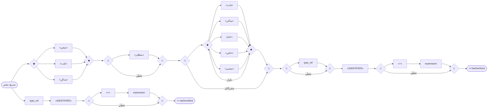

#### مثال
```sad
# أساسيّ + نوع اختياريّ
متغير س = 5
ثابت ع = 7
متغير رقم عدد = 3

# الصفة بعد الموصوف — المُعدِّل مُعدِّلٌ لا اسم (ISSUE-120)
متغير ثابت ص = 10       # ثابتٌ فعلاً: «ص = 20» بعده ⇒ SEM007
متغير عام ك = 1
متغير ساكن عام مشترك = 0

# «ساكن» تبدأ التصريح بذاتها كـ«متغير»/«ثابت»
ساكن عدّاد = 9
متغير ساكن عام جدول مصفوفة[4]   # يُحلَّل — ⚠️ لا يصلح للفهرسة بعدُ (ISSUE-122)

# «صدّر» تعرف الكلماتِ الثلاثَ جميعًا
صدّر ساكن مشترك = 51

# ✗ مرفوضة: مدّة تخزينٍ ساكنة لمحلّيٍّ غير منفَّذة ⇒ SEM039
# دالة د()
#   متغير ساكن ن = 0
# نهاية

# المنقوطة «؛» اختياريّة لا إلزاميّة (نهاية السطر تفصل الجمل)
متغير ن = 1؛

# ② الصيغة النوعيّة — النوع يبدأ التصريح بلا كلمةٍ مفتاحيّة
رقم س = 10
نص اسم = "ص"
طبيعي64 ن2 = 5
شخص ك = شخص()          # صنف من المستخدم
رقم ف                    # بلا تهيئة

# ✗ مرفوضة: لا مُعدِّلات في الصيغة النوعيّة — استعمل «متغير عام رقم س = 10»
# عام رقم س = 10
```

---

<a id="gr.decl.type_ref"></a>
### gr.decl.type_ref — إشارة نوع <span dir="ltr">(TypeRef)</span>

- **الرقم التسلسليّ:** `ق-017` · **المعرّف الموحَّد:** `gr.decl.type_ref` · **الحالة:** stable · **منذ:** 1.0.0
- **الوصف:** اسم نوع يُلفَظ كـIDENTIFIER (الأنواع **غير محجوزة** في المعجم). الأنواع المدمجة شائعة الاستعمال: «رقم» (صحيح)، «عشري»، «نص»، «منطقي»، «مصفوفة»، «خريطة»، «أي»، «طبيعي64»، «بايت»، «فراغ»، «عدم»؛ ويصلح أيّ معرّف صنفٍ مُعرَّفٍ من المستخدم. ⭐ TypeRef **يبدأ تصريحاً بذاته** (قرار مالك 2026-08-11 — الصيغة النوعيّة ② في gr.decl.variable): «نص اسم = "ص"» تصريحٌ معياريّ. ويظهر كذلك تابعاً لكلمة مفتاحية («متغير نص اسم»)، ونوعَ معامل («دالة ت(رقم س)»)، ونوعَ إرجاع («دالة رقم جمع()»). **قيدُ الإبهام:** حين يبدأ TypeRef التصريحَ **يلزمه معرّفٌ بعده مباشرةً** — «رقم» وحدها جملةُ تعبيرٍ لا تصريح، وهو ما يفصل الصيغتين بلا التباس. ⚠️ **ولا معامِلَ للعنصر** (مقيسٌ ٢٠٢٦-٠٨-١٧، ISSUE-148): TypeRef **رمزٌ مفردٌ**، فلا تُركَّب «مصفوفة رقم م» ولا «مصفوفة أي م» ولا «خريطة نص خ». والتعدادُ أعلاه يسرد «مصفوفة» و«خريطة» و«أي» في نَفَسٍ واحدٍ مع «رقم» و«نص»، فيُقرَأ أنّها تتراكب — وهي لا تتراكب: يُقرأ «مصفوفة» نوعًا و«رقم» **اسمًا للمتغيّر**، ويبقى «= [...]» إسنادًا حرًّا. والمفسّرُ يبتلع الشطرَ بالتصريحِ الضمنيّ فيبدو صحيحًا، والمُترجِمُ **يرفض البناء** — فالتباعدُ صامتٌ في المحرّكِ الذي يُجرَّب فيه أوّلًا. وأيُدعَم المعامِلُ مستقبلًا أم يُرفَض بتشخيصٍ صريح: **قرارٌ لم يُتَّخذ بعد**، وهذا السطرُ يصف المقيسَ لا يقضي به. ⚠️ **لاحقة «؟» (أمان العدم، NS-06) — مقيسةٌ في المواضع الأربعة، لا مفترَضة:** مدعومةٌ في **موضع نوع الإرجاع وحدَه** («دالة نص؟ جد()» ⇒ خروج ٠)؛ ومرفوضةٌ في تصريح المتغيّر بصيغتيه وفي المعاملات: «متغير نص؟ اسم» ⇒ SYN009، و«دالة ت(نص؟ س)» ⇒ SYN009، و«نص؟ اسم» ⇒ SYN001. دَينُ NS-06 مرصود — والوصفُ يذكر ما يعمل لا ما يُرجى أن يعمل. (أُعيد قياسُه 2026-08-14: الوصفُ أعلاه **صادقٌ كما هو**.) ✅ **والبديلُ اللفظيُّ يبلغ ما لا يبلغه الرمز:** الصفةُ «عدمي/عدمية» (قرارُ المالك 2026-08-13، gr.adv.type) تعمل في المواضع الثلاثة التي يُخفِق فيها «؟»: «متغير رقم عدمي س = لاشيء» و«دالة ت(رقم عدمي س)» و«نص عدمي اسم = لاشيء» — كلُّها خروجٌ ٠ على المحرّكَين (069، 071). والعلّةُ بنيويّةٌ لا مصادفة: فرعُ «النوعُ أوّلًا» يشترط أن يلي النوعَ **معرّفٌ مباشرةً**، و«؟» ليس معرّفًا فيسقط التحليل، بينما «عدمي» يلفظها المُشكِّلُ IDENTIFIER فتبلغ الفرعَ. فالدَّينُ الباقي دَينُ **الرمز** وحدَه، ولم يعد دَينَ الميزة. ⚠️ **«مضاعف» لفظٌ مُزالٌ يُتعرَّف عليه عمداً:** أُزيل من اللغة (SYN014 يُرشد إلى «عشري»)، ويظلّ المُحلِّل يتعرّف عليه كي يصل التنفيذ إلى ذلك التشخيص الودّيّ. مُعلَنٌ في `types.yaml ⇒ removed_type_words` ومُولَّدٌ في `REMOVED_TYPE_NAMES`، لا مُصلَّباً. **وليس «مدخلاً ميّتاً»**: قِيس أنّ إسقاطه من تعرُّف المُحلِّل يُنزِل التشخيص إلى SYN016 «الاسم يحتوي مسافة» الذي ينصح باستعمال اللفظ المُزال اسماً للمتغيّر — تدهورٌ لا تنظيف (حرسه `negative/061` و`062`).

#### 📐 BNF
```bnf
TypeRef = ('رقم' | 'عشري' | 'نص' | 'منطقي' | 'مصفوفة' | 'خريطة' | 'أي'
         | 'طبيعي64' | 'بايت' | 'فراغ' | 'عدم' | Identifier) ;
```

#### 🧩 تفصيل البدائل
- `«<اسم نوع>»`

#### 🔻 المسار إلى المحلل (دوال التحليل) ⇒ AST
**دالة (دوال) الدخول:**
1. [`ParserCore::parseVarDecl`](../../../shared/parser/src/declarations/parser_declarations.cpp) — `shared/parser/src/declarations/parser_declarations.cpp`
- **عقدة AST المُنتَجة:** `—`
- **مُستدعى من:** [`parseVarDecl`](20_declarations.md#gr.decl.variable)، [`parseFunctionDecl`](20_declarations.md#gr.decl.function)، [`parseFunctionDecl`](20_declarations.md#gr.decl.parameters)، [`parseFunctionDecl`](20_declarations.md#gr.decl.extern)، [`parseDeclaration`](60_advanced.md#gr.adv.ffi_extern_block)

##### مخطّط مسار الدوال (حتى AST)


#### 📊 مخطّط البنية النحويّة (Mermaid)


#### مثال
```sad
متغير نص اسم = "ص"
متغير رقم عدد = 42
دالة عشري نصف(رقم س) ارجع س / 2 نهاية

# ✓ الصيغة النوعيّة: النوع يبدأ التصريح
نص عنوان = "ص"
رقم عدد2 = 42
```

---

<a id="gr.decl.function"></a>
### gr.decl.function — تصريح دالة <span dir="ltr">(FunctionDeclaration)</span>

- **الرقم التسلسليّ:** `ق-018` · **المعرّف الموحَّد:** `gr.decl.function` · **الحالة:** stable · **منذ:** 1.0.0
- **الوصف:** تصريح دالة باسم ومعاملات وجسم يُغلَق بـ«نهاية». **نوع الإرجاع اختياريّ ويأتي قبل الاسم** (لا بعد المعاملات): «دالة رقم جمع(...)»، «دالة نص حيّ()»، ويشمل الأنواع المدمجة والاختياريّة «نوع؟» (NS-06) وأصناف المستخدم «دالة نقطة اصنع()». الصفة «غير_متزامن» تأتي **بعد المعاملات** (سياقية). المعاملات اختيارية وتقبل نوعاً وقيمة افتراضيّة (انظر gr.decl.parameters). إن غاب نوع الإرجاع استُنتِج من جسم الدالة. **قيد:** صيغة السهم «-> نوع» بعد المعاملات مرفوضة برسالة صريحة تُرشِد لوضع النوع قبل الاسم (ISSUE-023 — ليست فقدان ميزة بل صيغة بديلة). تفاصيل «غير_متزامن»/«انتظر» في 60_advanced.

#### 📐 BNF
```bnf
FunctionDeclaration = 'دالة' [ 'لا_ترجع' ] [ 'مقاطعة' ] [ Type ] Identifier
                      '(' [ Parameters ] ')' [ 'غير_متزامن' ] Block ;
```

#### 🧩 تفصيل البدائل
- `«دالة» [ «لا_ترجع» ] [ «مقاطعة» ] [ type_ref ] «IDENTIFIER» «(» [ parameters ] «)» [ «غير_متزامن» ] block`

#### 🔻 المسار إلى المحلل (دوال التحليل) ⇒ AST
**دالة (دوال) الدخول:**
1. [`ParserCore::parseFunctionDecl`](../../../shared/parser/src/declarations/parser_declarations.cpp) — `shared/parser/src/declarations/parser_declarations.cpp`
- **عقدة AST المُنتَجة:** `FunctionDecl`
- **يستدعي دوال:** [`parseVarDecl`](20_declarations.md#gr.decl.type_ref)، [`parseBlockStmt`](00_program.md#gr.program.block)
- **مُستدعى من:** [`parseDeclaration`](00_program.md#gr.program.declaration)، [`parseImplDecl`](30_oop.md#gr.oop.impl)، [`parseExtensionDecl`](30_oop.md#gr.oop.extension)، [`parseTemplateDecl`](60_advanced.md#gr.adv.template_decl)، [`parseUIDeclaration`](60_advanced.md#gr.adv.ui_decl)
- **روابط المعجم:** كلمات: «دالة»، «لا_ترجع»، «مقاطعة»

##### مخطّط مسار الدوال (حتى AST)
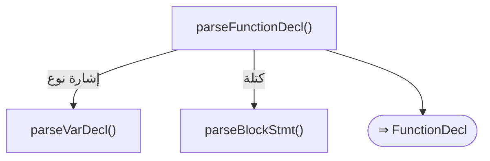

#### 📊 مخطّط البنية النحويّة (Mermaid)
```mermaid
flowchart LR
  n1(["تصريح دالة"])
  n2["«دالة»"]
  n3{"◇"}
  n4{"◇"}
  n5["«لا_ترجع»"]
  n3 --> n5
  n5 --> n4
  n3 -- "تخطّي" --> n4
  n2 --> n3
  n6{"◇"}
  n7{"◇"}
  n8["«مقاطعة»"]
  n6 --> n8
  n8 --> n7
  n6 -- "تخطّي" --> n7
  n4 --> n6
  n9{"◇"}
  n10{"◇"}
  n11["type_ref"]
  n9 --> n11
  n11 --> n10
  n9 -- "تخطّي" --> n10
  n7 --> n9
  n12["«IDENTIFIER»"]
  n10 --> n12
  n13["«(»"]
  n12 --> n13
  n14{"◇"}
  n15{"◇"}
  n16["parameters"]
  n14 --> n16
  n16 --> n15
  n14 -- "تخطّي" --> n15
  n13 --> n14
  n17["«)»"]
  n15 --> n17
  n18{"◇"}
  n19{"◇"}
  n20["«غير_متزامن»"]
  n18 --> n20
  n20 --> n19
  n18 -- "تخطّي" --> n19
  n17 --> n18
  n21["block"]
  n19 --> n21
  n1 --> n2
  n22(["⇒ FunctionDecl"])
  n21 --> n22
```

#### مثال
```sad
# بلا نوع إرجاع (يُستنتَج)
دالة جمع(أ، ب)
    ارجع أ + ب
نهاية

# نوع الإرجاع قبل الاسم
دالة رقم مربّع(س)
    ارجع س * س
نهاية

# نوع نصّ قبل الاسم
دالة نص حيّ()
    ارجع "مرحبا"
نهاية
```

---

<a id="gr.decl.parameters"></a>
### gr.decl.parameters — المعاملات <span dir="ltr">(Parameters)</span>

- **الرقم التسلسليّ:** `ق-019` · **المعرّف الموحَّد:** `gr.decl.parameters` · **الحالة:** stable · **منذ:** 1.0.0
- **الوصف:** قائمة معاملات مفصولة بفواصل (عربيّة «،» أو لاتينيّة «,»). كلّ معامل: نوع اختياريّ («رقم س») ثمّ الاسم ثمّ قيمة افتراضيّة اختياريّة («ب = 10»). يجوز خلط المُنوَّع وغير المُنوَّع وذي الافتراضيّ في القائمة نفسها. استدعاء الدالة بأقلّ من العدد يملأ النواقص بالافتراضيّات. **قيد:** المعامل المتغيّر «...اسم» (variadic) غير مدعوم — يُتخطّى «...» ثمّ يُخطئ (ISSUE-022).

#### 📐 BNF
```bnf
Parameters = Parameter { ',' Parameter } ;  Parameter = [ Type ] Identifier [ '=' Expression ] ;
```

#### 🧩 تفصيل البدائل
- `( [ type_ref ] «IDENTIFIER» [ «=» expression ] )+`

#### 🔻 المسار إلى المحلل (دوال التحليل) ⇒ AST
**دالة (دوال) الدخول:**
1. [`ParserCore::parseFunctionDecl`](../../../shared/parser/src/declarations/parser_declarations.cpp) — `shared/parser/src/declarations/parser_declarations.cpp`
- **عقدة AST المُنتَجة:** `—`
- **يستدعي دوال:** [`parseVarDecl`](20_declarations.md#gr.decl.type_ref)، [`parseExpression`](40_expressions.md#gr.expr.expression)
- **مُستدعى من:** [`parseFunctionDecl`](20_declarations.md#gr.decl.function)، [`parseFunctionDecl`](20_declarations.md#gr.decl.extern)، [`parseMethodDeclaration`](30_oop.md#gr.oop.method)، [`parseConstructorDeclaration`](30_oop.md#gr.oop.constructor)، [`parseOperatorDecl`](30_oop.md#gr.oop.operator)، [`parseTraitDecl`](30_oop.md#gr.oop.trait)، [`parseLambda`](40_expressions.md#gr.expr.lambda)، [`parseMacroDecl`](60_advanced.md#gr.adv.macro)، [`parseDeclaration`](60_advanced.md#gr.adv.ffi_extern_block)

##### مخطّط مسار الدوال (حتى AST)
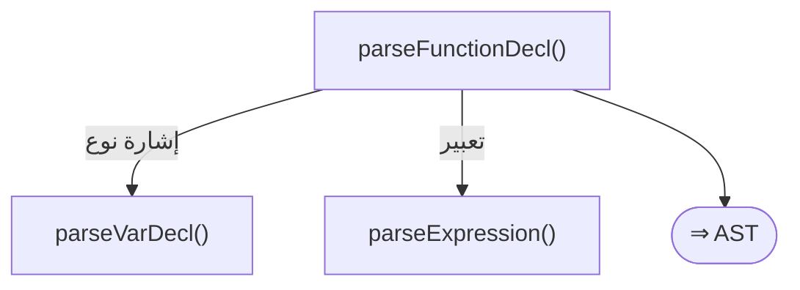

#### 📊 مخطّط البنية النحويّة (Mermaid)
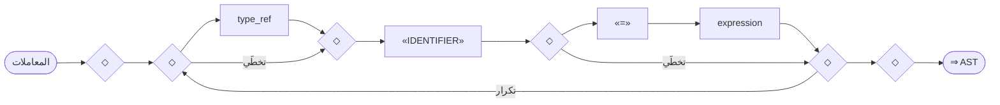

#### مثال
```sad
# مُنوَّع + قيمة افتراضيّة
دالة ت(رقم س، ب = 10)
    ارجع س + ب
نهاية
اطبع_سطر(ت(5))      # 15 (ب افتراضيّ)
اطبع_سطر(ت(5، 20))  # 25
```

---

<a id="gr.decl.import"></a>
### gr.decl.import — تصريح استيراد <span dir="ltr">(ImportDeclaration)</span>

- **الرقم التسلسليّ:** `ق-020` · **المعرّف الموحَّد:** `gr.decl.import` · **الحالة:** stable · **منذ:** 1.0.0
- **الوصف:** صيغتان: (أ) «استورد وحدة» لوحدة كاملة، مع اسم مستعار اختياريّ «استورد وحدة كـ ر»؛ (ب) «من وحدة استورد اسم [، اسم…]» أو «من وحدة استورد *» لأسماء محدَّدة. **كلتاهما تُحلَّلان نحوياً بنجاح** — فشل «من … استورد» في ISSUE-024 خطأُ **تنفيذٍ** (الرمز غير موجود في الوحدة/تحليل الوحدة) لا خطأ نحو؛ فالبناء سليم والعائق دلاليّ (توفّر الرمز في الوحدة المضمَّنة). بعض المدمجات تتطلّب «استورد أساسيات» أوّلاً. **دلالةُ الصيغة (أ):** اسمُ الوحدة — ومستعارُها «كـ ر» — يفتح **فضاءَ أسماء**، فيُنادى الرمزُ مؤهَّلًا: `ر.جمع(1، 2)` تُرجع 3، ويُقرأ العامُّ مؤهَّلًا كذلك: `ر.الحد_الأقصى`. وهذا **يعمل في المحرّكَين معًا** (مقيسٌ حيًّا 2026-08-04، كواشف 069–071). وكان قبلَه تباعُدًا تامًّا متعاكسًا — المفسّرُ فضاءُ أسماءٍ حصرًا والمصرّفُ تسطيحٌ حصرًا — فلا برنامجَ بهذه الصيغةِ يعمل في المحرّكَين (ISSUE-090). ويصحّ التأهيلُ كذلك عبر وحدةِ واجهةٍ تُعيد التصدير (`صدّر * من …`) فما تُتيحه الوحدةُ يُحسَب متعدّيًا (كاشف 075). والرمزُ غيرُ المُصدَّرِ لا يُؤهَّل في المحرّكَين (كاشف 076). **⚠️ حدودٌ مقيسةٌ على التأهيل — لا يُقرأ ما سبق أوسعَ منها:** (١) **ISSUE-090-ب:** المصرّفُ أكثرُ تساهلًا فيقبل **أيضًا** الصيغةَ المسطَّحةَ `جمع(1، 2)` بعد `استورد م`، بينما يرفضها المفسّرُ بـSEM004؛ فالمؤهَّلُ وحدَه هو المحمولُ بين المحرّكَين. (٢) **ISSUE-090-ج:** إن استُوردت وحدتان تُصدّران الاسمَ نفسَه، فصَل المفسّرُ فضاءَيهما بينما يُسطّح المصرّفُ فينهار الرمزان إلى واحد — فيرفض المصرّفُ بتشخيصِ إبهامٍ صريحٍ بدل اختيارٍ صامت. (٣) **ISSUE-090-د:** الوسيطُ الافتراضيُّ الناقصُ في نداءٍ مؤهَّل (`ر.زد(5)` ودالّتُها `زد(أ، ب = 10)`) يُخطئ في المفسّرِ بـSEM001 ويصحّ في المصرّف — والصيغةُ المسطَّحةُ `زد(5)` سليمةٌ في المحرّكَين، فالعطبُ في التأهيلِ حصرًا وهو **عيبُ مفسّرٍ سابق**. (٤) **ISSUE-090-و:** وحداتُ المكتبةِ القياسيّةِ لا تفتح فضاءَ أسماءٍ في أيٍّ من المحرّكَين: `استورد رياضيات كـ ر` ثمّ `ر.جذر(9)` يفشل فيهما معًا — في المفسّرِ بـRUN022، وفي المصرّفِ لأنّ الوحدةَ القياسيّةَ تُعترَض قبلَ قراءةِ شجرتِها فلا تُقيَّد رموزُها (كاشف 077).

#### 📐 BNF
```bnf
ModuleRef         = Identifier { '.' Identifier }
                  | StringLiteral ;
SourcePath        = ModuleRef
                  | ( '.' | '..' ) Identifier { '.' Identifier } ;
ImportItem        = Identifier [ 'كـ' Identifier ] ; ImportItems       = '*' | ImportItem { ( '،' | ',' ) ImportItem } ; ImportDeclaration = 'استورد' ModuleRef [ 'كـ' Identifier ]
                  | 'استورد' ImportItems 'من' SourcePath
                  | 'من' SourcePath 'استورد' ImportItems ;
```

#### 🧩 تفصيل البدائل
**1.** *استيراد وحدة:* `«استورد» «<وحدة>» [ «كـ» «IDENTIFIER» ]`
**2.** *استيراد محدد من وحدة:* `«من» «<وحدة>» «استورد» «<اسم|*>»`

#### 🔻 المسار إلى المحلل (دوال التحليل) ⇒ AST
**دالة (دوال) الدخول:**
1. [`ParserCore::parseImportStmt`](../../../shared/parser/src/declarations/parser_modules.cpp) — `shared/parser/src/declarations/parser_modules.cpp`
- **عقدة AST المُنتَجة:** `ImportStmt | FromImportStmt`
- **مُستدعى من:** [`parseDeclaration`](00_program.md#gr.program.declaration)
- **روابط المعجم:** كلمات: «استورد»، «من»، «كـ»

##### مخطّط مسار الدوال (حتى AST)
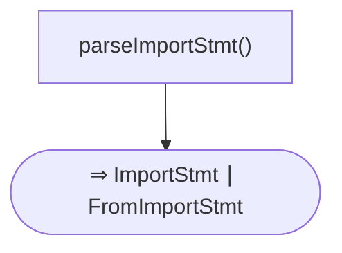

#### 📊 مخطّط البنية النحويّة (Mermaid)
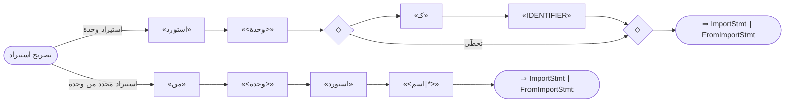

#### مثال
```sad
استورد رياضيات
استورد رياضيات كـ ر
من رياضيات استورد جا، جتا
```

---

<a id="gr.decl.export"></a>
### gr.decl.export — تصريح تصدير <span dir="ltr">(ExportDeclaration)</span>

- **الرقم التسلسليّ:** `ق-021` · **المعرّف الموحَّد:** `gr.decl.export` · **الحالة:** stable · **منذ:** 1.0.0
- **الوصف:** «صدّر» تسبق تصريحاً (دالة/صنف/متغير/بنية) فتُتيحه للاستيراد من وحدات أخرى. تلتفّ حول تصريحٍ كامل لا حول قيمة؛ فـ«صدّر متغير ص = 42» و«صدّر دالة …» و«صدّر بنية …» صحيحة. «صدّر بنية» تُترجَم الآن عبر الوحدات (ISSUE-026 مُغلَق). **مسارا التحليل:** «صدّر» في موضع التصريح (المستوى الأعلى) يمرّ بـparseExportDecl فيُنتج ExportDecl؛ وفي موضع الجملة (داخل كتلة) يمرّ بـparseExportStmt فيُنتج ExportStmt. القاعدةُ هذه تصف الأوّل، وهو ما يبنيه البرنامجُ فعلًا. **وشكلُ «صدّر *» ليس من هذه القاعدة** بل من gr.decl.reexport، ويُقبل في المحرّكَين معًا لا يُرفَض.

#### 📐 BNF
```bnf
ExportDeclaration = 'صدّر' Declaration ;
```

#### 🧩 تفصيل البدائل
- `«صدّر» declaration`

#### 🔻 المسار إلى المحلل (دوال التحليل) ⇒ AST
**دالة (دوال) الدخول:**
1. [`ParserCore::parseExportDecl`](../../../shared/parser/src/declarations/parser_modules.cpp) — `shared/parser/src/declarations/parser_modules.cpp`
- **عقدة AST المُنتَجة:** `ExportDecl`
- **يستدعي دوال:** [`parseDeclaration`](00_program.md#gr.program.declaration)
- **مُستدعى من:** [`parseDeclaration`](00_program.md#gr.program.declaration)
- **روابط المعجم:** كلمات: «صدّر»

##### مخطّط مسار الدوال (حتى AST)
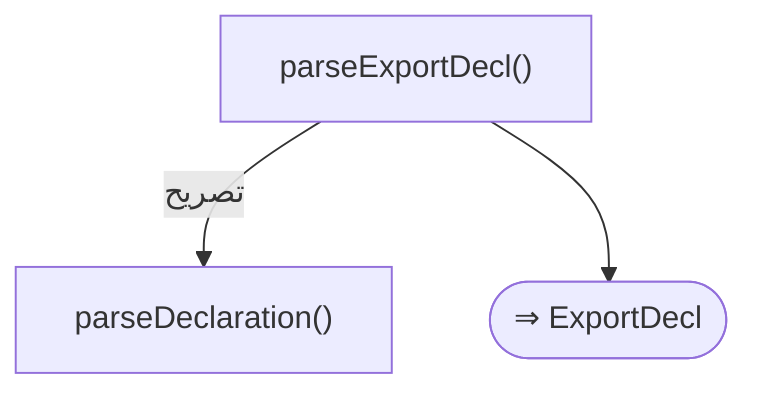

#### 📊 مخطّط البنية النحويّة (Mermaid)


#### مثال
```sad
صدّر متغير ثابت النسخة = "1.0"
صدّر دالة جمع(أ، ب)
    ارجع أ + ب
نهاية
```

---

<a id="gr.decl.reexport"></a>
### gr.decl.reexport — تصريح إعادة تصدير <span dir="ltr">(ReExportDeclaration)</span>

- **الرقم التسلسليّ:** `ق-022` · **المعرّف الموحَّد:** `gr.decl.reexport` · **الحالة:** stable · **منذ:** 1.0.0
- **الوصف:** إعادةُ التصدير تجعل وحدةً واجهةً لوحداتٍ أخرى، فيستورد المستعمِلُ منها رمزًا معرَّفًا في غيرها. ثلاثةُ أشكال: «صدّر *» المجرَّدة (بلا «من») ومعناها «صدّر كلَّ رموز هذه الوحدة العلنيّة» — وهي **لا-عمليّة** في المحرّكَين لأنّ رموزَ الوحدة متاحةٌ أصلًا، وتُستعمل توثيقًا للنيّة في وحدات المكتبة؛ و«صدّر * من وحدة» التي تُحمّل الوحدةَ المصدر؛ و«صدّر عنصر [كـ اسم] [، عنصر…] من وحدة» الانتقائيّة. شكلا «من وحدة» يعملان في المحرّكَين معًا: في الملفِّ المُعيدِ للتصدير نفسِه، و**عابرَين** كذلك — أي أن يستوردَ ملفٌّ ثالثٌ من الوحدةِ الواجهةِ رمزًا معرَّفًا في الوحدةِ المصدر (كان هذا العبورُ يعمل في المفسّرِ وحدَه ⇒ ISSUE-089، وصار تكافؤًا مقيسًا في المحرّكَين). ويصحّ المسارُ **النسبيُّ** في إعادةِ التصديرِ كذلك («صدّر * من .أخت») فيُحَلُّ من مجلَّدِ الوحدةِ التي كتبته لا من مجلَّدِ ملفِّ الجذر (ISSUE-089-ب). و**الدورةُ** — وحدتان تُعيد كلٌّ تصديرَ الأخرى — تنتهي في المحرّكَين بقاطعِ دورٍ في كلٍّ منهما، بعد أن كانت تُنهي كلًّا منهما بانهيارِ مكدّسٍ بلا تشخيص (ISSUE-094). **فضُّ الالتباس مع gr.decl.export:** الشكلُ الانتقائيُّ يبدأ كما تبدأ «صدّر اسم» من قاعدة التصدير؛ يفضّهما المحلّلُ بنظرةِ رمزٍ واحدٍ بعد الاسم: إن كان «من» أو فاصلةً (عربيّةً أو إنجليزيّة) أو «كـ» فهي إعادةُ تصدير، وإلّا فهي تصديرُ تصريحٍ.

#### 📐 BNF
```bnf
ReExportDeclaration = 'صدّر' '*'
                    | 'صدّر' '*' 'من' SourcePath
                    | 'صدّر' ImportItem { ( '،' | ',' ) ImportItem } 'من' SourcePath ;
(* ImportItem و SourcePath معرَّفتان في gr.decl.import *)
```

#### 🧩 تفصيل البدائل
**1.** *تصدير شامل مجرد:* `«صدّر» «*»`
**2.** *إعادة تصدير شاملة من وحدة:* `«صدّر» «*» «من» «<مسار_وحدة>»`
**3.** *إعادة تصدير انتقائية من وحدة:* `«صدّر» «<عنصر>» [ «كـ» «IDENTIFIER» ] { ( «،» | «,» ) «<عنصر>» [ «كـ» «IDENTIFIER» ] } «من» «<مسار_وحدة>»`

#### 🔻 المسار إلى المحلل (دوال التحليل) ⇒ AST
**دالة (دوال) الدخول:**
1. [`ParserCore::parseExportDecl`](../../../shared/parser/src/declarations/parser_modules.cpp) — `shared/parser/src/declarations/parser_modules.cpp`
- **عقدة AST المُنتَجة:** `ReExportStmt`
- **روابط المعجم:** كلمات: «صدّر»، «من»، «كـ»

##### مخطّط مسار الدوال (حتى AST)
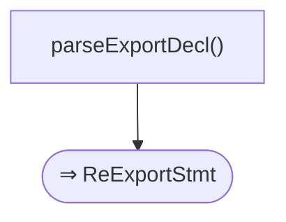

#### 📊 مخطّط البنية النحويّة (Mermaid)
```mermaid
flowchart LR
  n1(["تصريح إعادة تصدير"])
  n2["«صدّر»"]
  n3["«*»"]
  n2 --> n3
  n1 -- "تصدير شامل مجرد" --> n2
  n4(["⇒ ReExportStmt"])
  n3 --> n4
  n5["«صدّر»"]
  n6["«*»"]
  n5 --> n6
  n7["«من»"]
  n6 --> n7
  n8["«<مسار_وحدة>»"]
  n7 --> n8
  n1 -- "إعادة تصدير شاملة من وحدة" --> n5
  n9(["⇒ ReExportStmt"])
  n8 --> n9
  n10["«صدّر»"]
  n11["«<عنصر>»"]
  n10 --> n11
  n12{"◇"}
  n13{"◇"}
  n14["«كـ»"]
  n15["«IDENTIFIER»"]
  n14 --> n15
  n12 --> n14
  n15 --> n13
  n12 -- "تخطّي" --> n13
  n11 --> n12
  n16{"◇"}
  n17{"◇"}
  n18{"◆"}
  n19{"◆"}
  n20["«،»"]
  n18 --> n20
  n20 --> n19
  n21["«,»"]
  n18 --> n21
  n21 --> n19
  n22["«<عنصر>»"]
  n19 --> n22
  n23{"◇"}
  n24{"◇"}
  n25["«كـ»"]
  n26["«IDENTIFIER»"]
  n25 --> n26
  n23 --> n25
  n26 --> n24
  n23 -- "تخطّي" --> n24
  n22 --> n23
  n16 --> n18
  n24 --> n17
  n24 -- "تكرار" --> n18
  n16 -- "صفر/أكثر" --> n17
  n13 --> n16
  n27["«من»"]
  n17 --> n27
  n28["«<مسار_وحدة>»"]
  n27 --> n28
  n1 -- "إعادة تصدير انتقائية من وحدة" --> n10
  n29(["⇒ ReExportStmt"])
  n28 --> n29
```

#### مثال
```sad
صدّر *
صدّر * من أدوات
صدّر جمع كـ اجمع، طرح من حساب
```

---

<a id="gr.decl.extern"></a>
### gr.decl.extern — تصريح خارجي <span dir="ltr">(ExternDeclaration)</span>

- **الرقم التسلسليّ:** `ق-023` · **المعرّف الموحَّد:** `gr.decl.extern` · **الحالة:** stable · **منذ:** 1.0.0
- **الوصف:** ربط دالة خارجيّة (C/C++ ABI) عبر «دالة خارجية [("اسم_الربط")] [نوع] اسم(معاملات)» — **تصريح بلا جسم** (لا «نهاية»): يُعرّف التوقيع فقط ليُربط برمزٍ خارجيّ وقت الوصل. «خارجية» صفة مؤنّثة تطابق «دالة» (RFC 0034 — الصفة بعد الاسم وتطابقه جنسًا)؛ الصيغة القديمة «خارجي دالة» أُزيلت ويقابلها حاجز خطأ توجيهيّ. اسم الربط المقوّس الاختياريّ «("رمز")» يربط الاسم العربيّ برمز C مغاير. تفاصيل كتلة الربط «خارجي "C" … نهاية» وسمات الوصل في 60_advanced (gr.adv.ffi_*).

#### 📐 BNF
```bnf
ExternDeclaration = 'دالة' 'خارجية' [ '(' StringLiteral ')' ] [ Type ] Identifier '(' [ Parameters ] ')' ;
```

#### 🧩 تفصيل البدائل
- `«دالة» «خارجية» [ «(» «STRING_LITERAL» «)» ] [ type_ref ] «IDENTIFIER» «(» [ parameters ] «)»`

#### 🔻 المسار إلى المحلل (دوال التحليل) ⇒ AST
**دالة (دوال) الدخول:**
1. [`ParserCore::parseFunctionDecl`](../../../shared/parser/src/declarations/parser_declarations.cpp) — `shared/parser/src/declarations/parser_declarations.cpp`
2. [`ParserCore::parseExternFunctionDecl`](../../../shared/parser/src/declarations/parser_declarations.cpp) — `shared/parser/src/declarations/parser_declarations.cpp`
- **عقدة AST المُنتَجة:** `FunctionDecl`
- **يستدعي دوال:** [`parseVarDecl`](20_declarations.md#gr.decl.type_ref)
- **روابط المعجم:** كلمات: «دالة»، «خارجي»

##### مخطّط مسار الدوال (حتى AST)
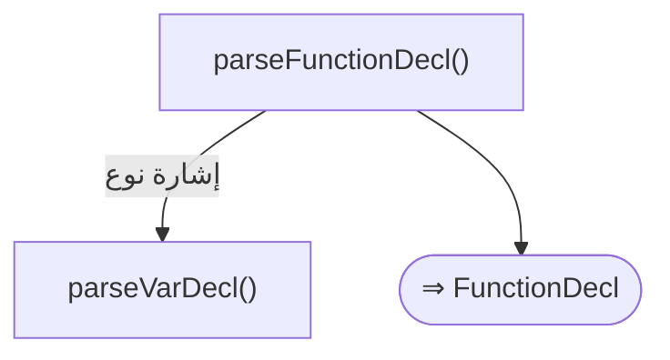

#### 📊 مخطّط البنية النحويّة (Mermaid)
```mermaid
flowchart LR
  n1(["تصريح خارجي"])
  n2["«دالة»"]
  n3["«خارجية»"]
  n2 --> n3
  n4{"◇"}
  n5{"◇"}
  n6["«(»"]
  n7["«STRING_LITERAL»"]
  n6 --> n7
  n8["«)»"]
  n7 --> n8
  n4 --> n6
  n8 --> n5
  n4 -- "تخطّي" --> n5
  n3 --> n4
  n9{"◇"}
  n10{"◇"}
  n11["type_ref"]
  n9 --> n11
  n11 --> n10
  n9 -- "تخطّي" --> n10
  n5 --> n9
  n12["«IDENTIFIER»"]
  n10 --> n12
  n13["«(»"]
  n12 --> n13
  n14{"◇"}
  n15{"◇"}
  n16["parameters"]
  n14 --> n16
  n16 --> n15
  n14 -- "تخطّي" --> n15
  n13 --> n14
  n17["«)»"]
  n15 --> n17
  n1 --> n2
  n18(["⇒ FunctionDecl"])
  n17 --> n18
```

#### مثال
```sad
دالة خارجية printf(نص)
دالة خارجية("cos") عشري جيب_التمام(عشري)
دالة خارجية رقم مدخل()
```

---

<a id="gr.decl.arg_list"></a>
### gr.decl.arg_list — قائمة وسائط <span dir="ltr">(ArgList)</span>

- **الرقم التسلسليّ:** `ق-024` · **المعرّف الموحَّد:** `gr.decl.arg_list` · **الحالة:** stable · **منذ:** 1.0.0
- **الوصف:** وسائط الاستدعاء مفصولة بفواصل **عربيّة «،» أو لاتينيّة «,» (يجوز خلطهما)**؛ قد تكون القائمة فارغة. كلّ وسيطٍ تعبيرٌ كامل (حرفيّ، متغيّر، عمليّة، استدعاء متداخل…). قاعدة مساعِدة يستهلكها استدعاء الدوال/الطرق (gr.expr.postfix) والمُزخرِفات ومصانع العناصر. تُقيَّم الوسائط قبل الاستدعاء؛ لا وسائط مُسمّاة ولا نشر «...» في الاستدعاء.

#### 📐 BNF
```bnf
ArgList = [ Expression { ( ',' | '،' ) Expression } ] ;
```

#### 🧩 تفصيل البدائل
- `[ expression { ( «،» | «,» ) expression } ]`

#### 🔻 المسار إلى المحلل (دوال التحليل) ⇒ AST
**دالة (دوال) الدخول:**
1. [`ParserCore::parseArgumentList`](../../../shared/parser/src/core/parser_helpers.cpp) — `shared/parser/src/core/parser_helpers.cpp`
- **عقدة AST المُنتَجة:** `—`
- **يستدعي دوال:** [`parseExpression`](40_expressions.md#gr.expr.expression)
- **مُستدعى من:** [`parseConstructorDeclaration`](30_oop.md#gr.oop.constructor)، [`parsePostfix`](30_oop.md#gr.oop.new)، [`parsePostfix`](40_expressions.md#gr.expr.postfix)، [`parseDecorator`](40_expressions.md#gr.expr.decorator)، [`parseDirectiveExpr`](40_expressions.md#gr.expr.directive)، [`parseWidgetExpression`](60_advanced.md#gr.adv.widget)، [`parseModifierChain`](60_advanced.md#gr.adv.ui_modifier_chain)

##### مخطّط مسار الدوال (حتى AST)


#### 📊 مخطّط البنية النحويّة (Mermaid)
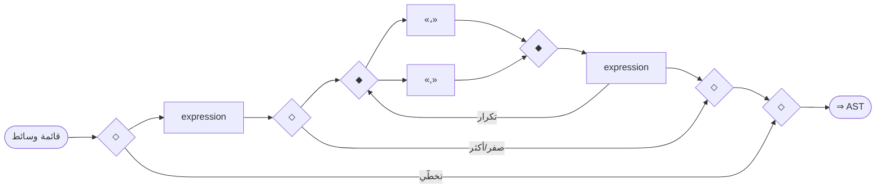

#### مثال
```sad
اطبع_سطر(جمع(1، 2))
اطبع_سطر(اكبر(3, 5, 8))
```

---
