# قواعد المحلل — طبقة البرمجة الكائنية

> ⚠️ **هذا الملف مُولَّد آليًّا** من `language-truth/grammar/*.yaml` عبر
> `scripts/codegen/gen_parser_grammar_docs.py` — **لا تُحرِّره يدويًّا**.
> عدّل YAML المصدر ثم أعد التوليد.


- **الطبقة:** `oop` · **ملف المصدر:** `language-truth/grammar/30_oop.yaml`
- **الوصف:** البرمجة الكائنية — صنف/أعضاء/حقل/طريقة/باني/هادم/خاصية/سمة/تنفيذ/امتداد/جديد/هذا/الأساس
- **عدد القواعد:** 16

> **قراءة المخطّطات:** «📊 مخطّط البنية النحويّة» يُظهر تسلسل الرموز (تكرار «تكرار»، اختياري «تخطّي»، بدائل ◆). «مخطّط مسار الدوال» يُظهر دوال المحلل التي تُستدعى حتى بناء عقدة AST.

## نظرة عامّة — مسار دوال الطبقة
> الاستدعاءات الداخليّة بين دوال قواعد هذه الطبقة (الروابط عبر الطبقات مذكورة في كل قاعدة).
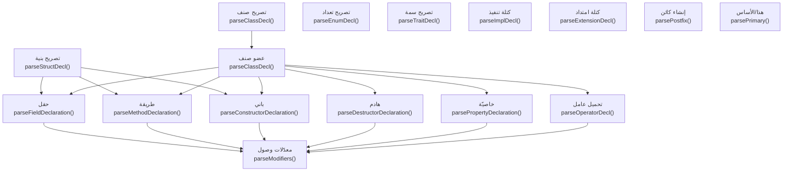

---

<a id="gr.oop.class"></a>
### gr.oop.class — تصريح صنف <span dir="ltr">(ClassDecl)</span>

- **الرقم التسلسليّ:** `ق-025` · **المعرّف الموحَّد:** `gr.oop.class` · **الحالة:** stable · **منذ:** 1.0.0
- **الوصف:** صنفٌ بكلمة «صنف» ثمّ الاسم ثمّ أعضاء (حقول/بانٍ/هادم/طرق/خصائص/عوامل) يُغلَقون بـ«نهاية» (الجسم بلا أقواس). المعدّلات «مجرد»/«محكم» تأتي **بعد** «صنف» (الصفة بعد الموصوف). الوراثة المفردة/المتعدّدة بـ«يرث أب [، أب…]»، وربط السمات بـ«نفّذ سمة [، سمة…]» في الترويسة. أسماء الأنواع المدمجة مقبولة كأسماء أصناف. يُنشأ المثيل بـ«اسم(وسائط)» أو «اسم(وسائط) جديد» (gr.oop.new).

#### 📐 BNF
```bnf
ClassDecl = 'صنف' { 'مجرد' | 'محكم' } Identifier
            [ 'يرث' Identifier { ',' Identifier } ]
            [ 'نفّذ' Identifier { ',' Identifier } ]
            { ClassMember } 'نهاية' ;
```

#### 🧩 تفصيل البدائل
- `«صنف» { ( «مجرد» | «محكم» ) } «IDENTIFIER» [ «يرث» «IDENTIFIER» { ( «،» | «,» ) «IDENTIFIER» } ] [ «نفّذ» «IDENTIFIER» { ( «،» | «,» ) «IDENTIFIER» } ] { member } «نهاية»`

#### 🔻 المسار إلى المحلل (دوال التحليل) ⇒ AST
**دالة (دوال) الدخول:**
1. [`ParserCore::parseClassDecl`](../../../shared/parser/src/declarations/parser_declarations.cpp) — `shared/parser/src/declarations/parser_declarations.cpp`
- **عقدة AST المُنتَجة:** `ClassDecl`
- **مُستدعى من:** [`parseDeclaration`](00_program.md#gr.program.declaration)، [`parseTemplateDecl`](60_advanced.md#gr.adv.template_decl)
- **روابط المعجم:** كلمات: «صنف»، «يرث»، «نهاية»، «مجرد»

##### مخطّط مسار الدوال (حتى AST)
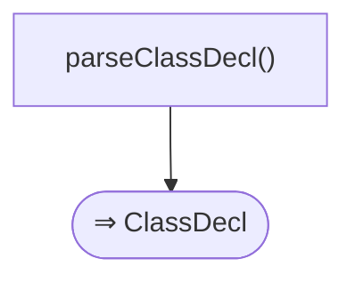

#### 📊 مخطّط البنية النحويّة (Mermaid)
```mermaid
flowchart LR
  n1(["تصريح صنف"])
  n2["«صنف»"]
  n3{"◇"}
  n4{"◇"}
  n5{"◆"}
  n6{"◆"}
  n7["«مجرد»"]
  n5 --> n7
  n7 --> n6
  n8["«محكم»"]
  n5 --> n8
  n8 --> n6
  n3 --> n5
  n6 --> n4
  n6 -- "تكرار" --> n5
  n3 -- "صفر/أكثر" --> n4
  n2 --> n3
  n9["«IDENTIFIER»"]
  n4 --> n9
  n10{"◇"}
  n11{"◇"}
  n12["«يرث»"]
  n13["«IDENTIFIER»"]
  n12 --> n13
  n14{"◇"}
  n15{"◇"}
  n16{"◆"}
  n17{"◆"}
  n18["«،»"]
  n16 --> n18
  n18 --> n17
  n19["«,»"]
  n16 --> n19
  n19 --> n17
  n20["«IDENTIFIER»"]
  n17 --> n20
  n14 --> n16
  n20 --> n15
  n20 -- "تكرار" --> n16
  n14 -- "صفر/أكثر" --> n15
  n13 --> n14
  n10 --> n12
  n15 --> n11
  n10 -- "تخطّي" --> n11
  n9 --> n10
  n21{"◇"}
  n22{"◇"}
  n23["«نفّذ»"]
  n24["«IDENTIFIER»"]
  n23 --> n24
  n25{"◇"}
  n26{"◇"}
  n27{"◆"}
  n28{"◆"}
  n29["«،»"]
  n27 --> n29
  n29 --> n28
  n30["«,»"]
  n27 --> n30
  n30 --> n28
  n31["«IDENTIFIER»"]
  n28 --> n31
  n25 --> n27
  n31 --> n26
  n31 -- "تكرار" --> n27
  n25 -- "صفر/أكثر" --> n26
  n24 --> n25
  n21 --> n23
  n26 --> n22
  n21 -- "تخطّي" --> n22
  n11 --> n21
  n32{"◇"}
  n33{"◇"}
  n34["member"]
  n32 --> n34
  n34 --> n33
  n34 -- "تكرار" --> n34
  n32 -- "صفر/أكثر" --> n33
  n22 --> n32
  n35["«نهاية»"]
  n33 --> n35
  n1 --> n2
  n36(["⇒ ClassDecl"])
  n35 --> n36
```

#### مثال
```sad
# أساسيّ
صنف نقطة
    متغير عام س
    باني(س) هذا.س = س نهاية
نهاية

# وراثة + معدّل + سمة
سمة ناطق دالة صوت() نهاية
صنف حيوان
    دالة صوت() ارجع "..." نهاية
نهاية
صنف قط يرث حيوان نفّذ ناطق
    دالة صوت() ارجع "مياو" نهاية
نهاية
اطبع_سطر(قط().صوت())     # مياو
```

---

<a id="gr.oop.enum"></a>
### gr.oop.enum — تصريح تعداد <span dir="ltr">(EnumDecl)</span>

- **الرقم التسلسليّ:** `ق-026` · **المعرّف الموحَّد:** `gr.oop.enum` · **الحالة:** stable · **منذ:** 1.0.0
- **الوصف:** تعدادٌ بكلمة «تعداد» ثمّ الاسم ثمّ أعضاء يُغلَقون بـ«نهاية» (الأقواس «{}» مُزالة). عضوٌ واحدٌ على الأقلّ، والأعضاء مفصولون بفواصل (والفاصلة بين الأعضاء اختياريّة في بعض المواضع). لكلّ عضوٍ ثلاثة أشكال متعارضة: (١) بسيط/وحدويّ (بلا لاحقة؛ يُرقَّم ضمنيًّا)، (٢) قيمةٌ صريحة «= تعبير» تثبّت الوسم، (٣) حمولةٌ موضعيّة «(نوع اسم، ...)» لتعدادٍ جبريّ (ADT) — النوع قبل الاسم (قاعدة ص) واختياريّ. أسماء الأعضاء والحقول مرنة (تقبل كلماتٍ محجوزةً غير بنيويّة). الحمولة الموضعيّة قدرةٌ تجريبيّة يكتمل توصيلها الدلاليّ/التنفيذيّ في مراحل الاستضافة الذاتيّة (أ-م٢..أ-م٤).

#### 📐 BNF
```bnf
EnumDecl   = 'تعداد' Identifier EnumMember { [ ',' ] EnumMember } 'نهاية' ; EnumMember = Identifier [ Payload | '=' Expression ] ; Payload    = '(' [ Field { ( ',' | '،' ) Field } ] ')' ; Field      = [ Type ] Identifier ;
```

#### 🧩 تفصيل البدائل
- `«تعداد» «IDENTIFIER» ( «IDENTIFIER» [ ( ( «(» [ [ type ] «IDENTIFIER» { ( «،» | «,» ) [ type ] «IDENTIFIER» } ] «)» ) | ( «=» expression ) ) ] )+ «نهاية»`

#### 🔻 المسار إلى المحلل (دوال التحليل) ⇒ AST
**دالة (دوال) الدخول:**
1. [`ParserCore::parseEnumDecl`](../../../shared/parser/src/declarations/parser_declarations.cpp) — `shared/parser/src/declarations/parser_declarations.cpp`
- **عقدة AST المُنتَجة:** `EnumDecl`
- **يستدعي دوال:** [`parseType`](60_advanced.md#gr.adv.type)، [`parseExpression`](40_expressions.md#gr.expr.expression)
- **مُستدعى من:** [`parseDeclaration`](00_program.md#gr.program.declaration)
- **روابط المعجم:** كلمات: «تعداد»، «نهاية»

##### مخطّط مسار الدوال (حتى AST)
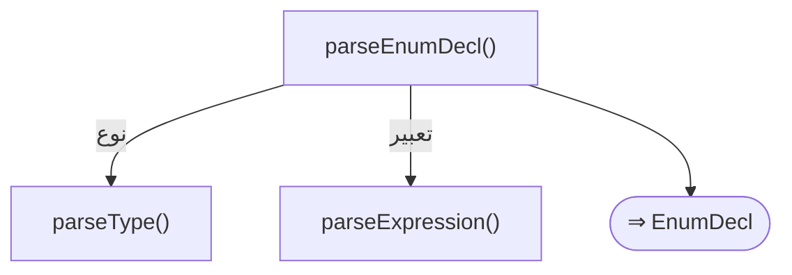

#### 📊 مخطّط البنية النحويّة (Mermaid)
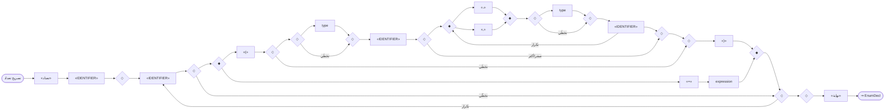

#### مثال
```sad
تعداد لون
    أحمر، أخضر، أزرق
نهاية

# بقيَم صريحة تثبّت الوسم
تعداد حالة
    نشط = 1، متوقف = 2
نهاية

# بحمولة موضعيّة (ADT) + وحدويّ
تعداد عقدة
    عدد(رقم قيمة)
    جمع(عقدة يسار، عقدة يمين)
    فراغ
نهاية
```

---

<a id="gr.oop.struct"></a>
### gr.oop.struct — تصريح بنية <span dir="ltr">(StructDecl)</span>

- **الرقم التسلسليّ:** `ق-027` · **المعرّف الموحَّد:** `gr.oop.struct` · **الحالة:** stable · **منذ:** 1.0.0
- **الوصف:** بنيةٌ بكلمة «بنية» ثمّ الاسم ثمّ أعضاء (حقول/بانٍ/طرق) يُغلَقون بـ«نهاية» (الأقواس «{}» مُزالة). تشبه الصنف لكن بلا وراثة؛ معاملات العمر اختياريّة (gr.adv.lifetime_params). المعدّلات بعد الموصوف («باني عام» لا «عام باني»). «صدّر بنية» تُترجَم عبر الوحدات (ISSUE-026 مُغلَق: مُلتقَطة في buildFromImportStmt/buildImportStmt).

#### 📐 BNF
```bnf
StructDecl = 'بنية' Identifier [ LifetimeParams ] { [ AccessMod ] ( Field | Constructor | Method ) } 'نهاية' ;
```

#### 🧩 تفصيل البدائل
- `«بنية» «IDENTIFIER» [ lifetime_params ] { ( field | constructor | method ) } «نهاية»`

#### 🔻 المسار إلى المحلل (دوال التحليل) ⇒ AST
**دالة (دوال) الدخول:**
1. [`ParserCore::parseStructDecl`](../../../shared/parser/src/declarations/parser_declarations.cpp) — `shared/parser/src/declarations/parser_declarations.cpp`
- **عقدة AST المُنتَجة:** `StructDecl`
- **يستدعي دوال:** [`parseLifetimeParams`](60_advanced.md#gr.adv.lifetime_params)، [`parseFieldDeclaration`](30_oop.md#gr.oop.field)، [`parseConstructorDeclaration`](30_oop.md#gr.oop.constructor)، [`parseMethodDeclaration`](30_oop.md#gr.oop.method)
- **مُستدعى من:** [`parseDeclaration`](00_program.md#gr.program.declaration)
- **روابط المعجم:** كلمات: «بنية»، «نهاية»

##### مخطّط مسار الدوال (حتى AST)
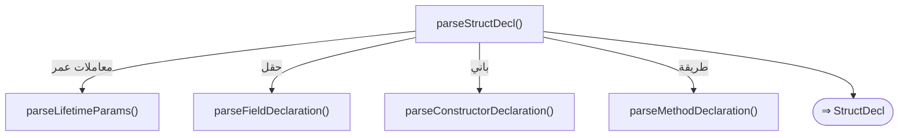

#### 📊 مخطّط البنية النحويّة (Mermaid)


#### مثال
```sad
بنية نقطة
    متغير عام س
    متغير عام ص
نهاية
متغير ن = نقطة()
ن.س = 3
اطبع_سطر(ن.س)     # 3
```

---

<a id="gr.oop.member"></a>
### gr.oop.member — عضو صنف <span dir="ltr">(ClassMember)</span>

- **الرقم التسلسليّ:** `ق-028` · **المعرّف الموحَّد:** `gr.oop.member` · **الحالة:** stable · **منذ:** 1.0.0
- **الوصف:** عضو الصنف يُختار بالكلمة المفتاحيّة الافتتاحيّة: «خاصية»⇒خاصيّة، «دالة»⇒طريقة، «باني»⇒باني، «هدم»⇒هادم، «عامل»⇒تحميل عامل، «متغير»/«ثابت»⇒حقل (انظر القواعد المفردة لكلٍّ). الموزّع يُميّز قبل قراءة المعدّلات، فالمعدّل يأتي **بعد** الكلمة؛ الصيغة القديمة (معدّل قبل الكلمة، «عام متغير») تُنتج خطأً توجيهيّاً مع استردادٍ عبر parseModifiers.

#### 📐 BNF
```bnf
ClassMember = Property | Method | Constructor | Destructor | Operator | Field ;
```

#### 🧩 تفصيل البدائل
- `( property | method | constructor | destructor | operator | field )`

#### 🔻 المسار إلى المحلل (دوال التحليل) ⇒ AST
**دالة (دوال) الدخول:**
1. [`ParserCore::parseClassDecl`](../../../shared/parser/src/declarations/parser_declarations.cpp) — `shared/parser/src/declarations/parser_declarations.cpp`
- **عقدة AST المُنتَجة:** `—`
- **يستدعي دوال:** [`parsePropertyDeclaration`](30_oop.md#gr.oop.property)، [`parseMethodDeclaration`](30_oop.md#gr.oop.method)، [`parseConstructorDeclaration`](30_oop.md#gr.oop.constructor)، [`parseDestructorDeclaration`](30_oop.md#gr.oop.destructor)، [`parseOperatorDecl`](30_oop.md#gr.oop.operator)، [`parseFieldDeclaration`](30_oop.md#gr.oop.field)
- **مُستدعى من:** [`parseClassDecl`](30_oop.md#gr.oop.class)، [`parseDeclaration`](60_advanced.md#gr.adv.contract)

##### مخطّط مسار الدوال (حتى AST)


#### 📊 مخطّط البنية النحويّة (Mermaid)
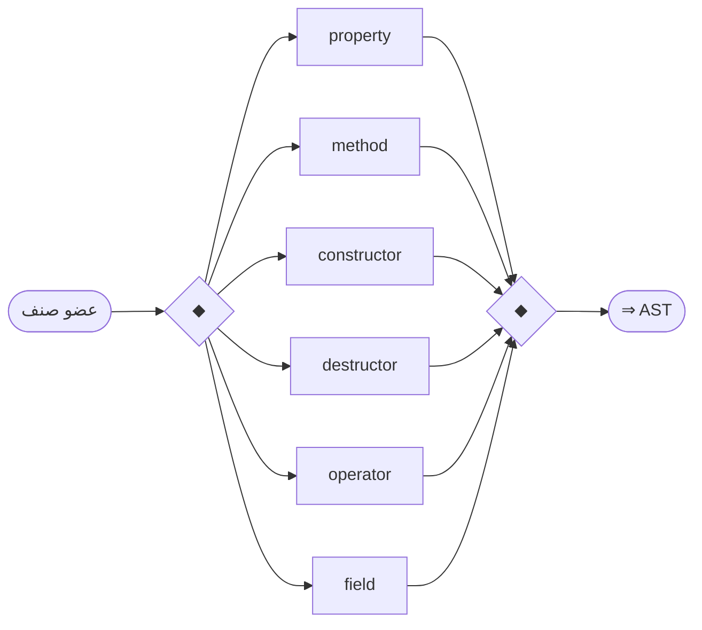

#### مثال
```sad
صنف نقطة
    متغير عام س              # حقل
    باني(س) هذا.س = س نهاية    # باني
    دالة اطبع() اطبع_سطر(هذا.س) نهاية   # طريقة
نهاية
نقطة(9).اطبع()     # 9
```

---

<a id="gr.oop.field"></a>
### gr.oop.field — حقل <span dir="ltr">(FieldDecl)</span>

- **الرقم التسلسليّ:** `ق-029` · **المعرّف الموحَّد:** `gr.oop.field` · **الحالة:** stable · **منذ:** 1.0.0
- **الوصف:** حقل بيانات في صنف/بنية بـ«متغير» (قابل للتغيير) أو «ثابت». المعدّلات (عام/خاص/ محمي/ساكن) تأتي **بعد** «متغير/ثابت» (الصفة بعد الموصوف): «متغير عام س»، «متغير خاص _ن». النوع اختياريّ والتهيئة «= قيمة» اختياريّة. تُقبَل كلمات ناعمة (غير بنيويّة) كأسماء حقول. الافتراضيّ للوصول «عام». ⭐ **والصيغةُ النوعيّةُ ② مقبولةٌ للحقلِ كذلك (بلا كلمةٍ مفتاحيّة): «رقم سن = 5» و«رقم سن» — وهي الصيغةُ الوحيدةُ التي تقبل نوعًا في الحقل**، إذ «متغير رقم سن» تُرفَض بـSYN011. وقد كانت هذه الصيغةُ مستعمَلةً ومقيسةً ولا يذكرها EBNF أعلاه (يوجب الكلمةَ المفتاحيّة) — تدوينٌ متأخّرٌ لواقعٍ قائم. ⭐ **ويصحّ اسمُ صنفٍ نوعًا للحقلِ في `بنية` («شخص صاحب») بشرطَين مقيسَين:** أن يكون الصنفُ **مصرَّحًا قبلَ البنيةِ نصًّا** (سجلُّ الأصنافِ يُبنى بالمرور، فصنفٌ يُعرَّف بعدها لا يُعرَف)، وأن يكون الاسمان **على السطرِ نفسِه** (وإلّا ابتُلِع حقلٌ مجرَّدٌ في السطرِ التالي). وحقلٌ نوعُه **بنيةٌ** غيرُ مدعومٍ بعد. ⚠️ **وتسري بوّابةُ SEM041 على الحقلِ كما تسري على التصريحِ العاري:** حقلٌ نوعُه صنفٌ بانيه يشترط وسائطَ **يُرفَض** — وكان بابُ البنيةِ مكشوفًا فأنتج قبولًا صامتًا برمزِ خروجٍ صفرٍ وقيمةٍ كاذبة. ⚠️ **وحدُّ مترجّمٍ مُعلَنٌ — ونطاقُه يُذكَر بحالِه:** الحقلُ الصنفيُّ **لا يخفضه المترجّمُ بعد**، والقاعدةُ تعمل في المفسّر. والرفضُ الصريحُ بـSEM042 موصولٌ في **مسارِ البنيةِ وحدَه**؛ أمّا الحقلُ الصنفيُّ في **صنفٍ** فما زال **يُبنى بـrc=0 ثمّ ينهار البرنامجُ المُنتَجُ بـ139** (تحرسه `VE035` حمراءَ مُعلَنة). ⚠️ **وتصويبُ سطرٍ:** كُتِب هنا أوّلًا أنّ الحقلَ الصنفيَّ «يُرفَض بـSEM042 … **كان** يُبنى بـrc=0 ثمّ ينهار» — بصيغةِ الماضي عن حالٍ **قائمٍ اليوم** لنصفِ نطاقِ هذه القاعدة (وهي تشمل الصنفَ والبنيةَ معًا). 🔑 **وإعلانُ إغلاقٍ يتجاوز نطاقَ ما أُغلِق أخطرُ من السكوت**، لأنّ من يقرؤه يكفّ عن البحث.

#### 📐 BNF
```bnf
FieldDecl = ( 'متغير' | 'ثابت' ) Modifiers [ Type ] Identifier [ '=' Expression ] ;
```

#### 🧩 تفصيل البدائل
- `( «متغير» | «ثابت» ) modifiers [ type ] «IDENTIFIER» [ «=» expression ]`

#### 🔻 المسار إلى المحلل (دوال التحليل) ⇒ AST
**دالة (دوال) الدخول:**
1. [`ParserCore::parseFieldDeclaration`](../../../shared/parser/src/declarations/parser_oop.cpp) — `shared/parser/src/declarations/parser_oop.cpp`
- **عقدة AST المُنتَجة:** `FieldDecl`
- **يستدعي دوال:** [`parseModifiers`](30_oop.md#gr.oop.modifiers)، [`parseType`](60_advanced.md#gr.adv.type)، [`parseExpression`](40_expressions.md#gr.expr.expression)
- **مُستدعى من:** [`parseStructDecl`](30_oop.md#gr.oop.struct)، [`parseClassDecl`](30_oop.md#gr.oop.member)
- **روابط المعجم:** كلمات: «متغير»، «ثابت»

##### مخطّط مسار الدوال (حتى AST)


#### 📊 مخطّط البنية النحويّة (Mermaid)
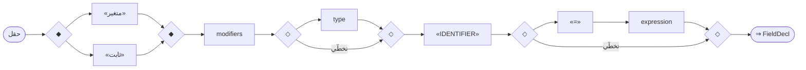

#### مثال
```sad
صنف حساب
    متغير عام رصيد = 0
    متغير خاص _رقم = "000"
    ثابت عام العملة = "ريال"
نهاية
متغير ح = حساب()
ح.رصيد = 100
اطبع_سطر(ح.رصيد)     # 100
```

---

<a id="gr.oop.method"></a>
### gr.oop.method — طريقة <span dir="ltr">(MethodDecl)</span>

- **الرقم التسلسليّ:** `ق-030` · **المعرّف الموحَّد:** `gr.oop.method` · **الحالة:** stable · **منذ:** 1.0.0
- **الوصف:** طريقة داخل صنف/بنية بكلمة «دالة». المعدّلات (عام/خاص/محمي/ساكن/مجرد) تأتي **بعد «دالة»** (الصفة بعد الموصوف): «دالة ساكن مربّع(س)». الطريقة الساكنة تُستدعى على الصنف نفسه («رياضة.مربّع(4)») لا على مثيل. نوع الإرجاع اختياريّ قبل الاسم و«غير_متزامن» بعد المعدّلات. الطرق المجرّدة (في صنفٍ «مجرد» أو سمة) بلا جسم. الوصول للحقول عبر «هذا.».

#### 📐 BNF
```bnf
MethodDecl = 'دالة' Modifiers [ 'غير_متزامن' ] [ ReturnType ] Identifier '(' Parameters ')' Block ;
```

#### 🧩 تفصيل البدائل
- `«دالة» modifiers [ «غير_متزامن» ] [ type ] «IDENTIFIER» «(» parameters «)» block`

#### 🔻 المسار إلى المحلل (دوال التحليل) ⇒ AST
**دالة (دوال) الدخول:**
1. [`ParserCore::parseMethodDeclaration`](../../../shared/parser/src/declarations/parser_oop.cpp) — `shared/parser/src/declarations/parser_oop.cpp`
- **عقدة AST المُنتَجة:** `MethodDecl`
- **يستدعي دوال:** [`parseModifiers`](30_oop.md#gr.oop.modifiers)، [`parseType`](60_advanced.md#gr.adv.type)، [`parseFunctionDecl`](20_declarations.md#gr.decl.parameters)، [`parseBlockStmt`](00_program.md#gr.program.block)
- **مُستدعى من:** [`parseStructDecl`](30_oop.md#gr.oop.struct)، [`parseClassDecl`](30_oop.md#gr.oop.member)
- **روابط المعجم:** كلمات: «دالة»

##### مخطّط مسار الدوال (حتى AST)


#### 📊 مخطّط البنية النحويّة (Mermaid)
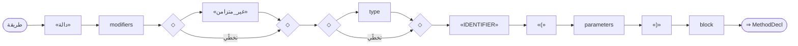

#### مثال
```sad
صنف رياضة
    دالة ساكن مربّع(س)
        ارجع س * س
    نهاية
نهاية
اطبع_سطر(رياضة.مربّع(4))     # 16
```

---

<a id="gr.oop.constructor"></a>
### gr.oop.constructor — باني <span dir="ltr">(ConstructorDecl)</span>

- **الرقم التسلسليّ:** `ق-031` · **المعرّف الموحَّد:** `gr.oop.constructor` · **الحالة:** stable · **منذ:** 1.0.0
- **الوصف:** باني الصنف بكلمة «باني» (لا «__تهيئة__»)؛ يُستدعى عند إنشاء المثيل ويهيّئ الحقول عبر «هذا.». يدعم تمرير الوسائط لباني الصنف الأساسيّ بلاحقة «: الأساس(وسائط)» قبل الجسم. المعدّلات بعد «باني» (الصفة بعد الموصوف).

#### 📐 BNF
```bnf
ConstructorDecl = 'باني' Modifiers '(' Parameters ')' [ ':' 'الأساس' '(' ArgList ')' ] Block ;
```

#### 🧩 تفصيل البدائل
- `«باني» modifiers «(» parameters «)» [ «:» «الأساس» «(» arg_list «)» ] block`

#### 🔻 المسار إلى المحلل (دوال التحليل) ⇒ AST
**دالة (دوال) الدخول:**
1. [`ParserCore::parseConstructorDeclaration`](../../../shared/parser/src/declarations/parser_oop.cpp) — `shared/parser/src/declarations/parser_oop.cpp`
- **عقدة AST المُنتَجة:** `ConstructorDecl`
- **يستدعي دوال:** [`parseModifiers`](30_oop.md#gr.oop.modifiers)، [`parseFunctionDecl`](20_declarations.md#gr.decl.parameters)، [`parseArgumentList`](20_declarations.md#gr.decl.arg_list)، [`parseBlockStmt`](00_program.md#gr.program.block)
- **مُستدعى من:** [`parseStructDecl`](30_oop.md#gr.oop.struct)، [`parseClassDecl`](30_oop.md#gr.oop.member)
- **روابط المعجم:** كلمات: «باني»، «الأساس»

##### مخطّط مسار الدوال (حتى AST)
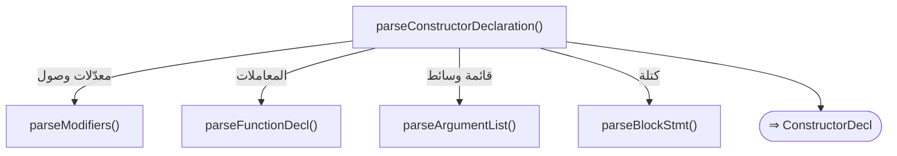

#### 📊 مخطّط البنية النحويّة (Mermaid)
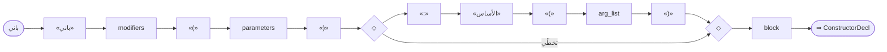

#### مثال
```sad
صنف حيوان
    متغير عام اسم
    باني(اسم) هذا.اسم = اسم نهاية
نهاية
صنف قط يرث حيوان
    باني(اسم) : الأساس(اسم) نهاية
نهاية
متغير ح = قط("توم")
اطبع_سطر(ح.اسم)     # توم
```

---

<a id="gr.oop.destructor"></a>
### gr.oop.destructor — هادم <span dir="ltr">(DestructorDecl)</span>

- **الرقم التسلسليّ:** `ق-032` · **المعرّف الموحَّد:** `gr.oop.destructor` · **الحالة:** stable · **منذ:** 1.0.0
- **الوصف:** هادم الصنف بكلمة «هدم» متبوعةً بأقواس فارغة «()» وجسم — يُستدعى عند تحرّر المثيل لتنظيف الموارد. **بلا معاملات** (بخلاف الباني). واحدٌ لكلّ صنف. المعدّلات بعد «هدم».

#### 📐 BNF
```bnf
DestructorDecl = 'هدم' Modifiers '(' ')' Block ;
```

#### 🧩 تفصيل البدائل
- `«هدم» modifiers «(» «)» block`

#### 🔻 المسار إلى المحلل (دوال التحليل) ⇒ AST
**دالة (دوال) الدخول:**
1. [`ParserCore::parseDestructorDeclaration`](../../../shared/parser/src/declarations/parser_oop.cpp) — `shared/parser/src/declarations/parser_oop.cpp`
- **عقدة AST المُنتَجة:** `DestructorDecl`
- **يستدعي دوال:** [`parseModifiers`](30_oop.md#gr.oop.modifiers)، [`parseBlockStmt`](00_program.md#gr.program.block)
- **مُستدعى من:** [`parseClassDecl`](30_oop.md#gr.oop.member)

##### مخطّط مسار الدوال (حتى AST)
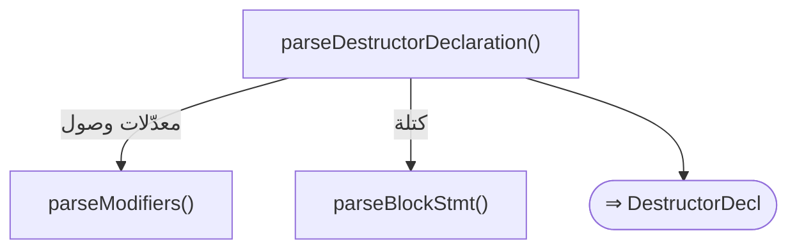

#### 📊 مخطّط البنية النحويّة (Mermaid)
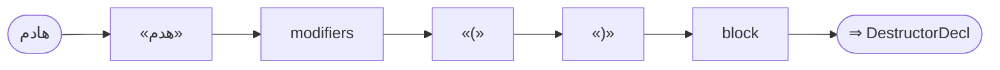

#### مثال
```sad
صنف مورد
    باني() اطبع_سطر("فتح") نهاية
    هدم() اطبع_سطر("إغلاق") نهاية
نهاية
متغير م = مورد()
```

---

<a id="gr.oop.property"></a>
### gr.oop.property — خاصيّة <span dir="ltr">(PropertyDecl)</span>

- **الرقم التسلسليّ:** `ق-033` · **المعرّف الموحَّد:** `gr.oop.property` · **الحالة:** stable · **منذ:** 1.0.0
- **الوصف:** خاصيّة مُحسوبة بكتلتَي «احصل()» (بلا معامل، تُرجع القيمة) و«عيّن(معامل)» (المعامل يستقبل القيمة المُسنَدة)؛ كلتاهما بأقواس ثمّ جسم يُغلَق بـ«نهاية»، والخاصيّة كلّها بـ«نهاية». «احصل»/«عيّن» سياقيّتان داخل الخاصيّة فقط. تُستعمل عادةً لتغليف حقلٍ خاصّ («_س») والوصول إليه كأنّه حقلٌ عاديّ («ك.س = 7»).

#### 📐 BNF
```bnf
PropertyDecl = 'خاصية' Modifiers [ Type ] Identifier
               { ( 'احصل' '(' ')' Block | 'عيّن' '(' Identifier ')' Block ) }
               'نهاية' ;
```

#### 🧩 تفصيل البدائل
- `«خاصية» modifiers [ type ] «IDENTIFIER» { ( ( «احصل» block ) | ( «عيّن» block ) ) } «نهاية»`

#### 🔻 المسار إلى المحلل (دوال التحليل) ⇒ AST
**دالة (دوال) الدخول:**
1. [`ParserCore::parsePropertyDeclaration`](../../../shared/parser/src/declarations/parser_oop.cpp) — `shared/parser/src/declarations/parser_oop.cpp`
- **عقدة AST المُنتَجة:** `PropertyDecl`
- **يستدعي دوال:** [`parseModifiers`](30_oop.md#gr.oop.modifiers)، [`parseType`](60_advanced.md#gr.adv.type)، [`parseBlockStmt`](00_program.md#gr.program.block)
- **مُستدعى من:** [`parseClassDecl`](30_oop.md#gr.oop.member)

##### مخطّط مسار الدوال (حتى AST)
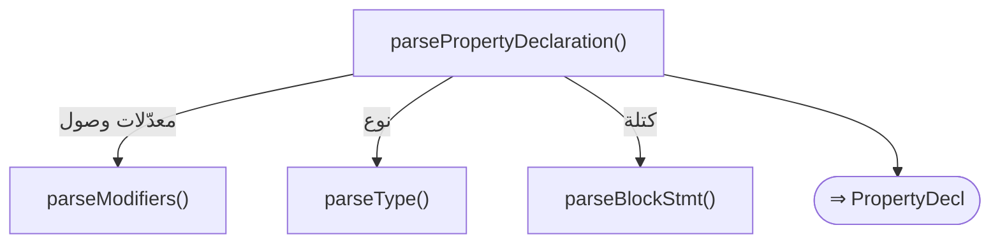

#### 📊 مخطّط البنية النحويّة (Mermaid)
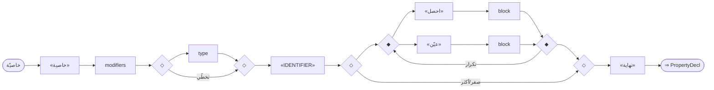

#### مثال
```sad
صنف ع
    متغير خاص _س = 0
    خاصية س
        احصل() ارجع هذا._س نهاية
        عيّن(ق) هذا._س = ق نهاية
    نهاية
نهاية
متغير ك = ع()
ك.س = 7
اطبع_سطر(ك.س)     # 7
```

---

<a id="gr.oop.operator"></a>
### gr.oop.operator — تحميل عامل <span dir="ltr">(OperatorDecl)</span>

- **الرقم التسلسليّ:** `ق-034` · **المعرّف الموحَّد:** `gr.oop.operator` · **الحالة:** stable · **منذ:** 1.0.0
- **الوصف:** تحميل عاملٍ زائدٍ داخل صنف بكلمة «عامل» يليها رمز العامل (+ - * / == …) ثمّ معامل الطرف الآخر وجسم يُرجع النتيجة. يتيح استعمال العامل بين مثيلَي الصنف («أ + ب» تستدعي «عامل +»). المعدّلات بعد «عامل».

#### 📐 BNF
```bnf
OperatorDecl = 'عامل' Modifiers Operator '(' Parameters ')' Block ;
```

#### 🧩 تفصيل البدائل
- `«عامل» modifiers «+» «(» parameters «)» block`

#### 🔻 المسار إلى المحلل (دوال التحليل) ⇒ AST
**دالة (دوال) الدخول:**
1. [`ParserCore::parseOperatorDecl`](../../../shared/parser/src/statements/parser_advanced.cpp) — `shared/parser/src/statements/parser_advanced.cpp`
- **عقدة AST المُنتَجة:** `OperatorDecl`
- **يستدعي دوال:** [`parseModifiers`](30_oop.md#gr.oop.modifiers)، [`parseFunctionDecl`](20_declarations.md#gr.decl.parameters)، [`parseBlockStmt`](00_program.md#gr.program.block)
- **مُستدعى من:** [`parseClassDecl`](30_oop.md#gr.oop.member)

##### مخطّط مسار الدوال (حتى AST)
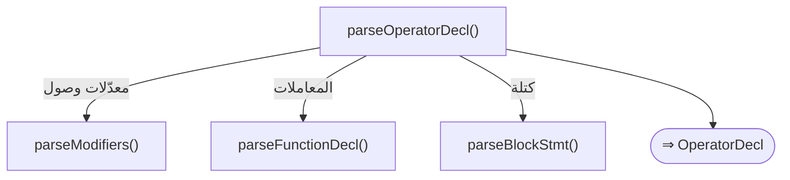

#### 📊 مخطّط البنية النحويّة (Mermaid)
```mermaid
flowchart LR
  n1(["تحميل عامل"])
  n2["«عامل»"]
  n3["modifiers"]
  n2 --> n3
  n4["«+»"]
  n3 --> n4
  n5["«(»"]
  n4 --> n5
  n6["parameters"]
  n5 --> n6
  n7["«)»"]
  n6 --> n7
  n8["block"]
  n7 --> n8
  n1 --> n2
  n9(["⇒ OperatorDecl"])
  n8 --> n9
```

#### مثال
```sad
صنف متجه
    متغير عام س
    باني(س) هذا.س = س نهاية
    عامل +(آخر) ارجع متجه(هذا.س + آخر.س) نهاية
نهاية
متغير ج = متجه(3) + متجه(4)
اطبع_سطر(ج.س)     # 7
```

---

<a id="gr.oop.modifiers"></a>
### gr.oop.modifiers — معدّلات وصول <span dir="ltr">(Modifiers)</span>

- **الرقم التسلسليّ:** `ق-035` · **المعرّف الموحَّد:** `gr.oop.modifiers` · **الحالة:** stable · **منذ:** 1.0.0
- **الوصف:** مجموعة معدّلات الوصول/الطبيعة (عام/خاص/محمي/ساكن/مجرد) تأتي **بعد** الكلمة المفتاحيّة للعضو (الصفة بعد الموصوف): «متغير خاص س»، «دالة ساكن ف()»، «باني عام». قد تتوالى عدّة معدّلات. الافتراضيّ عند غيابها «عام». وضعها قبل الكلمة (الصيغة القديمة «عام متغير») يُنتج خطأً توجيهيّاً مع استرداد.

#### 📐 BNF
```bnf
Modifiers = { 'عام' | 'خاص' | 'محمي' | 'ساكن' | 'مجرد' } ;
```

#### 🧩 تفصيل البدائل
- `{ ( «عام» | «خاص» | «محمي» | «ساكن» | «مجرد» ) }`

#### 🔻 المسار إلى المحلل (دوال التحليل) ⇒ AST
**دالة (دوال) الدخول:**
1. [`ParserCore::parseModifiers`](../../../shared/parser/src/declarations/parser_oop.cpp) — `shared/parser/src/declarations/parser_oop.cpp`
- **عقدة AST المُنتَجة:** `—`
- **مُستدعى من:** [`parseFieldDeclaration`](30_oop.md#gr.oop.field)، [`parseMethodDeclaration`](30_oop.md#gr.oop.method)، [`parseConstructorDeclaration`](30_oop.md#gr.oop.constructor)، [`parseDestructorDeclaration`](30_oop.md#gr.oop.destructor)، [`parsePropertyDeclaration`](30_oop.md#gr.oop.property)، [`parseOperatorDecl`](30_oop.md#gr.oop.operator)
- **روابط المعجم:** كلمات: «عام»، «خاص»، «محمي»، «ساكن»، «مجرد»

##### مخطّط مسار الدوال (حتى AST)
```mermaid
flowchart TD
  f1["parseModifiers()"]
  f2(["⇒ AST"])
  f1 --> f2
```

#### 📊 مخطّط البنية النحويّة (Mermaid)
```mermaid
flowchart LR
  n1(["معدّلات وصول"])
  n2{"◇"}
  n3{"◇"}
  n4{"◆"}
  n5{"◆"}
  n6["«عام»"]
  n4 --> n6
  n6 --> n5
  n7["«خاص»"]
  n4 --> n7
  n7 --> n5
  n8["«محمي»"]
  n4 --> n8
  n8 --> n5
  n9["«ساكن»"]
  n4 --> n9
  n9 --> n5
  n10["«مجرد»"]
  n4 --> n10
  n10 --> n5
  n2 --> n4
  n5 --> n3
  n5 -- "تكرار" --> n4
  n2 -- "صفر/أكثر" --> n3
  n1 --> n2
  n11(["⇒ AST"])
  n3 --> n11
```

#### مثال
```sad
صنف ص
    متغير خاص _د = 0
    دالة عام زد() هذا._د = هذا._د + 1 نهاية
    دالة عام اقرأ() ارجع هذا._د نهاية
نهاية
متغير ك = ص()
ك.زد()
اطبع_سطر(ك.اقرأ())     # 1
```

---

<a id="gr.oop.trait"></a>
### gr.oop.trait — تصريح سمة <span dir="ltr">(TraitDecl)</span>

- **الرقم التسلسليّ:** `ق-036` · **المعرّف الموحَّد:** `gr.oop.trait` · **الحالة:** stable · **منذ:** 1.0.0
- **الوصف:** سمة (واجهة) تُعرّف عقداً من دوالٍ **مجرّدة ضمنيّاً** (توقيع بلا جسم) أو بجسمٍ افتراضيّ اختياريّ يُغلَق بـ«نهاية». تُورَّث بـ«يرث»، وتُنفَّذ للأصناف عبر «نفّذ سمة لـ صنف» (gr.oop.impl) أو تُربط في ترويسة الصنف بـ«نفّذ». «سمة» كلمة سياقيّة.

#### 📐 BNF
```bnf
TraitDecl = 'سمة' Identifier [ 'يرث' Identifier { ',' Identifier } ]
            { 'دالة' [ 'مجرد' ] [ ReturnType ] Identifier '(' Parameters ')' [ DefaultBody 'نهاية' ] }
            'نهاية' ;
```

#### 🧩 تفصيل البدائل
- `«سمة» «IDENTIFIER» [ «يرث» «IDENTIFIER» { ( «،» | «,» ) «IDENTIFIER» } ] { «دالة» [ «مجرد» ] «IDENTIFIER» «(» parameters «)» } «نهاية»`

#### 🔻 المسار إلى المحلل (دوال التحليل) ⇒ AST
**دالة (دوال) الدخول:**
1. [`ParserCore::parseTraitDecl`](../../../shared/parser/src/declarations/parser_declarations.cpp) — `shared/parser/src/declarations/parser_declarations.cpp`
- **عقدة AST المُنتَجة:** `TraitDecl`
- **يستدعي دوال:** [`parseFunctionDecl`](20_declarations.md#gr.decl.parameters)
- **مُستدعى من:** [`parseDeclaration`](00_program.md#gr.program.declaration)
- **روابط المعجم:** كلمات: «يرث»، «دالة»، «نهاية»

##### مخطّط مسار الدوال (حتى AST)
```mermaid
flowchart TD
  f1["parseTraitDecl()"]
  f2["parseFunctionDecl()"]
  f1 -- "المعاملات" --> f2
  f3(["⇒ TraitDecl"])
  f1 --> f3
```

#### 📊 مخطّط البنية النحويّة (Mermaid)
```mermaid
flowchart LR
  n1(["تصريح سمة"])
  n2["«سمة»"]
  n3["«IDENTIFIER»"]
  n2 --> n3
  n4{"◇"}
  n5{"◇"}
  n6["«يرث»"]
  n7["«IDENTIFIER»"]
  n6 --> n7
  n8{"◇"}
  n9{"◇"}
  n10{"◆"}
  n11{"◆"}
  n12["«،»"]
  n10 --> n12
  n12 --> n11
  n13["«,»"]
  n10 --> n13
  n13 --> n11
  n14["«IDENTIFIER»"]
  n11 --> n14
  n8 --> n10
  n14 --> n9
  n14 -- "تكرار" --> n10
  n8 -- "صفر/أكثر" --> n9
  n7 --> n8
  n4 --> n6
  n9 --> n5
  n4 -- "تخطّي" --> n5
  n3 --> n4
  n15{"◇"}
  n16{"◇"}
  n17["«دالة»"]
  n18{"◇"}
  n19{"◇"}
  n20["«مجرد»"]
  n18 --> n20
  n20 --> n19
  n18 -- "تخطّي" --> n19
  n17 --> n18
  n21["«IDENTIFIER»"]
  n19 --> n21
  n22["«(»"]
  n21 --> n22
  n23["parameters"]
  n22 --> n23
  n24["«)»"]
  n23 --> n24
  n15 --> n17
  n24 --> n16
  n24 -- "تكرار" --> n17
  n15 -- "صفر/أكثر" --> n16
  n5 --> n15
  n25["«نهاية»"]
  n16 --> n25
  n1 --> n2
  n26(["⇒ TraitDecl"])
  n25 --> n26
```

#### مثال
```sad
سمة ناطق
    دالة صوت()
نهاية
صنف كلب نفّذ ناطق
    دالة صوت() ارجع "هو" نهاية
نهاية
اطبع_سطر(كلب().صوت())     # هو
```

---

<a id="gr.oop.impl"></a>
### gr.oop.impl — كتلة تنفيذ <span dir="ltr">(ImplDecl)</span>

- **الرقم التسلسليّ:** `ق-037` · **المعرّف الموحَّد:** `gr.oop.impl` · **الحالة:** stable · **منذ:** 1.0.0
- **الوصف:** كتلة تنفيذٍ خارج جسم الصنف تضيف/تحقّق دوالاً. صيغتان: «نفّذ سمة لـ صنف» (تحقيق سمةٍ لصنف) و«نفّذ صنف» (إضافة دوال للصنف مباشرةً). تحوي دوالاً بـ«دالة …» وتُغلَق بـ«نهاية». «نفّذ» و«لـ» سياقيّتان. بديلٌ لربط السمة في ترويسة الصنف («صنف س نفّذ سمة»).

#### 📐 BNF
```bnf
ImplDecl = 'نفّذ' ( Identifier 'لـ' Identifier | Identifier ) { 'دالة' FunctionDecl } 'نهاية' ;
```

#### 🧩 تفصيل البدائل
- `«نفّذ» «IDENTIFIER» [ «لـ» «IDENTIFIER» ] { function } «نهاية»`

#### 🔻 المسار إلى المحلل (دوال التحليل) ⇒ AST
**دالة (دوال) الدخول:**
1. [`ParserCore::parseImplDecl`](../../../shared/parser/src/declarations/parser_declarations.cpp) — `shared/parser/src/declarations/parser_declarations.cpp`
- **عقدة AST المُنتَجة:** `ImplDecl`
- **يستدعي دوال:** [`parseFunctionDecl`](20_declarations.md#gr.decl.function)
- **مُستدعى من:** [`parseDeclaration`](00_program.md#gr.program.declaration)
- **روابط المعجم:** كلمات: «نهاية»

##### مخطّط مسار الدوال (حتى AST)
```mermaid
flowchart TD
  f1["parseImplDecl()"]
  f2["parseFunctionDecl()"]
  f1 -- "تصريح دالة" --> f2
  f3(["⇒ ImplDecl"])
  f1 --> f3
```

#### 📊 مخطّط البنية النحويّة (Mermaid)
```mermaid
flowchart LR
  n1(["كتلة تنفيذ"])
  n2["«نفّذ»"]
  n3["«IDENTIFIER»"]
  n2 --> n3
  n4{"◇"}
  n5{"◇"}
  n6["«لـ»"]
  n7["«IDENTIFIER»"]
  n6 --> n7
  n4 --> n6
  n7 --> n5
  n4 -- "تخطّي" --> n5
  n3 --> n4
  n8{"◇"}
  n9{"◇"}
  n10["function"]
  n8 --> n10
  n10 --> n9
  n10 -- "تكرار" --> n10
  n8 -- "صفر/أكثر" --> n9
  n5 --> n8
  n11["«نهاية»"]
  n9 --> n11
  n1 --> n2
  n12(["⇒ ImplDecl"])
  n11 --> n12
```

#### مثال
```sad
سمة ناطق
    دالة صوت()
نهاية
صنف كلب
نهاية
نفّذ ناطق لـ كلب
    دالة صوت() ارجع "هو" نهاية
نهاية
اطبع_سطر(كلب().صوت())     # هو
```

---

<a id="gr.oop.extension"></a>
### gr.oop.extension — كتلة امتداد <span dir="ltr">(ExtensionDecl)</span>

- **الرقم التسلسليّ:** `ق-038` · **المعرّف الموحَّد:** `gr.oop.extension` · **الحالة:** stable · **منذ:** 1.0.0
- **الوصف:** إضافة دوالٍ لنوعٍ موجود دون تعديل تعريفه — اختصارٌ لـ«نفّذ نوع» بلا سمة. تحوي دوالاً بـ«دالة …» تصل حقول النوع عبر «هذا.»، وتُغلَق بـ«نهاية». «امتداد» كلمة سياقيّة.

#### 📐 BNF
```bnf
ExtensionDecl = 'امتداد' Identifier { 'دالة' FunctionDecl } 'نهاية' ;
```

#### 🧩 تفصيل البدائل
- `«امتداد» «IDENTIFIER» { function } «نهاية»`

#### 🔻 المسار إلى المحلل (دوال التحليل) ⇒ AST
**دالة (دوال) الدخول:**
1. [`ParserCore::parseExtensionDecl`](../../../shared/parser/src/declarations/parser_declarations.cpp) — `shared/parser/src/declarations/parser_declarations.cpp`
- **عقدة AST المُنتَجة:** `ExtensionDecl`
- **يستدعي دوال:** [`parseFunctionDecl`](20_declarations.md#gr.decl.function)
- **روابط المعجم:** كلمات: «نهاية»

##### مخطّط مسار الدوال (حتى AST)
```mermaid
flowchart TD
  f1["parseExtensionDecl()"]
  f2["parseFunctionDecl()"]
  f1 -- "تصريح دالة" --> f2
  f3(["⇒ ExtensionDecl"])
  f1 --> f3
```

#### 📊 مخطّط البنية النحويّة (Mermaid)
```mermaid
flowchart LR
  n1(["كتلة امتداد"])
  n2["«امتداد»"]
  n3["«IDENTIFIER»"]
  n2 --> n3
  n4{"◇"}
  n5{"◇"}
  n6["function"]
  n4 --> n6
  n6 --> n5
  n6 -- "تكرار" --> n6
  n4 -- "صفر/أكثر" --> n5
  n3 --> n4
  n7["«نهاية»"]
  n5 --> n7
  n1 --> n2
  n8(["⇒ ExtensionDecl"])
  n7 --> n8
```

#### مثال
```sad
صنف رقمي
    متغير عام ق
    باني(ق) هذا.ق = ق نهاية
نهاية
امتداد رقمي
    دالة مضاعف() ارجع هذا.ق * 2 نهاية
نهاية
اطبع_سطر(رقمي(5).مضاعف())     # 10
```

---

<a id="gr.oop.new"></a>
### gr.oop.new — إنشاء كائن <span dir="ltr">(NewExpr)</span>

- **الرقم التسلسليّ:** `ق-039` · **المعرّف الموحَّد:** `gr.oop.new` · **الحالة:** stable · **منذ:** 1.0.0
- **الوصف:** إنشاء كائن بصيغة **لاحقة**: «صنف(وسائط) جديد» — يُبنى في parsePostfix؛ إن تلا «)» كلمةُ «جديد» حُوِّل CallExpr إلى NewExpr (الصفة بعد الموصوف)، و«جديد» اختياريّة (بدونها استدعاءٌ عاديّ يكتشف المحرّكان كونه صنفاً). «جديد» بادئةً تُعامَل مُعرّفاً عاديّاً (parsePrimary يُرجعها VariableExpr). **تحقيق دالة ميتة:** الدالة `parseNewExpr` في parser_oop.cpp **ميتة** (بلا مستدعٍ) وتحمل صيغة بادئة بقوالب «جديد صنف<نوع>(...)» غيرَ قابلةٍ للوصول بصيغة اللغة اللاحقة الحاليّة؛ إحياؤها (تنصيب مُعمَّم) **قرار لغويّ** لا أدواتيّ — لم تُحيَ.

#### 📐 BNF
```bnf
NewExpr = ClassName '(' ArgList ')' [ 'جديد' ] ;
```

#### 🧩 تفصيل البدائل
- `«IDENTIFIER» «(» arg_list «)» [ «جديد» ]`

#### 🔻 المسار إلى المحلل (دوال التحليل) ⇒ AST
**دالة (دوال) الدخول:**
1. [`ParserCore::parsePostfix`](../../../shared/parser/src/core/parser_expressions.cpp) — `shared/parser/src/core/parser_expressions.cpp`
- **عقدة AST المُنتَجة:** `NewExpr`
- **يستدعي دوال:** [`parseArgumentList`](20_declarations.md#gr.decl.arg_list)
- **روابط المعجم:** كلمات: «جديد»

##### مخطّط مسار الدوال (حتى AST)
```mermaid
flowchart TD
  f1["parsePostfix()"]
  f2["parseArgumentList()"]
  f1 -- "قائمة وسائط" --> f2
  f3(["⇒ NewExpr"])
  f1 --> f3
```

#### 📊 مخطّط البنية النحويّة (Mermaid)
```mermaid
flowchart LR
  n1(["إنشاء كائن"])
  n2["«IDENTIFIER»"]
  n3["«(»"]
  n2 --> n3
  n4["arg_list"]
  n3 --> n4
  n5["«)»"]
  n4 --> n5
  n6{"◇"}
  n7{"◇"}
  n8["«جديد»"]
  n6 --> n8
  n8 --> n7
  n6 -- "تخطّي" --> n7
  n5 --> n6
  n1 --> n2
  n9(["⇒ NewExpr"])
  n7 --> n9
```

#### مثال
```sad
صنف نقطة
    متغير عام س
    باني(س) هذا.س = س نهاية
نهاية
متغير ن = نقطة(5) جديد     # «جديد» لاحقة اختياريّة
اطبع_سطر(ن.س)              # 5
```

---

<a id="gr.oop.this_super"></a>
### gr.oop.this_super — هذا/الأساس <span dir="ltr">(ThisSuperExpr)</span>

- **الرقم التسلسليّ:** `ق-040` · **المعرّف الموحَّد:** `gr.oop.this_super` · **الحالة:** stable · **منذ:** 1.0.0
- **الوصف:** «هذا» يشير للكائن الحاليّ ويُبنى ThisExpr في parsePrimary. «الأساس» تُعامَل تعبيرَ أساسٍ (SuperExpr) **فقط إن تلاها «.»** (وصول عضو)، وإلّا فمُعرّف عاديّ (مثل معامل اسمه «أساس»). الوصول للعضو «هذا.س»/«الأساس.طريقة()» يُكمِله parsePostfix، واستدعاء باني الأساس «: الأساس(...)» في gr.oop.constructor. **تحقيق دوال ميتة:** `parseThisExpression` و`parseSuperExpression` في parser_oop.cpp **ميتتان** (بلا مستدعٍ) — جسمهما مجرّد `make_unique<ThisExpr/SuperExpr>()` يؤدّيه المسار الحيّ (parsePrimary) بالكامل، بل نسخة «الأساس» الحيّة أدقّ (حارس «.»)؛ فهما **زائدتان** لا تحملان قدرةً مفقودة — مرشَّحتان للحذف (تنظيف كود لا ميزة).

#### 📐 BNF
```bnf
ThisSuper = 'هذا' | 'الأساس' '.' Member ;
```

#### 🧩 تفصيل البدائل
**1.** *هذا:* `«هذا»`
**2.** *الأساس:* `«الأساس» «.» «IDENTIFIER»`

#### 🔻 المسار إلى المحلل (دوال التحليل) ⇒ AST
**دالة (دوال) الدخول:**
1. [`ParserCore::parsePrimary`](../../../shared/parser/src/core/parser_expressions.cpp) — `shared/parser/src/core/parser_expressions.cpp`
- **عقدة AST المُنتَجة:** `ThisExpr | SuperExpr`
- **روابط المعجم:** كلمات: «هذا»، «الأساس»

##### مخطّط مسار الدوال (حتى AST)
```mermaid
flowchart TD
  f1["parsePrimary()"]
  f2(["⇒ ThisExpr ∣ SuperExpr"])
  f1 --> f2
```

#### 📊 مخطّط البنية النحويّة (Mermaid)
```mermaid
flowchart LR
  n1(["هذا/الأساس"])
  n2["«هذا»"]
  n1 -- "هذا" --> n2
  n3(["⇒ ThisExpr ∣ SuperExpr"])
  n2 --> n3
  n4["«الأساس»"]
  n5["«.»"]
  n4 --> n5
  n6["«IDENTIFIER»"]
  n5 --> n6
  n1 -- "الأساس" --> n4
  n7(["⇒ ThisExpr ∣ SuperExpr"])
  n6 --> n7
```

#### مثال
```sad
صنف حيوان
    متغير عام اسم
    باني(اسم) هذا.اسم = اسم نهاية
    دالة صوت() ارجع "..." نهاية
نهاية
صنف قط يرث حيوان
    باني(اسم) : الأساس(اسم) نهاية
    دالة صوت() ارجع "مياو: " + الأساس.صوت() نهاية
نهاية
اطبع_سطر(قط("توم").صوت())     # مياو: ...
```

---
