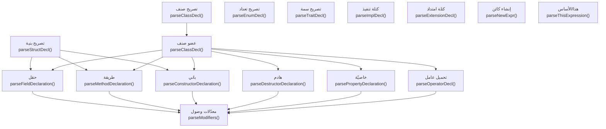
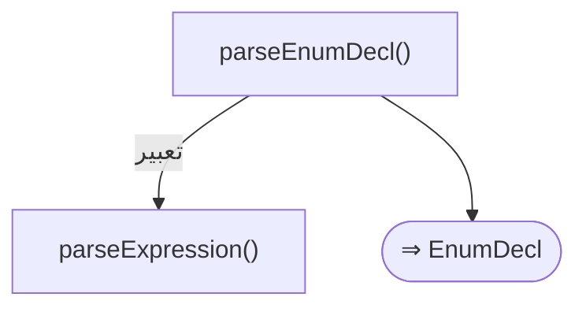
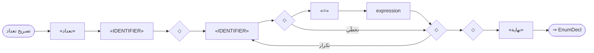
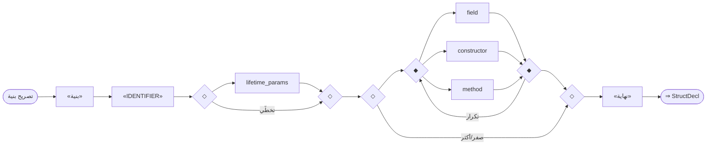
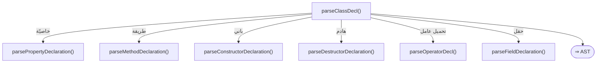
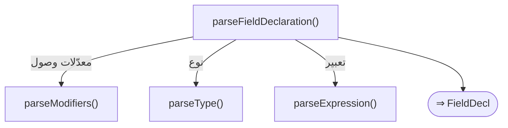
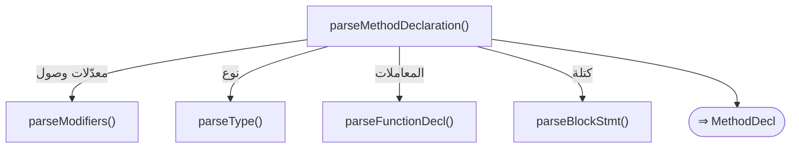
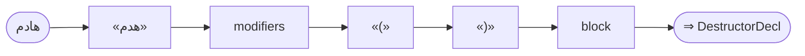

```mermaid
flowchart LR
  n1(["تصريح صنف"])
  n2["«صنف»"]
  n3{"◇"}
  n4{"◇"}
  n5{"◆"}
  n6{"◆"}
  n7["«مجرد»"]
  n5 --> n7
  n7 --> n6
  n8["«محكم»"]
  n5 --> n8
  n8 --> n6
  n3 --> n5
  n6 --> n4
  n6 -- "تكرار" --> n5
  n3 -- "صفر/أكثر" --> n4
  n2 --> n3
  n9["«IDENTIFIER»"]
  n4 --> n9
  n10{"◇"}
  n11{"◇"}
  n12["«يرث»"]
  n13["«IDENTIFIER»"]
  n12 --> n13
  n14{"◇"}
  n15{"◇"}
  n16["«،»"]
  n17["«IDENTIFIER»"]
  n16 --> n17
  n14 --> n16
  n17 --> n15
  n17 -- "تكرار" --> n16
  n14 -- "صفر/أكثر" --> n15
  n13 --> n14
  n10 --> n12
  n15 --> n11
  n10 -- "تخطّي" --> n11
  n9 --> n10
  n18{"◇"}
  n19{"◇"}
  n20["«نفّذ»"]
  n21["«IDENTIFIER»"]
  n20 --> n21
  n22{"◇"}
  n23{"◇"}
  n24["«،»"]
  n25["«IDENTIFIER»"]
  n24 --> n25
  n22 --> n24
  n25 --> n23
  n25 -- "تكرار" --> n24
  n22 -- "صفر/أكثر" --> n23
  n21 --> n22
  n18 --> n20
  n23 --> n19
  n18 -- "تخطّي" --> n19
  n11 --> n18
  n26{"◇"}
  n27{"◇"}
  n28["member"]
  n26 --> n28
  n28 --> n27
  n28 -- "تكرار" --> n28
  n26 -- "صفر/أكثر" --> n27
  n19 --> n26
  n29["«نهاية»"]
  n27 --> n29
  n1 --> n2
  n30(["⇒ ClassDecl"])
  n29 --> n30
```

# قواعد المحلل — طبقة البرمجة الكائنية

> ⚠️ **هذا الملف مُولَّد آليًّا** من `language-truth/grammar/*.yaml` عبر
> `scripts/codegen/gen_parser_grammar_docs.py` — **لا تُحرِّره يدويًّا**.
> عدّل YAML المصدر ثم أعد التوليد.


- **الطبقة:** `oop` · **ملف المصدر:** `language-truth/grammar/30_oop.yaml`
- **الوصف:** البرمجة الكائنية — صنف/أعضاء/حقل/طريقة/باني/هادم/خاصية/سمة/تنفيذ/امتداد/جديد/هذا/الأساس
- **عدد القواعد:** 16

> **قراءة المخطّطات:** «📊 مخطّط البنية النحويّة» يُظهر تسلسل الرموز (تكرار «تكرار»، اختياري «تخطّي»، بدائل ◆). «مخطّط مسار الدوال» يُظهر دوال المحلل التي تُستدعى حتى بناء عقدة AST.

## نظرة عامّة — مسار دوال الطبقة
> الاستدعاءات الداخليّة بين دوال قواعد هذه الطبقة (الروابط عبر الطبقات مذكورة في كل قاعدة).


---

<a id="gr.oop.class"></a>
### gr.oop.class — تصريح صنف <span dir="ltr">(ClassDecl)</span>

- **الرقم التسلسليّ:** `ق-024` · **المعرّف الموحَّد:** `gr.oop.class` · **الحالة:** stable · **منذ:** 1.0.0
- **الوصف:** الجسم بلا أقواس (ينتهي بـ«نهاية»). المعدّلات «مجرد»/«محكم» بعد «صنف» (الصفة بعد الموصوف). الوراثة بـ«يرث»، وتنفيذ السمات بـ«نفّذ». أسماء الأنواع المدمجة مقبولة كأسماء.

#### 📐 BNF
```bnf
ClassDecl = 'صنف' { 'مجرد' | 'محكم' } Identifier
            [ 'يرث' Identifier { ',' Identifier } ]
            [ 'نفّذ' Identifier { ',' Identifier } ]
            { ClassMember } 'نهاية' ;
```

#### 🧩 تفصيل البدائل
- `«صنف» { ( «مجرد» | «محكم» ) } «IDENTIFIER» [ «يرث» «IDENTIFIER» { «،» «IDENTIFIER» } ] [ «نفّذ» «IDENTIFIER» { «،» «IDENTIFIER» } ] { member } «نهاية»`

#### 🔻 المسار إلى المحلل (دوال التحليل) ⇒ AST
**دالة (دوال) الدخول:**
1. [`ParserCore::parseClassDecl`](../../../shared/parser/src/declarations/parser_declarations.cpp) — `shared/parser/src/declarations/parser_declarations.cpp`
- **عقدة AST المُنتَجة:** `ClassDecl`
- **مُستدعى من:** [`parseDeclaration`](00_program.md#gr.program.declaration)، [`parseTemplateDecl`](60_advanced.md#gr.adv.template_decl)
- **روابط المعجم:** كلمات: «صنف»، «يرث»، «نهاية»، «مجرد»

##### مخطّط مسار الدوال (حتى AST)


#### 📊 مخطّط البنية النحويّة (Mermaid)


#### مثال
```sad
صنف نقطة
    متغير عام س
    باني(س) هذا.س = س نهاية
نهاية
```

---

<a id="gr.oop.enum"></a>
### gr.oop.enum — تصريح تعداد <span dir="ltr">(EnumDecl)</span>

- **الرقم التسلسليّ:** `ق-025` · **المعرّف الموحَّد:** `gr.oop.enum` · **الحالة:** stable · **منذ:** 1.0.0
- **الوصف:** الأقواس {} مُزالة. عضو واحد على الأقل. أسماء أعضاء مرنة (تقبل كلمات محجوزة غير بنيويّة)

#### 📐 BNF
```bnf
EnumDecl = 'تعداد' Identifier EnumMember { [ ',' ] EnumMember } 'نهاية' ;
```

#### 🧩 تفصيل البدائل
- `«تعداد» «IDENTIFIER» ( «IDENTIFIER» [ «=» expression ] )+ «نهاية»`

#### 🔻 المسار إلى المحلل (دوال التحليل) ⇒ AST
**دالة (دوال) الدخول:**
1. [`ParserCore::parseEnumDecl`](../../../shared/parser/src/declarations/parser_declarations.cpp) — `shared/parser/src/declarations/parser_declarations.cpp`
- **عقدة AST المُنتَجة:** `EnumDecl`
- **يستدعي دوال:** [`parseExpression`](40_expressions.md#gr.expr.expression)
- **مُستدعى من:** [`parseDeclaration`](00_program.md#gr.program.declaration)
- **روابط المعجم:** كلمات: «تعداد»، «نهاية»

##### مخطّط مسار الدوال (حتى AST)


#### 📊 مخطّط البنية النحويّة (Mermaid)


#### مثال
```sad
تعداد لون
    أحمر، أخضر، أزرق
نهاية
```

---

<a id="gr.oop.struct"></a>
### gr.oop.struct — تصريح بنية <span dir="ltr">(StructDecl)</span>

- **الرقم التسلسليّ:** `ق-026` · **المعرّف الموحَّد:** `gr.oop.struct` · **الحالة:** stable · **منذ:** 1.0.0
- **الوصف:** الأقواس {} مُزالة. معاملات عمر اختياريّة. الصفة بعد الموصوف («باني عام» لا «عام باني»)

#### 📐 BNF
```bnf
StructDecl = 'بنية' Identifier [ LifetimeParams ] { [ AccessMod ] ( Field | Constructor | Method ) } 'نهاية' ;
```

#### 🧩 تفصيل البدائل
- `«بنية» «IDENTIFIER» [ lifetime_params ] { ( field | constructor | method ) } «نهاية»`

#### 🔻 المسار إلى المحلل (دوال التحليل) ⇒ AST
**دالة (دوال) الدخول:**
1. [`ParserCore::parseStructDecl`](../../../shared/parser/src/declarations/parser_declarations.cpp) — `shared/parser/src/declarations/parser_declarations.cpp`
- **عقدة AST المُنتَجة:** `StructDecl`
- **يستدعي دوال:** [`parseLifetimeParams`](60_advanced.md#gr.adv.lifetime_params)، [`parseFieldDeclaration`](30_oop.md#gr.oop.field)، [`parseConstructorDeclaration`](30_oop.md#gr.oop.constructor)، [`parseMethodDeclaration`](30_oop.md#gr.oop.method)
- **مُستدعى من:** [`parseDeclaration`](00_program.md#gr.program.declaration)
- **روابط المعجم:** كلمات: «بنية»، «نهاية»

##### مخطّط مسار الدوال (حتى AST)


#### 📊 مخطّط البنية النحويّة (Mermaid)


#### مثال
```sad
بنية نقطة
    متغير عام س
    متغير عام ص
نهاية
```

---

<a id="gr.oop.member"></a>
### gr.oop.member — عضو صنف <span dir="ltr">(ClassMember)</span>

- **الرقم التسلسليّ:** `ق-027` · **المعرّف الموحَّد:** `gr.oop.member` · **الحالة:** stable · **منذ:** 1.0.0
- **الوصف:** موزّع الأعضاء يميّز بالكلمة المفتاحيّة (خاصية/دالة/باني/هدم/عامل/متغير/ثابت). الصيغة القديمة (معدّل قبل الكلمة) تُنتج خطأً توجيهيًّا مع استرداد عبر parseModifiers.

#### 📐 BNF
```bnf
ClassMember = Property | Method | Constructor | Destructor | Operator | Field ;
```

#### 🧩 تفصيل البدائل
- `( property | method | constructor | destructor | operator | field )`

#### 🔻 المسار إلى المحلل (دوال التحليل) ⇒ AST
**دالة (دوال) الدخول:**
1. [`ParserCore::parseClassDecl`](../../../shared/parser/src/declarations/parser_declarations.cpp) — `shared/parser/src/declarations/parser_declarations.cpp`
- **عقدة AST المُنتَجة:** `—`
- **يستدعي دوال:** [`parsePropertyDeclaration`](30_oop.md#gr.oop.property)، [`parseMethodDeclaration`](30_oop.md#gr.oop.method)، [`parseConstructorDeclaration`](30_oop.md#gr.oop.constructor)، [`parseDestructorDeclaration`](30_oop.md#gr.oop.destructor)، [`parseOperatorDecl`](30_oop.md#gr.oop.operator)، [`parseFieldDeclaration`](30_oop.md#gr.oop.field)
- **مُستدعى من:** [`parseClassDecl`](30_oop.md#gr.oop.class)، [`parseDeclaration`](60_advanced.md#gr.adv.contract)

##### مخطّط مسار الدوال (حتى AST)


#### 📊 مخطّط البنية النحويّة (Mermaid)


---

<a id="gr.oop.field"></a>
### gr.oop.field — حقل <span dir="ltr">(FieldDecl)</span>

- **الرقم التسلسليّ:** `ق-028` · **المعرّف الموحَّد:** `gr.oop.field` · **الحالة:** stable · **منذ:** 1.0.0
- **الوصف:** حقل بيانات في صنف/بنية؛ المعدّلات بعد «متغير/ثابت». تُقبَل كلمات ناعمة كأسماء حقول

#### 📐 BNF
```bnf
FieldDecl = ( 'متغير' | 'ثابت' ) Modifiers [ Type ] Identifier [ '=' Expression ] ;
```

#### 🧩 تفصيل البدائل
- `( «متغير» | «ثابت» ) modifiers [ type ] «IDENTIFIER» [ «=» expression ]`

#### 🔻 المسار إلى المحلل (دوال التحليل) ⇒ AST
**دالة (دوال) الدخول:**
1. [`ParserCore::parseFieldDeclaration`](../../../shared/parser/src/declarations/parser_oop.cpp) — `shared/parser/src/declarations/parser_oop.cpp`
- **عقدة AST المُنتَجة:** `FieldDecl`
- **يستدعي دوال:** [`parseModifiers`](30_oop.md#gr.oop.modifiers)، [`parseType`](60_advanced.md#gr.adv.type)، [`parseExpression`](40_expressions.md#gr.expr.expression)
- **مُستدعى من:** [`parseStructDecl`](30_oop.md#gr.oop.struct)، [`parseClassDecl`](30_oop.md#gr.oop.member)
- **روابط المعجم:** كلمات: «متغير»، «ثابت»

##### مخطّط مسار الدوال (حتى AST)


#### 📊 مخطّط البنية النحويّة (Mermaid)


---

<a id="gr.oop.method"></a>
### gr.oop.method — طريقة <span dir="ltr">(MethodDecl)</span>

- **الرقم التسلسليّ:** `ق-029` · **المعرّف الموحَّد:** `gr.oop.method` · **الحالة:** stable · **منذ:** 1.0.0
- **الوصف:** طريقة صنف؛ المعدّلات (عام/خاص/محمي/ساكن/مجرد) بعد «دالة». الطرق المجرّدة بلا جسم

#### 📐 BNF
```bnf
MethodDecl = 'دالة' Modifiers [ 'غير_متزامن' ] [ ReturnType ] Identifier '(' Parameters ')' Block ;
```

#### 🧩 تفصيل البدائل
- `«دالة» modifiers [ «غير_متزامن» ] [ type ] «IDENTIFIER» «(» parameters «)» block`

#### 🔻 المسار إلى المحلل (دوال التحليل) ⇒ AST
**دالة (دوال) الدخول:**
1. [`ParserCore::parseMethodDeclaration`](../../../shared/parser/src/declarations/parser_oop.cpp) — `shared/parser/src/declarations/parser_oop.cpp`
- **عقدة AST المُنتَجة:** `MethodDecl`
- **يستدعي دوال:** [`parseModifiers`](30_oop.md#gr.oop.modifiers)، [`parseType`](60_advanced.md#gr.adv.type)، [`parseFunctionDecl`](20_declarations.md#gr.decl.parameters)، [`parseBlockStmt`](00_program.md#gr.program.block)
- **مُستدعى من:** [`parseStructDecl`](30_oop.md#gr.oop.struct)، [`parseClassDecl`](30_oop.md#gr.oop.member)
- **روابط المعجم:** كلمات: «دالة»

##### مخطّط مسار الدوال (حتى AST)


#### 📊 مخطّط البنية النحويّة (Mermaid)


---

<a id="gr.oop.constructor"></a>
### gr.oop.constructor — باني <span dir="ltr">(ConstructorDecl)</span>

- **الرقم التسلسليّ:** `ق-030` · **المعرّف الموحَّد:** `gr.oop.constructor` · **الحالة:** stable · **منذ:** 1.0.0
- **الوصف:** الباني بكلمة «باني» (لا __تهيئة__)؛ يدعم استدعاء باني الأساس «: الأساس(...)»

#### 📐 BNF
```bnf
ConstructorDecl = 'باني' Modifiers '(' Parameters ')' [ ':' 'الأساس' '(' ArgList ')' ] Block ;
```

#### 🧩 تفصيل البدائل
- `«باني» modifiers «(» parameters «)» [ «:» «الأساس» «(» arg_list «)» ] block`

#### 🔻 المسار إلى المحلل (دوال التحليل) ⇒ AST
**دالة (دوال) الدخول:**
1. [`ParserCore::parseConstructorDeclaration`](../../../shared/parser/src/declarations/parser_oop.cpp) — `shared/parser/src/declarations/parser_oop.cpp`
- **عقدة AST المُنتَجة:** `ConstructorDecl`
- **يستدعي دوال:** [`parseModifiers`](30_oop.md#gr.oop.modifiers)، [`parseFunctionDecl`](20_declarations.md#gr.decl.parameters)، [`parseArgumentList`](20_declarations.md#gr.decl.arg_list)، [`parseBlockStmt`](00_program.md#gr.program.block)
- **مُستدعى من:** [`parseStructDecl`](30_oop.md#gr.oop.struct)، [`parseClassDecl`](30_oop.md#gr.oop.member)
- **روابط المعجم:** كلمات: «باني»، «الأساس»

##### مخطّط مسار الدوال (حتى AST)


#### 📊 مخطّط البنية النحويّة (Mermaid)


---

<a id="gr.oop.destructor"></a>
### gr.oop.destructor — هادم <span dir="ltr">(DestructorDecl)</span>

- **الرقم التسلسليّ:** `ق-031` · **المعرّف الموحَّد:** `gr.oop.destructor` · **الحالة:** stable · **منذ:** 1.0.0
- **الوصف:** هادم الصنف بكلمة «هدم»؛ بلا معاملات

#### 📐 BNF
```bnf
DestructorDecl = 'هدم' Modifiers '(' ')' Block ;
```

#### 🧩 تفصيل البدائل
- `«هدم» modifiers «(» «)» block`

#### 🔻 المسار إلى المحلل (دوال التحليل) ⇒ AST
**دالة (دوال) الدخول:**
1. [`ParserCore::parseDestructorDeclaration`](../../../shared/parser/src/declarations/parser_oop.cpp) — `shared/parser/src/declarations/parser_oop.cpp`
- **عقدة AST المُنتَجة:** `DestructorDecl`
- **يستدعي دوال:** [`parseModifiers`](30_oop.md#gr.oop.modifiers)، [`parseBlockStmt`](00_program.md#gr.program.block)
- **مُستدعى من:** [`parseClassDecl`](30_oop.md#gr.oop.member)

##### مخطّط مسار الدوال (حتى AST)


#### 📊 مخطّط البنية النحويّة (Mermaid)


---

<a id="gr.oop.property"></a>
### gr.oop.property — خاصيّة <span dir="ltr">(PropertyDecl)</span>

- **الرقم التسلسليّ:** `ق-032` · **المعرّف الموحَّد:** `gr.oop.property` · **الحالة:** stable · **منذ:** 1.0.0
- **الوصف:** خاصيّة بكتل «احصل»/«عيّن» (سياقيّتان داخل الخاصيّة)

#### 📐 BNF
```bnf
PropertyDecl = 'خاصية' Modifiers [ Type ] Identifier { ( 'احصل' Block | 'عيّن' Block ) } 'نهاية' ;
```

#### 🧩 تفصيل البدائل
- `«خاصية» modifiers [ type ] «IDENTIFIER» { ( ( «احصل» block ) | ( «عيّن» block ) ) } «نهاية»`

#### 🔻 المسار إلى المحلل (دوال التحليل) ⇒ AST
**دالة (دوال) الدخول:**
1. [`ParserCore::parsePropertyDeclaration`](../../../shared/parser/src/declarations/parser_oop.cpp) — `shared/parser/src/declarations/parser_oop.cpp`
- **عقدة AST المُنتَجة:** `PropertyDecl`
- **يستدعي دوال:** [`parseModifiers`](30_oop.md#gr.oop.modifiers)، [`parseType`](60_advanced.md#gr.adv.type)، [`parseBlockStmt`](00_program.md#gr.program.block)
- **مُستدعى من:** [`parseClassDecl`](30_oop.md#gr.oop.member)

##### مخطّط مسار الدوال (حتى AST)


#### 📊 مخطّط البنية النحويّة (Mermaid)


---

<a id="gr.oop.operator"></a>
### gr.oop.operator — تحميل عامل <span dir="ltr">(OperatorDecl)</span>

- **الرقم التسلسليّ:** `ق-033` · **المعرّف الموحَّد:** `gr.oop.operator` · **الحالة:** stable · **منذ:** 1.0.0
- **الوصف:** تحميل عامل زائد (+ - * / == ...) داخل صنف بكلمة «عامل»

#### 📐 BNF
```bnf
OperatorDecl = 'عامل' Modifiers Operator '(' Parameters ')' Block ;
```

#### 🧩 تفصيل البدائل
- `«عامل» modifiers «+» «(» parameters «)» block`

#### 🔻 المسار إلى المحلل (دوال التحليل) ⇒ AST
**دالة (دوال) الدخول:**
1. [`ParserCore::parseOperatorDecl`](../../../shared/parser/src/statements/parser_advanced.cpp) — `shared/parser/src/statements/parser_advanced.cpp`
- **عقدة AST المُنتَجة:** `OperatorDecl`
- **يستدعي دوال:** [`parseModifiers`](30_oop.md#gr.oop.modifiers)، [`parseFunctionDecl`](20_declarations.md#gr.decl.parameters)، [`parseBlockStmt`](00_program.md#gr.program.block)
- **مُستدعى من:** [`parseClassDecl`](30_oop.md#gr.oop.member)

##### مخطّط مسار الدوال (حتى AST)


#### 📊 مخطّط البنية النحويّة (Mermaid)
```mermaid
flowchart LR
  n1(["تحميل عامل"])
  n2["«عامل»"]
  n3["modifiers"]
  n2 --> n3
  n4["«+»"]
  n3 --> n4
  n5["«(»"]
  n4 --> n5
  n6["parameters"]
  n5 --> n6
  n7["«)»"]
  n6 --> n7
  n8["block"]
  n7 --> n8
  n1 --> n2
  n9(["⇒ OperatorDecl"])
  n8 --> n9
```

---

<a id="gr.oop.modifiers"></a>
### gr.oop.modifiers — معدّلات وصول <span dir="ltr">(Modifiers)</span>

- **الرقم التسلسليّ:** `ق-034` · **المعرّف الموحَّد:** `gr.oop.modifiers` · **الحالة:** stable · **منذ:** 1.0.0
- **الوصف:** معدّلات تأتي بعد الكلمة المفتاحيّة (الصفة بعد الموصوف)؛ الافتراضيّ «عام»

#### 📐 BNF
```bnf
Modifiers = { 'عام' | 'خاص' | 'محمي' | 'ساكن' | 'مجرد' } ;
```

#### 🧩 تفصيل البدائل
- `{ ( «عام» | «خاص» | «محمي» | «ساكن» | «مجرد» ) }`

#### 🔻 المسار إلى المحلل (دوال التحليل) ⇒ AST
**دالة (دوال) الدخول:**
1. [`ParserCore::parseModifiers`](../../../shared/parser/src/declarations/parser_oop.cpp) — `shared/parser/src/declarations/parser_oop.cpp`
- **عقدة AST المُنتَجة:** `—`
- **مُستدعى من:** [`parseFieldDeclaration`](30_oop.md#gr.oop.field)، [`parseMethodDeclaration`](30_oop.md#gr.oop.method)، [`parseConstructorDeclaration`](30_oop.md#gr.oop.constructor)، [`parseDestructorDeclaration`](30_oop.md#gr.oop.destructor)، [`parsePropertyDeclaration`](30_oop.md#gr.oop.property)، [`parseOperatorDecl`](30_oop.md#gr.oop.operator)
- **روابط المعجم:** كلمات: «عام»، «خاص»، «محمي»، «ساكن»، «مجرد»

##### مخطّط مسار الدوال (حتى AST)
```mermaid
flowchart TD
  f1["parseModifiers()"]
  f2(["⇒ AST"])
  f1 --> f2
```

#### 📊 مخطّط البنية النحويّة (Mermaid)
```mermaid
flowchart LR
  n1(["معدّلات وصول"])
  n2{"◇"}
  n3{"◇"}
  n4{"◆"}
  n5{"◆"}
  n6["«عام»"]
  n4 --> n6
  n6 --> n5
  n7["«خاص»"]
  n4 --> n7
  n7 --> n5
  n8["«محمي»"]
  n4 --> n8
  n8 --> n5
  n9["«ساكن»"]
  n4 --> n9
  n9 --> n5
  n10["«مجرد»"]
  n4 --> n10
  n10 --> n5
  n2 --> n4
  n5 --> n3
  n5 -- "تكرار" --> n4
  n2 -- "صفر/أكثر" --> n3
  n1 --> n2
  n11(["⇒ AST"])
  n3 --> n11
```

---

<a id="gr.oop.trait"></a>
### gr.oop.trait — تصريح سمة <span dir="ltr">(TraitDecl)</span>

- **الرقم التسلسليّ:** `ق-035` · **المعرّف الموحَّد:** `gr.oop.trait` · **الحالة:** stable · **منذ:** 1.0.0
- **الوصف:** سمة (واجهة) بدوال مجرّدة ضمنيًّا (بلا جسم) أو بجسم افتراضيّ اختياريّ. «سمة» سياقيّة

#### 📐 BNF
```bnf
TraitDecl = 'سمة' Identifier [ 'يرث' Identifier { ',' Identifier } ]
            { 'دالة' [ 'مجرد' ] [ ReturnType ] Identifier '(' Parameters ')' [ DefaultBody 'نهاية' ] }
            'نهاية' ;
```

#### 🧩 تفصيل البدائل
- `«سمة» «IDENTIFIER» [ «يرث» «IDENTIFIER» { «،» «IDENTIFIER» } ] { «دالة» [ «مجرد» ] «IDENTIFIER» «(» parameters «)» } «نهاية»`

#### 🔻 المسار إلى المحلل (دوال التحليل) ⇒ AST
**دالة (دوال) الدخول:**
1. [`ParserCore::parseTraitDecl`](../../../shared/parser/src/declarations/parser_declarations.cpp) — `shared/parser/src/declarations/parser_declarations.cpp`
- **عقدة AST المُنتَجة:** `TraitDecl`
- **يستدعي دوال:** [`parseFunctionDecl`](20_declarations.md#gr.decl.parameters)
- **مُستدعى من:** [`parseDeclaration`](00_program.md#gr.program.declaration)
- **روابط المعجم:** كلمات: «يرث»، «دالة»، «نهاية»

##### مخطّط مسار الدوال (حتى AST)
```mermaid
flowchart TD
  f1["parseTraitDecl()"]
  f2["parseFunctionDecl()"]
  f1 -- "المعاملات" --> f2
  f3(["⇒ TraitDecl"])
  f1 --> f3
```

#### 📊 مخطّط البنية النحويّة (Mermaid)
```mermaid
flowchart LR
  n1(["تصريح سمة"])
  n2["«سمة»"]
  n3["«IDENTIFIER»"]
  n2 --> n3
  n4{"◇"}
  n5{"◇"}
  n6["«يرث»"]
  n7["«IDENTIFIER»"]
  n6 --> n7
  n8{"◇"}
  n9{"◇"}
  n10["«،»"]
  n11["«IDENTIFIER»"]
  n10 --> n11
  n8 --> n10
  n11 --> n9
  n11 -- "تكرار" --> n10
  n8 -- "صفر/أكثر" --> n9
  n7 --> n8
  n4 --> n6
  n9 --> n5
  n4 -- "تخطّي" --> n5
  n3 --> n4
  n12{"◇"}
  n13{"◇"}
  n14["«دالة»"]
  n15{"◇"}
  n16{"◇"}
  n17["«مجرد»"]
  n15 --> n17
  n17 --> n16
  n15 -- "تخطّي" --> n16
  n14 --> n15
  n18["«IDENTIFIER»"]
  n16 --> n18
  n19["«(»"]
  n18 --> n19
  n20["parameters"]
  n19 --> n20
  n21["«)»"]
  n20 --> n21
  n12 --> n14
  n21 --> n13
  n21 -- "تكرار" --> n14
  n12 -- "صفر/أكثر" --> n13
  n5 --> n12
  n22["«نهاية»"]
  n13 --> n22
  n1 --> n2
  n23(["⇒ TraitDecl"])
  n22 --> n23
```

---

<a id="gr.oop.impl"></a>
### gr.oop.impl — كتلة تنفيذ <span dir="ltr">(ImplDecl)</span>

- **الرقم التسلسليّ:** `ق-036` · **المعرّف الموحَّد:** `gr.oop.impl` · **الحالة:** stable · **منذ:** 1.0.0
- **الوصف:** صيغتان: «نفّذ سمة لـ صنف» و«نفّذ صنف». «نفّذ» سياقيّة

#### 📐 BNF
```bnf
ImplDecl = 'نفّذ' ( Identifier 'لـ' Identifier | Identifier ) { 'دالة' FunctionDecl } 'نهاية' ;
```

#### 🧩 تفصيل البدائل
- `«نفّذ» «IDENTIFIER» [ «لـ» «IDENTIFIER» ] { function } «نهاية»`

#### 🔻 المسار إلى المحلل (دوال التحليل) ⇒ AST
**دالة (دوال) الدخول:**
1. [`ParserCore::parseImplDecl`](../../../shared/parser/src/declarations/parser_declarations.cpp) — `shared/parser/src/declarations/parser_declarations.cpp`
- **عقدة AST المُنتَجة:** `ImplDecl`
- **يستدعي دوال:** [`parseFunctionDecl`](20_declarations.md#gr.decl.function)
- **مُستدعى من:** [`parseDeclaration`](00_program.md#gr.program.declaration)
- **روابط المعجم:** كلمات: «نهاية»

##### مخطّط مسار الدوال (حتى AST)
```mermaid
flowchart TD
  f1["parseImplDecl()"]
  f2["parseFunctionDecl()"]
  f1 -- "تصريح دالة" --> f2
  f3(["⇒ ImplDecl"])
  f1 --> f3
```

#### 📊 مخطّط البنية النحويّة (Mermaid)
```mermaid
flowchart LR
  n1(["كتلة تنفيذ"])
  n2["«نفّذ»"]
  n3["«IDENTIFIER»"]
  n2 --> n3
  n4{"◇"}
  n5{"◇"}
  n6["«لـ»"]
  n7["«IDENTIFIER»"]
  n6 --> n7
  n4 --> n6
  n7 --> n5
  n4 -- "تخطّي" --> n5
  n3 --> n4
  n8{"◇"}
  n9{"◇"}
  n10["function"]
  n8 --> n10
  n10 --> n9
  n10 -- "تكرار" --> n10
  n8 -- "صفر/أكثر" --> n9
  n5 --> n8
  n11["«نهاية»"]
  n9 --> n11
  n1 --> n2
  n12(["⇒ ImplDecl"])
  n11 --> n12
```

---

<a id="gr.oop.extension"></a>
### gr.oop.extension — كتلة امتداد <span dir="ltr">(ExtensionDecl)</span>

- **الرقم التسلسليّ:** `ق-037` · **المعرّف الموحَّد:** `gr.oop.extension` · **الحالة:** stable · **منذ:** 1.0.0
- **الوصف:** إضافة دوال لنوع موجود (اختصار لـ«نفّذ نوع» بلا سمة). «امتداد» سياقيّة

#### 📐 BNF
```bnf
ExtensionDecl = 'امتداد' Identifier { 'دالة' FunctionDecl } 'نهاية' ;
```

#### 🧩 تفصيل البدائل
- `«امتداد» «IDENTIFIER» { function } «نهاية»`

#### 🔻 المسار إلى المحلل (دوال التحليل) ⇒ AST
**دالة (دوال) الدخول:**
1. [`ParserCore::parseExtensionDecl`](../../../shared/parser/src/declarations/parser_declarations.cpp) — `shared/parser/src/declarations/parser_declarations.cpp`
- **عقدة AST المُنتَجة:** `ExtensionDecl`
- **يستدعي دوال:** [`parseFunctionDecl`](20_declarations.md#gr.decl.function)
- **روابط المعجم:** كلمات: «نهاية»

##### مخطّط مسار الدوال (حتى AST)
```mermaid
flowchart TD
  f1["parseExtensionDecl()"]
  f2["parseFunctionDecl()"]
  f1 -- "تصريح دالة" --> f2
  f3(["⇒ ExtensionDecl"])
  f1 --> f3
```

#### 📊 مخطّط البنية النحويّة (Mermaid)
```mermaid
flowchart LR
  n1(["كتلة امتداد"])
  n2["«امتداد»"]
  n3["«IDENTIFIER»"]
  n2 --> n3
  n4{"◇"}
  n5{"◇"}
  n6["function"]
  n4 --> n6
  n6 --> n5
  n6 -- "تكرار" --> n6
  n4 -- "صفر/أكثر" --> n5
  n3 --> n4
  n7["«نهاية»"]
  n5 --> n7
  n1 --> n2
  n8(["⇒ ExtensionDecl"])
  n7 --> n8
```

---

<a id="gr.oop.new"></a>
### gr.oop.new — إنشاء كائن <span dir="ltr">(NewExpr)</span>

- **الرقم التسلسليّ:** `ق-038` · **المعرّف الموحَّد:** `gr.oop.new` · **الحالة:** stable · **منذ:** 1.0.0
- **الوصف:** «جديد» لاحقيّة اختياريّة (الصفة بعد الموصوف)؛ بادئةً تُعامَل مُعرّفًا. يُبنى في gr.expr.postfix

#### 📐 BNF
```bnf
NewExpr = ClassName '(' ArgList ')' [ 'جديد' ] ;
```

#### 🧩 تفصيل البدائل
- `«IDENTIFIER» «(» arg_list «)» [ «جديد» ]`

#### 🔻 المسار إلى المحلل (دوال التحليل) ⇒ AST
**دالة (دوال) الدخول:**
1. [`ParserCore::parseNewExpr`](../../../shared/parser/src/declarations/parser_oop.cpp) — `shared/parser/src/declarations/parser_oop.cpp`
- **عقدة AST المُنتَجة:** `NewExpr`
- **يستدعي دوال:** [`parseArgumentList`](20_declarations.md#gr.decl.arg_list)
- **روابط المعجم:** كلمات: «جديد»

##### مخطّط مسار الدوال (حتى AST)
```mermaid
flowchart TD
  f1["parseNewExpr()"]
  f2["parseArgumentList()"]
  f1 -- "قائمة وسائط" --> f2
  f3(["⇒ NewExpr"])
  f1 --> f3
```

#### 📊 مخطّط البنية النحويّة (Mermaid)
```mermaid
flowchart LR
  n1(["إنشاء كائن"])
  n2["«IDENTIFIER»"]
  n3["«(»"]
  n2 --> n3
  n4["arg_list"]
  n3 --> n4
  n5["«)»"]
  n4 --> n5
  n6{"◇"}
  n7{"◇"}
  n8["«جديد»"]
  n6 --> n8
  n8 --> n7
  n6 -- "تخطّي" --> n7
  n5 --> n6
  n1 --> n2
  n9(["⇒ NewExpr"])
  n7 --> n9
```

---

<a id="gr.oop.this_super"></a>
### gr.oop.this_super — هذا/الأساس <span dir="ltr">(ThisSuperExpr)</span>

- **الرقم التسلسليّ:** `ق-039` · **المعرّف الموحَّد:** `gr.oop.this_super` · **الحالة:** stable · **منذ:** 1.0.0
- **الوصف:** «هذا» للكائن الحاليّ؛ «الأساس» تُعامَل تعبيرَ أساسٍ فقط إن تلاها «.» (وإلا مُعرّف عاديّ)

#### 📐 BNF
```bnf
ThisSuper = 'هذا' | 'الأساس' '.' Member ;
```

#### 🧩 تفصيل البدائل
**1.** *هذا:* `«هذا»`
**2.** *الأساس:* `«الأساس» «.» «IDENTIFIER»`

#### 🔻 المسار إلى المحلل (دوال التحليل) ⇒ AST
**دالة (دوال) الدخول:**
1. [`ParserCore::parseThisExpression`](../../../shared/parser/src/declarations/parser_oop.cpp) — `shared/parser/src/declarations/parser_oop.cpp`
2. [`ParserCore::parseSuperExpression`](../../../shared/parser/src/declarations/parser_oop.cpp) — `shared/parser/src/declarations/parser_oop.cpp`
- **عقدة AST المُنتَجة:** `ThisExpr | SuperExpr`
- **روابط المعجم:** كلمات: «هذا»، «الأساس»

##### مخطّط مسار الدوال (حتى AST)
```mermaid
flowchart TD
  f1["parseThisExpression()"]
  f2(["⇒ ThisExpr ∣ SuperExpr"])
  f1 --> f2
```

#### 📊 مخطّط البنية النحويّة (Mermaid)
```mermaid
flowchart LR
  n1(["هذا/الأساس"])
  n2["«هذا»"]
  n1 -- "هذا" --> n2
  n3(["⇒ ThisExpr ∣ SuperExpr"])
  n2 --> n3
  n4["«الأساس»"]
  n5["«.»"]
  n4 --> n5
  n6["«IDENTIFIER»"]
  n5 --> n6
  n1 -- "الأساس" --> n4
  n7(["⇒ ThisExpr ∣ SuperExpr"])
  n6 --> n7
```

---
