# قواعد المحلل — طبقة التعابير وسلسلة الأسبقية

> ⚠️ **هذا الملف مُولَّد آليًّا** من `language-truth/grammar/*.yaml` عبر
> `scripts/codegen/gen_parser_grammar_docs.py` — **لا تُحرِّره يدويًّا**.
> عدّل YAML المصدر ثم أعد التوليد.


- **الطبقة:** `expressions` · **ملف المصدر:** `language-truth/grammar/40_expressions.yaml`
- **الوصف:** التعابير وسلسلة الأسبقية — أنبوب/إسناد/ثلاثي/منطقي/بتّي/مقارنة/مدى/حسابي/أحادي/أس/لاحقي/أوّلي
- **عدد القواعد:** 25

> **قراءة المخطّطات:** «📊 مخطّط البنية النحويّة» يُظهر تسلسل الرموز (تكرار «تكرار»، اختياري «تخطّي»، بدائل ◆). «مخطّط مسار الدوال» يُظهر دوال المحلل التي تُستدعى حتى بناء عقدة AST.

## نظرة عامّة — مسار دوال الطبقة
> الاستدعاءات الداخليّة بين دوال قواعد هذه الطبقة (الروابط عبر الطبقات مذكورة في كل قاعدة).
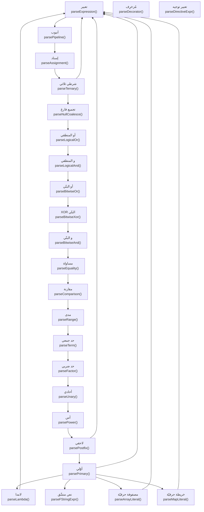

---

<a id="gr.expr.expression"></a>
### gr.expr.expression — تعبير <span dir="ltr">(Expression)</span>

- **الرقم التسلسليّ:** `ق-041` · **المعرّف الموحَّد:** `gr.expr.expression` · **الحالة:** stable · **منذ:** 1.0.0
- **الوصف:** غلاف نقطة الدخول — يفوّض لأدنى مستوى أسبقية (الأنبوب)

#### 📐 BNF
```bnf
Expression = Pipeline ;
```

#### 🧩 تفصيل البدائل
- `pipeline`

#### 🔻 المسار إلى المحلل (دوال التحليل) ⇒ AST
**دالة (دوال) الدخول:**
1. [`ParserCore::parseExpression`](../../../shared/parser/src/core/parser_expressions.cpp) — `shared/parser/src/core/parser_expressions.cpp`
- **عقدة AST المُنتَجة:** `—`
- **يستدعي دوال:** [`parsePipeline`](40_expressions.md#gr.expr.pipeline)
- **مُستدعى من:** [`parseIfStmt`](10_statements.md#gr.stmt.if)، [`parseWhileStmt`](10_statements.md#gr.stmt.while)، [`parseForStmt`](10_statements.md#gr.stmt.for)، [`parseMatchStmt`](10_statements.md#gr.stmt.match)، [`parseRaiseStmt`](10_statements.md#gr.stmt.throw)، [`parseReturnStmt`](10_statements.md#gr.stmt.return)، [`parseExpressionStmt`](10_statements.md#gr.stmt.expression)، [`parseSwitchStmt`](10_statements.md#gr.stmt.switch)، [`parseVarDecl`](20_declarations.md#gr.decl.variable)، [`parseFunctionDecl`](20_declarations.md#gr.decl.parameters)، [`parseArgumentList`](20_declarations.md#gr.decl.arg_list)، [`parseEnumDecl`](30_oop.md#gr.oop.enum)، [`parseFieldDeclaration`](30_oop.md#gr.oop.field)، [`parseTernary`](40_expressions.md#gr.expr.ternary)، [`parsePostfix`](40_expressions.md#gr.expr.postfix)، [`parsePrimary`](40_expressions.md#gr.expr.primary)، [`parseLambda`](40_expressions.md#gr.expr.lambda)، [`parseArrayLiteral`](40_expressions.md#gr.expr.array_literal)، [`parseMapLiteral`](40_expressions.md#gr.expr.map_literal)، [`parseTemplateInstantiation`](60_advanced.md#gr.adv.template_args)، [`parseYieldStmt`](60_advanced.md#gr.adv.yield)، [`parseWithStmt`](60_advanced.md#gr.adv.with)، [`parseGoStmt`](60_advanced.md#gr.adv.go)، [`parseSelectStmt`](60_advanced.md#gr.adv.select)، [`parseArrayLiteral`](60_advanced.md#gr.adv.list_comprehension)، [`parseMapLiteral`](60_advanced.md#gr.adv.set_comprehension)، [`parseMapLiteral`](60_advanced.md#gr.adv.dict_comprehension)، [`parsePrimary`](60_advanced.md#gr.adv.await)، [`parseUIStateDecl`](60_advanced.md#gr.adv.ui_state)، [`parseUIEventHandler`](60_advanced.md#gr.adv.ui_event)

##### مخطّط مسار الدوال (حتى AST)
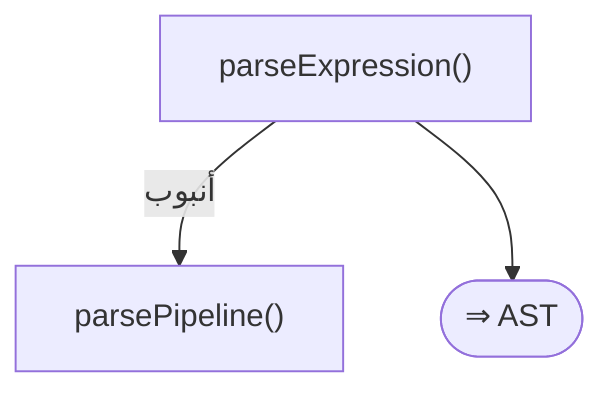

#### 📊 مخطّط البنية النحويّة (Mermaid)
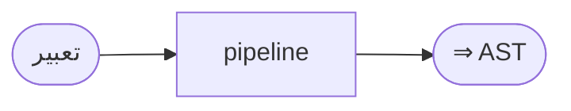

---

<a id="gr.expr.pipeline"></a>
### gr.expr.pipeline — أنبوب <span dir="ltr">(Pipeline)</span>

- **الرقم التسلسليّ:** `ق-042` · **المعرّف الموحَّد:** `gr.expr.pipeline` · **الحالة:** stable · **منذ:** 1.0.0
- **الوصف:** عامل الأنبوب يساريّ التجميع مع إزالة سكر نحوي: «أ |> د» ← «د(أ)»؛ «أ |> د(ب)» ← «د(أ، ب)»؛ «أ |> د |> ت» ← «ت(د(أ))».

#### 📐 BNF
```bnf
Pipeline = Assignment { '|>' Assignment } ;
```

#### 🧩 تفصيل البدائل
- `assignment { «|>» assignment }`

#### 🔻 المسار إلى المحلل (دوال التحليل) ⇒ AST
**دالة (دوال) الدخول:**
1. [`ParserCore::parsePipeline`](../../../shared/parser/src/core/parser_expressions.cpp) — `shared/parser/src/core/parser_expressions.cpp`
- **عقدة AST المُنتَجة:** `CallExpr`
- **يستدعي دوال:** [`parseAssignment`](40_expressions.md#gr.expr.assignment)
- **مُستدعى من:** [`parseExpression`](40_expressions.md#gr.expr.expression)

##### مخطّط مسار الدوال (حتى AST)
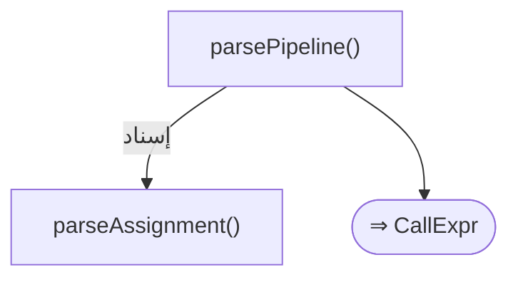

#### 📊 مخطّط البنية النحويّة (Mermaid)
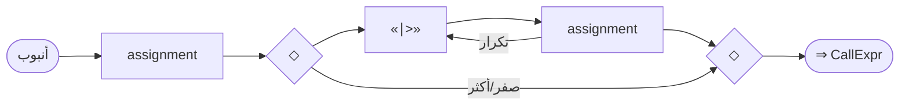

#### مثال
```sad
متغير ن = [1، 2، 3] |> طول
```

---

<a id="gr.expr.assignment"></a>
### gr.expr.assignment — إسناد <span dir="ltr">(Assignment)</span>

- **الرقم التسلسليّ:** `ق-043` · **المعرّف الموحَّد:** `gr.expr.assignment` · **الحالة:** stable · **منذ:** 1.0.0
- **الوصف:** يمينيّ التجميع. الهدف: متغيّر/عضو(كائن.حقل)/فهرس(م[ف]). «:=» (walrus) يتطلّب اسم متغيّر. المركّب «س += ص» سكر ← «س = س + ص» (يُعاد بناء طرف القراءة للمتداخل).

#### 📐 BNF
```bnf
Assignment = Ternary [ ( ':=' | '=' | '+=' | '-=' | '*=' | '/=' | '//=' | '%=' ) Assignment ] ;
```

#### 🧩 تفصيل البدائل
- `ternary [ ( «:=» | «=» | «+=» | «-=» | «*=» | «/=» | «//=» | «%=» ) assignment ]`

#### 🔻 المسار إلى المحلل (دوال التحليل) ⇒ AST
**دالة (دوال) الدخول:**
1. [`ParserCore::parseAssignment`](../../../shared/parser/src/core/parser_expressions.cpp) — `shared/parser/src/core/parser_expressions.cpp`
- **عقدة AST المُنتَجة:** `AssignExpr | MemberAssignExpr | IndexAssignExpr | WalrusExpr`
- **يستدعي دوال:** [`parseTernary`](40_expressions.md#gr.expr.ternary)
- **مُستدعى من:** [`parsePipeline`](40_expressions.md#gr.expr.pipeline)، [`parseAssignment`](40_expressions.md#gr.expr.assignment)
- **روابط المعجم:** عوامل: «=»، «+=»، «-=»، «*=»، «/=»، «%=»

##### مخطّط مسار الدوال (حتى AST)
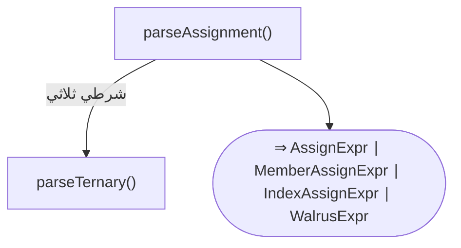

#### 📊 مخطّط البنية النحويّة (Mermaid)
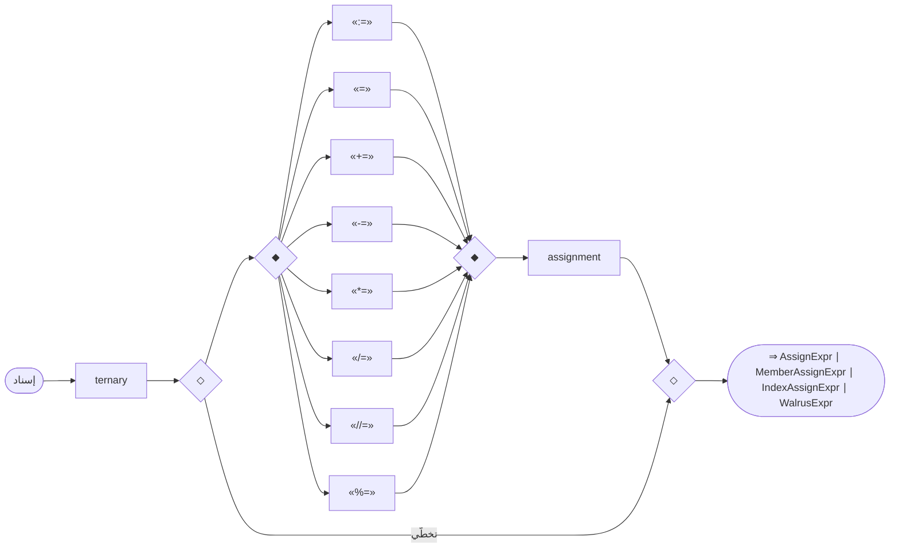

#### مثال
```sad
متغير س = 0
س += 5
```

---

<a id="gr.expr.ternary"></a>
### gr.expr.ternary — شرطي ثلاثي <span dir="ltr">(Ternary)</span>

- **الرقم التسلسليّ:** `ق-044` · **المعرّف الموحَّد:** `gr.expr.ternary` · **الحالة:** stable · **منذ:** 1.0.0
- **الوصف:** شرطيّ ثلاثيّ يمينيّ التجميع: «أ ؟ ب : ج ؟ د : هـ» ← «أ ؟ ب : (ج ؟ د : هـ)»

#### 📐 BNF
```bnf
Ternary = NullCoalesce [ '؟' Expression ':' Ternary ] ;
```

#### 🧩 تفصيل البدائل
- `null_coalesce [ «؟» expression «:» ternary ]`

#### 🔻 المسار إلى المحلل (دوال التحليل) ⇒ AST
**دالة (دوال) الدخول:**
1. [`ParserCore::parseTernary`](../../../shared/parser/src/core/parser_expressions.cpp) — `shared/parser/src/core/parser_expressions.cpp`
- **عقدة AST المُنتَجة:** `TernaryExpr`
- **يستدعي دوال:** [`parseNullCoalesce`](40_expressions.md#gr.expr.null_coalesce)، [`parseExpression`](40_expressions.md#gr.expr.expression)
- **مُستدعى من:** [`parseAssignment`](40_expressions.md#gr.expr.assignment)، [`parseTernary`](40_expressions.md#gr.expr.ternary)
- **روابط المعجم:** عوامل: «؟ :»

##### مخطّط مسار الدوال (حتى AST)
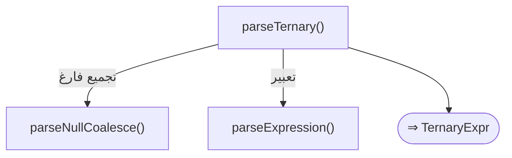

#### 📊 مخطّط البنية النحويّة (Mermaid)
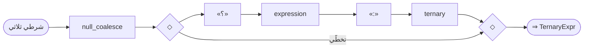

#### مثال
```sad
متغير ن = س > 0 ? "موجب" : "غير موجب"
```

---

<a id="gr.expr.null_coalesce"></a>
### gr.expr.null_coalesce — تجميع فارغ <span dir="ltr">(NullCoalesce)</span>

- **الرقم التسلسليّ:** `ق-045` · **المعرّف الموحَّد:** `gr.expr.null_coalesce` · **الحالة:** stable · **منذ:** 1.0.0
- **الوصف:** يُرجِع الطرف الأيسر إن لم يكن لاشيء، وإلا الأيمن

#### 📐 BNF
```bnf
NullCoalesce = LogicalOr { '؟؟' LogicalOr } ;
```

#### 🧩 تفصيل البدائل
- `logical_or { «؟؟» logical_or }`

#### 🔻 المسار إلى المحلل (دوال التحليل) ⇒ AST
**دالة (دوال) الدخول:**
1. [`ParserCore::parseNullCoalesce`](../../../shared/parser/src/core/parser_expressions.cpp) — `shared/parser/src/core/parser_expressions.cpp`
- **عقدة AST المُنتَجة:** `NullCoalesceExpr`
- **يستدعي دوال:** [`parseLogicalOr`](40_expressions.md#gr.expr.logical_or)
- **مُستدعى من:** [`parseTernary`](40_expressions.md#gr.expr.ternary)
- **روابط المعجم:** عوامل: «؟؟»

##### مخطّط مسار الدوال (حتى AST)
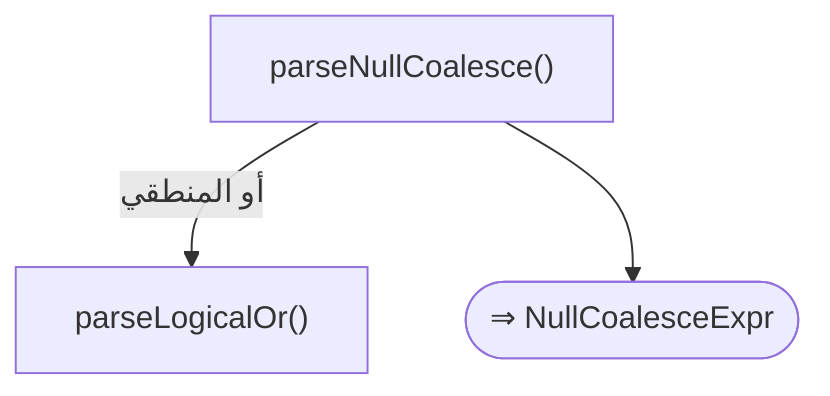

#### 📊 مخطّط البنية النحويّة (Mermaid)
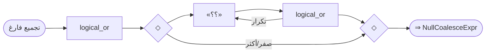

---

<a id="gr.expr.logical_or"></a>
### gr.expr.logical_or — أو المنطقي <span dir="ltr">(LogicalOr)</span>

- **الرقم التسلسليّ:** `ق-046` · **المعرّف الموحَّد:** `gr.expr.logical_or` · **الحالة:** stable · **منذ:** 1.0.0
- **الوصف:** أو منطقيّ يساريّ التجميع (يقبل «||» و«أو»)

#### 📐 BNF
```bnf
LogicalOr = LogicalAnd { ( '||' | 'أو' ) LogicalAnd } ;
```

#### 🧩 تفصيل البدائل
- `logical_and { «||» logical_and }`

#### 🔻 المسار إلى المحلل (دوال التحليل) ⇒ AST
**دالة (دوال) الدخول:**
1. [`ParserCore::parseLogicalOr`](../../../shared/parser/src/core/parser_expressions.cpp) — `shared/parser/src/core/parser_expressions.cpp`
- **عقدة AST المُنتَجة:** `BinaryExpr`
- **يستدعي دوال:** [`parseLogicalAnd`](40_expressions.md#gr.expr.logical_and)
- **مُستدعى من:** [`parseNullCoalesce`](40_expressions.md#gr.expr.null_coalesce)
- **روابط المعجم:** عوامل: «||»، «أو»

##### مخطّط مسار الدوال (حتى AST)
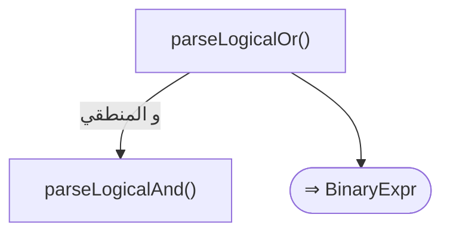

#### 📊 مخطّط البنية النحويّة (Mermaid)
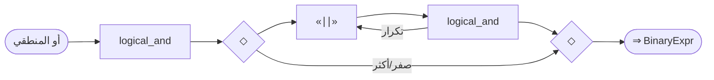

---

<a id="gr.expr.logical_and"></a>
### gr.expr.logical_and — و المنطقي <span dir="ltr">(LogicalAnd)</span>

- **الرقم التسلسليّ:** `ق-047` · **المعرّف الموحَّد:** `gr.expr.logical_and` · **الحالة:** stable · **منذ:** 1.0.0
- **الوصف:** و منطقيّ يساريّ التجميع (يقبل «&&» و«و»)

#### 📐 BNF
```bnf
LogicalAnd = BitwiseOr { ( '&&' | 'و' ) BitwiseOr } ;
```

#### 🧩 تفصيل البدائل
- `bitwise_or { «&&» bitwise_or }`

#### 🔻 المسار إلى المحلل (دوال التحليل) ⇒ AST
**دالة (دوال) الدخول:**
1. [`ParserCore::parseLogicalAnd`](../../../shared/parser/src/core/parser_expressions.cpp) — `shared/parser/src/core/parser_expressions.cpp`
- **عقدة AST المُنتَجة:** `BinaryExpr`
- **يستدعي دوال:** [`parseBitwiseOr`](40_expressions.md#gr.expr.bitwise_or)
- **مُستدعى من:** [`parseLogicalOr`](40_expressions.md#gr.expr.logical_or)
- **روابط المعجم:** عوامل: «&&»، «و»

##### مخطّط مسار الدوال (حتى AST)
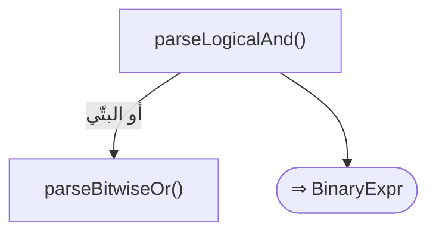

#### 📊 مخطّط البنية النحويّة (Mermaid)
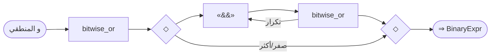

---

<a id="gr.expr.bitwise_or"></a>
### gr.expr.bitwise_or — أو البتّي <span dir="ltr">(BitwiseOr)</span>

- **الرقم التسلسليّ:** `ق-048` · **المعرّف الموحَّد:** `gr.expr.bitwise_or` · **الحالة:** stable · **منذ:** 1.0.0
- **الوصف:** أو بتّي يساريّ التجميع

#### 📐 BNF
```bnf
BitwiseOr = BitwiseXor { '|' BitwiseXor } ;
```

#### 🧩 تفصيل البدائل
- `bitwise_xor { «|» bitwise_xor }`

#### 🔻 المسار إلى المحلل (دوال التحليل) ⇒ AST
**دالة (دوال) الدخول:**
1. [`ParserCore::parseBitwiseOr`](../../../shared/parser/src/core/parser_expressions.cpp) — `shared/parser/src/core/parser_expressions.cpp`
- **عقدة AST المُنتَجة:** `BinaryExpr`
- **يستدعي دوال:** [`parseBitwiseXor`](40_expressions.md#gr.expr.bitwise_xor)
- **مُستدعى من:** [`parseLogicalAnd`](40_expressions.md#gr.expr.logical_and)
- **روابط المعجم:** عوامل: «|»

##### مخطّط مسار الدوال (حتى AST)
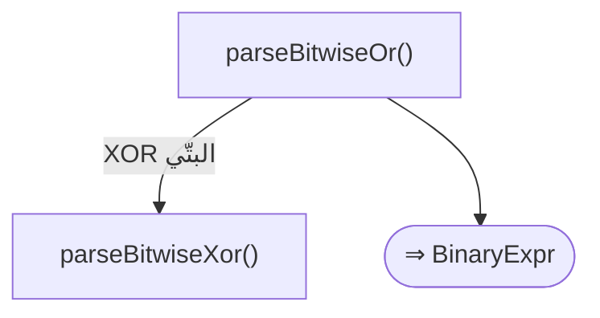

#### 📊 مخطّط البنية النحويّة (Mermaid)
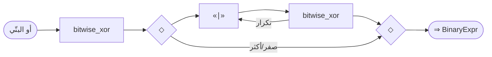

---

<a id="gr.expr.bitwise_xor"></a>
### gr.expr.bitwise_xor — XOR البتّي <span dir="ltr">(BitwiseXor)</span>

- **الرقم التسلسليّ:** `ق-049` · **المعرّف الموحَّد:** `gr.expr.bitwise_xor` · **الحالة:** stable · **منذ:** 1.0.0
- **الوصف:** XOR بتّي يساريّ التجميع

#### 📐 BNF
```bnf
BitwiseXor = BitwiseAnd { '^' BitwiseAnd } ;
```

#### 🧩 تفصيل البدائل
- `bitwise_and { «^» bitwise_and }`

#### 🔻 المسار إلى المحلل (دوال التحليل) ⇒ AST
**دالة (دوال) الدخول:**
1. [`ParserCore::parseBitwiseXor`](../../../shared/parser/src/core/parser_expressions.cpp) — `shared/parser/src/core/parser_expressions.cpp`
- **عقدة AST المُنتَجة:** `BinaryExpr`
- **يستدعي دوال:** [`parseBitwiseAnd`](40_expressions.md#gr.expr.bitwise_and)
- **مُستدعى من:** [`parseBitwiseOr`](40_expressions.md#gr.expr.bitwise_or)
- **روابط المعجم:** عوامل: «^»

##### مخطّط مسار الدوال (حتى AST)
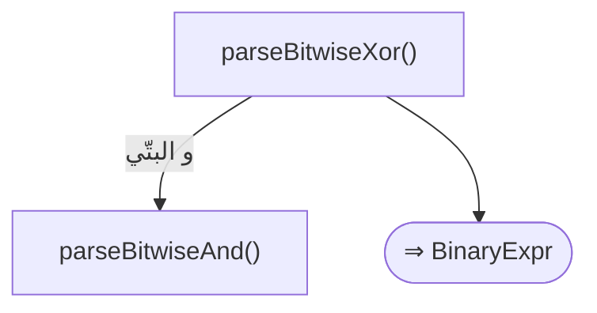

#### 📊 مخطّط البنية النحويّة (Mermaid)
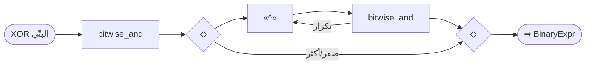

---

<a id="gr.expr.bitwise_and"></a>
### gr.expr.bitwise_and — و البتّي <span dir="ltr">(BitwiseAnd)</span>

- **الرقم التسلسليّ:** `ق-050` · **المعرّف الموحَّد:** `gr.expr.bitwise_and` · **الحالة:** stable · **منذ:** 1.0.0
- **الوصف:** و بتّي يساريّ التجميع؛ يميَّز عن «&» الاستعارة الأحاديّة بالموضع

#### 📐 BNF
```bnf
BitwiseAnd = Equality { '&' Equality } ;
```

#### 🧩 تفصيل البدائل
- `equality { «&» equality }`

#### 🔻 المسار إلى المحلل (دوال التحليل) ⇒ AST
**دالة (دوال) الدخول:**
1. [`ParserCore::parseBitwiseAnd`](../../../shared/parser/src/core/parser_expressions.cpp) — `shared/parser/src/core/parser_expressions.cpp`
- **عقدة AST المُنتَجة:** `BinaryExpr`
- **يستدعي دوال:** [`parseEquality`](40_expressions.md#gr.expr.equality)
- **مُستدعى من:** [`parseBitwiseXor`](40_expressions.md#gr.expr.bitwise_xor)
- **روابط المعجم:** عوامل: «&»

##### مخطّط مسار الدوال (حتى AST)
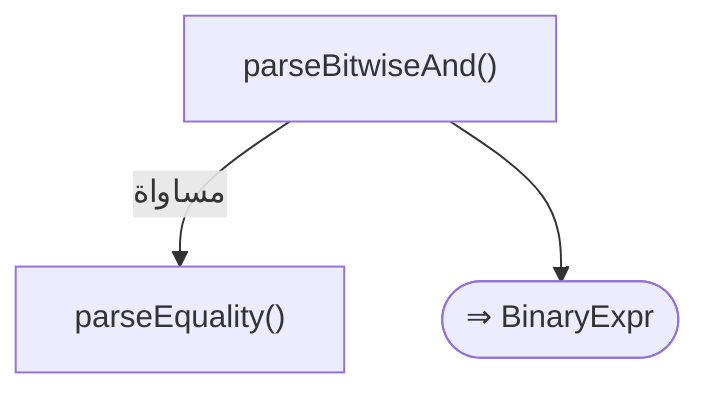

#### 📊 مخطّط البنية النحويّة (Mermaid)
```mermaid
flowchart LR
  n1(["و البتّي"])
  n2["equality"]
  n3{"◇"}
  n4{"◇"}
  n5["«&»"]
  n6["equality"]
  n5 --> n6
  n3 --> n5
  n6 --> n4
  n6 -- "تكرار" --> n5
  n3 -- "صفر/أكثر" --> n4
  n2 --> n3
  n1 --> n2
  n7(["⇒ BinaryExpr"])
  n4 --> n7
```

---

<a id="gr.expr.equality"></a>
### gr.expr.equality — مساواة <span dir="ltr">(Equality)</span>

- **الرقم التسلسليّ:** `ق-051` · **المعرّف الموحَّد:** `gr.expr.equality` · **الحالة:** stable · **منذ:** 1.0.0
- **الوصف:** مقارنة المساواة/عدمها يساريّ التجميع

#### 📐 BNF
```bnf
Equality = Comparison { ( '==' | '!=' ) Comparison } ;
```

#### 🧩 تفصيل البدائل
- `comparison { ( «==» | «!=» ) comparison }`

#### 🔻 المسار إلى المحلل (دوال التحليل) ⇒ AST
**دالة (دوال) الدخول:**
1. [`ParserCore::parseEquality`](../../../shared/parser/src/core/parser_expressions.cpp) — `shared/parser/src/core/parser_expressions.cpp`
- **عقدة AST المُنتَجة:** `BinaryExpr`
- **يستدعي دوال:** [`parseComparison`](40_expressions.md#gr.expr.comparison)
- **مُستدعى من:** [`parseBitwiseAnd`](40_expressions.md#gr.expr.bitwise_and)
- **روابط المعجم:** عوامل: «==»، «!=»

##### مخطّط مسار الدوال (حتى AST)
```mermaid
flowchart TD
  f1["parseEquality()"]
  f2["parseComparison()"]
  f1 -- "مقارنة" --> f2
  f3(["⇒ BinaryExpr"])
  f1 --> f3
```

#### 📊 مخطّط البنية النحويّة (Mermaid)
```mermaid
flowchart LR
  n1(["مساواة"])
  n2["comparison"]
  n3{"◇"}
  n4{"◇"}
  n5{"◆"}
  n6{"◆"}
  n7["«==»"]
  n5 --> n7
  n7 --> n6
  n8["«!=»"]
  n5 --> n8
  n8 --> n6
  n9["comparison"]
  n6 --> n9
  n3 --> n5
  n9 --> n4
  n9 -- "تكرار" --> n5
  n3 -- "صفر/أكثر" --> n4
  n2 --> n3
  n1 --> n2
  n10(["⇒ BinaryExpr"])
  n4 --> n10
```

---

<a id="gr.expr.comparison"></a>
### gr.expr.comparison — مقارنة <span dir="ltr">(Comparison)</span>

- **الرقم التسلسليّ:** `ق-052` · **المعرّف الموحَّد:** `gr.expr.comparison` · **الحالة:** stable · **منذ:** 1.0.0
- **الوصف:** مقارنات ترتيبيّة + عامل العضويّة «في» في نفس المستوى.
**إشارةُ الترتيبِ ودلالةُ «طبيعي» (قرارُ مالكٍ 2026-08-16):**
المقارنةُ الترتيبيّةُ (`<` `<=` `>` `>=`) **لا-موقَّعةٌ حين يكون النوعُ الساكنُ لـ«أيٍّ» من المعامِلَين `طبيعي`** — هيمنةٌ لا اشتراط. والمساواةُ (`==` `!=`) مساواةُ بتّاتٍ فلا تتأثّر بالإشارة.
🔑 **وحُجّةُ هذا القرارِ سقطت بعدَه، والقاعدةُ باقية.** كانَ يُبرَّرُ بأنّه «يُطابِقُ الحسابَ (`+` `−` `×`) الذي يهيمنُ فيه `طبيعي` سلفًا» — ثمّ قرَّرَ المالكُ (٢٦ آب ٢٠٢٦) أنّ الحسابَ على `طبيعي × رقم` **يُرفَضُ ترجمةً** بـ`SEM048` بدلَ أن يُحسَم بالهيمنة، لأنّ الخانةَ لا جوابَ صحيحَ لها. فلم تبقَ مطابقةٌ تُحتَجَّ بها: الحسابُ يقفُ حيثُ تمضي المقارنة. والأثرُ يُقالُ ولا يُخبَّأ: `ط + ن` خطأُ ترجمةٍ بينما `ط > ن` تمضي صامتةً بدلالةٍ لا-موقَّعة — لأنّ المقارنةَ **خارجَ نطاقِ المرحلةِ الأولى** من `SEM048` صراحةً (انظر `errors/semantic.yaml`)، لا لأنّها بُرِّئت. وحينَ تُوسَّعُ المرحلةُ الثانيةُ إلى المقارناتِ يُعادُ فتحُ هذا النصِّ بكامله.
وكان الشرطُ قبلَ القرارِ اشتراطَ **كليهما**، فانفرجت اللغةُ على نفسِها:

    طبيعي ط = 18446744073709551615
    طبيعي ن = 1
    ط > ن   ⇒  صحيح        (طبيعيّان: لا-موقَّعة)
    ط > 1   ⇒  خطأ    🔴   (طبيعيٌّ × حرفيّ: موقَّعة)

والمحرّكان كانا **متّفقَين** على ذلك، فمرَّ من بوّابةِ التكافؤِ ودُوِّن في تقريرِ المصفوفةِ «مقارنةٌ غيرُ موجَّهة ✅». 🔑 والتطابقُ بين المحرّكَين ينفي الانفراجَ وحدَه ولا يُثبِت الصواب.
⚠️ **ولازمُ هذا الاختيارِ يُقال ولا يُخبَّأ:** `ط > -1` تصير «خطأ» لأنّ `-1` تُقرَأ لا-موقَّعةً فتكون أكبرَ ما يكون. وهي دلالةُ C نفسُها، لازمةٌ للهيمنةِ لا مفاجأةٌ فيها.
**مواضعُ التنفيذِ خمسة**: `isUnsignedOrderingCmp` في `arithmetic_codegen.h` (يناديه أربعةُ مُصدِرين: `<` و`<=` في `arith_cmp.cpp`، و`>` و`>=` في `arith_extras.cpp`) والمفسّرُ في `expression_evaluator_binary_ops.cpp`. وجُمِعت الأربعةُ في مُحدِّدٍ واحدٍ عمدًا: قاعدةٌ تُنسَخ أربعَ مرّاتٍ تفترق في المرّةِ التي تُنسى.

#### 📐 BNF
```bnf
Comparison = Range { ( '<' | '<=' | '>' | '>=' | 'في' ) Range } ;
```

#### 🧩 تفصيل البدائل
- `range { ( «<» | «<=» | «>» | «>=» | «في» ) range }`

#### 🔻 المسار إلى المحلل (دوال التحليل) ⇒ AST
**دالة (دوال) الدخول:**
1. [`ParserCore::parseComparison`](../../../shared/parser/src/core/parser_expressions.cpp) — `shared/parser/src/core/parser_expressions.cpp`
- **عقدة AST المُنتَجة:** `BinaryExpr`
- **يستدعي دوال:** [`parseRange`](40_expressions.md#gr.expr.range)
- **مُستدعى من:** [`parseEquality`](40_expressions.md#gr.expr.equality)
- **روابط المعجم:** كلمات: «في» · عوامل: «<»، «<=»، «>»، «>=»، «في»

##### مخطّط مسار الدوال (حتى AST)
```mermaid
flowchart TD
  f1["parseComparison()"]
  f2["parseRange()"]
  f1 -- "مدى" --> f2
  f3(["⇒ BinaryExpr"])
  f1 --> f3
```

#### 📊 مخطّط البنية النحويّة (Mermaid)
```mermaid
flowchart LR
  n1(["مقارنة"])
  n2["range"]
  n3{"◇"}
  n4{"◇"}
  n5{"◆"}
  n6{"◆"}
  n7["«<»"]
  n5 --> n7
  n7 --> n6
  n8["«<=»"]
  n5 --> n8
  n8 --> n6
  n9["«>»"]
  n5 --> n9
  n9 --> n6
  n10["«>=»"]
  n5 --> n10
  n10 --> n6
  n11["«في»"]
  n5 --> n11
  n11 --> n6
  n12["range"]
  n6 --> n12
  n3 --> n5
  n12 --> n4
  n12 -- "تكرار" --> n5
  n3 -- "صفر/أكثر" --> n4
  n2 --> n3
  n1 --> n2
  n13(["⇒ BinaryExpr"])
  n4 --> n13
```

---

<a id="gr.expr.range"></a>
### gr.expr.range — مدى <span dir="ltr">(Range)</span>

- **الرقم التسلسليّ:** `ق-053` · **المعرّف الموحَّد:** `gr.expr.range` · **الحالة:** stable · **منذ:** 1.0.0
- **الوصف:** مدى «بداية..نهاية»؛ يدعم المدى المفتوح «1..» عند ملاقاة ] ) , أو نهاية الإدخال

#### 📐 BNF
```bnf
Range = Term [ '..' [ Term ] ] ;
```

#### 🧩 تفصيل البدائل
- `term [ «..» [ term ] ]`

#### 🔻 المسار إلى المحلل (دوال التحليل) ⇒ AST
**دالة (دوال) الدخول:**
1. [`ParserCore::parseRange`](../../../shared/parser/src/core/parser_expressions.cpp) — `shared/parser/src/core/parser_expressions.cpp`
- **عقدة AST المُنتَجة:** `RangeExpr`
- **يستدعي دوال:** [`parseTerm`](40_expressions.md#gr.expr.term)
- **مُستدعى من:** [`parseComparison`](40_expressions.md#gr.expr.comparison)
- **روابط المعجم:** عوامل: «..»

##### مخطّط مسار الدوال (حتى AST)
```mermaid
flowchart TD
  f1["parseRange()"]
  f2["parseTerm()"]
  f1 -- "حد جمعي" --> f2
  f3(["⇒ RangeExpr"])
  f1 --> f3
```

#### 📊 مخطّط البنية النحويّة (Mermaid)
```mermaid
flowchart LR
  n1(["مدى"])
  n2["term"]
  n3{"◇"}
  n4{"◇"}
  n5["«..»"]
  n6{"◇"}
  n7{"◇"}
  n8["term"]
  n6 --> n8
  n8 --> n7
  n6 -- "تخطّي" --> n7
  n5 --> n6
  n3 --> n5
  n7 --> n4
  n3 -- "تخطّي" --> n4
  n2 --> n3
  n1 --> n2
  n9(["⇒ RangeExpr"])
  n4 --> n9
```

---

<a id="gr.expr.term"></a>
### gr.expr.term — حد جمعي <span dir="ltr">(Term)</span>

- **الرقم التسلسليّ:** `ق-054` · **المعرّف الموحَّد:** `gr.expr.term` · **الحالة:** stable · **منذ:** 1.0.0
- **الوصف:** الجمع/الطرح ثم الإزاحة البتّيّة «<< >>» في نفس المستوى (بعد +/-)

#### 📐 BNF
```bnf
Term = Factor { ( '+' | '-' ) Factor } { ( '<<' | '>>' ) Factor } ;
```

#### 🧩 تفصيل البدائل
- `factor { ( «+» | «-» ) factor } { ( «<<» | «>>» ) factor }`

#### 🔻 المسار إلى المحلل (دوال التحليل) ⇒ AST
**دالة (دوال) الدخول:**
1. [`ParserCore::parseTerm`](../../../shared/parser/src/core/parser_expressions.cpp) — `shared/parser/src/core/parser_expressions.cpp`
- **عقدة AST المُنتَجة:** `BinaryExpr`
- **يستدعي دوال:** [`parseFactor`](40_expressions.md#gr.expr.factor)
- **مُستدعى من:** [`parseRange`](40_expressions.md#gr.expr.range)
- **روابط المعجم:** عوامل: «+»، «-»، «<<»، «>>»

##### مخطّط مسار الدوال (حتى AST)
```mermaid
flowchart TD
  f1["parseTerm()"]
  f2["parseFactor()"]
  f1 -- "حد ضربي" --> f2
  f3(["⇒ BinaryExpr"])
  f1 --> f3
```

#### 📊 مخطّط البنية النحويّة (Mermaid)
```mermaid
flowchart LR
  n1(["حد جمعي"])
  n2["factor"]
  n3{"◇"}
  n4{"◇"}
  n5{"◆"}
  n6{"◆"}
  n7["«+»"]
  n5 --> n7
  n7 --> n6
  n8["«-»"]
  n5 --> n8
  n8 --> n6
  n9["factor"]
  n6 --> n9
  n3 --> n5
  n9 --> n4
  n9 -- "تكرار" --> n5
  n3 -- "صفر/أكثر" --> n4
  n2 --> n3
  n10{"◇"}
  n11{"◇"}
  n12{"◆"}
  n13{"◆"}
  n14["«<<»"]
  n12 --> n14
  n14 --> n13
  n15["«>>»"]
  n12 --> n15
  n15 --> n13
  n16["factor"]
  n13 --> n16
  n10 --> n12
  n16 --> n11
  n16 -- "تكرار" --> n12
  n10 -- "صفر/أكثر" --> n11
  n4 --> n10
  n1 --> n2
  n17(["⇒ BinaryExpr"])
  n11 --> n17
```

---

<a id="gr.expr.factor"></a>
### gr.expr.factor — حد ضربي <span dir="ltr">(Factor)</span>

- **الرقم التسلسليّ:** `ق-055` · **المعرّف الموحَّد:** `gr.expr.factor` · **الحالة:** stable · **منذ:** 1.0.0
- **الوصف:** الضرب/القسمة/القسمة الصحيحة/الباقي يساريّ التجميع

#### 📐 BNF
```bnf
Factor = Unary { ( '*' | '/' | '//' | '%' ) Unary } ;
```

#### 🧩 تفصيل البدائل
- `unary { ( «*» | «/» | «//» | «%» ) unary }`

#### 🔻 المسار إلى المحلل (دوال التحليل) ⇒ AST
**دالة (دوال) الدخول:**
1. [`ParserCore::parseFactor`](../../../shared/parser/src/core/parser_expressions.cpp) — `shared/parser/src/core/parser_expressions.cpp`
- **عقدة AST المُنتَجة:** `BinaryExpr`
- **يستدعي دوال:** [`parseUnary`](40_expressions.md#gr.expr.unary)
- **مُستدعى من:** [`parseTerm`](40_expressions.md#gr.expr.term)
- **روابط المعجم:** عوامل: «*»، «/»، «//»، «%»

##### مخطّط مسار الدوال (حتى AST)
```mermaid
flowchart TD
  f1["parseFactor()"]
  f2["parseUnary()"]
  f1 -- "أحادي" --> f2
  f3(["⇒ BinaryExpr"])
  f1 --> f3
```

#### 📊 مخطّط البنية النحويّة (Mermaid)
```mermaid
flowchart LR
  n1(["حد ضربي"])
  n2["unary"]
  n3{"◇"}
  n4{"◇"}
  n5{"◆"}
  n6{"◆"}
  n7["«*»"]
  n5 --> n7
  n7 --> n6
  n8["«/»"]
  n5 --> n8
  n8 --> n6
  n9["«//»"]
  n5 --> n9
  n9 --> n6
  n10["«%»"]
  n5 --> n10
  n10 --> n6
  n11["unary"]
  n6 --> n11
  n3 --> n5
  n11 --> n4
  n11 -- "تكرار" --> n5
  n3 -- "صفر/أكثر" --> n4
  n2 --> n3
  n1 --> n2
  n12(["⇒ BinaryExpr"])
  n4 --> n12
```

---

<a id="gr.expr.unary"></a>
### gr.expr.unary — أحادي <span dir="ltr">(Unary)</span>

- **الرقم التسلسليّ:** `ق-056` · **المعرّف الموحَّد:** `gr.expr.unary` · **الحالة:** stable · **منذ:** 1.0.0
- **الوصف:** «&متغير» / «&'أ متغير» استعارة (قابلة للتعديل عند «متغير»/«mut»)؛ تعليق العمر اختياريّ. تُميَّز عن «&» البتّي بالموضع البادئ. باقي الأحاديّات بادئة وتعاوديّة.

#### 📐 BNF
```bnf
Unary = '&' [ Lifetime ] [ 'متغير' | 'mut' ] Identifier
      | ( '!' | '-' | '++' | '--' | '~' ) Unary
      | Power ;
```

#### 🧩 تفصيل البدائل
**1.** *استعارة:* `«&» [ «LIFETIME» ] [ «متغير» ] «IDENTIFIER»`
**2.** *أحادي بادئ:* `( «!» | «-» | «++» | «--» | «~» ) unary`
**3.** *تفويض للأس:* `power`

#### 🔻 المسار إلى المحلل (دوال التحليل) ⇒ AST
**دالة (دوال) الدخول:**
1. [`ParserCore::parseUnary`](../../../shared/parser/src/core/parser_expressions.cpp) — `shared/parser/src/core/parser_expressions.cpp`
- **عقدة AST المُنتَجة:** `UnaryExpr | BorrowExpr`
- **يستدعي دوال:** [`parsePower`](40_expressions.md#gr.expr.power)
- **مُستدعى من:** [`parseFactor`](40_expressions.md#gr.expr.factor)، [`parseUnary`](40_expressions.md#gr.expr.unary)
- **روابط المعجم:** عوامل: «!»، «-»، «++»، «--»، «~»، «&»

##### مخطّط مسار الدوال (حتى AST)
```mermaid
flowchart TD
  f1["parseUnary()"]
  f2["parsePower()"]
  f1 -- "أس" --> f2
  f3(["⇒ UnaryExpr ∣ BorrowExpr"])
  f1 --> f3
```

#### 📊 مخطّط البنية النحويّة (Mermaid)
```mermaid
flowchart LR
  n1(["أحادي"])
  n2["«&»"]
  n3{"◇"}
  n4{"◇"}
  n5["«LIFETIME»"]
  n3 --> n5
  n5 --> n4
  n3 -- "تخطّي" --> n4
  n2 --> n3
  n6{"◇"}
  n7{"◇"}
  n8["«متغير»"]
  n6 --> n8
  n8 --> n7
  n6 -- "تخطّي" --> n7
  n4 --> n6
  n9["«IDENTIFIER»"]
  n7 --> n9
  n1 -- "استعارة" --> n2
  n10(["⇒ UnaryExpr ∣ BorrowExpr"])
  n9 --> n10
  n11{"◆"}
  n12{"◆"}
  n13["«!»"]
  n11 --> n13
  n13 --> n12
  n14["«-»"]
  n11 --> n14
  n14 --> n12
  n15["«++»"]
  n11 --> n15
  n15 --> n12
  n16["«--»"]
  n11 --> n16
  n16 --> n12
  n17["«~»"]
  n11 --> n17
  n17 --> n12
  n18["unary"]
  n12 --> n18
  n1 -- "أحادي بادئ" --> n11
  n19(["⇒ UnaryExpr ∣ BorrowExpr"])
  n18 --> n19
  n20["power"]
  n1 -- "تفويض للأس" --> n20
  n21(["⇒ UnaryExpr ∣ BorrowExpr"])
  n20 --> n21
```

---

<a id="gr.expr.power"></a>
### gr.expr.power — أس <span dir="ltr">(Power)</span>

- **الرقم التسلسليّ:** `ق-057` · **المعرّف الموحَّد:** `gr.expr.power` · **الحالة:** stable · **منذ:** 1.0.0
- **الوصف:** الأس يمينيّ التجميع: «2 ** 3 ** 2» ← «2 ** (3 ** 2)»

#### 📐 BNF
```bnf
Power = Postfix [ '**' Power ] ;
```

#### 🧩 تفصيل البدائل
- `postfix [ «**» power ]`

#### 🔻 المسار إلى المحلل (دوال التحليل) ⇒ AST
**دالة (دوال) الدخول:**
1. [`ParserCore::parsePower`](../../../shared/parser/src/core/parser_expressions.cpp) — `shared/parser/src/core/parser_expressions.cpp`
- **عقدة AST المُنتَجة:** `BinaryExpr`
- **يستدعي دوال:** [`parsePostfix`](40_expressions.md#gr.expr.postfix)
- **مُستدعى من:** [`parseUnary`](40_expressions.md#gr.expr.unary)، [`parsePower`](40_expressions.md#gr.expr.power)
- **روابط المعجم:** عوامل: «**»

##### مخطّط مسار الدوال (حتى AST)
```mermaid
flowchart TD
  f1["parsePower()"]
  f2["parsePostfix()"]
  f1 -- "لاحقي" --> f2
  f3(["⇒ BinaryExpr"])
  f1 --> f3
```

#### 📊 مخطّط البنية النحويّة (Mermaid)
```mermaid
flowchart LR
  n1(["أس"])
  n2["postfix"]
  n3{"◇"}
  n4{"◇"}
  n5["«**»"]
  n6["power"]
  n5 --> n6
  n3 --> n5
  n6 --> n4
  n3 -- "تخطّي" --> n4
  n2 --> n3
  n1 --> n2
  n7(["⇒ BinaryExpr"])
  n4 --> n7
```

---

<a id="gr.expr.postfix"></a>
### gr.expr.postfix — لاحقي <span dir="ltr">(Postfix)</span>

- **الرقم التسلسليّ:** `ق-058` · **المعرّف الموحَّد:** `gr.expr.postfix` · **الحالة:** stable · **منذ:** 1.0.0
- **الوصف:** حلقة لواحق يساريّة: استدعاء «()»، إنشاء لاحقيّ «(...) جديد»، عضو «.»، استدعاء طريقة، وصول آمن «?.»، فهرسة/شريحة «[...]»/«[ب:ن:خطوة]»/«[ب..ن]»، بعديّ «++/--»، فهرسة آمنة «?[...]»، واستدعاء ماكرو «اسم!(...)». يدعم الوصول الرقميّ للصفوف «صف.0.0».

#### 📐 BNF
```bnf
Postfix = Primary { PostfixOp } ; PostfixOp = Identifier '!' '(' ArgList ')' | '(' ArgList ')' [ 'جديد' ]
          | '.' Member [ '(' ArgList ')' ] | '؟.' Member [ '(' ArgList ')' ]
          | '[' IndexOrSlice ']' | ( '++' | '--' ) | '؟' '[' Expression ']' ;
```

#### 🧩 تفصيل البدائل
- `primary { ( ( «!» «(» arg_list «)» ) | ( «(» arg_list «)» [ «جديد» ] ) | ( «.» «IDENTIFIER» [ «(» arg_list «)» ] ) | ( «؟.» «IDENTIFIER» [ «(» arg_list «)» ] ) | ( «[» expression «]» ) | ( «++» | «--» ) ) }`

#### 🔻 المسار إلى المحلل (دوال التحليل) ⇒ AST
**دالة (دوال) الدخول:**
1. [`ParserCore::parsePostfix`](../../../shared/parser/src/core/parser_expressions.cpp) — `shared/parser/src/core/parser_expressions.cpp`
- **عقدة AST المُنتَجة:** `CallExpr | MethodCallExpr | MemberExpr | OptionalChainExpr | IndexExpr | SliceExpr | NewExpr | UnaryExpr`
- **يستدعي دوال:** [`parsePrimary`](40_expressions.md#gr.expr.primary)، [`parseArgumentList`](20_declarations.md#gr.decl.arg_list)، [`parseExpression`](40_expressions.md#gr.expr.expression)
- **مُستدعى من:** [`parsePower`](40_expressions.md#gr.expr.power)
- **روابط المعجم:** كلمات: «جديد» · عوامل: «()»، «.»، «[]»، «؟.»، «++»، «--»

##### مخطّط مسار الدوال (حتى AST)
```mermaid
flowchart TD
  f1["parsePostfix()"]
  f2["parsePrimary()"]
  f1 -- "أوّلي" --> f2
  f3["parseArgumentList()"]
  f1 -- "قائمة وسائط" --> f3
  f4["parseExpression()"]
  f1 -- "تعبير" --> f4
  f5(["⇒ CallExpr ∣ MethodCallExpr ∣ MemberExpr ∣ OptionalChainExpr ∣ IndexExpr ∣ SliceExpr ∣ NewExpr ∣ UnaryExpr"])
  f1 --> f5
```

#### 📊 مخطّط البنية النحويّة (Mermaid)
```mermaid
flowchart LR
  n1(["لاحقي"])
  n2["primary"]
  n3{"◇"}
  n4{"◇"}
  n5{"◆"}
  n6{"◆"}
  n7["«!»"]
  n8["«(»"]
  n7 --> n8
  n9["arg_list"]
  n8 --> n9
  n10["«)»"]
  n9 --> n10
  n5 --> n7
  n10 --> n6
  n11["«(»"]
  n12["arg_list"]
  n11 --> n12
  n13["«)»"]
  n12 --> n13
  n14{"◇"}
  n15{"◇"}
  n16["«جديد»"]
  n14 --> n16
  n16 --> n15
  n14 -- "تخطّي" --> n15
  n13 --> n14
  n5 --> n11
  n15 --> n6
  n17["«.»"]
  n18["«IDENTIFIER»"]
  n17 --> n18
  n19{"◇"}
  n20{"◇"}
  n21["«(»"]
  n22["arg_list"]
  n21 --> n22
  n23["«)»"]
  n22 --> n23
  n19 --> n21
  n23 --> n20
  n19 -- "تخطّي" --> n20
  n18 --> n19
  n5 --> n17
  n20 --> n6
  n24["«؟.»"]
  n25["«IDENTIFIER»"]
  n24 --> n25
  n26{"◇"}
  n27{"◇"}
  n28["«(»"]
  n29["arg_list"]
  n28 --> n29
  n30["«)»"]
  n29 --> n30
  n26 --> n28
  n30 --> n27
  n26 -- "تخطّي" --> n27
  n25 --> n26
  n5 --> n24
  n27 --> n6
  n31["«(»"]
  n32["expression"]
  n31 --> n32
  n33["«)»"]
  n32 --> n33
  n5 --> n31
  n33 --> n6
  n34{"◆"}
  n35{"◆"}
  n36["«++»"]
  n34 --> n36
  n36 --> n35
  n37["«--»"]
  n34 --> n37
  n37 --> n35
  n5 --> n34
  n35 --> n6
  n3 --> n5
  n6 --> n4
  n6 -- "تكرار" --> n5
  n3 -- "صفر/أكثر" --> n4
  n2 --> n3
  n1 --> n2
  n38(["⇒ CallExpr ∣ MethodCallExpr ∣ MemberExpr ∣ OptionalChainExpr ∣ IndexExpr ∣ SliceExpr ∣ NewExpr ∣ UnaryExpr"])
  n4 --> n38
```

#### مثال
```sad
شخص("أحمد", 30) جديد
```

---

<a id="gr.expr.primary"></a>
### gr.expr.primary — أوّلي <span dir="ltr">(Primary)</span>

- **الرقم التسلسليّ:** `ق-059` · **المعرّف الموحَّد:** `gr.expr.primary` · **الحالة:** stable · **منذ:** 1.0.0
- **الوصف:** أعلى مستوى أسبقية. يشمل القيم الحرفيّة، المتغيّر/تخصيص القالب، التجميع/الصف/السهميّة، المصفوفة/الخريطة الحرفيّة، «هذا»/«الأساس»، «انتظر»/«انشر»، تعبير-إذا، القيمة المطلقة «|x|»، وتعبير الواجهة «اعرض». تمييز «(»: «()» صف فارغ، «(x)» تجميع، «(x،...)» صف، «(x) =>» سهميّة.

#### 📐 BNF
```bnf
Primary = 'إذا' '(' Expression ')' [ 'ثم' ] Expression 'وإلا' Expression
        | 'انتظر' Expression | 'انشر' Expression | 'هذا' | 'الأساس' '.' Member
        | DirectiveExpr | Lambda | Literal | FString | '|' Expression '|'
        | 'اعرض' Widget | Identifier [ '<' TemplateArgs '>' ]
        | '(' [ Expression { ',' Expression } ] ')' [ '=>' Expression ]
        | ArrayLiteral | MapLiteral | BuiltinType | SoftKeywordAsName ;
```

#### 🧩 تفصيل البدائل
**1.** *تعبير-إذا:* `«إذا» «(» expression «)» expression «وإلا» expression`
**2.** *هذا/الأساس:* `( «هذا» | «الأساس» )`
**3.** *لامدا:* `lambda`
**4.** *قيمة حرفيّة:* `( «صحيح» | «خطأ» | «لاشيء» | «NUMBER_INTEGER» | «NUMBER_DOUBLE» | «STRING_LITERAL» | «STRING_RAW» )`
**5.** *نص منسَّق:* `fstring`
**6.** *متغيّر / تخصيص قالب:* `«IDENTIFIER» [ «<» template_args «>» ]`
**7.** *تجميع / صف / سهميّة:* `«(» [ expression { ( «،» | «,» ) expression } ] «)» [ «=>» expression ]`
**8.** *مصفوفة / خريطة حرفيّة:* `( array_literal | map_literal )`

#### 🔻 المسار إلى المحلل (دوال التحليل) ⇒ AST
**دالة (دوال) الدخول:**
1. [`ParserCore::parsePrimary`](../../../shared/parser/src/core/parser_expressions.cpp) — `shared/parser/src/core/parser_expressions.cpp`
- **عقدة AST المُنتَجة:** `LiteralExpr | VariableExpr | TupleExpr | ArrayExpr | MapExpr | ThisExpr | SuperExpr | AwaitExpr | ErrorPropagateExpr | TernaryExpr | LambdaExpr | CallExpr | TemplateInstantiation`
- **يستدعي دوال:** [`parseExpression`](40_expressions.md#gr.expr.expression)، [`parseLambda`](40_expressions.md#gr.expr.lambda)، [`parseFStringExpr`](40_expressions.md#gr.expr.fstring)، [`parseTemplateInstantiation`](60_advanced.md#gr.adv.template_args)، [`parseArrayLiteral`](40_expressions.md#gr.expr.array_literal)، [`parseMapLiteral`](40_expressions.md#gr.expr.map_literal)
- **مُستدعى من:** [`parsePostfix`](40_expressions.md#gr.expr.postfix)
- **روابط المعجم:** كلمات: «إذا»، «وإلا»، «هذا»، «الأساس»

##### مخطّط مسار الدوال (حتى AST)
```mermaid
flowchart TD
  f1["parsePrimary()"]
  f2["parseExpression()"]
  f1 -- "تعبير" --> f2
  f3["parseLambda()"]
  f1 -- "لامدا" --> f3
  f4["parseFStringExpr()"]
  f1 -- "نص منسَّق" --> f4
  f5["parseTemplateInstantiation()"]
  f1 -- "وسائط قالب" --> f5
  f6["parseArrayLiteral()"]
  f1 -- "مصفوفة حرفيّة" --> f6
  f7["parseMapLiteral()"]
  f1 -- "خريطة حرفيّة" --> f7
  f8(["⇒ LiteralExpr ∣ VariableExpr ∣ TupleExpr ∣ ArrayExpr ∣ MapExpr ∣ ThisExpr ∣ SuperExpr ∣ AwaitExpr ∣ ErrorPropagateExpr ∣ TernaryExpr ∣ LambdaExpr ∣ CallExpr ∣ TemplateInstantiation"])
  f1 --> f8
```

#### 📊 مخطّط البنية النحويّة (Mermaid)
```mermaid
flowchart LR
  n1(["أوّلي"])
  n2["«إذا»"]
  n3["«(»"]
  n2 --> n3
  n4["expression"]
  n3 --> n4
  n5["«)»"]
  n4 --> n5
  n6["expression"]
  n5 --> n6
  n7["«وإلا»"]
  n6 --> n7
  n8["expression"]
  n7 --> n8
  n1 -- "تعبير-إذا" --> n2
  n9(["⇒ LiteralExpr ∣ VariableExpr ∣ TupleExpr ∣ ArrayExpr ∣ MapExpr ∣ ThisExpr ∣ SuperExpr ∣ AwaitExpr ∣ ErrorPropagateExpr ∣ TernaryExpr ∣ LambdaExpr ∣ CallExpr ∣ TemplateInstantiation"])
  n8 --> n9
  n10{"◆"}
  n11{"◆"}
  n12["«هذا»"]
  n10 --> n12
  n12 --> n11
  n13["«الأساس»"]
  n10 --> n13
  n13 --> n11
  n1 -- "هذا/الأساس" --> n10
  n14(["⇒ LiteralExpr ∣ VariableExpr ∣ TupleExpr ∣ ArrayExpr ∣ MapExpr ∣ ThisExpr ∣ SuperExpr ∣ AwaitExpr ∣ ErrorPropagateExpr ∣ TernaryExpr ∣ LambdaExpr ∣ CallExpr ∣ TemplateInstantiation"])
  n11 --> n14
  n15["lambda"]
  n1 -- "لامدا" --> n15
  n16(["⇒ LiteralExpr ∣ VariableExpr ∣ TupleExpr ∣ ArrayExpr ∣ MapExpr ∣ ThisExpr ∣ SuperExpr ∣ AwaitExpr ∣ ErrorPropagateExpr ∣ TernaryExpr ∣ LambdaExpr ∣ CallExpr ∣ TemplateInstantiation"])
  n15 --> n16
  n17{"◆"}
  n18{"◆"}
  n19["«صحيح»"]
  n17 --> n19
  n19 --> n18
  n20["«خطأ»"]
  n17 --> n20
  n20 --> n18
  n21["«لاشيء»"]
  n17 --> n21
  n21 --> n18
  n22["«NUMBER_INTEGER»"]
  n17 --> n22
  n22 --> n18
  n23["«NUMBER_DOUBLE»"]
  n17 --> n23
  n23 --> n18
  n24["«STRING_LITERAL»"]
  n17 --> n24
  n24 --> n18
  n25["«STRING_RAW»"]
  n17 --> n25
  n25 --> n18
  n1 -- "قيمة حرفيّة" --> n17
  n26(["⇒ LiteralExpr ∣ VariableExpr ∣ TupleExpr ∣ ArrayExpr ∣ MapExpr ∣ ThisExpr ∣ SuperExpr ∣ AwaitExpr ∣ ErrorPropagateExpr ∣ TernaryExpr ∣ LambdaExpr ∣ CallExpr ∣ TemplateInstantiation"])
  n18 --> n26
  n27["fstring"]
  n1 -- "نص منسَّق" --> n27
  n28(["⇒ LiteralExpr ∣ VariableExpr ∣ TupleExpr ∣ ArrayExpr ∣ MapExpr ∣ ThisExpr ∣ SuperExpr ∣ AwaitExpr ∣ ErrorPropagateExpr ∣ TernaryExpr ∣ LambdaExpr ∣ CallExpr ∣ TemplateInstantiation"])
  n27 --> n28
  n29["«IDENTIFIER»"]
  n30{"◇"}
  n31{"◇"}
  n32["«<»"]
  n33["template_args"]
  n32 --> n33
  n34["«>»"]
  n33 --> n34
  n30 --> n32
  n34 --> n31
  n30 -- "تخطّي" --> n31
  n29 --> n30
  n1 -- "متغيّر / تخصيص قالب" --> n29
  n35(["⇒ LiteralExpr ∣ VariableExpr ∣ TupleExpr ∣ ArrayExpr ∣ MapExpr ∣ ThisExpr ∣ SuperExpr ∣ AwaitExpr ∣ ErrorPropagateExpr ∣ TernaryExpr ∣ LambdaExpr ∣ CallExpr ∣ TemplateInstantiation"])
  n31 --> n35
  n36["«(»"]
  n37{"◇"}
  n38{"◇"}
  n39["expression"]
  n40{"◇"}
  n41{"◇"}
  n42{"◆"}
  n43{"◆"}
  n44["«،»"]
  n42 --> n44
  n44 --> n43
  n45["«,»"]
  n42 --> n45
  n45 --> n43
  n46["expression"]
  n43 --> n46
  n40 --> n42
  n46 --> n41
  n46 -- "تكرار" --> n42
  n40 -- "صفر/أكثر" --> n41
  n39 --> n40
  n37 --> n39
  n41 --> n38
  n37 -- "تخطّي" --> n38
  n36 --> n37
  n47["«)»"]
  n38 --> n47
  n48{"◇"}
  n49{"◇"}
  n50["«=>»"]
  n51["expression"]
  n50 --> n51
  n48 --> n50
  n51 --> n49
  n48 -- "تخطّي" --> n49
  n47 --> n48
  n1 -- "تجميع / صف / سهميّة" --> n36
  n52(["⇒ LiteralExpr ∣ VariableExpr ∣ TupleExpr ∣ ArrayExpr ∣ MapExpr ∣ ThisExpr ∣ SuperExpr ∣ AwaitExpr ∣ ErrorPropagateExpr ∣ TernaryExpr ∣ LambdaExpr ∣ CallExpr ∣ TemplateInstantiation"])
  n49 --> n52
  n53{"◆"}
  n54{"◆"}
  n55["array_literal"]
  n53 --> n55
  n55 --> n54
  n56["map_literal"]
  n53 --> n56
  n56 --> n54
  n1 -- "مصفوفة / خريطة حرفيّة" --> n53
  n57(["⇒ LiteralExpr ∣ VariableExpr ∣ TupleExpr ∣ ArrayExpr ∣ MapExpr ∣ ThisExpr ∣ SuperExpr ∣ AwaitExpr ∣ ErrorPropagateExpr ∣ TernaryExpr ∣ LambdaExpr ∣ CallExpr ∣ TemplateInstantiation"])
  n54 --> n57
```

#### مثال
```sad
متغير ص = (1، 2، 3)
```

---

<a id="gr.expr.lambda"></a>
### gr.expr.lambda — لامدا <span dir="ltr">(Lambda)</span>

- **الرقم التسلسليّ:** `ق-060` · **المعرّف الموحَّد:** `gr.expr.lambda` · **الحالة:** stable · **منذ:** 1.0.0
- **الوصف:** دالة مجهولة؛ الأقواس حول المعاملات إلزاميّة. الجسم تعبير «=>» أو كتلة تنتهي بـ«نهاية»

#### 📐 BNF
```bnf
Lambda = 'لامدا' '(' Parameters ')' ( '=>' Expression | '=>' Block 'نهاية' | Block 'نهاية' ) ;
```

#### 🧩 تفصيل البدائل
- `«لامدا» «(» parameters «)» ( ( «=>» expression ) | ( block ) )`

#### 🔻 المسار إلى المحلل (دوال التحليل) ⇒ AST
**دالة (دوال) الدخول:**
1. [`ParserCore::parseLambda`](../../../shared/parser/src/core/parser_expressions.cpp) — `shared/parser/src/core/parser_expressions.cpp`
- **عقدة AST المُنتَجة:** `LambdaExpr`
- **يستدعي دوال:** [`parseFunctionDecl`](20_declarations.md#gr.decl.parameters)، [`parseExpression`](40_expressions.md#gr.expr.expression)، [`parseBlockStmt`](00_program.md#gr.program.block)
- **مُستدعى من:** [`parsePrimary`](40_expressions.md#gr.expr.primary)

##### مخطّط مسار الدوال (حتى AST)
```mermaid
flowchart TD
  f1["parseLambda()"]
  f2["parseFunctionDecl()"]
  f1 -- "المعاملات" --> f2
  f3["parseExpression()"]
  f1 -- "تعبير" --> f3
  f4["parseBlockStmt()"]
  f1 -- "كتلة" --> f4
  f5(["⇒ LambdaExpr"])
  f1 --> f5
```

#### 📊 مخطّط البنية النحويّة (Mermaid)
```mermaid
flowchart LR
  n1(["لامدا"])
  n2["«لامدا»"]
  n3["«(»"]
  n2 --> n3
  n4["parameters"]
  n3 --> n4
  n5["«)»"]
  n4 --> n5
  n6{"◆"}
  n7{"◆"}
  n8["«=>»"]
  n9["expression"]
  n8 --> n9
  n6 --> n8
  n9 --> n7
  n10["block"]
  n6 --> n10
  n10 --> n7
  n5 --> n6
  n1 --> n2
  n11(["⇒ LambdaExpr"])
  n7 --> n11
```

#### مثال
```sad
متغير ضعف = لامدا(س) => س * 2
```

---

<a id="gr.expr.fstring"></a>
### gr.expr.fstring — نص منسَّق <span dir="ltr">(FString)</span>

- **الرقم التسلسليّ:** `ق-061` · **المعرّف الموحَّد:** `gr.expr.fstring` · **الحالة:** stable · **منذ:** 1.0.0
- **الوصف:** نص منسَّق بتعابير مدمجة «{تعبير}»؛ يُزال السكر إلى سلسلة جمع «نص(...) + نصوص». بلا «{}» يُعامَل نصًّا عاديًّا (LiteralExpr).

#### 📐 BNF
```bnf
FString = FSTRING_TOKEN ;
```

#### 🧩 تفصيل البدائل
- `«STRING_FSTRING»`

#### 🔻 المسار إلى المحلل (دوال التحليل) ⇒ AST
**دالة (دوال) الدخول:**
1. [`ParserCore::parseFStringExpr`](../../../shared/parser/src/core/parser_expressions.cpp) — `shared/parser/src/core/parser_expressions.cpp`
- **عقدة AST المُنتَجة:** `BinaryExpr | LiteralExpr`
- **مُستدعى من:** [`parsePrimary`](40_expressions.md#gr.expr.primary)

##### مخطّط مسار الدوال (حتى AST)
```mermaid
flowchart TD
  f1["parseFStringExpr()"]
  f2(["⇒ BinaryExpr ∣ LiteralExpr"])
  f1 --> f2
```

#### 📊 مخطّط البنية النحويّة (Mermaid)
```mermaid
flowchart LR
  n1(["نص منسَّق"])
  n2["«STRING_FSTRING»"]
  n1 --> n2
  n3(["⇒ BinaryExpr ∣ LiteralExpr"])
  n2 --> n3
```

---

<a id="gr.expr.decorator"></a>
### gr.expr.decorator — مُزخرِف <span dir="ltr">(Decorator)</span>

- **الرقم التسلسليّ:** `ق-062` · **المعرّف الموحَّد:** `gr.expr.decorator` · **الحالة:** stable · **منذ:** 1.0.0
- **الوصف:** مُزخرِف يسبق تصريح الدالة؛ بلا/مع وسائط استدعاء

#### 📐 BNF
```bnf
Decorator = '@' Identifier [ '(' ArgList ')' ] ;
```

#### 🧩 تفصيل البدائل
- `«@» «IDENTIFIER» [ «(» arg_list «)» ]`

#### 🔻 المسار إلى المحلل (دوال التحليل) ⇒ AST
**دالة (دوال) الدخول:**
1. [`ParserCore::parseDecorator`](../../../shared/parser/src/core/parser_expressions.cpp) — `shared/parser/src/core/parser_expressions.cpp`
- **عقدة AST المُنتَجة:** `DecoratorExpr`
- **يستدعي دوال:** [`parseArgumentList`](20_declarations.md#gr.decl.arg_list)

##### مخطّط مسار الدوال (حتى AST)
```mermaid
flowchart TD
  f1["parseDecorator()"]
  f2["parseArgumentList()"]
  f1 -- "قائمة وسائط" --> f2
  f3(["⇒ DecoratorExpr"])
  f1 --> f3
```

#### 📊 مخطّط البنية النحويّة (Mermaid)
```mermaid
flowchart LR
  n1(["مُزخرِف"])
  n2["«@»"]
  n3["«IDENTIFIER»"]
  n2 --> n3
  n4{"◇"}
  n5{"◇"}
  n6["«(»"]
  n7["arg_list"]
  n6 --> n7
  n8["«)»"]
  n7 --> n8
  n4 --> n6
  n8 --> n5
  n4 -- "تخطّي" --> n5
  n3 --> n4
  n1 --> n2
  n9(["⇒ DecoratorExpr"])
  n5 --> n9
```

---

<a id="gr.expr.directive"></a>
### gr.expr.directive — تعبير توجيه <span dir="ltr">(DirectiveExpr)</span>

- **الرقم التسلسليّ:** `ق-063` · **المعرّف الموحَّد:** `gr.expr.directive` · **الحالة:** stable · **منذ:** 1.0.0
- **الوصف:** تعابير التوجيهات: «@حجم(نوع)»، «@ذري(عملية، ...)» — تتطلّب «(» بعد الاسم

#### 📐 BNF
```bnf
DirectiveExpr = '@' Name '(' ArgList ')' ;
```

#### 🧩 تفصيل البدائل
- `«@» «IDENTIFIER» «(» arg_list «)»`

#### 🔻 المسار إلى المحلل (دوال التحليل) ⇒ AST
**دالة (دوال) الدخول:**
1. [`ParserCore::parseDirectiveExpr`](../../../shared/parser/src/core/parser_main.cpp) — `shared/parser/src/core/parser_main.cpp`
- **عقدة AST المُنتَجة:** `SizeofExpr | AtomicExpr | InlineAsmExpr`
- **يستدعي دوال:** [`parseArgumentList`](20_declarations.md#gr.decl.arg_list)

##### مخطّط مسار الدوال (حتى AST)
```mermaid
flowchart TD
  f1["parseDirectiveExpr()"]
  f2["parseArgumentList()"]
  f1 -- "قائمة وسائط" --> f2
  f3(["⇒ SizeofExpr ∣ AtomicExpr ∣ InlineAsmExpr"])
  f1 --> f3
```

#### 📊 مخطّط البنية النحويّة (Mermaid)
```mermaid
flowchart LR
  n1(["تعبير توجيه"])
  n2["«@»"]
  n3["«IDENTIFIER»"]
  n2 --> n3
  n4["«(»"]
  n3 --> n4
  n5["arg_list"]
  n4 --> n5
  n6["«)»"]
  n5 --> n6
  n1 --> n2
  n7(["⇒ SizeofExpr ∣ AtomicExpr ∣ InlineAsmExpr"])
  n6 --> n7
```

---

<a id="gr.expr.array_literal"></a>
### gr.expr.array_literal — مصفوفة حرفيّة <span dir="ltr">(ArrayLiteral)</span>

- **الرقم التسلسليّ:** `ق-064` · **المعرّف الموحَّد:** `gr.expr.array_literal` · **الحالة:** stable · **منذ:** 1.0.0
- **الوصف:** مصفوفة «[أ، ب، ج]» أو فارغة «[]»؛ تتحوّل لاستيعاب قائمة إن بدأ المحتوى بـ«لكل» (ترتيب عربيّ: لكل … أنتج …)

#### 📐 BNF
```bnf
ArrayLiteral = '[' [ ListComprehension | Expression { ( ',' | '،' ) Expression } ] ']' ;
```

#### 🧩 تفصيل البدائل
- `«[» [ ( list_comprehension | ( expression { ( «،» | «,» ) expression } ) ) ] «]»`

#### 🔻 المسار إلى المحلل (دوال التحليل) ⇒ AST
**دالة (دوال) الدخول:**
1. [`ParserCore::parseArrayLiteral`](../../../shared/parser/src/statements/parser_advanced.cpp) — `shared/parser/src/statements/parser_advanced.cpp`
- **عقدة AST المُنتَجة:** `ArrayExpr | ListComprehensionExpr`
- **يستدعي دوال:** [`parseExpression`](40_expressions.md#gr.expr.expression)
- **مُستدعى من:** [`parsePrimary`](40_expressions.md#gr.expr.primary)

##### مخطّط مسار الدوال (حتى AST)
```mermaid
flowchart TD
  f1["parseArrayLiteral()"]
  f2["parseExpression()"]
  f1 -- "تعبير" --> f2
  f3(["⇒ ArrayExpr ∣ ListComprehensionExpr"])
  f1 --> f3
```

#### 📊 مخطّط البنية النحويّة (Mermaid)
```mermaid
flowchart LR
  n1(["مصفوفة حرفيّة"])
  n2["«(»"]
  n3{"◇"}
  n4{"◇"}
  n5{"◆"}
  n6{"◆"}
  n7["list_comprehension"]
  n5 --> n7
  n7 --> n6
  n8["expression"]
  n9{"◇"}
  n10{"◇"}
  n11{"◆"}
  n12{"◆"}
  n13["«،»"]
  n11 --> n13
  n13 --> n12
  n14["«,»"]
  n11 --> n14
  n14 --> n12
  n15["expression"]
  n12 --> n15
  n9 --> n11
  n15 --> n10
  n15 -- "تكرار" --> n11
  n9 -- "صفر/أكثر" --> n10
  n8 --> n9
  n5 --> n8
  n10 --> n6
  n3 --> n5
  n6 --> n4
  n3 -- "تخطّي" --> n4
  n2 --> n3
  n16["«)»"]
  n4 --> n16
  n1 --> n2
  n17(["⇒ ArrayExpr ∣ ListComprehensionExpr"])
  n16 --> n17
```

#### مثال
```sad
متغير ق = [1، 2، 3]
```

---

<a id="gr.expr.map_literal"></a>
### gr.expr.map_literal — خريطة حرفيّة <span dir="ltr">(MapLiteral)</span>

- **الرقم التسلسليّ:** `ق-065` · **المعرّف الموحَّد:** `gr.expr.map_literal` · **الحالة:** stable · **منذ:** 1.0.0
- **الوصف:** خريطة «{مفتاح: قيمة، ...}» (يُقبَل «=» بدل «:») أو فارغة؛ تتحوّل لاستيعاب قاموس/مجموعة إن بدأ المحتوى بـ«لكل» (ترتيب عربيّ: لكل … أنتج …؛ «:» بعد الناتج ⇒ قاموس وإلّا مجموعة). 🔑 **ترتيبُ المرورِ عقدٌ: بترتيبِ الإدخال** — «مفاتيح» و«قيم» و«لكل» والطباعةُ تمرُّ بالترتيبِ الذي أُدخِلَت به المفاتيح، وإعادةُ إسنادِ مفتاحٍ موجودٍ تُبقيه في موضعِه، والحذفُ يُطبِقُ الفجوةَ فلا يبتلعُ الإدراجَ التالي. وليس هذا تفصيلَ تنفيذٍ: كان المفسّرُ يُهشِّرُ والخلفيّةُ تُرتِّب، فافترقا على برامجَ صحيحةٍ باختلافِ المنصّة

#### 📐 BNF
```bnf
MapLiteral = '{' [ DictComprehension | SetComprehension | Expression ( ':' | '=' ) Expression { ',' ... } ] '}' ;
```

#### 🧩 تفصيل البدائل
- `«{» [ ( dict_comprehension | set_comprehension | ( expression ( «:» | «=» ) expression { ( «،» | «,» ) expression } ) ) ] «}»`

#### 🔻 المسار إلى المحلل (دوال التحليل) ⇒ AST
**دالة (دوال) الدخول:**
1. [`ParserCore::parseMapLiteral`](../../../shared/parser/src/statements/parser_advanced.cpp) — `shared/parser/src/statements/parser_advanced.cpp`
- **عقدة AST المُنتَجة:** `MapExpr | DictComprehensionExpr | SetComprehensionExpr`
- **يستدعي دوال:** [`parseExpression`](40_expressions.md#gr.expr.expression)
- **مُستدعى من:** [`parsePrimary`](40_expressions.md#gr.expr.primary)

##### مخطّط مسار الدوال (حتى AST)
```mermaid
flowchart TD
  f1["parseMapLiteral()"]
  f2["parseExpression()"]
  f1 -- "تعبير" --> f2
  f3(["⇒ MapExpr ∣ DictComprehensionExpr ∣ SetComprehensionExpr"])
  f1 --> f3
```

#### 📊 مخطّط البنية النحويّة (Mermaid)
```mermaid
flowchart LR
  n1(["خريطة حرفيّة"])
  n2["«❲»"]
  n3{"◇"}
  n4{"◇"}
  n5{"◆"}
  n6{"◆"}
  n7["dict_comprehension"]
  n5 --> n7
  n7 --> n6
  n8["set_comprehension"]
  n5 --> n8
  n8 --> n6
  n9["expression"]
  n10{"◆"}
  n11{"◆"}
  n12["«:»"]
  n10 --> n12
  n12 --> n11
  n13["«=»"]
  n10 --> n13
  n13 --> n11
  n9 --> n10
  n14["expression"]
  n11 --> n14
  n15{"◇"}
  n16{"◇"}
  n17{"◆"}
  n18{"◆"}
  n19["«،»"]
  n17 --> n19
  n19 --> n18
  n20["«,»"]
  n17 --> n20
  n20 --> n18
  n21["expression"]
  n18 --> n21
  n15 --> n17
  n21 --> n16
  n21 -- "تكرار" --> n17
  n15 -- "صفر/أكثر" --> n16
  n14 --> n15
  n5 --> n9
  n16 --> n6
  n3 --> n5
  n6 --> n4
  n3 -- "تخطّي" --> n4
  n2 --> n3
  n22["«❳»"]
  n4 --> n22
  n1 --> n2
  n23(["⇒ MapExpr ∣ DictComprehensionExpr ∣ SetComprehensionExpr"])
  n22 --> n23
```

#### مثال
```sad
متغير خ = {"أ": 1، "ب": 2}
```

---
