# قواعد المحلل — طبقة أنماط المطابقة

> ⚠️ **هذا الملف مُولَّد آليًّا** من `language-truth/grammar/*.yaml` عبر
> `scripts/codegen/gen_parser_grammar_docs.py` — **لا تُحرِّره يدويًّا**.
> عدّل YAML المصدر ثم أعد التوليد.


- **الطبقة:** `patterns` · **ملف المصدر:** `language-truth/grammar/50_patterns.yaml`
- **الوصف:** أنماط المطابقة — شامل/حرفيّ/متغيّر/نطاق/قائمة/بنية/ربط/بدائل
- **عدد القواعد:** 6

> **قراءة المخطّطات:** «📊 مخطّط البنية النحويّة» يُظهر تسلسل الرموز (تكرار «تكرار»، اختياري «تخطّي»، بدائل ◆). «مخطّط مسار الدوال» يُظهر دوال المحلل التي تُستدعى حتى بناء عقدة AST.

## نظرة عامّة — مسار دوال الطبقة
> الاستدعاءات الداخليّة بين دوال قواعد هذه الطبقة (الروابط عبر الطبقات مذكورة في كل قاعدة).
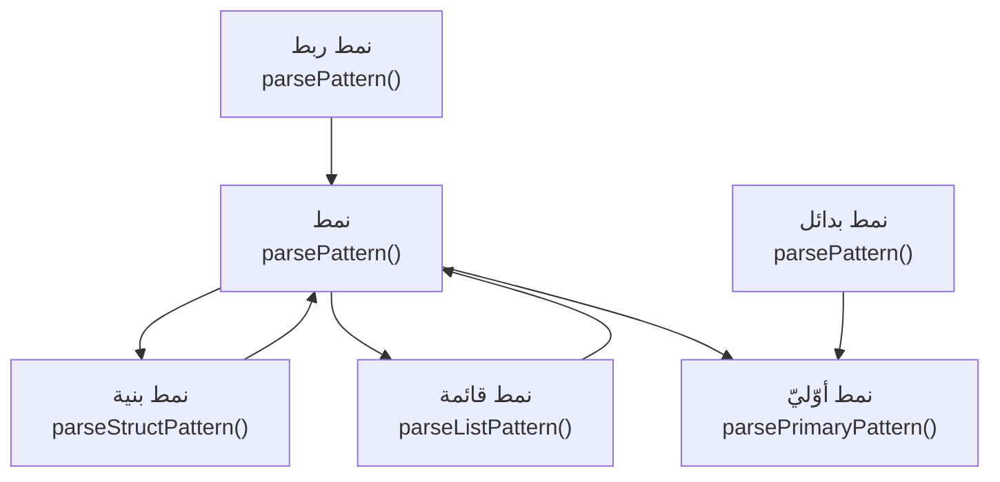

---

<a id="gr.pattern.pattern"></a>
### gr.pattern.pattern — نمط <span dir="ltr">(Pattern)</span>

- **الرقم التسلسليّ:** `ق-065` · **المعرّف الموحَّد:** `gr.pattern.pattern` · **الحالة:** stable · **منذ:** 1.0.0
- **الوصف:** موزّع النمط: شامل «_»، بنية «{}»، قائمة «[]»، أوّليّ، ربط «@»، بدائل «|»

#### 📐 BNF
```bnf
Pattern = '_' | StructPattern | ListPattern
        | PrimaryPattern [ '@' Pattern ] | PrimaryPattern { '|' PrimaryPattern } ;
```

#### 🧩 تفصيل البدائل
**1.** *شامل:* `«_»`
**2.** *بنية / قائمة:* `( struct | list )`
**3.** *أوّليّ مع ربط/بدائل:* `primary [ ( ( «@» pattern ) | ( «|» primary )+ ) ]`

#### 🔻 المسار إلى المحلل (دوال التحليل) ⇒ AST
**دالة (دوال) الدخول:**
1. [`ParserCore::parsePattern`](../../../shared/parser/src/statements/parser_advanced.cpp) — `shared/parser/src/statements/parser_advanced.cpp`
- **عقدة AST المُنتَجة:** `WildcardPattern | StructPattern | ListPattern | BindingPattern | OrPattern`
- **يستدعي دوال:** [`parseStructPattern`](50_patterns.md#gr.pattern.struct)، [`parseListPattern`](50_patterns.md#gr.pattern.list)، [`parsePrimaryPattern`](50_patterns.md#gr.pattern.primary)
- **مُستدعى من:** [`parseMatchStmt`](10_statements.md#gr.stmt.match)، [`parsePattern`](50_patterns.md#gr.pattern.pattern)، [`parseListPattern`](50_patterns.md#gr.pattern.list)، [`parseStructPattern`](50_patterns.md#gr.pattern.struct)، [`parsePattern`](50_patterns.md#gr.pattern.binding)

##### مخطّط مسار الدوال (حتى AST)
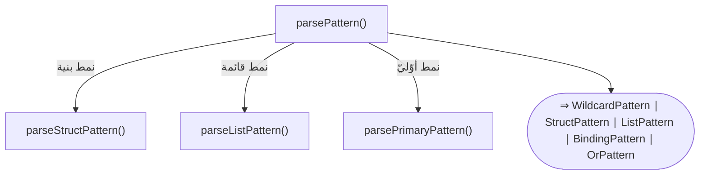

#### 📊 مخطّط البنية النحويّة (Mermaid)
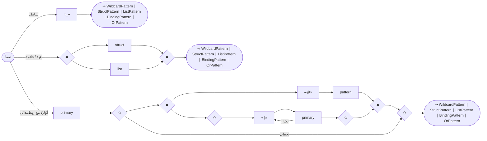

---

<a id="gr.pattern.primary"></a>
### gr.pattern.primary — نمط أوّليّ <span dir="ltr">(PrimaryPattern)</span>

- **الرقم التسلسليّ:** `ق-066` · **المعرّف الموحَّد:** `gr.pattern.primary` · **الحالة:** stable · **منذ:** 1.0.0
- **الوصف:** حرفيّ (يدعم السالب)، نطاق «1..10» ⇒ RangePattern، أو مُعرّف ⇒ VariablePattern (يربط القيمة)

#### 📐 BNF
```bnf
PrimaryPattern = [ '-' ] Number [ '..' [ '-' ] Number ]
               | String | BoolLit | NullLit | Identifier ;
```

#### 🧩 تفصيل البدائل
**1.** *حرفيّ / نطاق رقميّ:* `[ «-» ] ( «NUMBER_INTEGER» | «NUMBER_DOUBLE» ) [ «..» [ «-» ] ( «NUMBER_INTEGER» | «NUMBER_DOUBLE» ) ]`
**2.** *حرفيّ آخر:* `( «STRING_LITERAL» | «صحيح» | «خطأ» | «لاشيء» )`
**3.** *متغيّر (ربط):* `«IDENTIFIER»`

#### 🔻 المسار إلى المحلل (دوال التحليل) ⇒ AST
**دالة (دوال) الدخول:**
1. [`ParserCore::parsePrimaryPattern`](../../../shared/parser/src/statements/parser_advanced.cpp) — `shared/parser/src/statements/parser_advanced.cpp`
- **عقدة AST المُنتَجة:** `LiteralPattern | RangePattern | VariablePattern`
- **مُستدعى من:** [`parsePattern`](50_patterns.md#gr.pattern.pattern)، [`parsePattern`](50_patterns.md#gr.pattern.or)

##### مخطّط مسار الدوال (حتى AST)
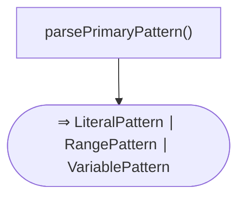

#### 📊 مخطّط البنية النحويّة (Mermaid)
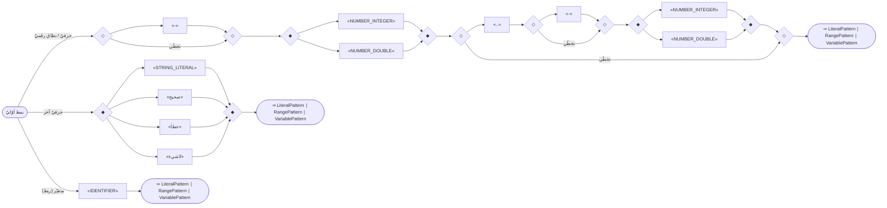

---

<a id="gr.pattern.list"></a>
### gr.pattern.list — نمط قائمة <span dir="ltr">(ListPattern)</span>

- **الرقم التسلسليّ:** `ق-067` · **المعرّف الموحَّد:** `gr.pattern.list` · **الحالة:** stable · **منذ:** 1.0.0
- **الوصف:** تفكيك المصفوفة «[أ، ب]»

#### 📐 BNF
```bnf
ListPattern = '[' [ Pattern { ( ',' | '،' ) Pattern } ] ']' ;
```

#### 🧩 تفصيل البدائل
- `«[» [ pattern { «،» pattern } ] «]»`

#### 🔻 المسار إلى المحلل (دوال التحليل) ⇒ AST
**دالة (دوال) الدخول:**
1. [`ParserCore::parseListPattern`](../../../shared/parser/src/statements/parser_advanced.cpp) — `shared/parser/src/statements/parser_advanced.cpp`
- **عقدة AST المُنتَجة:** `ListPattern`
- **يستدعي دوال:** [`parsePattern`](50_patterns.md#gr.pattern.pattern)
- **مُستدعى من:** [`parsePattern`](50_patterns.md#gr.pattern.pattern)

##### مخطّط مسار الدوال (حتى AST)
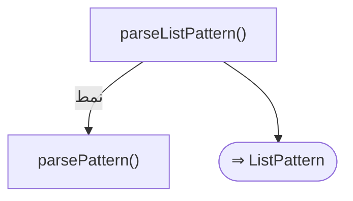

#### 📊 مخطّط البنية النحويّة (Mermaid)
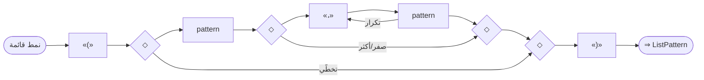

---

<a id="gr.pattern.struct"></a>
### gr.pattern.struct — نمط بنية <span dir="ltr">(StructPattern)</span>

- **الرقم التسلسليّ:** `ق-068` · **المعرّف الموحَّد:** `gr.pattern.struct` · **الحالة:** stable · **منذ:** 1.0.0
- **الوصف:** تفكيك الكائن «{س: س}»

#### 📐 BNF
```bnf
StructPattern = '{' Identifier ':' Pattern { ( ',' | '،' ) Identifier ':' Pattern } '}' ;
```

#### 🧩 تفصيل البدائل
- `«{» ( «IDENTIFIER» «:» pattern )+ «}»`

#### 🔻 المسار إلى المحلل (دوال التحليل) ⇒ AST
**دالة (دوال) الدخول:**
1. [`ParserCore::parseStructPattern`](../../../shared/parser/src/statements/parser_advanced.cpp) — `shared/parser/src/statements/parser_advanced.cpp`
- **عقدة AST المُنتَجة:** `StructPattern`
- **يستدعي دوال:** [`parsePattern`](50_patterns.md#gr.pattern.pattern)
- **مُستدعى من:** [`parsePattern`](50_patterns.md#gr.pattern.pattern)

##### مخطّط مسار الدوال (حتى AST)
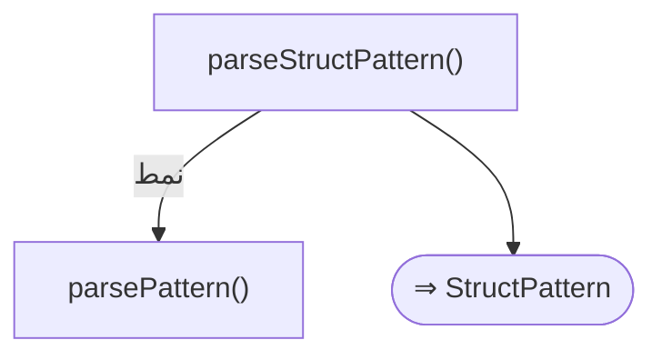

#### 📊 مخطّط البنية النحويّة (Mermaid)
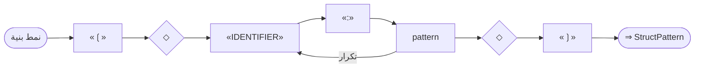

---

<a id="gr.pattern.binding"></a>
### gr.pattern.binding — نمط ربط <span dir="ltr">(BindingPattern)</span>

- **الرقم التسلسليّ:** `ق-069` · **المعرّف الموحَّد:** `gr.pattern.binding` · **الحالة:** stable · **منذ:** 1.0.0
- **الوصف:** «ن @ 1..10» يربط «ن» ويطابق النطاق

#### 📐 BNF
```bnf
BindingPattern = Identifier '@' Pattern ;
```

#### 🧩 تفصيل البدائل
- `«IDENTIFIER» «@» pattern`

#### 🔻 المسار إلى المحلل (دوال التحليل) ⇒ AST
**دالة (دوال) الدخول:**
1. [`ParserCore::parsePattern`](../../../shared/parser/src/statements/parser_advanced.cpp) — `shared/parser/src/statements/parser_advanced.cpp`
- **عقدة AST المُنتَجة:** `BindingPattern`

##### مخطّط مسار الدوال (حتى AST)
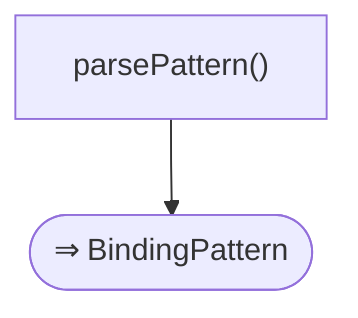

#### 📊 مخطّط البنية النحويّة (Mermaid)
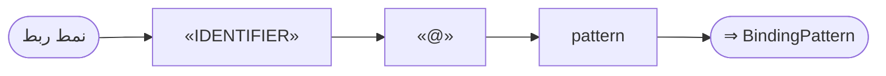

---

<a id="gr.pattern.or"></a>
### gr.pattern.or — نمط بدائل <span dir="ltr">(OrPattern)</span>

- **الرقم التسلسليّ:** `ق-070` · **المعرّف الموحَّد:** `gr.pattern.or` · **الحالة:** stable · **منذ:** 1.0.0
- **الوصف:** بدائل «1 | 2» (تستخدم OP_OR)

#### 📐 BNF
```bnf
OrPattern = PrimaryPattern '|' PrimaryPattern { '|' PrimaryPattern } ;
```

#### 🧩 تفصيل البدائل
- `primary ( «|» primary )+`

#### 🔻 المسار إلى المحلل (دوال التحليل) ⇒ AST
**دالة (دوال) الدخول:**
1. [`ParserCore::parsePattern`](../../../shared/parser/src/statements/parser_advanced.cpp) — `shared/parser/src/statements/parser_advanced.cpp`
- **عقدة AST المُنتَجة:** `OrPattern`
- **يستدعي دوال:** [`parsePrimaryPattern`](50_patterns.md#gr.pattern.primary)
- **روابط المعجم:** عوامل: «||»

##### مخطّط مسار الدوال (حتى AST)
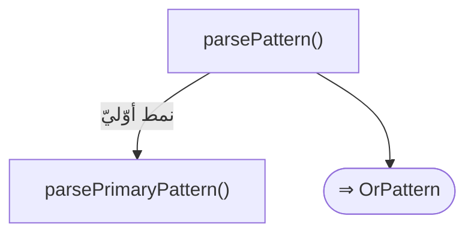

#### 📊 مخطّط البنية النحويّة (Mermaid)
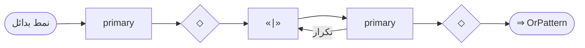

---
