# قواعد المحلل — طبقة البنيات المتقدمة

> ⚠️ **هذا الملف مُولَّد آليًّا** من `language-truth/grammar/*.yaml` عبر
> `scripts/codegen/gen_parser_grammar_docs.py` — **لا تُحرِّره يدويًّا**.
> عدّل YAML المصدر ثم أعد التوليد.


- **الطبقة:** `advanced` · **ملف المصدر:** `language-truth/grammar/60_advanced.yaml`
- **الوصف:** بنيات متقدمة — أنواع/قوالب/عمر/قيود + أنتج/باستخدام/أجّل/أطلق/اختر + استيعاب/ماكرو/اختبار/عقد/FFI/واجهة
- **عدد القواعد:** 28

> **قراءة المخطّطات:** «📊 مخطّط البنية النحويّة» يُظهر تسلسل الرموز (تكرار «تكرار»، اختياري «تخطّي»، بدائل ◆). «مخطّط مسار الدوال» يُظهر دوال المحلل التي تُستدعى حتى بناء عقدة AST.

## نظرة عامّة — مسار دوال الطبقة
> الاستدعاءات الداخليّة بين دوال قواعد هذه الطبقة (الروابط عبر الطبقات مذكورة في كل قاعدة).
```mermaid
flowchart TD
  o1["نوع<br/>parseType()"]
  o2["معاملات عمر<br/>parseLifetimeParams()"]
  o3["تصريح قالب<br/>parseTemplateDecl()"]
  o4["معاملات قالب<br/>parseTemplateParameters()"]
  o5["وسائط قالب<br/>parseTemplateInstantiation()"]
  o6["جملة حيث<br/>parseWhereClause()"]
  o7["جملة أنتج<br/>parseYieldStmt()"]
  o8["جملة باستخدام<br/>parseWithStmt()"]
  o9["جملة أجّل<br/>parseDeferStmt()"]
  o10["جملة أطلق<br/>parseGoStmt()"]
  o11["جملة اختر<br/>parseSelectStmt()"]
  o12["استيعاب قائمة<br/>parseArrayLiteral()"]
  o13["استيعاب مجموعة<br/>parseMapLiteral()"]
  o14["استيعاب قاموس<br/>parseMapLiteral()"]
  o15["تصريح ماكرو<br/>parseMacroDecl()"]
  o16["اختبار خصائص<br/>parseTestDecl()"]
  o17["تعبير انتظر<br/>parsePrimary()"]
  o18["عقد ذكيّ<br/>parseDeclaration()"]
  o19["كتلة خارجي<br/>parseDeclaration()"]
  o20["اتفاقيّة ربط<br/>parseDeclaration()"]
  o21["نوع C<br/>parseType()"]
  o22["تجميع مضمَّن<br/>tryParseDirective()"]
  o23["كتلة لهجة التجميع<br/>parseAsmBlockStmt()"]
  o24["تصريح واجهة<br/>parseUIDeclaration()"]
  o25["تصريح حالة واجهة<br/>parseUIStateDecl()"]
  o26["تعبير عنصر واجهة<br/>parseWidgetExpression()"]
  o27["سلسلة معدّلات<br/>parseModifierChain()"]
  o28["معالج حدث<br/>parseUIEventHandler()"]
  o3 --> o4
  o4 --> o1
  o5 --> o1
  o24 --> o25
  o25 --> o1
  o26 --> o27
```

---

<a id="gr.adv.type"></a>
### gr.adv.type — نوع <span dir="ltr">(Type)</span>

- **الرقم التسلسليّ:** `ق-072` · **المعرّف الموحَّد:** `gr.adv.type` · **الحالة:** stable · **منذ:** 1.0.0
- **الوصف:** أنواع مدمجة كمُعرّفات سياقيّة (رقم/نص/...) لا كلمات محجوزة. اللاحقة «؟» ⇒ اختياريّ. الأنواع العامّة «مصفوفة<T>»/«خريطة<K,V>». «مضاعف» أُزيلت (استخدم «عشري»). ولاحقةٌ لفظيّةٌ مكافئةٌ لـ«؟»: الصفةُ «عدمي» (وتأنيثُها «عدمية») — «رقم عدمي» ⇒ Optional حرفًا بحرف. الصفةُ سياقيّةٌ في المعجم فيلزمها **نظرٌ مسبقٌ باسم**: تُستهلَك متى تلاها IDENTIFIER **في السطرِ نفسِه**، فيبقى «متغير رقم عدمي = 5» تصريحَ متغيّرٍ اسمُه «عدمي» كما كان. 🔑 وقيدُ السطرِ ليس تجميلًا: المُشكِّلُ لا يُصدرُ رمزَ نهايةِ سطر والتصريحُ بلا مُهيّئٍ مقبول، فبدونه يُقرأ «متغير رقم عدمي» ثمّ «س = 5» تصريحًا واحدًا اسمُه «س» ويختفي «عدمي» صامتًا (مقيس؛ الاختبار 073). ⚠️ وحدٌّ مُعلَن: موضعُ الوسيطِ العامّ («مصفوفة<رقم عدمي>») لا يليه اسمٌ فلا تُستهلَك فيه — لم يُقَس ولا يُدَّعى. ملحوظةٌ مقيسة: «؟» **لا** تبلغ تصريحَ المتغيّرِ («متغير نص؟ اسم» ⇒ SYN009)، واللفظُ يبلغه — فالصفةُ أوسعُ موضعًا من الرمز لا مرادفةٌ له في كلِّ موقع.

#### 📐 BNF
```bnf
Type = TypeCore [ '؟' | ( 'عدمي' | 'عدمية' ) Identifier<lookahead, same-line> ] ; TypeCore = 'رقم' | 'عشري' | 'نص' | 'منطقي' | 'فراغ' | 'عدم' | 'أي'
         | ( 'مصفوفة' | 'خريطة' ) [ '<' Type [ ',' Type ] '>' ] | Identifier ;
```

#### 🧩 تفصيل البدائل
- `( «رقم» | «عشري» | «نص» | «منطقي» | «فراغ» | «مصفوفة» | «خريطة» | «IDENTIFIER» ) [ «<» type { ( «،» | «,» ) type } «>» ] [ ( «؟» | «عدمي» ) ]`

#### 🔻 المسار إلى المحلل (دوال التحليل) ⇒ AST
**دالة (دوال) الدخول:**
1. [`ParserCore::parseType`](../../../shared/parser/src/core/parser_helpers.cpp) — `shared/parser/src/core/parser_helpers.cpp`
2. [`ParserCore::matchesNullableAdjective`](../../../shared/parser/src/core/parser_helpers.cpp) — `shared/parser/src/core/parser_helpers.cpp`
3. [`ParserCore::parseTypeCore`](../../../shared/parser/src/core/parser_helpers.cpp) — `shared/parser/src/core/parser_helpers.cpp`
4. [`ParserCore::parseGenericType`](../../../shared/parser/src/core/parser_helpers.cpp) — `shared/parser/src/core/parser_helpers.cpp`
- **عقدة AST المُنتَجة:** `SadTypeKind | SadTypePtr`
- **مُستدعى من:** [`parseEnumDecl`](30_oop.md#gr.oop.enum)، [`parseFieldDeclaration`](30_oop.md#gr.oop.field)، [`parseMethodDeclaration`](30_oop.md#gr.oop.method)، [`parsePropertyDeclaration`](30_oop.md#gr.oop.property)، [`parseType`](60_advanced.md#gr.adv.type)، [`parseTemplateParameters`](60_advanced.md#gr.adv.template_params)، [`parseTemplateInstantiation`](60_advanced.md#gr.adv.template_args)، [`parseUIStateDecl`](60_advanced.md#gr.adv.ui_state)

##### مخطّط مسار الدوال (حتى AST)
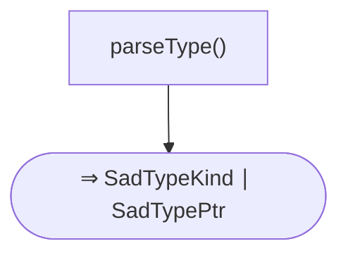

#### 📊 مخطّط البنية النحويّة (Mermaid)
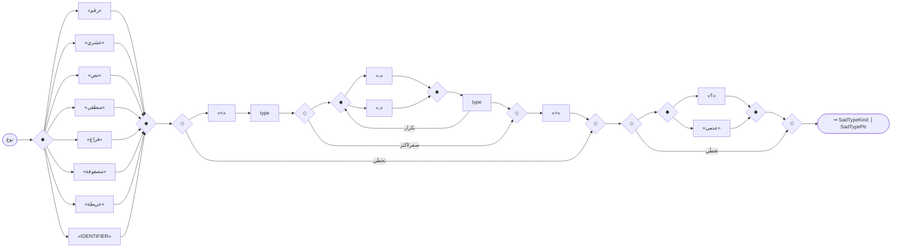

---

<a id="gr.adv.lifetime_params"></a>
### gr.adv.lifetime_params — معاملات عمر <span dir="ltr">(LifetimeParams)</span>

- **الرقم التسلسليّ:** `ق-073` · **المعرّف الموحَّد:** `gr.adv.lifetime_params` · **الحالة:** stable · **منذ:** 1.0.0
- **الوصف:** نظر مسبق يميّز «<'أ>» عن المقارنة/القالب. أمثلة: «دالة أطول<'أ>(...)»، «بنية مرجع<'أ>»

#### 📐 BNF
```bnf
LifetimeParams = '<' Lifetime { ( ',' | '،' ) Lifetime } '>' ;
```

#### 🧩 تفصيل البدائل
- `«<» ( «LIFETIME» )+ «>»`

#### 🔻 المسار إلى المحلل (دوال التحليل) ⇒ AST
**دالة (دوال) الدخول:**
1. [`ParserCore::parseLifetimeParams`](../../../shared/parser/src/declarations/parser_declarations.cpp) — `shared/parser/src/declarations/parser_declarations.cpp`
- **عقدة AST المُنتَجة:** `std::vector<std::string>`
- **مُستدعى من:** [`parseStructDecl`](30_oop.md#gr.oop.struct)

##### مخطّط مسار الدوال (حتى AST)
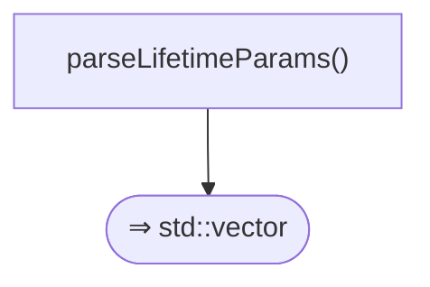

#### 📊 مخطّط البنية النحويّة (Mermaid)
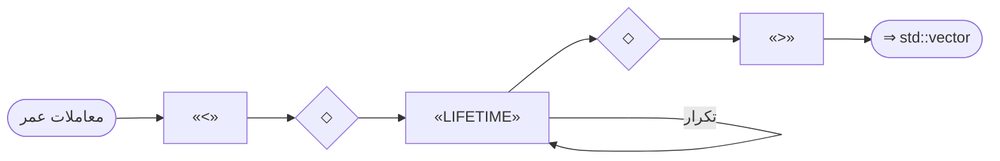

---

<a id="gr.adv.template_decl"></a>
### gr.adv.template_decl — تصريح قالب <span dir="ltr">(TemplateDecl)</span>

- **الرقم التسلسليّ:** `ق-074` · **المعرّف الموحَّد:** `gr.adv.template_decl` · **الحالة:** stable · **منذ:** 1.0.0
- **الوصف:** قالب عامّ لدالة/صنف؛ يجب معامل نوع واحد على الأقل. الاسم يُسجَّل في knownTemplateNames_

#### 📐 BNF
```bnf
TemplateDecl = 'قالب' TemplateParams ( FunctionDecl | ClassDecl ) ;
```

#### 🧩 تفصيل البدائل
- `«قالب» template_params ( function | class )`

#### 🔻 المسار إلى المحلل (دوال التحليل) ⇒ AST
**دالة (دوال) الدخول:**
1. [`ParserCore::parseTemplateDecl`](../../../shared/parser/src/statements/parser_advanced.cpp) — `shared/parser/src/statements/parser_advanced.cpp`
- **عقدة AST المُنتَجة:** `TemplateFunctionDecl | TemplateClassDecl`
- **يستدعي دوال:** [`parseTemplateParameters`](60_advanced.md#gr.adv.template_params)، [`parseFunctionDecl`](20_declarations.md#gr.decl.function)، [`parseClassDecl`](30_oop.md#gr.oop.class)

##### مخطّط مسار الدوال (حتى AST)
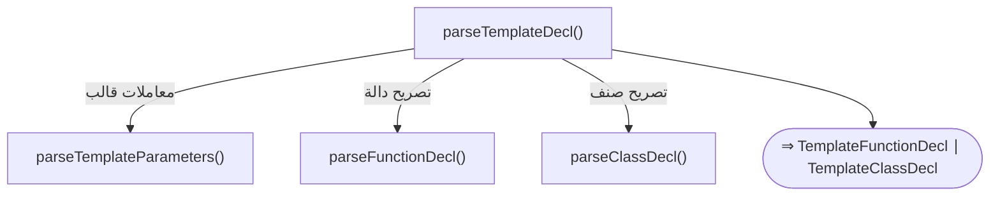

#### 📊 مخطّط البنية النحويّة (Mermaid)
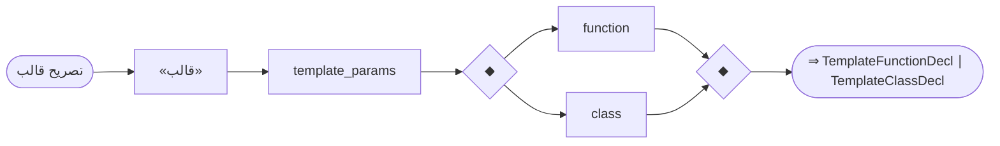

---

<a id="gr.adv.template_params"></a>
### gr.adv.template_params — معاملات قالب <span dir="ltr">(TemplateParams)</span>

- **الرقم التسلسليّ:** `ق-075` · **المعرّف الموحَّد:** `gr.adv.template_params` · **الحالة:** stable · **منذ:** 1.0.0
- **الوصف:** يدعم const-generics «ثابت رقم N = 4» والقيود المتعدّدة «ت: قيد1 + قيد2»

#### 📐 BNF
```bnf
TemplateParams = '<' TParam { ( ',' | '،' ) TParam } '>' ; TParam = 'ثابت' Type Identifier [ '=' Expression ] | 'نوع' Identifier [ ':' Constraint { '+' Constraint } ] ;
```

#### 🧩 تفصيل البدائل
- `«<» ( ( ( «ثابت» type «IDENTIFIER» ) | ( «نوع» «IDENTIFIER» ) ) )+ «>»`

#### 🔻 المسار إلى المحلل (دوال التحليل) ⇒ AST
**دالة (دوال) الدخول:**
1. [`ParserCore::parseTemplateParameters`](../../../shared/parser/src/statements/parser_advanced.cpp) — `shared/parser/src/statements/parser_advanced.cpp`
- **عقدة AST المُنتَجة:** `std::vector<TypeParameter>`
- **يستدعي دوال:** [`parseType`](60_advanced.md#gr.adv.type)
- **مُستدعى من:** [`parseTemplateDecl`](60_advanced.md#gr.adv.template_decl)
- **روابط المعجم:** كلمات: «ثابت»

##### مخطّط مسار الدوال (حتى AST)
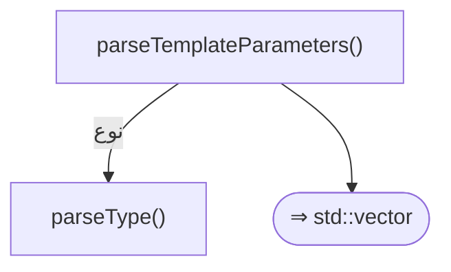

#### 📊 مخطّط البنية النحويّة (Mermaid)
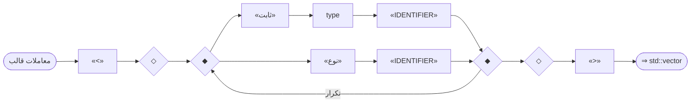

---

<a id="gr.adv.template_args"></a>
### gr.adv.template_args — وسائط قالب <span dir="ltr">(TemplateArgs)</span>

- **الرقم التسلسليّ:** `ق-076` · **المعرّف الموحَّد:** `gr.adv.template_args` · **الحالة:** stable · **منذ:** 1.0.0
- **الوصف:** وسائط أنواع/قيم بين «<...>» عند تخصيص قالب؛ تُستهلَك من gr.expr.primary

#### 📐 BNF
```bnf
TemplateArgs = ( Type | Expression ) { ',' ( Type | Expression ) } ;
```

#### 🧩 تفصيل البدائل
- `( type | expression ) { ( «،» | «,» ) ( type | expression ) }`

#### 🔻 المسار إلى المحلل (دوال التحليل) ⇒ AST
**دالة (دوال) الدخول:**
1. [`ParserCore::parseTemplateInstantiation`](../../../shared/parser/src/statements/parser_advanced.cpp) — `shared/parser/src/statements/parser_advanced.cpp`
- **عقدة AST المُنتَجة:** `TemplateInstantiation`
- **يستدعي دوال:** [`parseType`](60_advanced.md#gr.adv.type)، [`parseExpression`](40_expressions.md#gr.expr.expression)
- **مُستدعى من:** [`parsePrimary`](40_expressions.md#gr.expr.primary)

##### مخطّط مسار الدوال (حتى AST)
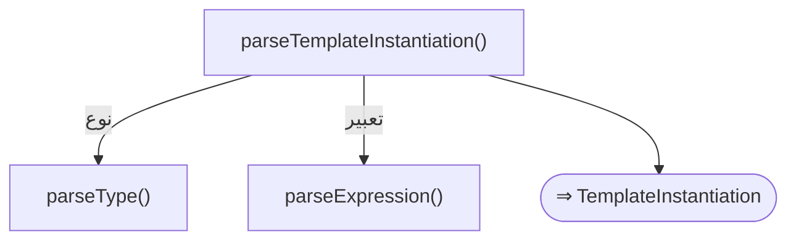

#### 📊 مخطّط البنية النحويّة (Mermaid)
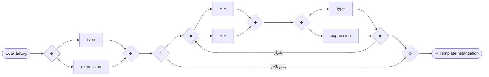

---

<a id="gr.adv.where_clause"></a>
### gr.adv.where_clause — جملة حيث <span dir="ltr">(WhereClause)</span>

- **الرقم التسلسليّ:** `ق-077` · **المعرّف الموحَّد:** `gr.adv.where_clause` · **الحالة:** stable · **منذ:** 1.0.0
- **الوصف:** قيود القوالب المتقدمة؛ يدعم الأنواع المرتبطة «ت.عنصر: قابل_للمقارنة» والقيود المتعدّدة بـ«+»

#### 📐 BNF
```bnf
WhereClause = 'حيث' ConstraintItem { ( ',' | '،' ) ConstraintItem } ;
```

#### 🧩 تفصيل البدائل
- `«حيث» ( «IDENTIFIER» «:» «IDENTIFIER» )+`

#### 🔻 المسار إلى المحلل (دوال التحليل) ⇒ AST
**دالة (دوال) الدخول:**
1. [`ParserCore::parseWhereClause`](../../../shared/parser/src/statements/parser_advanced.cpp) — `shared/parser/src/statements/parser_advanced.cpp`
- **عقدة AST المُنتَجة:** `WhereClause`

##### مخطّط مسار الدوال (حتى AST)
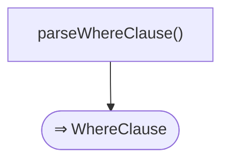

#### 📊 مخطّط البنية النحويّة (Mermaid)
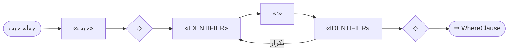

---

<a id="gr.adv.yield"></a>
### gr.adv.yield — جملة أنتج <span dir="ltr">(YieldStatement)</span>

- **الرقم التسلسليّ:** `ق-078` · **المعرّف الموحَّد:** `gr.adv.yield` · **الحالة:** stable · **منذ:** 1.0.0
- **الوصف:** إنتاج قيمة من مولّد؛ «from» (مُعرّف) لتفويض التوليد. «اعطِ» أُزيلت

#### 📐 BNF
```bnf
YieldStatement = 'أنتج' [ 'from' ] [ Expression ] ;
```

#### 🧩 تفصيل البدائل
- `«أنتج» [ «from» ] [ expression ]`

#### 🔻 المسار إلى المحلل (دوال التحليل) ⇒ AST
**دالة (دوال) الدخول:**
1. [`ParserCore::parseYieldStmt`](../../../shared/parser/src/statements/parser_statements.cpp) — `shared/parser/src/statements/parser_statements.cpp`
- **عقدة AST المُنتَجة:** `YieldStmt`
- **يستدعي دوال:** [`parseExpression`](40_expressions.md#gr.expr.expression)

##### مخطّط مسار الدوال (حتى AST)
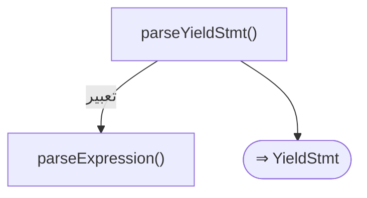

#### 📊 مخطّط البنية النحويّة (Mermaid)
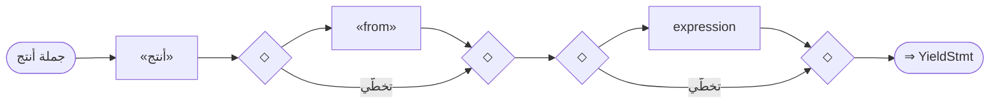

---

<a id="gr.adv.with"></a>
### gr.adv.with — جملة باستخدام <span dir="ltr">(WithStatement)</span>

- **الرقم التسلسليّ:** `ق-079` · **المعرّف الموحَّد:** `gr.adv.with` · **الحالة:** stable · **منذ:** 1.0.0
- **الوصف:** مدير سياق؛ الاسم المستعار بعد «كـ» اختياريّ. «نهاية_استخدام» أُزيلت

#### 📐 BNF
```bnf
WithStatement = 'باستخدام' Expression [ 'كـ' Identifier ] { Statement } 'نهاية' ;
```

#### 🧩 تفصيل البدائل
- `«باستخدام» expression [ «كـ» «IDENTIFIER» ] { statement } «نهاية»`

#### 🔻 المسار إلى المحلل (دوال التحليل) ⇒ AST
**دالة (دوال) الدخول:**
1. [`ParserCore::parseWithStmt`](../../../shared/parser/src/statements/parser_statements.cpp) — `shared/parser/src/statements/parser_statements.cpp`
- **عقدة AST المُنتَجة:** `WithStmt`
- **يستدعي دوال:** [`parseExpression`](40_expressions.md#gr.expr.expression)، [`parseStatement`](00_program.md#gr.program.statement)
- **روابط المعجم:** كلمات: «كـ»، «نهاية»

##### مخطّط مسار الدوال (حتى AST)
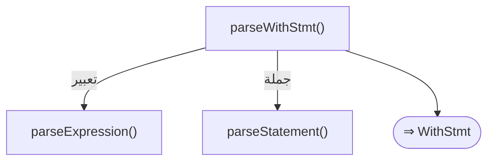

#### 📊 مخطّط البنية النحويّة (Mermaid)
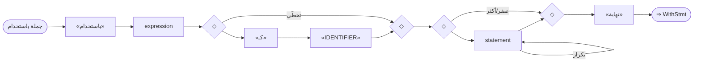

---

<a id="gr.adv.defer"></a>
### gr.adv.defer — جملة أجّل <span dir="ltr">(DeferStatement)</span>

- **الرقم التسلسليّ:** `ق-080` · **المعرّف الموحَّد:** `gr.adv.defer` · **الحالة:** stable · **منذ:** 1.0.0
- **الوصف:** تنظيف مضمون عند الخروج (LIFO)؛ سياقيّة (تُستثنى مع =/+=/.). جملة واحدة أو كتلة

#### 📐 BNF
```bnf
DeferStatement = 'أجّل' ( Statement | { Statement } 'نهاية' ) ;
```

#### 🧩 تفصيل البدائل
- `«أجّل» ( statement | ( { statement } «نهاية» ) )`

#### 🔻 المسار إلى المحلل (دوال التحليل) ⇒ AST
**دالة (دوال) الدخول:**
1. [`ParserCore::parseDeferStmt`](../../../shared/parser/src/statements/parser_statements.cpp) — `shared/parser/src/statements/parser_statements.cpp`
- **عقدة AST المُنتَجة:** `DeferStmt`
- **يستدعي دوال:** [`parseStatement`](00_program.md#gr.program.statement)

##### مخطّط مسار الدوال (حتى AST)
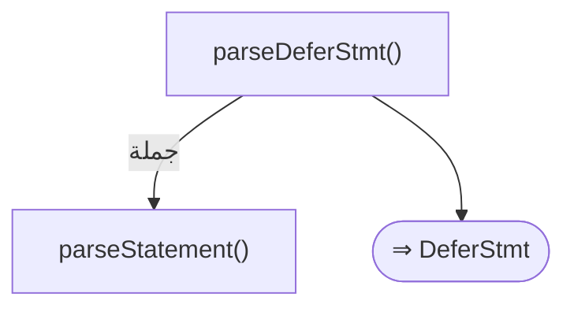

#### 📊 مخطّط البنية النحويّة (Mermaid)
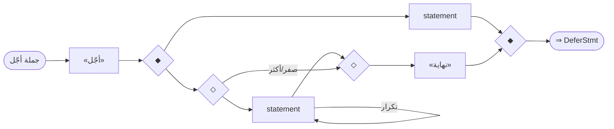

---

<a id="gr.adv.go"></a>
### gr.adv.go — جملة أطلق <span dir="ltr">(GoStatement)</span>

- **الرقم التسلسليّ:** `ق-081` · **المعرّف الموحَّد:** `gr.adv.go` · **الحالة:** stable · **منذ:** 1.0.0
- **الوصف:** إطلاق goroutine؛ سطر واحد (استدعاء/لامدا) أو كتلة (تدعم متغير/ثابت). التمييز بفرق السطر

#### 📐 BNF
```bnf
GoStatement = 'أطلق' ( Expression | { Declaration } 'نهاية' ) ;
```

#### 🧩 تفصيل البدائل
- `«أطلق» ( expression | ( { declaration } «نهاية» ) )`

#### 🔻 المسار إلى المحلل (دوال التحليل) ⇒ AST
**دالة (دوال) الدخول:**
1. [`ParserCore::parseGoStmt`](../../../shared/parser/src/statements/parser_statements.cpp) — `shared/parser/src/statements/parser_statements.cpp`
- **عقدة AST المُنتَجة:** `GoStmt`
- **يستدعي دوال:** [`parseExpression`](40_expressions.md#gr.expr.expression)، [`parseDeclaration`](00_program.md#gr.program.declaration)

##### مخطّط مسار الدوال (حتى AST)
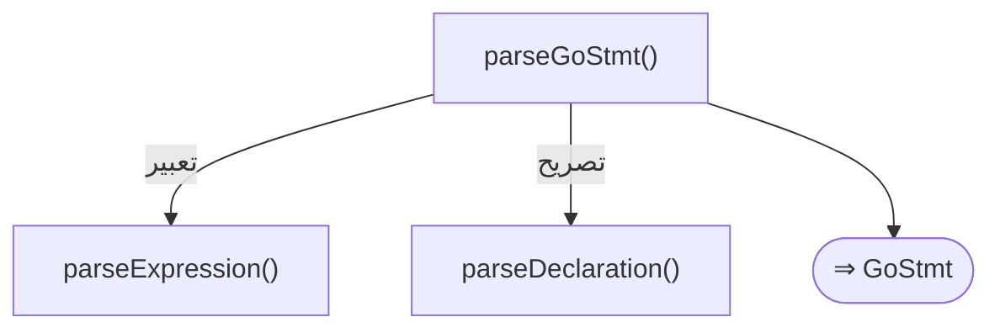

#### 📊 مخطّط البنية النحويّة (Mermaid)
```mermaid
flowchart LR
  n1(["جملة أطلق"])
  n2["«أطلق»"]
  n3{"◆"}
  n4{"◆"}
  n5["expression"]
  n3 --> n5
  n5 --> n4
  n6{"◇"}
  n7{"◇"}
  n8["declaration"]
  n6 --> n8
  n8 --> n7
  n8 -- "تكرار" --> n8
  n6 -- "صفر/أكثر" --> n7
  n9["«نهاية»"]
  n7 --> n9
  n3 --> n6
  n9 --> n4
  n2 --> n3
  n1 --> n2
  n10(["⇒ GoStmt"])
  n4 --> n10
```

---

<a id="gr.adv.select"></a>
### gr.adv.select — جملة اختر <span dir="ltr">(SelectStatement)</span>

- **الرقم التسلسليّ:** `ق-082` · **المعرّف الموحَّد:** `gr.adv.select` · **الحالة:** stable · **منذ:** 1.0.0
- **الوصف:** اختيار من قنوات متعددة؛ «:» إلزاميّة بعد القناة و«افتراضي»

#### 📐 BNF
```bnf
SelectStatement = 'اختر' { 'عندما' Expression ':' { Statement } } [ 'افتراضي' ':' { Statement } ] 'نهاية' ;
```

#### 🧩 تفصيل البدائل
- `«اختر» { «عندما» expression «:» { statement } } [ «افتراضي» «:» { statement } ] «نهاية»`

#### 🔻 المسار إلى المحلل (دوال التحليل) ⇒ AST
**دالة (دوال) الدخول:**
1. [`ParserCore::parseSelectStmt`](../../../shared/parser/src/statements/parser_statements.cpp) — `shared/parser/src/statements/parser_statements.cpp`
- **عقدة AST المُنتَجة:** `SelectStmt`
- **يستدعي دوال:** [`parseExpression`](40_expressions.md#gr.expr.expression)، [`parseStatement`](00_program.md#gr.program.statement)
- **روابط المعجم:** كلمات: «عندما»، «افتراضي»، «نهاية»

##### مخطّط مسار الدوال (حتى AST)
```mermaid
flowchart TD
  f1["parseSelectStmt()"]
  f2["parseExpression()"]
  f1 -- "تعبير" --> f2
  f3["parseStatement()"]
  f1 -- "جملة" --> f3
  f4(["⇒ SelectStmt"])
  f1 --> f4
```

#### 📊 مخطّط البنية النحويّة (Mermaid)
```mermaid
flowchart LR
  n1(["جملة اختر"])
  n2["«اختر»"]
  n3{"◇"}
  n4{"◇"}
  n5["«عندما»"]
  n6["expression"]
  n5 --> n6
  n7["«:»"]
  n6 --> n7
  n8{"◇"}
  n9{"◇"}
  n10["statement"]
  n8 --> n10
  n10 --> n9
  n10 -- "تكرار" --> n10
  n8 -- "صفر/أكثر" --> n9
  n7 --> n8
  n3 --> n5
  n9 --> n4
  n9 -- "تكرار" --> n5
  n3 -- "صفر/أكثر" --> n4
  n2 --> n3
  n11{"◇"}
  n12{"◇"}
  n13["«افتراضي»"]
  n14["«:»"]
  n13 --> n14
  n15{"◇"}
  n16{"◇"}
  n17["statement"]
  n15 --> n17
  n17 --> n16
  n17 -- "تكرار" --> n17
  n15 -- "صفر/أكثر" --> n16
  n14 --> n15
  n11 --> n13
  n16 --> n12
  n11 -- "تخطّي" --> n12
  n4 --> n11
  n18["«نهاية»"]
  n12 --> n18
  n1 --> n2
  n19(["⇒ SelectStmt"])
  n18 --> n19
```

---

<a id="gr.adv.list_comprehension"></a>
### gr.adv.list_comprehension — استيعاب قائمة <span dir="ltr">(ListComprehension)</span>

- **الرقم التسلسليّ:** `ق-083` · **المعرّف الموحَّد:** `gr.adv.list_comprehension` · **الحالة:** stable · **منذ:** 1.0.0
- **الوصف:** «[لكل س في مصدر [إذا شرط] أنتج تعبير]» داخل «[]»؛ رأس الحلقة أوّلًا ثم «أنتج» تفصله عن تعبير الناتج (ترتيب عربيّ)؛ الشرط اختياريّ؛ يدعم فكّ الزوج «لكل مفتاح، قيمة في خريطة» (متغيّر القيمة اختياريّ، للخرائط)

#### 📐 BNF
```bnf
ListComprehension = 'لكل' Identifier [ '،' Identifier ] 'في' Expression [ 'إذا' Expression ] 'أنتج' Expression ;
```

#### 🧩 تفصيل البدائل
- `«لكل» «IDENTIFIER» [ ( «،» | «,» ) «IDENTIFIER» ] «في» expression [ «إذا» expression ] «أنتج» expression`

#### 🔻 المسار إلى المحلل (دوال التحليل) ⇒ AST
**دالة (دوال) الدخول:**
1. [`ParserCore::parseArrayLiteral`](../../../shared/parser/src/statements/parser_advanced.cpp) — `shared/parser/src/statements/parser_advanced.cpp`
- **عقدة AST المُنتَجة:** `ListComprehensionExpr`
- **يستدعي دوال:** [`parseExpression`](40_expressions.md#gr.expr.expression)
- **مُستدعى من:** [`parseArrayLiteral`](40_expressions.md#gr.expr.array_literal)
- **روابط المعجم:** كلمات: «لكل»، «في»، «إذا»، «أنتج»

##### مخطّط مسار الدوال (حتى AST)
```mermaid
flowchart TD
  f1["parseArrayLiteral()"]
  f2["parseExpression()"]
  f1 -- "تعبير" --> f2
  f3(["⇒ ListComprehensionExpr"])
  f1 --> f3
```

#### 📊 مخطّط البنية النحويّة (Mermaid)
```mermaid
flowchart LR
  n1(["استيعاب قائمة"])
  n2["«لكل»"]
  n3["«IDENTIFIER»"]
  n2 --> n3
  n4{"◇"}
  n5{"◇"}
  n6{"◆"}
  n7{"◆"}
  n8["«،»"]
  n6 --> n8
  n8 --> n7
  n9["«,»"]
  n6 --> n9
  n9 --> n7
  n10["«IDENTIFIER»"]
  n7 --> n10
  n4 --> n6
  n10 --> n5
  n4 -- "تخطّي" --> n5
  n3 --> n4
  n11["«في»"]
  n5 --> n11
  n12["expression"]
  n11 --> n12
  n13{"◇"}
  n14{"◇"}
  n15["«إذا»"]
  n16["expression"]
  n15 --> n16
  n13 --> n15
  n16 --> n14
  n13 -- "تخطّي" --> n14
  n12 --> n13
  n17["«أنتج»"]
  n14 --> n17
  n18["expression"]
  n17 --> n18
  n1 --> n2
  n19(["⇒ ListComprehensionExpr"])
  n18 --> n19
```

#### مثال
```sad
متغير ز = [لكل س في [1، 2، 3] أنتج س * 2]
```

---

<a id="gr.adv.set_comprehension"></a>
### gr.adv.set_comprehension — استيعاب مجموعة <span dir="ltr">(SetComprehension)</span>

- **الرقم التسلسليّ:** `ق-084` · **المعرّف الموحَّد:** `gr.adv.set_comprehension` · **الحالة:** stable · **منذ:** 1.0.0
- **الوصف:** «{لكل س في مصدر [إذا شرط] أنتج تعبير}» داخل «{}» بلا «:» بعد الناتج ⇒ مجموعة؛ الشرط اختياريّ؛ يدعم فكّ الزوج «لكل مفتاح، قيمة في خريطة» (متغيّر القيمة اختياريّ، للخرائط)

#### 📐 BNF
```bnf
SetComprehension = 'لكل' Identifier [ '،' Identifier ] 'في' Expression [ 'إذا' Expression ] 'أنتج' Expression ;
```

#### 🧩 تفصيل البدائل
- `«لكل» «IDENTIFIER» [ ( «،» | «,» ) «IDENTIFIER» ] «في» expression [ «إذا» expression ] «أنتج» expression`

#### 🔻 المسار إلى المحلل (دوال التحليل) ⇒ AST
**دالة (دوال) الدخول:**
1. [`ParserCore::parseMapLiteral`](../../../shared/parser/src/statements/parser_advanced.cpp) — `shared/parser/src/statements/parser_advanced.cpp`
- **عقدة AST المُنتَجة:** `SetComprehensionExpr`
- **يستدعي دوال:** [`parseExpression`](40_expressions.md#gr.expr.expression)
- **مُستدعى من:** [`parseMapLiteral`](40_expressions.md#gr.expr.map_literal)
- **روابط المعجم:** كلمات: «لكل»، «في»، «إذا»، «أنتج»

##### مخطّط مسار الدوال (حتى AST)
```mermaid
flowchart TD
  f1["parseMapLiteral()"]
  f2["parseExpression()"]
  f1 -- "تعبير" --> f2
  f3(["⇒ SetComprehensionExpr"])
  f1 --> f3
```

#### 📊 مخطّط البنية النحويّة (Mermaid)
```mermaid
flowchart LR
  n1(["استيعاب مجموعة"])
  n2["«لكل»"]
  n3["«IDENTIFIER»"]
  n2 --> n3
  n4{"◇"}
  n5{"◇"}
  n6{"◆"}
  n7{"◆"}
  n8["«،»"]
  n6 --> n8
  n8 --> n7
  n9["«,»"]
  n6 --> n9
  n9 --> n7
  n10["«IDENTIFIER»"]
  n7 --> n10
  n4 --> n6
  n10 --> n5
  n4 -- "تخطّي" --> n5
  n3 --> n4
  n11["«في»"]
  n5 --> n11
  n12["expression"]
  n11 --> n12
  n13{"◇"}
  n14{"◇"}
  n15["«إذا»"]
  n16["expression"]
  n15 --> n16
  n13 --> n15
  n16 --> n14
  n13 -- "تخطّي" --> n14
  n12 --> n13
  n17["«أنتج»"]
  n14 --> n17
  n18["expression"]
  n17 --> n18
  n1 --> n2
  n19(["⇒ SetComprehensionExpr"])
  n18 --> n19
```

#### مثال
```sad
متغير م = {لكل س في [1، 2، 2، 3] أنتج س}
```

---

<a id="gr.adv.dict_comprehension"></a>
### gr.adv.dict_comprehension — استيعاب قاموس <span dir="ltr">(DictComprehension)</span>

- **الرقم التسلسليّ:** `ق-085` · **المعرّف الموحَّد:** `gr.adv.dict_comprehension` · **الحالة:** stable · **منذ:** 1.0.0
- **الوصف:** «{لكل س في مصدر [إذا شرط] أنتج مفتاح: قيمة}» داخل «{}» مع «:» بعد الناتج ⇒ قاموس؛ الشرط اختياريّ؛ يدعم فكّ الزوج «لكل مفتاح، قيمة في خريطة» (متغيّر القيمة اختياريّ، للخرائط)

#### 📐 BNF
```bnf
DictComprehension = 'لكل' Identifier [ '،' Identifier ] 'في' Expression [ 'إذا' Expression ] 'أنتج' Expression ( ':' | '=' ) Expression ;
```

#### 🧩 تفصيل البدائل
- `«لكل» «IDENTIFIER» [ ( «،» | «,» ) «IDENTIFIER» ] «في» expression [ «إذا» expression ] «أنتج» expression ( «:» | «=» ) expression`

#### 🔻 المسار إلى المحلل (دوال التحليل) ⇒ AST
**دالة (دوال) الدخول:**
1. [`ParserCore::parseMapLiteral`](../../../shared/parser/src/statements/parser_advanced.cpp) — `shared/parser/src/statements/parser_advanced.cpp`
- **عقدة AST المُنتَجة:** `DictComprehensionExpr`
- **يستدعي دوال:** [`parseExpression`](40_expressions.md#gr.expr.expression)
- **مُستدعى من:** [`parseMapLiteral`](40_expressions.md#gr.expr.map_literal)
- **روابط المعجم:** كلمات: «لكل»، «في»، «إذا»، «أنتج»

##### مخطّط مسار الدوال (حتى AST)
```mermaid
flowchart TD
  f1["parseMapLiteral()"]
  f2["parseExpression()"]
  f1 -- "تعبير" --> f2
  f3(["⇒ DictComprehensionExpr"])
  f1 --> f3
```

#### 📊 مخطّط البنية النحويّة (Mermaid)
```mermaid
flowchart LR
  n1(["استيعاب قاموس"])
  n2["«لكل»"]
  n3["«IDENTIFIER»"]
  n2 --> n3
  n4{"◇"}
  n5{"◇"}
  n6{"◆"}
  n7{"◆"}
  n8["«،»"]
  n6 --> n8
  n8 --> n7
  n9["«,»"]
  n6 --> n9
  n9 --> n7
  n10["«IDENTIFIER»"]
  n7 --> n10
  n4 --> n6
  n10 --> n5
  n4 -- "تخطّي" --> n5
  n3 --> n4
  n11["«في»"]
  n5 --> n11
  n12["expression"]
  n11 --> n12
  n13{"◇"}
  n14{"◇"}
  n15["«إذا»"]
  n16["expression"]
  n15 --> n16
  n13 --> n15
  n16 --> n14
  n13 -- "تخطّي" --> n14
  n12 --> n13
  n17["«أنتج»"]
  n14 --> n17
  n18["expression"]
  n17 --> n18
  n19{"◆"}
  n20{"◆"}
  n21["«:»"]
  n19 --> n21
  n21 --> n20
  n22["«=»"]
  n19 --> n22
  n22 --> n20
  n18 --> n19
  n23["expression"]
  n20 --> n23
  n1 --> n2
  n24(["⇒ DictComprehensionExpr"])
  n23 --> n24
```

#### مثال
```sad
متغير ق = {لكل س في [1، 2، 3] أنتج س: س * س}
```

---

<a id="gr.adv.macro"></a>
### gr.adv.macro — تصريح ماكرو <span dir="ltr">(MacroDecl)</span>

- **الرقم التسلسليّ:** `ق-086` · **المعرّف الموحَّد:** `gr.adv.macro` · **الحالة:** stable · **منذ:** 1.0.0
- **الوصف:** تعريف ماكرو يُستدعى بعلامة تعجّب «اسم!(...)»؛ يدعم معاملًا متغيّرًا «...رسائل». «ماكرو» سياقيّة

#### 📐 BNF
```bnf
MacroDecl = 'ماكرو' Identifier '(' [ Parameters [ '...' Identifier ] ] ')' { Statement } 'نهاية' ;
```

#### 🧩 تفصيل البدائل
- `«ماكرو» «IDENTIFIER» «(» parameters «)» { statement } «نهاية»`

#### 🔻 المسار إلى المحلل (دوال التحليل) ⇒ AST
**دالة (دوال) الدخول:**
1. [`ParserCore::parseMacroDecl`](../../../shared/parser/src/declarations/parser_declarations.cpp) — `shared/parser/src/declarations/parser_declarations.cpp`
- **عقدة AST المُنتَجة:** `MacroDecl`
- **يستدعي دوال:** [`parseFunctionDecl`](20_declarations.md#gr.decl.parameters)، [`parseStatement`](00_program.md#gr.program.statement)
- **روابط المعجم:** كلمات: «نهاية»

##### مخطّط مسار الدوال (حتى AST)
```mermaid
flowchart TD
  f1["parseMacroDecl()"]
  f2["parseFunctionDecl()"]
  f1 -- "المعاملات" --> f2
  f3["parseStatement()"]
  f1 -- "جملة" --> f3
  f4(["⇒ MacroDecl"])
  f1 --> f4
```

#### 📊 مخطّط البنية النحويّة (Mermaid)
```mermaid
flowchart LR
  n1(["تصريح ماكرو"])
  n2["«ماكرو»"]
  n3["«IDENTIFIER»"]
  n2 --> n3
  n4["«(»"]
  n3 --> n4
  n5["parameters"]
  n4 --> n5
  n6["«)»"]
  n5 --> n6
  n7{"◇"}
  n8{"◇"}
  n9["statement"]
  n7 --> n9
  n9 --> n8
  n9 -- "تكرار" --> n9
  n7 -- "صفر/أكثر" --> n8
  n6 --> n7
  n10["«نهاية»"]
  n8 --> n10
  n1 --> n2
  n11(["⇒ MacroDecl"])
  n10 --> n11
```

---

<a id="gr.adv.property_test"></a>
### gr.adv.property_test — اختبار خصائص <span dir="ltr">(TestDecl)</span>

- **الرقم التسلسليّ:** `ق-087` · **المعرّف الموحَّد:** `gr.adv.property_test` · **الحالة:** stable · **منذ:** 1.0.0
- **الوصف:** «اختبر("اسم") تكرارات N بذرة S ... نهاية»؛ الأقواس حول الاسم إلزاميّة. «اختبر» سياقيّة

#### 📐 BNF
```bnf
TestDecl = 'اختبر' '(' STRING ')' [ 'تكرارات' Number ] [ 'بذرة' Number ] { Statement } 'نهاية' ;
```

#### 🧩 تفصيل البدائل
- `«اختبر» «(» «STRING_LITERAL» «)» [ «تكرارات» «NUMBER_INTEGER» ] [ «بذرة» «NUMBER_INTEGER» ] { statement } «نهاية»`

#### 🔻 المسار إلى المحلل (دوال التحليل) ⇒ AST
**دالة (دوال) الدخول:**
1. [`ParserCore::parseTestDecl`](../../../shared/parser/src/declarations/parser_declarations.cpp) — `shared/parser/src/declarations/parser_declarations.cpp`
- **عقدة AST المُنتَجة:** `TestDecl`
- **يستدعي دوال:** [`parseStatement`](00_program.md#gr.program.statement)
- **روابط المعجم:** كلمات: «نهاية»

##### مخطّط مسار الدوال (حتى AST)
```mermaid
flowchart TD
  f1["parseTestDecl()"]
  f2["parseStatement()"]
  f1 -- "جملة" --> f2
  f3(["⇒ TestDecl"])
  f1 --> f3
```

#### 📊 مخطّط البنية النحويّة (Mermaid)
```mermaid
flowchart LR
  n1(["اختبار خصائص"])
  n2["«اختبر»"]
  n3["«(»"]
  n2 --> n3
  n4["«STRING_LITERAL»"]
  n3 --> n4
  n5["«)»"]
  n4 --> n5
  n6{"◇"}
  n7{"◇"}
  n8["«تكرارات»"]
  n9["«NUMBER_INTEGER»"]
  n8 --> n9
  n6 --> n8
  n9 --> n7
  n6 -- "تخطّي" --> n7
  n5 --> n6
  n10{"◇"}
  n11{"◇"}
  n12["«بذرة»"]
  n13["«NUMBER_INTEGER»"]
  n12 --> n13
  n10 --> n12
  n13 --> n11
  n10 -- "تخطّي" --> n11
  n7 --> n10
  n14{"◇"}
  n15{"◇"}
  n16["statement"]
  n14 --> n16
  n16 --> n15
  n16 -- "تكرار" --> n16
  n14 -- "صفر/أكثر" --> n15
  n11 --> n14
  n17["«نهاية»"]
  n15 --> n17
  n1 --> n2
  n18(["⇒ TestDecl"])
  n17 --> n18
```

---

<a id="gr.adv.await"></a>
### gr.adv.await — تعبير انتظر <span dir="ltr">(AwaitExpr)</span>

- **الرقم التسلسليّ:** `ق-088` · **المعرّف الموحَّد:** `gr.adv.await` · **الحالة:** stable · **منذ:** 1.0.0
- **الوصف:** تعبير انتظار لقيمة غير متزامنة؛ «انتظر» كلمة سياقيّة تُحلَّل في الأوّليّ (gr.expr.primary)

#### 📐 BNF
```bnf
AwaitExpr = 'انتظر' Expression ;
```

#### 🧩 تفصيل البدائل
- `«انتظر» expression`

#### 🔻 المسار إلى المحلل (دوال التحليل) ⇒ AST
**دالة (دوال) الدخول:**
1. [`ParserCore::parsePrimary`](../../../shared/parser/src/core/parser_expressions.cpp) — `shared/parser/src/core/parser_expressions.cpp`
- **عقدة AST المُنتَجة:** `AwaitExpr`
- **يستدعي دوال:** [`parseExpression`](40_expressions.md#gr.expr.expression)

##### مخطّط مسار الدوال (حتى AST)
```mermaid
flowchart TD
  f1["parsePrimary()"]
  f2["parseExpression()"]
  f1 -- "تعبير" --> f2
  f3(["⇒ AwaitExpr"])
  f1 --> f3
```

#### 📊 مخطّط البنية النحويّة (Mermaid)
```mermaid
flowchart LR
  n1(["تعبير انتظر"])
  n2["«انتظر»"]
  n3["expression"]
  n2 --> n3
  n1 --> n2
  n4(["⇒ AwaitExpr"])
  n3 --> n4
```

---

<a id="gr.adv.contract"></a>
### gr.adv.contract — عقد ذكيّ <span dir="ltr">(ContractDecl)</span>

- **الرقم التسلسليّ:** `ق-089` · **المعرّف الموحَّد:** `gr.adv.contract` · **الحالة:** stable · **منذ:** 1.0.0
- **الوصف:** عقد ذكيّ بكلمة «عقد» — يُعامَل صنفًا مع isContract=true (نفس بنية gr.oop.class). «عقد» سياقيّة.

#### 📐 BNF
```bnf
ContractDecl = 'عقد' Identifier [ 'يرث' Identifier { ',' Identifier } ] { ClassMember } 'نهاية' ;
```

#### 🧩 تفصيل البدائل
- `«عقد» «IDENTIFIER» [ «يرث» «IDENTIFIER» { ( «،» | «,» ) «IDENTIFIER» } ] { member } «نهاية»`

#### 🔻 المسار إلى المحلل (دوال التحليل) ⇒ AST
**دالة (دوال) الدخول:**
1. [`ParserCore::parseDeclaration`](../../../shared/parser/src/core/parser_main.cpp) — `shared/parser/src/core/parser_main.cpp`
2. [`ParserCore::parseClassDecl`](../../../shared/parser/src/declarations/parser_declarations.cpp) — `shared/parser/src/declarations/parser_declarations.cpp`
- **عقدة AST المُنتَجة:** `ClassDecl`
- **يستدعي دوال:** [`parseClassDecl`](30_oop.md#gr.oop.member)
- **روابط المعجم:** كلمات: «نهاية»

##### مخطّط مسار الدوال (حتى AST)
```mermaid
flowchart TD
  f1["parseDeclaration()"]
  f2["parseClassDecl()"]
  f1 -- "عضو صنف" --> f2
  f3(["⇒ ClassDecl"])
  f1 --> f3
```

#### 📊 مخطّط البنية النحويّة (Mermaid)
```mermaid
flowchart LR
  n1(["عقد ذكيّ"])
  n2["«عقد»"]
  n3["«IDENTIFIER»"]
  n2 --> n3
  n4{"◇"}
  n5{"◇"}
  n6["«يرث»"]
  n7["«IDENTIFIER»"]
  n6 --> n7
  n8{"◇"}
  n9{"◇"}
  n10{"◆"}
  n11{"◆"}
  n12["«،»"]
  n10 --> n12
  n12 --> n11
  n13["«,»"]
  n10 --> n13
  n13 --> n11
  n14["«IDENTIFIER»"]
  n11 --> n14
  n8 --> n10
  n14 --> n9
  n14 -- "تكرار" --> n10
  n8 -- "صفر/أكثر" --> n9
  n7 --> n8
  n4 --> n6
  n9 --> n5
  n4 -- "تخطّي" --> n5
  n3 --> n4
  n15{"◇"}
  n16{"◇"}
  n17["member"]
  n15 --> n17
  n17 --> n16
  n17 -- "تكرار" --> n17
  n15 -- "صفر/أكثر" --> n16
  n5 --> n15
  n18["«نهاية»"]
  n16 --> n18
  n1 --> n2
  n19(["⇒ ClassDecl"])
  n18 --> n19
```

#### مثال
```sad
عقد محفظة
    متغير عام رصيد
    دالة عام إيداع(مبلغ) هذا.رصيد = هذا.رصيد + مبلغ نهاية
نهاية
```

---

<a id="gr.adv.ffi_extern_block"></a>
### gr.adv.ffi_extern_block — كتلة خارجي <span dir="ltr">(ExternBlock)</span>

- **الرقم التسلسليّ:** `ق-090` · **المعرّف الموحَّد:** `gr.adv.ffi_extern_block` · **الحالة:** experimental · **منذ:** 1.0.0
- **الوصف:** كتلة ربط أجنبيّ «خارجي \"C\" دالة ... نهاية» — تُغلق بـ«نهاية» اتّساقًا مع نمط الإغلاق العربيّ الموحَّد في لغة ص (لا الأقواس «{}»). التصاريح داخل الكتلة تبدأ بـ«دالة» مباشرةً **بلا تكرار «خارجي»** — اتفاقيّة الربط تُذكر مرّة على الفاتحة وتسري على كلّ التصاريح. الكتلة باقية بلا تغيير في RFC 0034 (المذكّر «خارجي» فاتحتها لأنّه اسم البنية لا صفة لـ«دالة»). يحلّلها ParserCore::parseDeclaration مباشرةً (لا مُحلّل فرعيّ)؛ تدعم C/C++/نظام كاتفاقيّات ربط.

#### 📐 BNF
```bnf
ExternBlock = 'خارجي' StringLiteral { 'دالة' [ Type ] Identifier '(' [ Parameters ] ')' } 'نهاية' ;
```

#### 🧩 تفصيل البدائل
- `«خارجي» «"C"» { «دالة» [ type_ref ] «IDENTIFIER» «(» [ parameters ] «)» } «نهاية»`

#### 🔻 المسار إلى المحلل (دوال التحليل) ⇒ AST
**دالة (دوال) الدخول:**
1. [`ParserCore::parseDeclaration`](../../../shared/parser/src/core/parser_main.cpp) — `shared/parser/src/core/parser_main.cpp`
2. [`ParserCore::parseExternFunctionDecl`](../../../shared/parser/src/declarations/parser_declarations.cpp) — `shared/parser/src/declarations/parser_declarations.cpp`
- **عقدة AST المُنتَجة:** `BlockStmt`
- **يستدعي دوال:** [`parseVarDecl`](20_declarations.md#gr.decl.type_ref)، [`parseFunctionDecl`](20_declarations.md#gr.decl.parameters)
- **روابط المعجم:** كلمات: «خارجي»، «دالة»

##### مخطّط مسار الدوال (حتى AST)
```mermaid
flowchart TD
  f1["parseDeclaration()"]
  f2["parseVarDecl()"]
  f1 -- "إشارة نوع" --> f2
  f3["parseFunctionDecl()"]
  f1 -- "المعاملات" --> f3
  f4(["⇒ BlockStmt"])
  f1 --> f4
```

#### 📊 مخطّط البنية النحويّة (Mermaid)
```mermaid
flowchart LR
  n1(["كتلة خارجي"])
  n2["«خارجي»"]
  n3["«'C'»"]
  n2 --> n3
  n4{"◇"}
  n5{"◇"}
  n6["«دالة»"]
  n7{"◇"}
  n8{"◇"}
  n9["type_ref"]
  n7 --> n9
  n9 --> n8
  n7 -- "تخطّي" --> n8
  n6 --> n7
  n10["«IDENTIFIER»"]
  n8 --> n10
  n11["«(»"]
  n10 --> n11
  n12{"◇"}
  n13{"◇"}
  n14["parameters"]
  n12 --> n14
  n14 --> n13
  n12 -- "تخطّي" --> n13
  n11 --> n12
  n15["«)»"]
  n13 --> n15
  n4 --> n6
  n15 --> n5
  n15 -- "تكرار" --> n6
  n4 -- "صفر/أكثر" --> n5
  n3 --> n4
  n16["«نهاية»"]
  n5 --> n16
  n1 --> n2
  n17(["⇒ BlockStmt"])
  n16 --> n17
```

---

<a id="gr.adv.ffi_linkage"></a>
### gr.adv.ffi_linkage — اتفاقيّة ربط <span dir="ltr">(Linkage)</span>

- **الرقم التسلسليّ:** `ق-091` · **المعرّف الموحَّد:** `gr.adv.ffi_linkage` · **الحالة:** experimental · **منذ:** 1.0.0
- **الوصف:** شكلا الربط الأجنبيّ (RFC 0034): **نصّ عارٍ** بعد «خارجي» يفتح كتلة ربط (خارجي "C" … نهاية — اتفاقيّة C افتراضيًّا أو C++/نظام)، بينما **النصّ المقوّس** بعد «خارجية» في الصيغة المفردة «دالة خارجية("رمز") …» هو اسم ربط الرمز الخارجيّ لدالة واحدة. العُريّ ⇒ كتلة؛ المقوّس ⇒ اسم ربط مفرد.

#### 📐 BNF
```bnf
Linkage = 'خارجي' StringLiteral | 'خارجية' '(' StringLiteral ')' ;
```

#### 🧩 تفصيل البدائل
**1.** `«خارجي» «"C"»`
**2.** `«خارجية» «(» «STRING_LITERAL» «)»`

#### 🔻 المسار إلى المحلل (دوال التحليل) ⇒ AST
**دالة (دوال) الدخول:**
1. [`ParserCore::parseDeclaration`](../../../shared/parser/src/core/parser_main.cpp) — `shared/parser/src/core/parser_main.cpp`
2. [`ParserCore::parseFunctionDecl`](../../../shared/parser/src/declarations/parser_declarations.cpp) — `shared/parser/src/declarations/parser_declarations.cpp`
- **عقدة AST المُنتَجة:** `ExternLinkage`
- **روابط المعجم:** كلمات: «خارجي»

##### مخطّط مسار الدوال (حتى AST)
```mermaid
flowchart TD
  f1["parseDeclaration()"]
  f2(["⇒ ExternLinkage"])
  f1 --> f2
```

#### 📊 مخطّط البنية النحويّة (Mermaid)
```mermaid
flowchart LR
  n1(["اتفاقيّة ربط"])
  n2["«خارجي»"]
  n3["«'C'»"]
  n2 --> n3
  n1 --> n2
  n4(["⇒ ExternLinkage"])
  n3 --> n4
  n5["«خارجية»"]
  n6["«(»"]
  n5 --> n6
  n7["«STRING_LITERAL»"]
  n6 --> n7
  n8["«)»"]
  n7 --> n8
  n1 --> n5
  n9(["⇒ ExternLinkage"])
  n8 --> n9
```

---

<a id="gr.adv.ffi_ctype"></a>
### gr.adv.ffi_ctype — نوع C <span dir="ltr">(CType)</span>

- **الرقم التسلسليّ:** `ق-092` · **المعرّف الموحَّد:** `gr.adv.ffi_ctype` · **الحالة:** experimental · **منذ:** 1.0.0
- **الوصف:** نوع معامل/إرجاع في توقيع دالة خارجيّة. حيًّا يُحلَّل عبر نظام أنواع ص الأصليّ (ParserCore::parseType) لا عبر نحو أنواع C مستقلّ.

#### 📐 BNF
```bnf
CType = BasicCType { '*' } [ '[' Number ']' ] ;
```

#### 🧩 تفصيل البدائل
- `«IDENTIFIER» { «*» }`

#### 🔻 المسار إلى المحلل (دوال التحليل) ⇒ AST
**دالة (دوال) الدخول:**
1. [`ParserCore::parseType`](../../../shared/parser/src/core/parser_helpers.cpp) — `shared/parser/src/core/parser_helpers.cpp`
2. [`ParserCore::parseTypedParameterList`](../../../shared/parser/src/core/parser_helpers.cpp) — `shared/parser/src/core/parser_helpers.cpp`
- **عقدة AST المُنتَجة:** `SadTypeKind`

##### مخطّط مسار الدوال (حتى AST)
```mermaid
flowchart TD
  f1["parseType()"]
  f2(["⇒ SadTypeKind"])
  f1 --> f2
```

#### 📊 مخطّط البنية النحويّة (Mermaid)
```mermaid
flowchart LR
  n1(["نوع C"])
  n2["«IDENTIFIER»"]
  n3{"◇"}
  n4{"◇"}
  n5["«*»"]
  n3 --> n5
  n5 --> n4
  n5 -- "تكرار" --> n5
  n3 -- "صفر/أكثر" --> n4
  n2 --> n3
  n1 --> n2
  n6(["⇒ SadTypeKind"])
  n4 --> n6
```

---

<a id="gr.adv.inline_asm"></a>
### gr.adv.inline_asm — تجميع مضمَّن <span dir="ltr">(InlineAsm)</span>

- **الرقم التسلسليّ:** `ق-093` · **المعرّف الموحَّد:** `gr.adv.inline_asm` · **الحالة:** experimental · **منذ:** 1.0.0
- **الوصف:** تجميع مضمَّن «@تجميع(\"code\", outputs, inputs, clobbers)» — sadc فقط. يُحلَّل في tryParseDirective ويُلَفّ في ExprStmt.

#### 📐 BNF
```bnf
InlineAsm = '@تجميع' '(' STRING { ',' ( STRING | 'متطاير' ) } ')' ;
```

#### 🧩 تفصيل البدائل
- `«@» «تجميع» «(» «STRING_LITERAL» { ( «،» | «,» ) «STRING_LITERAL» } «)»`

#### 🔻 المسار إلى المحلل (دوال التحليل) ⇒ AST
**دالة (دوال) الدخول:**
1. [`ParserCore::tryParseDirective`](../../../shared/parser/src/core/parser_main.cpp) — `shared/parser/src/core/parser_main.cpp`
- **عقدة AST المُنتَجة:** `InlineAsmExpr`

##### مخطّط مسار الدوال (حتى AST)
```mermaid
flowchart TD
  f1["tryParseDirective()"]
  f2(["⇒ InlineAsmExpr"])
  f1 --> f2
```

#### 📊 مخطّط البنية النحويّة (Mermaid)
```mermaid
flowchart LR
  n1(["تجميع مضمَّن"])
  n2["«@»"]
  n3["«تجميع»"]
  n2 --> n3
  n4["«(»"]
  n3 --> n4
  n5["«STRING_LITERAL»"]
  n4 --> n5
  n6{"◇"}
  n7{"◇"}
  n8{"◆"}
  n9{"◆"}
  n10["«،»"]
  n8 --> n10
  n10 --> n9
  n11["«,»"]
  n8 --> n11
  n11 --> n9
  n12["«STRING_LITERAL»"]
  n9 --> n12
  n6 --> n8
  n12 --> n7
  n12 -- "تكرار" --> n8
  n6 -- "صفر/أكثر" --> n7
  n5 --> n6
  n13["«)»"]
  n7 --> n13
  n1 --> n2
  n14(["⇒ InlineAsmExpr"])
  n13 --> n14
```

---

<a id="gr.adv.asm_dialect"></a>
### gr.adv.asm_dialect — كتلة لهجة التجميع <span dir="ltr">(AsmBlock)</span>

- **الرقم التسلسليّ:** `ق-094` · **المعرّف الموحَّد:** `gr.adv.asm_dialect` · **الحالة:** experimental · **منذ:** 1.0.0
- **الوصف:** كتلة لهجة التجميع العربيّ «تجميع … نهاية» (م١ RFC اللهجات الأصيلة) — تعليمات عربيّة منظَّمة مفحوصة مقابل معجم **معماريّة الهدف** المولَّد من مصدر الحقيقة (i686 وx86_64 وaarch64 وriscv64، لكلٍّ معجمه ونكهة مُجمِّعه). المنمنمات والسجلّات عربيّة ومشتركة حيث الدلالة مشتركة، فبرنامج ص لا يُعاد كتابته لأنّ العتاد تغيّر، و{متغيّر ص} يُربَط تلقائيًّا بقيود InlineAsm، ويلوّث(…) ⇒ clobbers. تُخفَض في sadc إلى llvm::InlineAsm وتُرفَض في المفسّر بخطأ كتالوج SEM027. منمنمة غير معجميّة على معماريّة الهدف ⇒ SEM025، وعدد معاملات مخالف ⇒ SEM026، وهدف لا معجم لمعماريّته ⇒ SEM044.

#### 📐 BNF
```bnf
AsmBlock = 'تجميع' [ 'متطاير' ] { AsmLabel | AsmInstruction | AsmClobber } 'نهاية' ; AsmInstruction = MNEMONIC [ Operand { '،' Operand } ] ; AsmLabel = IDENT ':' ; AsmClobber = 'يلوّث' '(' Target { '،' Target } ')' ; Operand = REGISTER | INTEGER | '[' MemExpr ']' | '{' IDENT '}' | LABEL ;
```

#### 🧩 تفصيل البدائل
- `«تجميع» { AsmInstruction } «نهاية»`

#### 🔻 المسار إلى المحلل (دوال التحليل) ⇒ AST
**دالة (دوال) الدخول:**
1. [`ParserCore::parseAsmBlockStmt`](../../../shared/parser/src/core/parser_main.cpp) — `shared/parser/src/core/parser_main.cpp`
2. [`StatementBuilder::buildAsmBlock`](../../../compiler/src/frontend/builders/statement_asm.cpp) — `compiler/src/frontend/builders/statement_asm.cpp`
- **عقدة AST المُنتَجة:** `AsmBlockStmt`

##### مخطّط مسار الدوال (حتى AST)
```mermaid
flowchart TD
  f1["parseAsmBlockStmt()"]
  f2(["⇒ AsmBlockStmt"])
  f1 --> f2
```

#### 📊 مخطّط البنية النحويّة (Mermaid)
```mermaid
flowchart LR
  n1(["كتلة لهجة التجميع"])
  n2["«تجميع»"]
  n3{"◇"}
  n4{"◇"}
  n5["AsmInstruction"]
  n3 --> n5
  n5 --> n4
  n5 -- "تكرار" --> n5
  n3 -- "صفر/أكثر" --> n4
  n2 --> n3
  n6["«نهاية»"]
  n4 --> n6
  n1 --> n2
  n7(["⇒ AsmBlockStmt"])
  n6 --> n7
```

---

<a id="gr.adv.ui_decl"></a>
### gr.adv.ui_decl — تصريح واجهة <span dir="ltr">(UIDeclaration)</span>

- **الرقم التسلسليّ:** `ق-095` · **المعرّف الموحَّد:** `gr.adv.ui_decl` · **الحالة:** experimental · **منذ:** 1.0.0
- **الوصف:** مكوّن واجهة تصريحيّ «واجهة عداد ... نهاية»؛ يحوي تصريحات حالة ودوال. «واجهة» سياقيّة.

#### 📐 BNF
```bnf
UIDeclaration = 'واجهة' Identifier [ 'يرث' Identifier ] { UIStateDecl | 'دالة' FunctionDecl } 'نهاية' ;
```

#### 🧩 تفصيل البدائل
- `«واجهة» «IDENTIFIER» [ «يرث» «IDENTIFIER» ] { ( ui_state | function ) } «نهاية»`

#### 🔻 المسار إلى المحلل (دوال التحليل) ⇒ AST
**دالة (دوال) الدخول:**
1. [`ParserCore::parseUIDeclaration`](../../../shared/parser/src/ui/parser_ui.cpp) — `shared/parser/src/ui/parser_ui.cpp`
- **عقدة AST المُنتَجة:** `UIDeclarationNode`
- **يستدعي دوال:** [`parseUIStateDecl`](60_advanced.md#gr.adv.ui_state)، [`parseFunctionDecl`](20_declarations.md#gr.decl.function)
- **روابط المعجم:** كلمات: «يرث»، «نهاية»

##### مخطّط مسار الدوال (حتى AST)
```mermaid
flowchart TD
  f1["parseUIDeclaration()"]
  f2["parseUIStateDecl()"]
  f1 -- "تصريح حالة واجهة" --> f2
  f3["parseFunctionDecl()"]
  f1 -- "تصريح دالة" --> f3
  f4(["⇒ UIDeclarationNode"])
  f1 --> f4
```

#### 📊 مخطّط البنية النحويّة (Mermaid)
```mermaid
flowchart LR
  n1(["تصريح واجهة"])
  n2["«واجهة»"]
  n3["«IDENTIFIER»"]
  n2 --> n3
  n4{"◇"}
  n5{"◇"}
  n6["«يرث»"]
  n7["«IDENTIFIER»"]
  n6 --> n7
  n4 --> n6
  n7 --> n5
  n4 -- "تخطّي" --> n5
  n3 --> n4
  n8{"◇"}
  n9{"◇"}
  n10{"◆"}
  n11{"◆"}
  n12["ui_state"]
  n10 --> n12
  n12 --> n11
  n13["function"]
  n10 --> n13
  n13 --> n11
  n8 --> n10
  n11 --> n9
  n11 -- "تكرار" --> n10
  n8 -- "صفر/أكثر" --> n9
  n5 --> n8
  n14["«نهاية»"]
  n9 --> n14
  n1 --> n2
  n15(["⇒ UIDeclarationNode"])
  n14 --> n15
```

---

<a id="gr.adv.ui_state"></a>
### gr.adv.ui_state — تصريح حالة واجهة <span dir="ltr">(UIStateDecl)</span>

- **الرقم التسلسليّ:** `ق-096` · **المعرّف الموحَّد:** `gr.adv.ui_state` · **الحالة:** experimental · **منذ:** 1.0.0
- **الوصف:** حالة مكوّن: «@حالة اسم: نوع = قيمة» (محليّة)، «@ربط» (مرجع)، «@بيئة» (عالميّة)، «@محسوب اسم = تعبير» (مشتقّة).

#### 📐 BNF
```bnf
UIStateDecl = '@' ( 'حالة' | 'ربط' | 'بيئة' | 'محسوب' ) Identifier [ ':' Type ] [ '=' Expression ] ;
```

#### 🧩 تفصيل البدائل
- `«@» «IDENTIFIER» [ «:» type ] [ «=» expression ]`

#### 🔻 المسار إلى المحلل (دوال التحليل) ⇒ AST
**دالة (دوال) الدخول:**
1. [`ParserCore::parseUIStateDecl`](../../../shared/parser/src/ui/parser_ui.cpp) — `shared/parser/src/ui/parser_ui.cpp`
- **عقدة AST المُنتَجة:** `UIStateDecl`
- **يستدعي دوال:** [`parseType`](60_advanced.md#gr.adv.type)، [`parseExpression`](40_expressions.md#gr.expr.expression)
- **مُستدعى من:** [`parseUIDeclaration`](60_advanced.md#gr.adv.ui_decl)

##### مخطّط مسار الدوال (حتى AST)
```mermaid
flowchart TD
  f1["parseUIStateDecl()"]
  f2["parseType()"]
  f1 -- "نوع" --> f2
  f3["parseExpression()"]
  f1 -- "تعبير" --> f3
  f4(["⇒ UIStateDecl"])
  f1 --> f4
```

#### 📊 مخطّط البنية النحويّة (Mermaid)
```mermaid
flowchart LR
  n1(["تصريح حالة واجهة"])
  n2["«@»"]
  n3["«IDENTIFIER»"]
  n2 --> n3
  n4{"◇"}
  n5{"◇"}
  n6["«:»"]
  n7["type"]
  n6 --> n7
  n4 --> n6
  n7 --> n5
  n4 -- "تخطّي" --> n5
  n3 --> n4
  n8{"◇"}
  n9{"◇"}
  n10["«=»"]
  n11["expression"]
  n10 --> n11
  n8 --> n10
  n11 --> n9
  n8 -- "تخطّي" --> n9
  n5 --> n8
  n1 --> n2
  n12(["⇒ UIStateDecl"])
  n9 --> n12
```

---

<a id="gr.adv.widget"></a>
### gr.adv.widget — تعبير عنصر واجهة <span dir="ltr">(WidgetExpr)</span>

- **الرقم التسلسليّ:** `ق-097` · **المعرّف الموحَّد:** `gr.adv.widget` · **الحالة:** experimental · **منذ:** 1.0.0
- **الوصف:** عنصر واجهة «نص_عنصر("مرحبا").حجم(32)»؛ يدعم وسائط مسمّاة وغير مسمّاة، سلسلة معدّلات، وكتلة أبناء للحاويات تُغلَق بـ«نهاية». يُحلَّل بعد «اعرض» أو في موضع تعبير.

#### 📐 BNF
```bnf
WidgetExpr = WidgetName [ '(' [ Arg { ',' Arg } ] ')' ] ModifierChain [ ChildrenBlock 'نهاية' ] ;
```

#### 🧩 تفصيل البدائل
- `«IDENTIFIER» [ «(» arg_list «)» ] ui_modifier_chain`

#### 🔻 المسار إلى المحلل (دوال التحليل) ⇒ AST
**دالة (دوال) الدخول:**
1. [`ParserCore::parseWidgetExpression`](../../../shared/parser/src/ui/parser_ui.cpp) — `shared/parser/src/ui/parser_ui.cpp`
- **عقدة AST المُنتَجة:** `UIWidgetExprNode`
- **يستدعي دوال:** [`parseArgumentList`](20_declarations.md#gr.decl.arg_list)، [`parseModifierChain`](60_advanced.md#gr.adv.ui_modifier_chain)

##### مخطّط مسار الدوال (حتى AST)
```mermaid
flowchart TD
  f1["parseWidgetExpression()"]
  f2["parseArgumentList()"]
  f1 -- "قائمة وسائط" --> f2
  f3["parseModifierChain()"]
  f1 -- "سلسلة معدّلات" --> f3
  f4(["⇒ UIWidgetExprNode"])
  f1 --> f4
```

#### 📊 مخطّط البنية النحويّة (Mermaid)
```mermaid
flowchart LR
  n1(["تعبير عنصر واجهة"])
  n2["«IDENTIFIER»"]
  n3{"◇"}
  n4{"◇"}
  n5["«(»"]
  n6["arg_list"]
  n5 --> n6
  n7["«)»"]
  n6 --> n7
  n3 --> n5
  n7 --> n4
  n3 -- "تخطّي" --> n4
  n2 --> n3
  n8["ui_modifier_chain"]
  n4 --> n8
  n1 --> n2
  n9(["⇒ UIWidgetExprNode"])
  n8 --> n9
```

#### مثال
```sad
اعرض نص_عنصر("مرحبا").حجم(32)
```

---

<a id="gr.adv.ui_modifier_chain"></a>
### gr.adv.ui_modifier_chain — سلسلة معدّلات <span dir="ltr">(ModifierChain)</span>

- **الرقم التسلسليّ:** `ق-098` · **المعرّف الموحَّد:** `gr.adv.ui_modifier_chain` · **الحالة:** experimental · **منذ:** 1.0.0
- **الوصف:** سلسلة معدّلات لاحقيّة على عنصر «.حجم(32).لون(أحمر)»؛ تشمل معالجات الأحداث

#### 📐 BNF
```bnf
ModifierChain = { '.' Identifier '(' [ ArgList ] ')' | UIEventHandler } ;
```

#### 🧩 تفصيل البدائل
- `{ «.» «IDENTIFIER» «(» arg_list «)» }`

#### 🔻 المسار إلى المحلل (دوال التحليل) ⇒ AST
**دالة (دوال) الدخول:**
1. [`ParserCore::parseModifierChain`](../../../shared/parser/src/ui/parser_ui.cpp) — `shared/parser/src/ui/parser_ui.cpp`
- **عقدة AST المُنتَجة:** `std::vector<UIModifierNode>`
- **يستدعي دوال:** [`parseArgumentList`](20_declarations.md#gr.decl.arg_list)
- **مُستدعى من:** [`parseWidgetExpression`](60_advanced.md#gr.adv.widget)

##### مخطّط مسار الدوال (حتى AST)
```mermaid
flowchart TD
  f1["parseModifierChain()"]
  f2["parseArgumentList()"]
  f1 -- "قائمة وسائط" --> f2
  f3(["⇒ std::vector<UIModifierNode>"])
  f1 --> f3
```

#### 📊 مخطّط البنية النحويّة (Mermaid)
```mermaid
flowchart LR
  n1(["سلسلة معدّلات"])
  n2{"◇"}
  n3{"◇"}
  n4["«.»"]
  n5["«IDENTIFIER»"]
  n4 --> n5
  n6["«(»"]
  n5 --> n6
  n7["arg_list"]
  n6 --> n7
  n8["«)»"]
  n7 --> n8
  n2 --> n4
  n8 --> n3
  n8 -- "تكرار" --> n4
  n2 -- "صفر/أكثر" --> n3
  n1 --> n2
  n9(["⇒ std::vector<UIModifierNode>"])
  n3 --> n9
```

---

<a id="gr.adv.ui_event"></a>
### gr.adv.ui_event — معالج حدث <span dir="ltr">(UIEventHandler)</span>

- **الرقم التسلسليّ:** `ق-099` · **المعرّف الموحَّد:** `gr.adv.ui_event` · **الحالة:** experimental · **منذ:** 1.0.0
- **الوصف:** معالج حدث «.عند_النقر => اطبع("تم!")»؛ الجسم تعبير «=>» أو كتلة تنتهي بـ«نهاية»

#### 📐 BNF
```bnf
UIEventHandler = '.' EventName '=>' ( Expression | Block 'نهاية' ) ;
```

#### 🧩 تفصيل البدائل
- `«.» «IDENTIFIER» «=>» expression`

#### 🔻 المسار إلى المحلل (دوال التحليل) ⇒ AST
**دالة (دوال) الدخول:**
1. [`ParserCore::parseUIEventHandler`](../../../shared/parser/src/ui/parser_ui.cpp) — `shared/parser/src/ui/parser_ui.cpp`
- **عقدة AST المُنتَجة:** `UIEventHandlerNode`
- **يستدعي دوال:** [`parseExpression`](40_expressions.md#gr.expr.expression)

##### مخطّط مسار الدوال (حتى AST)
```mermaid
flowchart TD
  f1["parseUIEventHandler()"]
  f2["parseExpression()"]
  f1 -- "تعبير" --> f2
  f3(["⇒ UIEventHandlerNode"])
  f1 --> f3
```

#### 📊 مخطّط البنية النحويّة (Mermaid)
```mermaid
flowchart LR
  n1(["معالج حدث"])
  n2["«.»"]
  n3["«IDENTIFIER»"]
  n2 --> n3
  n4["«=>»"]
  n3 --> n4
  n5["expression"]
  n4 --> n5
  n1 --> n2
  n6(["⇒ UIEventHandlerNode"])
  n5 --> n6
```

---
