# قواعد المحلل — طبقة القواعد المعجمية

> ⚠️ **هذا الملف مُولَّد آليًّا** من `language-truth/grammar/*.yaml` عبر
> `scripts/codegen/gen_parser_grammar_docs.py` — **لا تُحرِّره يدويًّا**.
> عدّل YAML المصدر ثم أعد التوليد.


- **الطبقة:** `lexical` · **ملف المصدر:** `language-truth/grammar/70_lexical.yaml`
- **الوصف:** القواعد المعجمية — معرّف/عدد صحيح/عشري/نص/نص خام/نص منسَّق/عمر/تعليق
- **عدد القواعد:** 8

> **قراءة المخطّطات:** «📊 مخطّط البنية النحويّة» يُظهر تسلسل الرموز (تكرار «تكرار»، اختياري «تخطّي»، بدائل ◆). «مخطّط مسار الدوال» يُظهر دوال المحلل التي تُستدعى حتى بناء عقدة AST.

---

<a id="gr.lex.identifier"></a>
### gr.lex.identifier — مُعرّف <span dir="ltr">(Identifier)</span>

- **الرقم التسلسليّ:** `ق-097` · **المعرّف الموحَّد:** `gr.lex.identifier` · **الحالة:** stable · **منذ:** 1.0.0
- **الوصف:** اسم مُعرّف — يدعم العربية واللاتينية و«_»؛ يبدأ بحرف/«_»؛ UTF-8

#### 📐 BNF
```bnf
Identifier = ( Letter | '_' | ArabicLetter ) { Letter | Digit | '_' | ArabicLetter } ;
```

#### 🧩 تفصيل البدائل
- `«IDENTIFIER»`

#### 🔻 المسار إلى المحلل (دوال التحليل) ⇒ AST
**دالة (دوال) الدخول:**
1. [`LexerCore::nextToken`](../../../shared/lexer/src/lexer_core.cpp) — `shared/lexer/src/lexer_core.cpp`
- **عقدة AST المُنتَجة:** `Token(IDENTIFIER)`

##### مخطّط مسار الدوال (حتى AST)
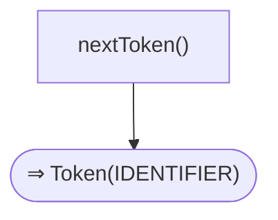

#### 📊 مخطّط البنية النحويّة (Mermaid)
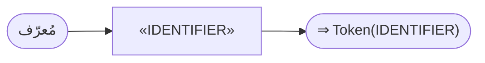

#### مثال
```sad
متغير الاسم_الأول = "أحمد"
```

---

<a id="gr.lex.integer"></a>
### gr.lex.integer — عدد صحيح <span dir="ltr">(IntegerLiteral)</span>

- **الرقم التسلسليّ:** `ق-098` · **المعرّف الموحَّد:** `gr.lex.integer` · **الحالة:** stable · **منذ:** 1.0.0
- **الوصف:** عدد صحيح عشريّ/سداسيّ‑عشريّ/ثنائيّ/ثمانيّ؛ يُقبَل فاصل «_» للقراءة

#### 📐 BNF
```bnf
IntegerLiteral = Digit { Digit | '_' } ;
```

#### 🧩 تفصيل البدائل
- `«NUMBER_INTEGER»`

#### 🔻 المسار إلى المحلل (دوال التحليل) ⇒ AST
**دالة (دوال) الدخول:**
1. [`LexerCore::nextToken`](../../../shared/lexer/src/lexer_core.cpp) — `shared/lexer/src/lexer_core.cpp`
- **عقدة AST المُنتَجة:** `Token(NUMBER_INTEGER)`

##### مخطّط مسار الدوال (حتى AST)
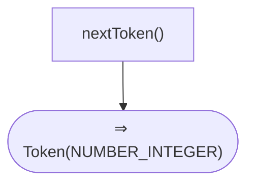

#### 📊 مخطّط البنية النحويّة (Mermaid)
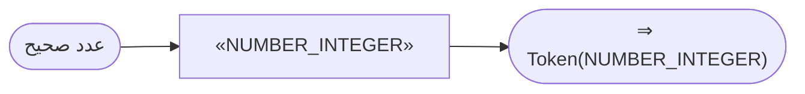

---

<a id="gr.lex.double"></a>
### gr.lex.double — عدد عشريّ <span dir="ltr">(DoubleLiteral)</span>

- **الرقم التسلسليّ:** `ق-099` · **المعرّف الموحَّد:** `gr.lex.double` · **الحالة:** stable · **منذ:** 1.0.0
- **الوصف:** عدد بفاصلة عشريّة وأُسّ اختياريّ؛ ملاحظة: «0.0» قد يُقسَّم لوصول صفوف «صف.0.0»

#### 📐 BNF
```bnf
DoubleLiteral = Digit { Digit } '.' Digit { Digit } [ ( 'e' | 'E' ) [ '+' | '-' ] Digit { Digit } ] ;
```

#### 🧩 تفصيل البدائل
- `«NUMBER_DOUBLE»`

#### 🔻 المسار إلى المحلل (دوال التحليل) ⇒ AST
**دالة (دوال) الدخول:**
1. [`LexerCore::nextToken`](../../../shared/lexer/src/lexer_core.cpp) — `shared/lexer/src/lexer_core.cpp`
- **عقدة AST المُنتَجة:** `Token(NUMBER_DOUBLE)`

##### مخطّط مسار الدوال (حتى AST)
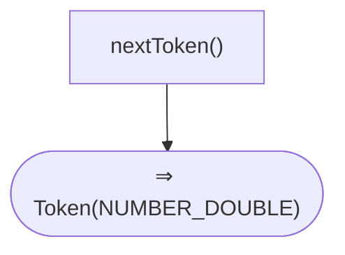

#### 📊 مخطّط البنية النحويّة (Mermaid)
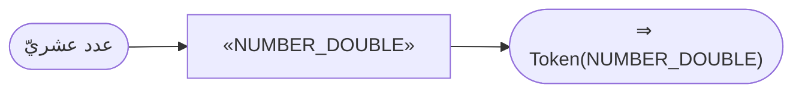

---

<a id="gr.lex.string"></a>
### gr.lex.string — نص حرفيّ <span dir="ltr">(StringLiteral)</span>

- **الرقم التسلسليّ:** `ق-100` · **المعرّف الموحَّد:** `gr.lex.string` · **الحالة:** stable · **منذ:** 1.0.0
- **الوصف:** نص بين علامتي اقتباس مع تسلسلات هروب «\n \t \" ...»؛ UTF-8

#### 📐 BNF
```bnf
StringLiteral = '"' { Char | Escape } '"' ;
```

#### 🧩 تفصيل البدائل
- `«STRING_LITERAL»`

#### 🔻 المسار إلى المحلل (دوال التحليل) ⇒ AST
**دالة (دوال) الدخول:**
1. [`LexerCore::nextToken`](../../../shared/lexer/src/lexer_core.cpp) — `shared/lexer/src/lexer_core.cpp`
- **عقدة AST المُنتَجة:** `Token(STRING_LITERAL)`

##### مخطّط مسار الدوال (حتى AST)
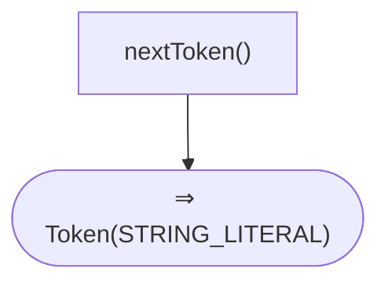

#### 📊 مخطّط البنية النحويّة (Mermaid)
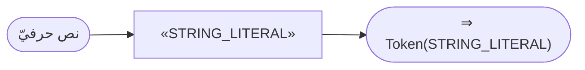

---

<a id="gr.lex.raw_string"></a>
### gr.lex.raw_string — نص خام <span dir="ltr">(RawString)</span>

- **الرقم التسلسليّ:** `ق-101` · **المعرّف الموحَّد:** `gr.lex.raw_string` · **الحالة:** stable · **منذ:** 1.0.0
- **الوصف:** نص خام «r"..."» بلا معالجة تسلسلات الهروب — يُعامَل كنص عاديّ في الأوّليّ

#### 📐 BNF
```bnf
RawString = 'r' '"' { Char } '"' ;
```

#### 🧩 تفصيل البدائل
- `«STRING_RAW»`

#### 🔻 المسار إلى المحلل (دوال التحليل) ⇒ AST
**دالة (دوال) الدخول:**
1. [`LexerCore::nextToken`](../../../shared/lexer/src/lexer_core.cpp) — `shared/lexer/src/lexer_core.cpp`
- **عقدة AST المُنتَجة:** `Token(STRING_RAW)`

##### مخطّط مسار الدوال (حتى AST)
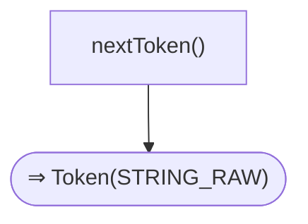

#### 📊 مخطّط البنية النحويّة (Mermaid)
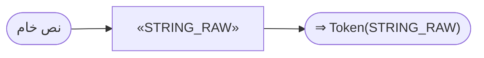

---

<a id="gr.lex.fstring"></a>
### gr.lex.fstring — رمز نص منسَّق <span dir="ltr">(FStringToken)</span>

- **الرقم التسلسليّ:** `ق-102` · **المعرّف الموحَّد:** `gr.lex.fstring` · **الحالة:** stable · **منذ:** 1.0.0
- **الوصف:** رمز نص منسَّق «f"...{تعبير}..."»؛ يُوسَّع لاحقًا في gr.expr.fstring

#### 📐 BNF
```bnf
FStringToken = 'f' '"' { Char | '{' ... '}' } '"' ;
```

#### 🧩 تفصيل البدائل
- `«STRING_FSTRING»`

#### 🔻 المسار إلى المحلل (دوال التحليل) ⇒ AST
**دالة (دوال) الدخول:**
1. [`LexerCore::nextToken`](../../../shared/lexer/src/lexer_core.cpp) — `shared/lexer/src/lexer_core.cpp`
- **عقدة AST المُنتَجة:** `Token(STRING_FSTRING)`

##### مخطّط مسار الدوال (حتى AST)
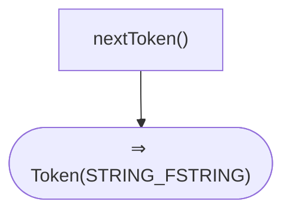

#### 📊 مخطّط البنية النحويّة (Mermaid)
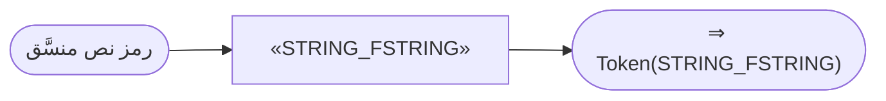

---

<a id="gr.lex.lifetime"></a>
### gr.lex.lifetime — تعليق عمر <span dir="ltr">(Lifetime)</span>

- **الرقم التسلسليّ:** `ق-103` · **المعرّف الموحَّد:** `gr.lex.lifetime` · **الحالة:** stable · **منذ:** 1.0.0
- **الوصف:** تعليق عمر «'أ» يبدأ بفاصلة عليا؛ يُستهلَك في معاملات العمر والاستعارة

#### 📐 BNF
```bnf
Lifetime = '\'' Identifier ;
```

#### 🧩 تفصيل البدائل
- `«LIFETIME»`

#### 🔻 المسار إلى المحلل (دوال التحليل) ⇒ AST
**دالة (دوال) الدخول:**
1. [`LexerCore::nextToken`](../../../shared/lexer/src/lexer_core.cpp) — `shared/lexer/src/lexer_core.cpp`
- **عقدة AST المُنتَجة:** `Token(LIFETIME)`

##### مخطّط مسار الدوال (حتى AST)
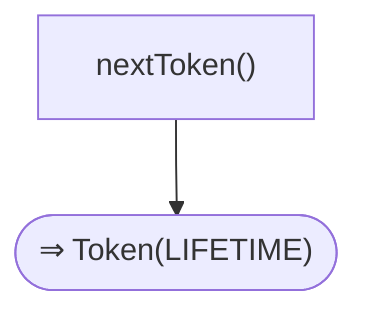

#### 📊 مخطّط البنية النحويّة (Mermaid)
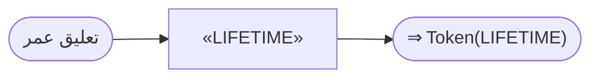

---

<a id="gr.lex.comment"></a>
### gr.lex.comment — تعليق <span dir="ltr">(Comment)</span>

- **الرقم التسلسليّ:** `ق-104` · **المعرّف الموحَّد:** `gr.lex.comment` · **الحالة:** stable · **منذ:** 1.0.0
- **الوصف:** تعليق سطر «#»، كتلة «#* *#»، توثيق «##» أو «#** **#»؛ تعليقات «##» تُرفَق بالتصريح التالي

#### 📐 BNF
```bnf
Comment = '#' { Char } NEWLINE | '#*' { Char } '*#' | '##' { Char } NEWLINE | '#**' { Char } '**#' ;
```

#### 🧩 تفصيل البدائل
- `( «COMMENT» | «DOC_COMMENT» )`

#### 🔻 المسار إلى المحلل (دوال التحليل) ⇒ AST
**دالة (دوال) الدخول:**
1. [`LexerCore::nextToken`](../../../shared/lexer/src/lexer_core.cpp) — `shared/lexer/src/lexer_core.cpp`
- **عقدة AST المُنتَجة:** `Token(COMMENT) | Token(DOC_COMMENT)`

##### مخطّط مسار الدوال (حتى AST)
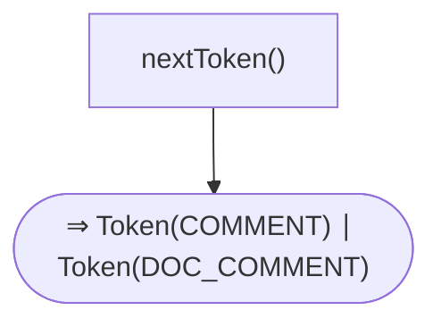

#### 📊 مخطّط البنية النحويّة (Mermaid)
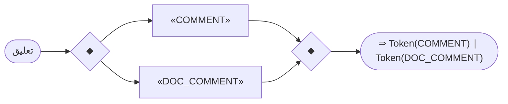

---
