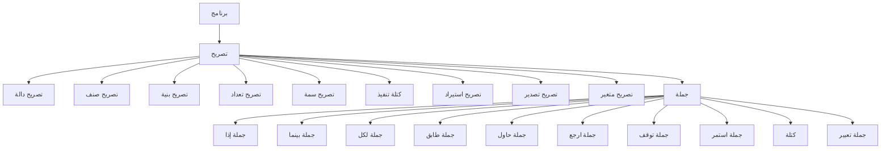

# فهرس قواعد لغة ص — المُولَّد من مصدر الحقيقة

> ⚠️ **هذا الملف مُولَّد آليًّا** من `language-truth/grammar/*.yaml` عبر
> `scripts/codegen/gen_parser_grammar_docs.py` — **لا تُحرِّره يدويًّا**.
> عدّل YAML المصدر ثم أعد التوليد.

المصدر الموحَّد: [`language-truth/grammar/`](../../../language-truth/grammar/) (قواعد إنتاج YAML). هذا التوثيق مُشتقّ منه آليًّا.

**إجمالي القواعد:** 106 · **الطبقات:** 8 · **عقد AST مميَّزة:** 87 · **الحالة:** experimental: 10، stable: 96

## خريطة التوزيع العليا (البرنامج → التصريح → الجملة)

## الطبقات

| # | الطبقة | الملف المُولَّد | المصدر | عدد القواعد |
|---|--------|----------------|--------|-------------|
| 1 | النواة (البرنامج) | [00_program.md](00_program.md) | `00_program.yaml` | 4 |
| 2 | الجمل | [10_statements.md](10_statements.md) | `10_statements.yaml` | 11 |
| 3 | التصريحات والوحدات | [20_declarations.md](20_declarations.md) | `20_declarations.yaml` | 8 |
| 4 | البرمجة الكائنية | [30_oop.md](30_oop.md) | `30_oop.yaml` | 16 |
| 5 | التعابير وسلسلة الأسبقية | [40_expressions.md](40_expressions.md) | `40_expressions.yaml` | 25 |
| 6 | أنماط المطابقة | [50_patterns.md](50_patterns.md) | `50_patterns.yaml` | 6 |
| 7 | البنيات المتقدمة | [60_advanced.md](60_advanced.md) | `60_advanced.yaml` | 28 |
| 8 | القواعد المعجمية | [70_lexical.md](70_lexical.md) | `70_lexical.yaml` | 8 |

## كل القواعد (المعرّف ⇒ عقدة AST ⇒ دالة المحلل)

| ق-# | المعرّف الموحَّد | الاسم | عقدة AST | دالة المحلل |
|-----|------------------|-------|----------|-------------|
| ق-001 | [`gr.program.program`](00_program.md#gr.program.program) | برنامج | `StmtList` | `ParserCore::parseProgram` |
| ق-002 | [`gr.program.declaration`](00_program.md#gr.program.declaration) | تصريح | `—` | `ParserCore::parseDeclaration` |
| ق-003 | [`gr.program.statement`](00_program.md#gr.program.statement) | جملة | `—` | `ParserCore::parseStatement` |
| ق-004 | [`gr.program.block`](00_program.md#gr.program.block) | كتلة | `BlockStmt` | `ParserCore::parseBlockStmt` |
| ق-005 | [`gr.stmt.if`](10_statements.md#gr.stmt.if) | جملة إذا | `IfStmt` | `ParserCore::parseIfStmt` |
| ق-006 | [`gr.stmt.while`](10_statements.md#gr.stmt.while) | جملة بينما | `WhileStmt` | `ParserCore::parseWhileStmt` |
| ق-007 | [`gr.stmt.for`](10_statements.md#gr.stmt.for) | جملة لكل | `ForStmt \| ForRangeStmt` | `ParserCore::parseForStmt` |
| ق-008 | [`gr.stmt.match`](10_statements.md#gr.stmt.match) | جملة طابق | `MatchStmt` | `ParserCore::parseMatchStmt` |
| ق-009 | [`gr.stmt.try`](10_statements.md#gr.stmt.try) | جملة حاول | `TryStmt` | `ParserCore::parseTryStmt` |
| ق-010 | [`gr.stmt.throw`](10_statements.md#gr.stmt.throw) | جملة ارمي | `RaiseStmt` | `ParserCore::parseRaiseStmt` |
| ق-011 | [`gr.stmt.return`](10_statements.md#gr.stmt.return) | جملة ارجع | `ReturnStmt` | `ParserCore::parseReturnStmt` |
| ق-012 | [`gr.stmt.break`](10_statements.md#gr.stmt.break) | جملة توقف | `BreakStmt` | `ParserCore::parseBreakStmt` |
| ق-013 | [`gr.stmt.continue`](10_statements.md#gr.stmt.continue) | جملة استمر | `ContinueStmt` | `ParserCore::parseContinueStmt` |
| ق-014 | [`gr.stmt.expression`](10_statements.md#gr.stmt.expression) | جملة تعبير | `ExprStmt` | `ParserCore::parseExpressionStmt` |
| ق-015 | [`gr.stmt.switch`](10_statements.md#gr.stmt.switch) | جملة حالة | `SwitchStmt` | `ParserCore::parseSwitchStmt` |
| ق-016 | [`gr.decl.variable`](20_declarations.md#gr.decl.variable) | تصريح متغير | `VarDeclStmt` | `ParserCore::parseVarDecl` |
| ق-017 | [`gr.decl.type_ref`](20_declarations.md#gr.decl.type_ref) | إشارة نوع | `—` | `ParserCore::parseVarDecl` |
| ق-018 | [`gr.decl.function`](20_declarations.md#gr.decl.function) | تصريح دالة | `FunctionDecl` | `ParserCore::parseFunctionDecl` |
| ق-019 | [`gr.decl.parameters`](20_declarations.md#gr.decl.parameters) | المعاملات | `—` | `ParserCore::parseFunctionDecl` |
| ق-020 | [`gr.decl.import`](20_declarations.md#gr.decl.import) | تصريح استيراد | `ImportStmt \| FromImportStmt` | `ParserCore::parseImportStmt` |
| ق-021 | [`gr.decl.export`](20_declarations.md#gr.decl.export) | تصريح تصدير | `ExportStmt` | `ParserCore::parseExportStmt` |
| ق-022 | [`gr.decl.extern`](20_declarations.md#gr.decl.extern) | تصريح خارجي | `FunctionDecl` | `ParserCore::parseFunctionDecl` |
| ق-023 | [`gr.decl.arg_list`](20_declarations.md#gr.decl.arg_list) | قائمة وسائط | `—` | `ParserCore::parseArgumentList` |
| ق-024 | [`gr.oop.class`](30_oop.md#gr.oop.class) | تصريح صنف | `ClassDecl` | `ParserCore::parseClassDecl` |
| ق-025 | [`gr.oop.enum`](30_oop.md#gr.oop.enum) | تصريح تعداد | `EnumDecl` | `ParserCore::parseEnumDecl` |
| ق-026 | [`gr.oop.struct`](30_oop.md#gr.oop.struct) | تصريح بنية | `StructDecl` | `ParserCore::parseStructDecl` |
| ق-027 | [`gr.oop.member`](30_oop.md#gr.oop.member) | عضو صنف | `—` | `ParserCore::parseClassDecl` |
| ق-028 | [`gr.oop.field`](30_oop.md#gr.oop.field) | حقل | `FieldDecl` | `ParserCore::parseFieldDeclaration` |
| ق-029 | [`gr.oop.method`](30_oop.md#gr.oop.method) | طريقة | `MethodDecl` | `ParserCore::parseMethodDeclaration` |
| ق-030 | [`gr.oop.constructor`](30_oop.md#gr.oop.constructor) | باني | `ConstructorDecl` | `ParserCore::parseConstructorDeclaration` |
| ق-031 | [`gr.oop.destructor`](30_oop.md#gr.oop.destructor) | هادم | `DestructorDecl` | `ParserCore::parseDestructorDeclaration` |
| ق-032 | [`gr.oop.property`](30_oop.md#gr.oop.property) | خاصيّة | `PropertyDecl` | `ParserCore::parsePropertyDeclaration` |
| ق-033 | [`gr.oop.operator`](30_oop.md#gr.oop.operator) | تحميل عامل | `OperatorDecl` | `ParserCore::parseOperatorDecl` |
| ق-034 | [`gr.oop.modifiers`](30_oop.md#gr.oop.modifiers) | معدّلات وصول | `—` | `ParserCore::parseModifiers` |
| ق-035 | [`gr.oop.trait`](30_oop.md#gr.oop.trait) | تصريح سمة | `TraitDecl` | `ParserCore::parseTraitDecl` |
| ق-036 | [`gr.oop.impl`](30_oop.md#gr.oop.impl) | كتلة تنفيذ | `ImplDecl` | `ParserCore::parseImplDecl` |
| ق-037 | [`gr.oop.extension`](30_oop.md#gr.oop.extension) | كتلة امتداد | `ExtensionDecl` | `ParserCore::parseExtensionDecl` |
| ق-038 | [`gr.oop.new`](30_oop.md#gr.oop.new) | إنشاء كائن | `NewExpr` | `ParserCore::parsePostfix` |
| ق-039 | [`gr.oop.this_super`](30_oop.md#gr.oop.this_super) | هذا/الأساس | `ThisExpr \| SuperExpr` | `ParserCore::parsePrimary` |
| ق-040 | [`gr.expr.expression`](40_expressions.md#gr.expr.expression) | تعبير | `—` | `ParserCore::parseExpression` |
| ق-041 | [`gr.expr.pipeline`](40_expressions.md#gr.expr.pipeline) | أنبوب | `CallExpr` | `ParserCore::parsePipeline` |
| ق-042 | [`gr.expr.assignment`](40_expressions.md#gr.expr.assignment) | إسناد | `AssignExpr \| MemberAssignExpr \| IndexAssignExpr \| WalrusExpr` | `ParserCore::parseAssignment` |
| ق-043 | [`gr.expr.ternary`](40_expressions.md#gr.expr.ternary) | شرطي ثلاثي | `TernaryExpr` | `ParserCore::parseTernary` |
| ق-044 | [`gr.expr.null_coalesce`](40_expressions.md#gr.expr.null_coalesce) | تجميع فارغ | `NullCoalesceExpr` | `ParserCore::parseNullCoalesce` |
| ق-045 | [`gr.expr.logical_or`](40_expressions.md#gr.expr.logical_or) | أو المنطقي | `BinaryExpr` | `ParserCore::parseLogicalOr` |
| ق-046 | [`gr.expr.logical_and`](40_expressions.md#gr.expr.logical_and) | و المنطقي | `BinaryExpr` | `ParserCore::parseLogicalAnd` |
| ق-047 | [`gr.expr.bitwise_or`](40_expressions.md#gr.expr.bitwise_or) | أو البتّي | `BinaryExpr` | `ParserCore::parseBitwiseOr` |
| ق-048 | [`gr.expr.bitwise_xor`](40_expressions.md#gr.expr.bitwise_xor) | XOR البتّي | `BinaryExpr` | `ParserCore::parseBitwiseXor` |
| ق-049 | [`gr.expr.bitwise_and`](40_expressions.md#gr.expr.bitwise_and) | و البتّي | `BinaryExpr` | `ParserCore::parseBitwiseAnd` |
| ق-050 | [`gr.expr.equality`](40_expressions.md#gr.expr.equality) | مساواة | `BinaryExpr` | `ParserCore::parseEquality` |
| ق-051 | [`gr.expr.comparison`](40_expressions.md#gr.expr.comparison) | مقارنة | `BinaryExpr` | `ParserCore::parseComparison` |
| ق-052 | [`gr.expr.range`](40_expressions.md#gr.expr.range) | مدى | `RangeExpr` | `ParserCore::parseRange` |
| ق-053 | [`gr.expr.term`](40_expressions.md#gr.expr.term) | حد جمعي | `BinaryExpr` | `ParserCore::parseTerm` |
| ق-054 | [`gr.expr.factor`](40_expressions.md#gr.expr.factor) | حد ضربي | `BinaryExpr` | `ParserCore::parseFactor` |
| ق-055 | [`gr.expr.unary`](40_expressions.md#gr.expr.unary) | أحادي | `UnaryExpr \| BorrowExpr` | `ParserCore::parseUnary` |
| ق-056 | [`gr.expr.power`](40_expressions.md#gr.expr.power) | أس | `BinaryExpr` | `ParserCore::parsePower` |
| ق-057 | [`gr.expr.postfix`](40_expressions.md#gr.expr.postfix) | لاحقي | `CallExpr \| MethodCallExpr \| MemberExpr \| OptionalChainExpr \| IndexExpr \| SliceExpr \| NewExpr \| UnaryExpr` | `ParserCore::parsePostfix` |
| ق-058 | [`gr.expr.primary`](40_expressions.md#gr.expr.primary) | أوّلي | `LiteralExpr \| VariableExpr \| TupleExpr \| ArrayExpr \| MapExpr \| ThisExpr \| SuperExpr \| AwaitExpr \| ErrorPropagateExpr \| TernaryExpr \| LambdaExpr \| CallExpr \| TemplateInstantiation` | `ParserCore::parsePrimary` |
| ق-059 | [`gr.expr.lambda`](40_expressions.md#gr.expr.lambda) | لامدا | `LambdaExpr` | `ParserCore::parseLambda` |
| ق-060 | [`gr.expr.fstring`](40_expressions.md#gr.expr.fstring) | نص منسَّق | `BinaryExpr \| LiteralExpr` | `ParserCore::parseFStringExpr` |
| ق-061 | [`gr.expr.decorator`](40_expressions.md#gr.expr.decorator) | مُزخرِف | `DecoratorExpr` | `ParserCore::parseDecorator` |
| ق-062 | [`gr.expr.directive`](40_expressions.md#gr.expr.directive) | تعبير توجيه | `SizeofExpr \| AtomicExpr \| InlineAsmExpr` | `ParserCore::parseDirectiveExpr` |
| ق-063 | [`gr.expr.array_literal`](40_expressions.md#gr.expr.array_literal) | مصفوفة حرفيّة | `ArrayExpr \| ListComprehensionExpr` | `ParserCore::parseArrayLiteral` |
| ق-064 | [`gr.expr.map_literal`](40_expressions.md#gr.expr.map_literal) | خريطة حرفيّة | `MapExpr \| DictComprehensionExpr \| SetComprehensionExpr` | `ParserCore::parseMapLiteral` |
| ق-065 | [`gr.pattern.pattern`](50_patterns.md#gr.pattern.pattern) | نمط | `WildcardPattern \| StructPattern \| ListPattern \| BindingPattern \| OrPattern` | `ParserCore::parsePattern` |
| ق-066 | [`gr.pattern.primary`](50_patterns.md#gr.pattern.primary) | نمط أوّليّ | `LiteralPattern \| RangePattern \| VariablePattern \| EnumVariantPattern \| ConstructorPattern` | `ParserCore::parsePrimaryPattern` |
| ق-067 | [`gr.pattern.list`](50_patterns.md#gr.pattern.list) | نمط قائمة | `ListPattern` | `ParserCore::parseListPattern` |
| ق-068 | [`gr.pattern.struct`](50_patterns.md#gr.pattern.struct) | نمط بنية | `StructPattern` | `ParserCore::parseStructPattern` |
| ق-069 | [`gr.pattern.binding`](50_patterns.md#gr.pattern.binding) | نمط ربط | `BindingPattern` | `ParserCore::parsePattern` |
| ق-070 | [`gr.pattern.or`](50_patterns.md#gr.pattern.or) | نمط بدائل | `OrPattern` | `ParserCore::parsePattern` |
| ق-071 | [`gr.adv.type`](60_advanced.md#gr.adv.type) | نوع | `SadTypeKind \| SadTypePtr` | `ParserCore::parseType` |
| ق-072 | [`gr.adv.lifetime_params`](60_advanced.md#gr.adv.lifetime_params) | معاملات عمر | `std::vector<std::string>` | `ParserCore::parseLifetimeParams` |
| ق-073 | [`gr.adv.template_decl`](60_advanced.md#gr.adv.template_decl) | تصريح قالب | `TemplateFunctionDecl \| TemplateClassDecl` | `ParserCore::parseTemplateDecl` |
| ق-074 | [`gr.adv.template_params`](60_advanced.md#gr.adv.template_params) | معاملات قالب | `std::vector<TypeParameter>` | `ParserCore::parseTemplateParameters` |
| ق-075 | [`gr.adv.template_args`](60_advanced.md#gr.adv.template_args) | وسائط قالب | `TemplateInstantiation` | `ParserCore::parseTemplateInstantiation` |
| ق-076 | [`gr.adv.where_clause`](60_advanced.md#gr.adv.where_clause) | جملة حيث | `WhereClause` | `ParserCore::parseWhereClause` |
| ق-077 | [`gr.adv.yield`](60_advanced.md#gr.adv.yield) | جملة أنتج | `YieldStmt` | `ParserCore::parseYieldStmt` |
| ق-078 | [`gr.adv.with`](60_advanced.md#gr.adv.with) | جملة باستخدام | `WithStmt` | `ParserCore::parseWithStmt` |
| ق-079 | [`gr.adv.defer`](60_advanced.md#gr.adv.defer) | جملة أجّل | `DeferStmt` | `ParserCore::parseDeferStmt` |
| ق-080 | [`gr.adv.go`](60_advanced.md#gr.adv.go) | جملة أطلق | `GoStmt` | `ParserCore::parseGoStmt` |
| ق-081 | [`gr.adv.select`](60_advanced.md#gr.adv.select) | جملة اختر | `SelectStmt` | `ParserCore::parseSelectStmt` |
| ق-082 | [`gr.adv.list_comprehension`](60_advanced.md#gr.adv.list_comprehension) | استيعاب قائمة | `ListComprehensionExpr` | `ParserCore::parseArrayLiteral` |
| ق-083 | [`gr.adv.set_comprehension`](60_advanced.md#gr.adv.set_comprehension) | استيعاب مجموعة | `SetComprehensionExpr` | `ParserCore::parseMapLiteral` |
| ق-084 | [`gr.adv.dict_comprehension`](60_advanced.md#gr.adv.dict_comprehension) | استيعاب قاموس | `DictComprehensionExpr` | `ParserCore::parseMapLiteral` |
| ق-085 | [`gr.adv.macro`](60_advanced.md#gr.adv.macro) | تصريح ماكرو | `MacroDecl` | `ParserCore::parseMacroDecl` |
| ق-086 | [`gr.adv.property_test`](60_advanced.md#gr.adv.property_test) | اختبار خصائص | `TestDecl` | `ParserCore::parseTestDecl` |
| ق-087 | [`gr.adv.await`](60_advanced.md#gr.adv.await) | تعبير انتظر | `AwaitExpr` | `ParserCore::parsePrimary` |
| ق-088 | [`gr.adv.contract`](60_advanced.md#gr.adv.contract) | عقد ذكيّ | `ClassDecl` | `ParserCore::parseDeclaration` |
| ق-089 | [`gr.adv.ffi_extern_block`](60_advanced.md#gr.adv.ffi_extern_block) | كتلة خارجي | `BlockStmt` | `ParserCore::parseDeclaration` |
| ق-090 | [`gr.adv.ffi_linkage`](60_advanced.md#gr.adv.ffi_linkage) | اتفاقيّة ربط | `ExternLinkage` | `ParserCore::parseDeclaration` |
| ق-091 | [`gr.adv.ffi_ctype`](60_advanced.md#gr.adv.ffi_ctype) | نوع C | `SadTypeKind` | `ParserCore::parseType` |
| ق-092 | [`gr.adv.inline_asm`](60_advanced.md#gr.adv.inline_asm) | تجميع مضمَّن | `InlineAsmExpr` | `ParserCore::tryParseDirective` |
| ق-093 | [`gr.adv.asm_dialect`](60_advanced.md#gr.adv.asm_dialect) | كتلة لهجة التجميع | `AsmBlockStmt` | `ParserCore::parseAsmBlockStmt` |
| ق-094 | [`gr.adv.ui_decl`](60_advanced.md#gr.adv.ui_decl) | تصريح واجهة | `UIDeclarationNode` | `ParserCore::parseUIDeclaration` |
| ق-095 | [`gr.adv.ui_state`](60_advanced.md#gr.adv.ui_state) | تصريح حالة واجهة | `UIStateDecl` | `ParserCore::parseUIStateDecl` |
| ق-096 | [`gr.adv.widget`](60_advanced.md#gr.adv.widget) | تعبير عنصر واجهة | `UIWidgetExprNode` | `ParserCore::parseWidgetExpression` |
| ق-097 | [`gr.adv.ui_modifier_chain`](60_advanced.md#gr.adv.ui_modifier_chain) | سلسلة معدّلات | `std::vector<UIModifierNode>` | `ParserCore::parseModifierChain` |
| ق-098 | [`gr.adv.ui_event`](60_advanced.md#gr.adv.ui_event) | معالج حدث | `UIEventHandlerNode` | `ParserCore::parseUIEventHandler` |
| ق-099 | [`gr.lex.identifier`](70_lexical.md#gr.lex.identifier) | مُعرّف | `Token(IDENTIFIER)` | `LexerCore::nextToken` |
| ق-100 | [`gr.lex.integer`](70_lexical.md#gr.lex.integer) | عدد صحيح | `Token(NUMBER_INTEGER)` | `LexerCore::nextToken` |
| ق-101 | [`gr.lex.double`](70_lexical.md#gr.lex.double) | عدد عشريّ | `Token(NUMBER_DOUBLE)` | `LexerCore::nextToken` |
| ق-102 | [`gr.lex.string`](70_lexical.md#gr.lex.string) | نص حرفيّ | `Token(STRING_LITERAL)` | `LexerCore::nextToken` |
| ق-103 | [`gr.lex.raw_string`](70_lexical.md#gr.lex.raw_string) | نص خام | `Token(STRING_RAW)` | `LexerCore::nextToken` |
| ق-104 | [`gr.lex.fstring`](70_lexical.md#gr.lex.fstring) | رمز نص منسَّق | `Token(STRING_FSTRING)` | `LexerCore::nextToken` |
| ق-105 | [`gr.lex.lifetime`](70_lexical.md#gr.lex.lifetime) | تعليق عمر | `Token(LIFETIME)` | `LexerCore::nextToken` |
| ق-106 | [`gr.lex.comment`](70_lexical.md#gr.lex.comment) | تعليق | `Token(COMMENT) \| Token(DOC_COMMENT)` | `LexerCore::nextToken` |

## فهرس حسب عقدة AST

| عقدة AST | القواعد المُنتِجة |
|----------|--------------------|
| `ArrayExpr \| ListComprehensionExpr` | [`gr.expr.array_literal`](40_expressions.md#gr.expr.array_literal) |
| `AsmBlockStmt` | [`gr.adv.asm_dialect`](60_advanced.md#gr.adv.asm_dialect) |
| `AssignExpr \| MemberAssignExpr \| IndexAssignExpr \| WalrusExpr` | [`gr.expr.assignment`](40_expressions.md#gr.expr.assignment) |
| `AwaitExpr` | [`gr.adv.await`](60_advanced.md#gr.adv.await) |
| `BinaryExpr` | [`gr.expr.logical_or`](40_expressions.md#gr.expr.logical_or)، [`gr.expr.logical_and`](40_expressions.md#gr.expr.logical_and)، [`gr.expr.bitwise_or`](40_expressions.md#gr.expr.bitwise_or)، [`gr.expr.bitwise_xor`](40_expressions.md#gr.expr.bitwise_xor)، [`gr.expr.bitwise_and`](40_expressions.md#gr.expr.bitwise_and)، [`gr.expr.equality`](40_expressions.md#gr.expr.equality)، [`gr.expr.comparison`](40_expressions.md#gr.expr.comparison)، [`gr.expr.term`](40_expressions.md#gr.expr.term)، [`gr.expr.factor`](40_expressions.md#gr.expr.factor)، [`gr.expr.power`](40_expressions.md#gr.expr.power) |
| `BinaryExpr \| LiteralExpr` | [`gr.expr.fstring`](40_expressions.md#gr.expr.fstring) |
| `BindingPattern` | [`gr.pattern.binding`](50_patterns.md#gr.pattern.binding) |
| `BlockStmt` | [`gr.program.block`](00_program.md#gr.program.block)، [`gr.adv.ffi_extern_block`](60_advanced.md#gr.adv.ffi_extern_block) |
| `BreakStmt` | [`gr.stmt.break`](10_statements.md#gr.stmt.break) |
| `CallExpr` | [`gr.expr.pipeline`](40_expressions.md#gr.expr.pipeline) |
| `CallExpr \| MethodCallExpr \| MemberExpr \| OptionalChainExpr \| IndexExpr \| SliceExpr \| NewExpr \| UnaryExpr` | [`gr.expr.postfix`](40_expressions.md#gr.expr.postfix) |
| `ClassDecl` | [`gr.oop.class`](30_oop.md#gr.oop.class)، [`gr.adv.contract`](60_advanced.md#gr.adv.contract) |
| `ConstructorDecl` | [`gr.oop.constructor`](30_oop.md#gr.oop.constructor) |
| `ContinueStmt` | [`gr.stmt.continue`](10_statements.md#gr.stmt.continue) |
| `DecoratorExpr` | [`gr.expr.decorator`](40_expressions.md#gr.expr.decorator) |
| `DeferStmt` | [`gr.adv.defer`](60_advanced.md#gr.adv.defer) |
| `DestructorDecl` | [`gr.oop.destructor`](30_oop.md#gr.oop.destructor) |
| `DictComprehensionExpr` | [`gr.adv.dict_comprehension`](60_advanced.md#gr.adv.dict_comprehension) |
| `EnumDecl` | [`gr.oop.enum`](30_oop.md#gr.oop.enum) |
| `ExportStmt` | [`gr.decl.export`](20_declarations.md#gr.decl.export) |
| `ExprStmt` | [`gr.stmt.expression`](10_statements.md#gr.stmt.expression) |
| `ExtensionDecl` | [`gr.oop.extension`](30_oop.md#gr.oop.extension) |
| `ExternLinkage` | [`gr.adv.ffi_linkage`](60_advanced.md#gr.adv.ffi_linkage) |
| `FieldDecl` | [`gr.oop.field`](30_oop.md#gr.oop.field) |
| `ForStmt \| ForRangeStmt` | [`gr.stmt.for`](10_statements.md#gr.stmt.for) |
| `FunctionDecl` | [`gr.decl.function`](20_declarations.md#gr.decl.function)، [`gr.decl.extern`](20_declarations.md#gr.decl.extern) |
| `GoStmt` | [`gr.adv.go`](60_advanced.md#gr.adv.go) |
| `IfStmt` | [`gr.stmt.if`](10_statements.md#gr.stmt.if) |
| `ImplDecl` | [`gr.oop.impl`](30_oop.md#gr.oop.impl) |
| `ImportStmt \| FromImportStmt` | [`gr.decl.import`](20_declarations.md#gr.decl.import) |
| `InlineAsmExpr` | [`gr.adv.inline_asm`](60_advanced.md#gr.adv.inline_asm) |
| `LambdaExpr` | [`gr.expr.lambda`](40_expressions.md#gr.expr.lambda) |
| `ListComprehensionExpr` | [`gr.adv.list_comprehension`](60_advanced.md#gr.adv.list_comprehension) |
| `ListPattern` | [`gr.pattern.list`](50_patterns.md#gr.pattern.list) |
| `LiteralExpr \| VariableExpr \| TupleExpr \| ArrayExpr \| MapExpr \| ThisExpr \| SuperExpr \| AwaitExpr \| ErrorPropagateExpr \| TernaryExpr \| LambdaExpr \| CallExpr \| TemplateInstantiation` | [`gr.expr.primary`](40_expressions.md#gr.expr.primary) |
| `LiteralPattern \| RangePattern \| VariablePattern \| EnumVariantPattern \| ConstructorPattern` | [`gr.pattern.primary`](50_patterns.md#gr.pattern.primary) |
| `MacroDecl` | [`gr.adv.macro`](60_advanced.md#gr.adv.macro) |
| `MapExpr \| DictComprehensionExpr \| SetComprehensionExpr` | [`gr.expr.map_literal`](40_expressions.md#gr.expr.map_literal) |
| `MatchStmt` | [`gr.stmt.match`](10_statements.md#gr.stmt.match) |
| `MethodDecl` | [`gr.oop.method`](30_oop.md#gr.oop.method) |
| `NewExpr` | [`gr.oop.new`](30_oop.md#gr.oop.new) |
| `NullCoalesceExpr` | [`gr.expr.null_coalesce`](40_expressions.md#gr.expr.null_coalesce) |
| `OperatorDecl` | [`gr.oop.operator`](30_oop.md#gr.oop.operator) |
| `OrPattern` | [`gr.pattern.or`](50_patterns.md#gr.pattern.or) |
| `PropertyDecl` | [`gr.oop.property`](30_oop.md#gr.oop.property) |
| `RaiseStmt` | [`gr.stmt.throw`](10_statements.md#gr.stmt.throw) |
| `RangeExpr` | [`gr.expr.range`](40_expressions.md#gr.expr.range) |
| `ReturnStmt` | [`gr.stmt.return`](10_statements.md#gr.stmt.return) |
| `SadTypeKind` | [`gr.adv.ffi_ctype`](60_advanced.md#gr.adv.ffi_ctype) |
| `SadTypeKind \| SadTypePtr` | [`gr.adv.type`](60_advanced.md#gr.adv.type) |
| `SelectStmt` | [`gr.adv.select`](60_advanced.md#gr.adv.select) |
| `SetComprehensionExpr` | [`gr.adv.set_comprehension`](60_advanced.md#gr.adv.set_comprehension) |
| `SizeofExpr \| AtomicExpr \| InlineAsmExpr` | [`gr.expr.directive`](40_expressions.md#gr.expr.directive) |
| `StmtList` | [`gr.program.program`](00_program.md#gr.program.program) |
| `StructDecl` | [`gr.oop.struct`](30_oop.md#gr.oop.struct) |
| `StructPattern` | [`gr.pattern.struct`](50_patterns.md#gr.pattern.struct) |
| `SwitchStmt` | [`gr.stmt.switch`](10_statements.md#gr.stmt.switch) |
| `TemplateFunctionDecl \| TemplateClassDecl` | [`gr.adv.template_decl`](60_advanced.md#gr.adv.template_decl) |
| `TemplateInstantiation` | [`gr.adv.template_args`](60_advanced.md#gr.adv.template_args) |
| `TernaryExpr` | [`gr.expr.ternary`](40_expressions.md#gr.expr.ternary) |
| `TestDecl` | [`gr.adv.property_test`](60_advanced.md#gr.adv.property_test) |
| `ThisExpr \| SuperExpr` | [`gr.oop.this_super`](30_oop.md#gr.oop.this_super) |
| `Token(COMMENT) \| Token(DOC_COMMENT)` | [`gr.lex.comment`](70_lexical.md#gr.lex.comment) |
| `Token(IDENTIFIER)` | [`gr.lex.identifier`](70_lexical.md#gr.lex.identifier) |
| `Token(LIFETIME)` | [`gr.lex.lifetime`](70_lexical.md#gr.lex.lifetime) |
| `Token(NUMBER_DOUBLE)` | [`gr.lex.double`](70_lexical.md#gr.lex.double) |
| `Token(NUMBER_INTEGER)` | [`gr.lex.integer`](70_lexical.md#gr.lex.integer) |
| `Token(STRING_FSTRING)` | [`gr.lex.fstring`](70_lexical.md#gr.lex.fstring) |
| `Token(STRING_LITERAL)` | [`gr.lex.string`](70_lexical.md#gr.lex.string) |
| `Token(STRING_RAW)` | [`gr.lex.raw_string`](70_lexical.md#gr.lex.raw_string) |
| `TraitDecl` | [`gr.oop.trait`](30_oop.md#gr.oop.trait) |
| `TryStmt` | [`gr.stmt.try`](10_statements.md#gr.stmt.try) |
| `UIDeclarationNode` | [`gr.adv.ui_decl`](60_advanced.md#gr.adv.ui_decl) |
| `UIEventHandlerNode` | [`gr.adv.ui_event`](60_advanced.md#gr.adv.ui_event) |
| `UIStateDecl` | [`gr.adv.ui_state`](60_advanced.md#gr.adv.ui_state) |
| `UIWidgetExprNode` | [`gr.adv.widget`](60_advanced.md#gr.adv.widget) |
| `UnaryExpr \| BorrowExpr` | [`gr.expr.unary`](40_expressions.md#gr.expr.unary) |
| `VarDeclStmt` | [`gr.decl.variable`](20_declarations.md#gr.decl.variable) |
| `WhereClause` | [`gr.adv.where_clause`](60_advanced.md#gr.adv.where_clause) |
| `WhileStmt` | [`gr.stmt.while`](10_statements.md#gr.stmt.while) |
| `WildcardPattern \| StructPattern \| ListPattern \| BindingPattern \| OrPattern` | [`gr.pattern.pattern`](50_patterns.md#gr.pattern.pattern) |
| `WithStmt` | [`gr.adv.with`](60_advanced.md#gr.adv.with) |
| `YieldStmt` | [`gr.adv.yield`](60_advanced.md#gr.adv.yield) |
| `std::vector<TypeParameter>` | [`gr.adv.template_params`](60_advanced.md#gr.adv.template_params) |
| `std::vector<UIModifierNode>` | [`gr.adv.ui_modifier_chain`](60_advanced.md#gr.adv.ui_modifier_chain) |
| `std::vector<std::string>` | [`gr.adv.lifetime_params`](60_advanced.md#gr.adv.lifetime_params) |
| `—` | [`gr.program.declaration`](00_program.md#gr.program.declaration)، [`gr.program.statement`](00_program.md#gr.program.statement)، [`gr.decl.type_ref`](20_declarations.md#gr.decl.type_ref)، [`gr.decl.parameters`](20_declarations.md#gr.decl.parameters)، [`gr.decl.arg_list`](20_declarations.md#gr.decl.arg_list)، [`gr.oop.member`](30_oop.md#gr.oop.member)، [`gr.oop.modifiers`](30_oop.md#gr.oop.modifiers)، [`gr.expr.expression`](40_expressions.md#gr.expr.expression) |
