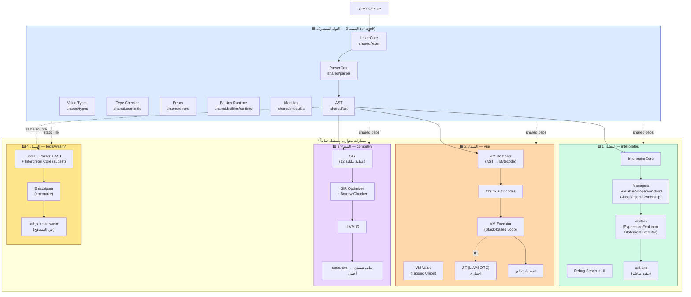

# نظرة عامة على مشروع لغة ص

> **تاريخ التحديث**: 29 أبريل 2026  
> **الإصدار**: 1.3.0  
> **نوع الفحص**: شامل (Exhaustive Scan) — مُحدَّث ليعكس **بنية المسارات الأربعة المتوازية**

---

## ملخص تنفيذي

**لغة ص (Sad)** هي لغة برمجة عربية حديثة مطورة بـ C++17، تهدف لتقديم تجربة برمجة كاملة باللغة العربية مع دعم كامل للإنجليزية. المشروع يوفر **أربعة مسارات تنفيذ متوازية مستقلة تماماً**، تتقاطع فقط في طبقة `shared/` المشتركة:

1. 🟩 **مسار المفسر الشجري (`sad`)** — Tree-Walking على AST مباشرة — مجلد `interpreter/`
2. 🟧 **مسار الآلة الافتراضية (Bytecode VM)** — تجميع AST إلى بايت كود + تنفيذ Stack-based + JIT اختياري — مجلد `vm/`
3. 🟪 **مسار المترجم الأصلي (`sadc`)** — تحويل AST إلى SIR ← LLVM IR ← ملف تنفيذي أصلي — مجلد `compiler/`
4. 🟨 **مسار WebAssembly (`sad_wasm`)** — مفسر مُصغَّر يُجمَّع بـ Emscripten إلى `.wasm` — مجلد `tools/wasm/`

> **مهم:** الآلة الافتراضية ليست جزءاً من المفسر الشجري — هما **مساران منفصلان متوازيان** لكلٍّ منهما نظام قيم مستقل وحلقة تنفيذ مستقلة.
>
> **مهم:** `sad_wasm` ليس نسخة Web من `sad.exe` — بل برنامج مستقل يبني subset من المفسر مباشرة من المصدر مع `emcmake`، يخدم بيئة المتصفح حصرياً.

---

## الجدول الملخص

| الخاصية | القيمة |
|---------|--------|
| **اللغة الأساسية** | C++17 |
| **نظام البناء** | CMake 3.20+ |
| **المترجم الخلفي** | LLVM 18 |
| **المنصات المدعومة** | Windows, Linux, macOS |
| **الترخيص** | MIT |
| **امتداد الملفات** | `.ص` |
| **الترميز** | UTF-8 |

---

## 🏛️ بنية المسارات الأربعة المتوازية

> نظام تنفيذ لغة ص يتكوّن من **طبقة مشتركة واحدة** يعتمد عليها **أربعة مسارات تنفيذ متوازية لا تتقاطع** (لا يستورد أحدها من الآخر، ولا يستدعيه).

### 📐 المخطط المعماري الكامل



### 🔑 المبادئ المعمارية الأساسية

1. **اعتماد أحادي الاتجاه:** كل من `interpreter/`, `vm/`, `compiler/`, `tools/wasm/` يعتمد على `shared/` فقط — والعكس ممنوع.
2. **استقلال تام بين المسارات:** لا يستورد `interpreter/` من `vm/` ولا العكس، والمسارات الثلاثة الأولى لا تستورد من `compiler/`.
3. **أنظمة قيم مستقلة:** المسار الشجري يستخدم `sad::Value`، الـ VM يستخدم `sad::vm::قيمة`، والمترجم يستخدم `llvm::Value*`.
4. **ما يتكرر بين المسارات → `shared/`:** فحص الأنواع، builtins runtime، modules، الأخطاء.
5. **المسار 4 (WebAssembly) خاص جداً:** لا يربط بمكتبة `sad_core` كما يفعل `sad.exe` — بل يبني subset من المفسر مباشرة من المصدر مع Emscripten. مكتبات `vm/`, `compiler/`, `network/`, `ui/` غير مدعومة فيه.

---

## الطبقة 0 — النواة المشتركة `shared/`

كل ما تحت `shared/` يخدم المسارات الثلاثة بنفس الطريقة، ولا يحقّ لأي مكون فيها استيراد ملفات من `interpreter/` أو `vm/` أو `compiler/`.

| المجلد | الوظيفة | الملفات الرئيسية |
|--------|---------|------------------|
| `lexer/` | التحليل المعجمي + جدول الكلمات المحجوزة | `token.h`, `lexer_core.h`, `lexer_keywords.cpp` |
| `parser/` | التحليل النحوي + بناء AST | `parser_core.h`, `parser_classes.h` |
| `ast/` | عقد شجرة AST + Visitor base | `ast_node.h`, `expressions.h`, `statements.h` |
| `types/` | `Value` الموحد ونظام الأنواع | `value.h`, `data_types.h`, `sad_type_system.h` |
| `semantic/` | فاحص الأنواع المشترك | `type_checker.h` |
| `errors/` | تعريفات الأخطاء وموقع المصدر | `error_types.h`, `position.h` |
| `builtins/runtime/` | تنفيذ الدوال المضمنة + مدير المكتبة القياسية | `builtins.cpp`, `stdlib_manager.cpp` |
| `modules/` | نظام الاستيراد والوحدات | `module_loader.h` |
| `profiler/` | البروفايلر المشترك | `profiler.h` |
| `hot_reload/` | إعادة التحميل الساخن | `hot_reload.h` |
| `utils/` | أدوات عامة (UTF-8, paths, ...) | `utf8.h`, `path_utils.h` |

> **مكتبات CMake:** `sad_shared` (+ `sad_semantic_shared` لفاحص الأنواع).

---

## 🟩 المسار 1 — مسار المفسر الشجري `interpreter/`

مفسر شجري ينفّذ AST مباشرة عبر زوّار (Visitors). الأنسب للتطوير السريع والـ REPL وميزات التزامن الديناميكية (goroutines/channels).

```
interpreter/
├── include/
│   ├── core/                       ← نقطة الدخول
│   │   ├── interpreter_core.h
│   │   └── builtin_module_registry.h
│   ├── managers/                   ← مديرو الحالة
│   │   ├── variable_manager.h      (المتغيرات)
│   │   ├── scope_manager.h         (النطاقات)
│   │   ├── function_manager.h      (الدوال)
│   │   ├── class_manager.h         (الأصناف)
│   │   ├── object_manager.h        (الكائنات)
│   │   └── ownership_manager.h     (الملكية والاستعارة)
│   ├── visitors/                   ← المُقيِّمون والمنفذون
│   │   ├── expression_evaluator.h
│   │   └── statement_executor.h
│   ├── debug/debug_server.h        ← خادم تنقيح
│   ├── error/enhanced_errors.h
│   ├── ui/ui_state_manager.h       ← جسر UI
│   ├── channel.h                   ← قنوات goroutines
│   ├── async_runtime.h             ← التزامن
│   ├── exception.h
│   └── ast_printer.h
└── src/
    ├── core/interpreter_core.cpp
    ├── managers/                   ← تنفيذات المديرين
    ├── visitors/                   ← مُقسَّمة حسب المسؤولية:
    │   ├── expression_evaluator_core.cpp
    │   ├── expression_evaluator_calls*.cpp        (الاستدعاءات + الماكروز)
    │   ├── expression_evaluator_members*.cpp      (الوصول للأعضاء)
    │   ├── expression_evaluator_oop*.cpp          (OOP, الكائنات)
    │   ├── expression_evaluator_binary_*.cpp      (العمليات الثنائية)
    │   ├── statement_executor_control*.cpp        (التحكم + الاستثناءات)
    │   ├── statement_executor_functions*.cpp      (الدوال + القوالب)
    │   ├── statement_executor_modules.cpp         (الاستيراد)
    │   └── statement_executor_oop*.cpp            (الأصناف + البنى)
    ├── builtins/                   ← الدوال المضمنة (تُجمَّع داخل sad_core)
    │   ├── builtin_registry.cpp
    │   ├── builtin_module_*.cpp    (math, strings, http, sockets, ...)
    │   └── builtin_kernel_*.cpp    (بدائل النواة)
    ├── debug/debug_server.cpp
    ├── error/enhanced_errors.cpp
    ├── ui/                         ← UI bridge + widget builders
    └── exception.cpp
```

| الخاصية | الوصف |
|---|---|
| **مكتبة CMake** | `sad_interpreter` |
| **الملف التنفيذي** | `sad.exe` |
| **يعتمد على** | `sad_shared`, `sad_semantic_shared` |
| **نوع القيم** | `sad::Value` (المشترك من `shared/types/value.h`) |
| **التنفيذ** | Tree-Walking — Visitor على عقد AST مباشرة |
| **التزامن** | `GoroutineManager` + `SadChannel` (snapshot للمتغيرات لكل خيط) |
| **النقاط القوية** | تطوير سريع، رسائل خطأ غنية، REPL، تنقيح حي، goroutines جاهزة |
| **النقاط الضعيفة** | أبطأ من VM/sadc في الحلقات الكثيفة |

---

## 🟧 المسار 2 — مسار الآلة الافتراضية `vm/`

آلة افتراضية مبنية على بايت كود (Stack-based) مع نظام قيم منفصل عالي الأداء (Tagged Union)، وخيار JIT عبر LLVM ORC. **مستقل تماماً عن مسار المفسر الشجري.**

```
vm/
├── include/
│   ├── sad_vm_opcodes.h    ← تعريفات رموز العمليات
│   ├── sad_vm_value.h      ← نظام القيم الخاص بالـ VM (sad::vm::قيمة)
│   ├── sad_vm_chunk.h      ← كتلة بايت كود (instructions + constants)
│   ├── sad_vm_compiler.h   ← مُحوِّل AST → بايت كود
│   ├── sad_vm_executor.h   ← حلقة التنفيذ الرئيسية
│   ├── sad_vm_debug.h      ← أدوات تنقيح بايت كود
│   └── sad_jit.h           ← محرّك JIT (LLVM ORC)
└── src/
    ├── sad_vm_opcodes.cpp
    ├── sad_vm_compiler.cpp
    ├── sad_vm_executor.cpp
    └── sad_jit.cpp
```

| الخاصية | الوصف |
|---|---|
| **مكتبة CMake** | `sad_vm` |
| **يعتمد على** | `sad_shared` فقط (مستقل تماماً عن `interpreter/` و `compiler/`) |
| **نوع القيم** | `sad::vm::قيمة` — Tagged Union مستقل |
| **التنفيذ** | بايت كود Stack-based، مع Constants pool |
| **JIT** | اختياري عبر LLVM ORC (`HAS_LLVM`) |
| **النقاط القوية** | أسرع في الحلقات والتعابير المتكررة، آثار ذاكرة أصغر، يدعم JIT |
| **النقاط الضعيفة** | يحتاج خطوة تجميع، نظام قيم مكرر، التزامن قيد التطوير |

---

## 🟪 المسار 3 — مسار المترجم الأصلي `compiler/`

مترجم متقدم يحوّل AST إلى ملف تنفيذي أصلي عبر تمثيل وسيط خاص (SIR — Sad Intermediate Representation) ثم LLVM IR.

| المرحلة | المكون | الوظيفة |
|---------|--------|---------|
| Frontend | `ast_to_sir.cpp` | تحويل AST إلى SIR |
| Middle | `sir_optimizer.cpp` | تحسينات SIR |
| Middle | `sir_borrow_check.cpp` | فحص الاستعارة |
| Backend | `sir_to_llvm.cpp` | تحويل SIR إلى LLVM IR |
| Backend | `targets/` | دعم منصات متعددة |

#### عمليات SIR الـ 12 للملكية:

| # | العملية | الوظيفة | المثال |
|---|---------|---------|--------|
| 1 | `Alloc` | تخصيص ذاكرة | `%0 = Alloc(عدد)` |
| 2 | `Borrow` | استعارة ثابتة | `%1 = Borrow(%0)` |
| 3 | `BorrowMut` | استعارة متغيرة | `%1 = BorrowMut(%0)` |
| 4 | `Move` | نقل الملكية | `%1 = Move(%0)` |
| 5 | `Copy` | نسخ القيمة | `%1 = Copy(%0)` |
| 6 | `Drop` | تحرير الذاكرة | `Drop(%0)` |
| 7 | `Clone` | استنساخ عميق | `%1 = Clone(%0)` |
| 8 | `EndBorrow` | إنهاء الاستعارة | `EndBorrow(%1)` |
| 9 | `Reborrow` | إعادة استعارة | `%2 = Reborrow(%1)` |
| 10 | `Project` | الوصول لحقل | `%1 = Project(%0, "حقل")` |
| 11 | `Deref` | فك المرجع | `%1 = Deref(%ref)` |
| 12 | `Take` | أخذ من حاوية | `%1 = Take(%arr, 0)` |

### 4. المكتبة القياسية (`stdlib/`)

مكتبات عربية شاملة:

| الوحدة | الوظيفة | حالة التحميل |
|--------|---------|--------------|
| `core/` | الأساسيات | تلقائي |
| `io/` | الإدخال والإخراج | تلقائي |
| `math/` | الرياضيات | استيراد |
| `string/` | معالجة النصوص | استيراد |
| `network/` | الشبكات | استيراد |
| `graphics/` | الرسوميات | استيراد |
| `crypto/` | التشفير | استيراد |
| `database/` | قواعد البيانات | استيراد |
| `json/` | معالجة JSON | استيراد |
| `xml/` | معالجة XML | استيراد |

---

## � المسار 4 — مسار WebAssembly `tools/wasm/`

> **مكتبة:** لا توجد مكتبة وسيطة — يبني المصدر مباشرة عبر CMake مع Emscripten
> **مدخل:** `tools/wasm/sad_wasm.cpp` (يحوي `_sad_execute`, `_sad_version`)
> **مخرج:** `sad.js` + `sad.wasm` (يُنشر للمتصفح)
> **الأمر:** `emcmake cmake -S . -B build_wasm -DBUILD_WASM=ON && cmake --build build_wasm --target sad_wasm`

### مكونات المسار

| المكون | الملف/المصدر | الوظيفة |
|--------|------------|---------|
| Lexer + Parser | `shared/lexer/`, `shared/parser/` (نفس مصدر المسار 1) | تحليل الكود |
| AST | `shared/ast/` | شجرة |
| Value | `shared/types/` | قيم وقت التشغيل |
| Interpreter Core (subset) | `interpreter/src/core/{interpreter_core,statement_executor,expression_evaluator}.cpp` + `interpreter/src/builtin/builtin_functions.cpp` | تنفيذ مبسّط |
| WASM bindings | `tools/wasm/sad_wasm.cpp` | تصدير `_sad_execute`, `_sad_version`, `_malloc`, `_free` |
| Runtime exports | Emscripten `cwrap`, `ccall`, `UTF8ToString`, `stringToUTF8`, `lengthBytesUTF8` | جسر JS↔C++ |

### القيود (مهم!)

- ❌ **لا يدعم** الشبكة (`network/`)
- ❌ **لا يدعم** الواجهات (`sad_ui/`)
- ❌ **لا يدعم** قواعد البيانات (`database/`)
- ❌ **لا يدعم** الرسوميات الأصلية (SDL2)
- ❌ **لا يدعم** الـ Profiler ولا Debug Server ولا Hot Reload
- ❌ **لا يدعم** الـ VM ولا المترجم
- ✅ يدعم: المنطق العام، الدوال، الأصناف، النصوص، المصفوفات، المخرجات (عبر `console.log`)

### الاستخدام

```javascript
// في صفحة HTML
const Module = await import('./sad.js');
const sad_execute = Module.cwrap('sad_execute', 'string', ['string']);
const result = sad_execute('اطبع_سطر("مرحباً من المتصفح")');
console.log(result);
```

### المتطلبات

- Emscripten SDK 3.1+
- تفعيل بيئة Emscripten قبل cmake (`emsdk_env.ps1` على Windows)

---

## 🔍 جدول المقارنة الشامل للمسارات الأربعة

| المعيار | 🟩 المسار 1: `interpreter/` | 🟧 المسار 2: `vm/` | 🟪 المسار 3: `compiler/` | 🟨 المسار 4: `tools/wasm/` |
|---|---|---|---|---|
| **النوع** | مفسر شجري Tree-Walking | آلة افتراضية Bytecode | مترجم AOT أصلي | مفسر شجري (subset) للمتصفح |
| **مكتبة CMake** | `sad_core` (= interpreter) | `sad_vm` | `sad_compiler` | لا توجد (يبني المصدر مباشرة) |
| **الملف التنفيذي** | `sad.exe` | مدمج في `sad.exe` (`--vm`) | `sadc.exe` → `.exe` ناتج | `sad.js` + `sad.wasm` |
| **آلية التنفيذ** | Visitor على AST مباشرة | AST → Bytecode → Stack VM | AST → SIR → LLVM IR → Native | Visitor (subset) → Emscripten → .wasm |
| **نوع القيم** | `sad::Value` (المشترك) | `sad::vm::قيمة` (محلي) | `llvm::Value*` | `sad::Value` (المشترك) |
| **بدء التنفيذ** | فوري | يحتاج تجميع AST → Bytecode | يحتاج بناء كامل | يحتاج تحميل `.wasm` (مرة واحدة) |
| **سرعة التشغيل** | متوسطة | عالية | عالية جداً (Native) | جيدة (V8/SpiderMonkey) |
| **JIT** | ❌ | ✅ (اختياري — LLVM ORC) | ❌ (AOT بدلاً منه) | ✅ (المتصفح يُجيت WASM) |
| **التزامن** | ✅ goroutines + channels جاهزة | 🔄 قيد التطوير | 🔄 قيد التطوير | ❌ (single-threaded) |
| **التنقيح** | DAP عبر `debug_server` | عرض بايت كود + Disasm | DWARF/PDB من LLVM | Browser DevTools |
| **REPL** | ✅ مدعوم | ❌ | ❌ | ✅ (في صفحة الويب) |
| **الشبكة/UI/قواعد البيانات** | ✅ جميعها | ⚠️ جزئي | ⚠️ جزئي | ❌ غير مدعوم |
| **يعتمد على المسارات الأخرى** | ❌ لا | ❌ لا | ❌ لا | يبني subset من المسار 1 |
| **يعتمد على `shared/`** | ✅ نعم (الوحيد) | ✅ نعم (الوحيد) | ✅ نعم (الوحيد) | ✅ نعم (مع subset interpreter) |
| **النقاط القوية** | تطوير سريع، رسائل خطأ غنية، REPL | أسرع في الحلقات، JIT اختياري، آثار صغيرة | أعلى أداء، ملف تنفيذي مستقل | يعمل في المتصفح، sandboxed |
| **النقاط الضعيفة** | أبطأ في الحلقات | يحتاج تجميع، نظام قيم مكرر | بطء البناء، يحتاج LLVM | لا شبكة/قواعد بيانات/UI أصلية |

---

## ✅ نتائج فحص اعتمادات `compiler/` (المسار 3)

> **خلاصة الفحص:** المسار الثالث **نظيف معمارياً تماماً** — لا يستورد أي ملف من `interpreter/` ولا من `vm/`.

### ما تم فحصه

| الفحص | الأداة | النتيجة |
|---|---|---|
| `#include` لرؤوس interpreter في `compiler/{src,include}/` | grep على `interpreter_core/expression_evaluator/statement_executor/class_manager/...` | **0 نتيجة** ✅ |
| `#include` لرؤوس vm في `compiler/{src,include}/` | grep على `sad_vm/vm/` | **0 نتيجة** ✅ |
| `target_link_libraries` في `compiler/CMakeLists.txt` | فحص يدوي | تربط فقط بـ: `sad_shared`, `sad_type_system`, `sad_semantic_shared`, `sad_frontend`, `sad_optimizer`, مكتبات LLVM، ومكتبات داخلية للمترجم نفسه ✅ |
| الذكر الوحيد لـ "interpreter" في compiler | تعليقات فقط (`"to match interpreter"` لتوحيد سلوك الطباعة العشرية) | غير ربطي — وثائقي فقط ✅ |

### ربط `sadc.exe` (في `cmake/executables.cmake`)

```cmake
target_link_libraries(sadc PRIVATE
    sad_shared sad_compiler sad_mobile ${LLVM_LIBS}
)
```

> ✅ لا `sad_interpreter` ولا `sad_vm`. المسار 3 مستقل تماماً.

### ⚠️ استثناء وحيد: `tools/compiler/main_simple.cpp`

ملف قديم **مُستثنى من بناء `sadc`** (لا يظهر في قائمة مصادر `sadc` في `executables.cmake`). يحتوي على `#include "interpreter_core.h"` و `#include "sad_vm_compiler.h"` — لكنه **غير مستخدم**. مرشّح للحذف أو الأرشفة.

### ⚠️ استثناء ثانٍ: `tools/compiler/src/{run_command,test_command}.cpp`

ملفان يستخدمان `Sad::Interpreter::Interpreter` لتنفيذ الكود مباشرة عبر سطر الأوامر `sadc run/test`. **هذان الملفان أيضاً غير مُضمّنين في بناء `sadc` الحالي** (انظر قائمة المصادر في `cmake/executables.cmake` — لا يظهران).

---

## 🛠️ الأدوات (`tools/`) — مسارات التنفيذ

> فحص شامل لكل أداة في `tools/` لتحديد بأي مسار تنفيذي ترتبط فعلياً.

### الأدوات والمكتبات المربوطة

| الأداة | المخرج | يربط بـ | المسار الفعلي | تقييم العزل |
|---|---|---|---|---|
| 🟩 **المفسر الأساسي** | `sad.exe` | `sad_core` (= مفسر) | المسار 1 | متوقع ✅ |
| 🟪 **المترجم الأساسي** | `sadc.exe` | `sad_shared`, `sad_compiler`, `sad_mobile`, LLVM | المسار 3 | **نظيف تام** ✅ |
| 🟧 **بناء VM** | (مكتبة `sad_vm`) | `sad_shared` فقط | المسار 2 | **نظيف تام** ✅ |
| `tools/formatter/` | `sad-fmt.exe` | يضم مباشرةً ملفات `compiler/src/format/*.cpp` + `shared/` | يستخدم AST/lexer من shared فقط | **نظيف** ✅ |
| `tools/apk_builder/` | `sad-apk.exe` | لا شيء (مستقل، يبني APK خام) | لا يعتمد على أي مسار | **نظيف** ✅ |
| `tools/lsp/` | `sad-lsp.exe` (`sad_lsp_engine`) | `sad_core` + `sad_formatter` | **يربط بالمفسر** | ⚠️ خلط طبقات — LSP يحتاج فقط lexer/parser/AST من `shared/` |
| `tools/analizer/` | `sad-analizer.exe` (`sad_analizer_engine`) | `sad_core` | **يربط بالمفسر** | ⚠️ خلط طبقات — التحليل الإحصائي لا يحتاج تنفيذاً |
| `tools/repl/` | `sad-repl.exe` | `sad_core` + `sad_semantic` | المسار 1 (المفسر) | منطقي 🟢 (REPL = تنفيذ تفاعلي) |
| `tools/profiler/` | `sad-profiler.exe` (`sad_profiler_lib`) | `sad_profiler_lib` + `sad_core` + `sad_semantic` | المسار 1 (المفسر) | منطقي 🟢 (يقيس أداء التنفيذ) |
| `tools/pkg/` | (لا CMakeLists.txt مستقل — مدمج عبر `pkg_command` في sadc) | يعمل ضمن `sadc` | المسار 3 | منطقي 🟢 |
| `tools/installers/` | سكريبتات تثبيت | لا اعتمادات بناء | — | — |
| `tools/wasm/` | (مدمج عبر `cmake/wasm.cmake` + Emscripten → `sad_wasm`) | يضم المفسر إلى wasm | المسار 1 (مفسر مُجمَّع لـ Wasm) | منطقي 🟢 |
| `tools/build/` | (سكريبتات بناء) | — | — | — |

### 🚨 ملاحظة معمارية مهمة: `sad_core` ليست مكتبة "مشتركة"

> رغم اسمها المُوحي بأنها مكتبة نواة مشتركة، فإن `sad_core` (المُعرَّفة في `cmake/libraries.cmake` + `cmake/sources.cmake`) **تحتوي على ملفات `interpreter/src/...` كاملة** — أي أنها فعلياً **مكتبة المسار 1 (المفسر الشجري)**.

- المكتبة الفعلية لطبقة `shared/` هي **`sad_shared`** و **`sad_semantic_shared`** فقط.
- استخدام اسم `sad_core` للمفسر **مُضلِّل** ويُسبب الالتباس الذي اكتشفناه (LSP و analizer يربطان بـ `sad_core` ظنّاً منهما أنها shared، فيسحبان معها كل المفسر).

### الإصلاحات المعمارية المُوصى بها

| الأولوية | المشكلة | الحل المقترح |
|---|---|---|
| 🔴 عالية | `sad_core` اسم مُضلِّل (هو مكتبة المفسر فعلياً) | إعادة تسميتها إلى `sad_interpreter` لتوضيح المسار |
| 🟠 متوسطة | `tools/lsp` يربط بالمفسر بلا حاجة | تغيير `sad_core` → `sad_shared` فقط (LSP لا يحتاج تنفيذ) |
| 🟠 متوسطة | `tools/analizer` يربط بالمفسر بلا حاجة | تغيير `sad_core` → `sad_shared` فقط |
| 🟡 منخفضة | `tools/compiler/main_simple.cpp` ميت (يستورد interpreter+vm) | حذف (مجلّد `archived/` أُزيل في م5، RFC sadlang-rfcs#10) |
| 🟡 منخفضة | `tools/compiler/src/{run,test}_command.cpp` غير مُضمَّنين في `sadc` | إما تفعيلهما (يجعل sadc يعتمد على المفسر — يكسر العزل!) أو حذفهما |

---

## 📚 مسار توليد التوثيق — تشريح كامل

> **ملاحظة معمارية محورية:** نظام التوثيق ليس مسار تنفيذ — هو **استخراج ساكن من AST** عبر مكتبة مشتركة، يستخدمها كلٌّ من `sad.exe` و `sadc.exe` بنفس الطريقة بالضبط.

### المُحرّك الأساسي: `DocsExtractor`

| الخاصية | القيمة |
|---|---|
| **الموقع** | [shared/ast/include/docs_extractor.h](shared/ast/include/docs_extractor.h) |
| **الفضاء الاسمي** | `Sad::AST::DocsExtractor` |
| **الطبقة** | 🟦 طبقة 0 المشتركة (`shared/`) |
| **آلية العمل** | يقرأ AST → يستخرج تعليقات `##` و `#** *#` + توقيعات الدوال/الأصناف → يُولّد المخرج |
| **يحتاج تنفيذاً؟** | ❌ **لا** — تحليل ساكن بالكامل |
| **يحتاج LLVM؟** | ❌ لا |
| **الصيغ المدعومة** | Markdown, JSON, HTML, PDF (عبر `pdf_exporter`) |

### مساعد ثانوي: `DocsEmitter` (المتقدم)

| الخاصية | القيمة |
|---|---|
| **الموقع** | [compiler/include/meta/docs_emitter.h](compiler/include/meta/docs_emitter.h) + [compiler/src/meta/docs_emitter.cpp](compiler/src/meta/docs_emitter.cpp) |
| **الفضاء الاسمي** | `Sad::Meta::DocsEmitter` |
| **الطبقة** | 🟪 المسار 3 (`compiler/`) — جزء من مكتبة `sad_tools` |
| **الاستخدام الفعلي** | فقط في `compiler/tests/test_docs_emitter.cpp` (اختبارات) |
| **الإنتاج** | ❌ **لا يُستخدم في `sadc` ولا في `sad`** — مساعد متقدم غير مُفعّل بعد |

> الميزة الفعلية المُستخدمة في `--docs` هي `DocsExtractor` المشترك، وليس `DocsEmitter`.

### كيف يعمل `--docs` في كل واجهة

#### 🟩 في `sad.exe` (المفسر)
```
sad.exe --docs file.ص
sad.exe --docs-project=src --docs-format=html --docs-out=docs.html
```

**التدفق الداخلي:**
- نقطة الدخول: [tools/compiler/main_simple.cpp](tools/compiler/main_simple.cpp) (نفس `main` الذي يحوي حلقة المفسر)
- يستدعي مباشرة:
  - `Sad::AST::DocsExtractor::collectSadFiles(...)` — جمع الملفات
  - `DocsExtractor::extractMarkdown / extractJson / extractHtml / extractPrintableHtml`
  - `DocsExtractor::extractProjectMarkdown` للمشاريع
  - `pdf_exporter` للتصدير لـ PDF
- **لا يُشغّل المفسر ولا VM** — مجرد lex + parse + استخراج.

#### 🟪 في `sadc.exe` (المترجم)
```
sadc.exe --docs file.ص
sadc.exe --docs-project=src --docs-format=html --docs-out=docs.html
```

**التدفق الداخلي:**
- نقطة الدخول: [tools/compiler/compiler_driver_frontend.cpp](tools/compiler/compiler_driver_frontend.cpp) — دالة `emit_project_docs()`
- يستدعي **نفس** `Sad::AST::DocsExtractor` بالضبط
- **لا يُشغّل LLVM ولا يولّد ملفاً تنفيذياً** — يخرج فور انتهاء الاستخراج
- النتيجة: مخرج **بايتياً متطابق** مع `sad --docs` لنفس المُدخل

### اختبارات التحقق من التطابق المزدوج

| الأداة | الموقع | الوظيفة |
|---|---|---|
| `runner.py` | [tests/doc_gen_dual_execution/runner.py](tests/doc_gen_dual_execution/runner.py) | يشغّل `sad` و `sadc` بنفس وسائط `--docs` ويُقارن المخرجات بايتياً |
| `cmake/doc_gen_dual_tests.cmake` | [cmake/doc_gen_dual_tests.cmake](cmake/doc_gen_dual_tests.cmake) | يُسجّل الاختبارات في CTest كـ `DocGenDual_Fast` (md/json/html) و `DocGenDual_Full` (يشمل PDF) |
| القاعدة | تطابق بايتي صارم لـ md/json/html؛ تسامح ~5KB لـ PDF (metadata/timestamps) | — |

### مخطط مسار التوثيق

```mermaid
graph LR
    SRC[".ص ملف"] --> LEX[LexerCore<br/>shared/lexer]
    LEX --> PAR[ParserCore<br/>shared/parser]
    PAR --> AST[AST<br/>shared/ast]
    AST --> DEX["DocsExtractor<br/>shared/ast/docs_extractor"]

    DEX --> MD["Markdown"]
    DEX --> JSON["JSON"]
    DEX --> HTML["HTML"]
    DEX --> PDFEXP["pdf_exporter"]
    PDFEXP --> PDF["PDF"]

    SAD["sad.exe<br/>(عبر main_simple.cpp)"] -.--> DEX
    SADC["sadc.exe<br/>(عبر compiler_driver_frontend)"] -.--> DEX

    style DEX fill:#dbeafe,stroke:#1e40af,stroke-width:3px
    style SAD fill:#d1fae5,stroke:#065f46
    style SADC fill:#e9d5ff,stroke:#6b21a8
```

### الخلاصة المعمارية لمسار التوثيق

| السؤال | الجواب |
|---|---|
| هل `--docs` يحتاج المفسر؟ | ❌ لا |
| هل `--docs` يحتاج VM؟ | ❌ لا |
| هل `--docs` يحتاج LLVM؟ | ❌ لا |
| هل `sad --docs` و `sadc --docs` يعطيان نفس النتيجة؟ | ✅ نعم — بايتياً متطابق (مضمون باختبارات CTest) |
| لماذا يوجد منفذان للأمر نفسه؟ | راحة المستخدم — لا يحتاج تثبيت `sadc` (الذي يحتاج LLVM) فقط لتوليد توثيق |
| ما هي الميزة المعمارية لوضع `DocsExtractor` في `shared/`؟ | تجنّب التكرار — نفس المنطق لكلتا الواجهتين بدون نسخ |

---

## 🚨 تصحيح معماري مهم: `sad.exe` يحوي مسارين

> **اكتشاف من فحص `cmake/executables.cmake` السطر 10-22:** الملف التنفيذي `sad.exe` يربط بـ **كلٍّ** من `sad_core` (المفسر الشجري) و `sad_vm` (الآلة الافتراضية) في آنٍ واحد.

```cmake
add_executable(sad tools/compiler/main_simple.cpp)
target_link_libraries(sad PRIVATE
    sad_core      # 🟩 المسار 1 (interpreter/)
    sad_vm        # 🟧 المسار 2 (vm/)
    sad_type_system
    sad_semantic
    ...
)
```

### المعنى الفعلي

- **على مستوى المكتبات (libraries):** المسارات الثلاثة معزولة فعلاً (`sad_interpreter` لا يستورد من `vm/`، والعكس صحيح، وكلاهما لا يستوردان من `compiler/`).
- **على مستوى الملفات التنفيذية (executables):** `sad.exe` يدمج 1 + 2 معاً في برنامج واحد، بينما `sadc.exe` يحتوي 3 منفصلاً.

### التحديث المعماري

```
المكتبات (Libraries) — معزولة:
  sad_shared  ← sad_interpreter
  sad_shared  ← sad_vm
  sad_shared  ← sad_compiler

الملفات التنفيذية (Executables) — مدموجة بالاختيار:
  sad.exe   = sad_interpreter + sad_vm + (المفسر الافتراضي + خيار --vm)
  sadc.exe  = sad_compiler + LLVM + (مترجم AOT)
```

### تأثير ذلك على فهم "ثلاثة مسارات متوازية"

- **المسارات الثلاثة كمكتبات مستقلة:** ✅ صحيح
- **المسارات الثلاثة كملفات تنفيذية مستقلة:** ❌ **غير دقيق** — `sad.exe` يجمع 1+2
- **الرسم المعماري السليم:** طبقة `shared/` ← 3 مكتبات معزولة ← يُختار منها لكل executable

> هذا الدمج في `sad.exe` يعكس قراراً واعياً: المفسر يحتاج VM لتشغيل وحدات بايت كود مُجمَّعة مسبقاً (مثل ميزة `--ast-cache` المستقبلية)، وأيضاً الـ VM يحتاج المفسر لتنفيذ كود غير مُجمَّع. لذا دمجهما عملي.

---

## نظام الكلمات المفتاحية

### الكلمات المحجوزة (40 كلمة)

```
دالة، ارجع، صنف، بنية، تعداد، يرث، نهاية، جديد، هذا، باني، الأساس،
إذا، وإلا، بينما، لكل، في، توقف، استمر،
طابق، عندما، افتراضي،
حاول، امسك، ارمي، أخيراً،
عام، خاص، محمي، مجرد،
استورد، من، كـ، صدّر،
متغير، ثابت، ساكن، خارجي،
صحيح، خطأ، لاشيء
```

### العوامل المنطقية (3)

```
و (AND)، أو (OR)، ليس (NOT)
```

### الكلمات السياقية (تعمل كمُعرّفات خارج سياقها)

```
غير_متزامن، انتظر، لامدا، أنتج، مولد، باستخدام،
سمة، نفّذ، قالب، فضاء، نهاية_فضاء،
اختبر، خاصية، احصل، عيّن، هدم، عامل، رئيسية، حالة،
امتداد، ماكرو، أجّل، أطلق، اختر
```

### أسماء الأنواع المدمجة (مُعرّفات عادية)

```
رقم، عشري، نص، منطقي، فراغ، عدم، مصفوفة، خريطة، أي
```

---

## مثال على الكود

```sad
# برنامج مثال بلغة ص

صنف نقطة
    متغير عام س
    متغير عام ص
    
    باني(س، ص)
        هذا.س = س
        هذا.ص = ص
    نهاية
    
    دالة عام المسافة(أخرى)
        متغير فرق_س = هذا.س - أخرى.س
        متغير فرق_ص = هذا.ص - أخرى.ص
        ارجع جذر(فرق_س ** 2 + فرق_ص ** 2)
    نهاية
نهاية

# إنشاء نقطتين
متغير ن1 = نقطة(0، 0)
متغير ن2 = نقطة(3، 4)

# حساب المسافة
اطبع_سطر("المسافة: " + ن1.المسافة(ن2))  # المسافة: 5
```

---

## البناء والتشغيل

### المتطلبات

- CMake 3.20+
- C++17 compiler (MSVC, GCC, Clang)
- LLVM 18 (اختياري، للمترجم)

### أوامر البناء

```powershell
# تهيئة البناء
cmake -S . -B build

# بناء النواة المشتركة (الطبقة 1)
cmake --build build --config Debug --target sad_shared

# بناء مسار الشجرة (الطبقة 2أ)
cmake --build build --config Debug --target sad_interpreter
cmake --build build --config Debug --target sad-run        # المنفذ النهائي

# بناء مسار الآلة الافتراضية (الطبقة 2ب)
cmake --build build --config Debug --target sad_vm

# بناء المترجم الأصلي
cmake --build build --config Debug --target sad-build

# تشغيل ملف عبر المفسر الشجري
.\build\bin\Debug\sad.exe examples\test_simple.ص
```

### الاختبارات

```powershell
# تفعيل الاختبارات
cmake -S . -B build -DBUILD_TESTS=ON

# بناء وتشغيل الاختبارات
cmake --build build --config Debug --target comprehensive_tests
ctest --test-dir build -R Comprehensive
```

---

## الوثائق ذات الصلة

- [المرجع الكامل للغة](SAD_LANGUAGE_COMPLETE_REFERENCE.md)
- [البرمجة الكائنية](07_البرمجة_الكائنية.md)
- [بنية المترجم](هيكل_المترجم.md)
- [تحليل شجرة المصدر](source-tree-analysis.md)
- [دليل المساهمة](../CONTRIBUTING.md)

---

## الإحصائيات

| المقياس | القيمة |
|---------|--------|
| عدد ملفات المصدر C++ | ~500+ |
| عدد ملفات الوثائق | 1109 |
| عدد الاختبارات | 900+ |
| الكلمات المحجوزة | 40 |
| عمليات SIR | 12 |
| وحدات المكتبة القياسية | 30+ |
| **طبقات نظام التنفيذ** | **3** (مشتركة + شجري + آلة افتراضية) |
| مكتبات CMake للنظام الثلاثي | `sad_shared`, `sad_interpreter`, `sad_vm` |

---

## ملاحظات معمارية للمساهمين

> **قواعد إلزامية للحفاظ على بنية الطبقات الثلاث (مرتبطة بـ CW-02 من قواعد كتابة الكود):**

1. **اتجاه الاعتمادات أحادي:** `interpreter/` → `shared/`، و `vm/` → `shared/`. ممنوع منعاً باتاً:
   - `shared/` يستورد من `interpreter/` أو `vm/`
   - `interpreter/` يستورد من `vm/` أو العكس

2. **نظام القيم مزدوج عمداً:** `sad::Value` للمسار الشجري و `sad::vm::قيمة` للـ VM. لا تحاول توحيدهما إلا عبر طبقة محول صريح في `shared/`.

3. **الدوال المضمنة (builtins):** التنفيذات الأساسية في `shared/builtins/runtime/`. التسجيل الخاص بكل مسار يبقى داخله (`interpreter/src/builtins/builtin_registry.cpp` للمفسر).

4. **إضافة ميزة لغوية جديدة:** عدّل `shared/` (lexer/parser/AST) ثم نفّذها في **كلا** المسارين بشكل مستقل.

5. **عند الشك:** اسأل "هل المكوّن مفيد للمسارين؟" — إن كانت الإجابة نعم، يذهب إلى `shared/`؛ إن كان خاصاً بمسار، يبقى داخله.

---

*تم تحديث هذا المستند يدوياً ليعكس بنية الطبقات الثلاث للمفسر — 28 أبريل 2026*
