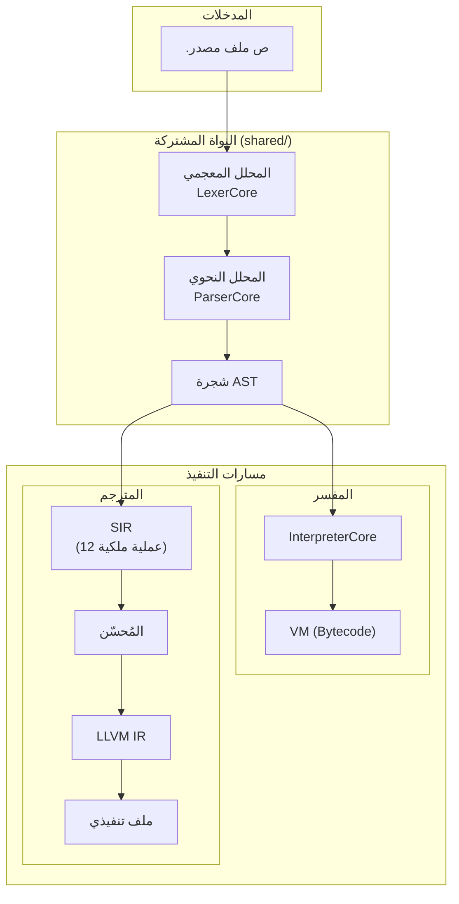

# نظرة عامة على مشروع لغة ص

> **تاريخ التوليد**: 17 أبريل 2026  
> **الإصدار**: 1.0.0  
> **نوع الفحص**: شامل (Exhaustive Scan)

---

## ملخص تنفيذي

**لغة ص (Sad)** هي لغة برمجة عربية حديثة مطورة بـ C++17، تهدف لتقديم تجربة برمجة كاملة باللغة العربية مع دعم كامل للإنجليزية. المشروع يوفر مسارين للتنفيذ:

1. **مفسر مباشر (`sad`)** — تنفيذ شجري سريع للتطوير
2. **مترجم أصلي (`sadc`)** — ترجمة إلى ملف تنفيذي عبر LLVM

---

## الجدول الملخص

| الخاصية | القيمة |
|---------|--------|
| **اللغة الأساسية** | C++17 |
| **نظام البناء** | CMake 3.20+ |
| **المترجم الخلفي** | LLVM 18 |
| **المنصات المدعومة** | Windows, Linux, macOS |
| **الترخيص** | MIT |
| **امتداد الملفات** | `.ص` |
| **الترميز** | UTF-8 |

---

## البنية المعمارية



---

## المكونات الرئيسية

### 1. النواة المشتركة (`shared/`)

المكونات المشتركة بين المفسر والمترجم:

| المجلد | الوظيفة | الملفات الرئيسية |
|--------|---------|------------------|
| `lexer/` | المحلل المعجمي | `token.h`, `lexer_core.h` |
| `parser/` | المحلل النحوي | `parser_core.h`, `parser_classes.h` |
| `ast/` | عقد شجرة AST | `ast_node.h`, `expressions.h`, `statements.h` |
| `types/` | نظام الأنواع | `value.h`, `data_types.h`, `sad_type_system.h` |
| `errors/` | أنواع الأخطاء | `error_types.h` |

### 2. المفسر (`interpreter_new/`)

مفسر شجري يدعم جميع ميزات اللغة:

| المكون | الوظيفة |
|--------|---------|
| `InterpreterCore` | نقطة الدخول الرئيسية |
| `VariableManager` | إدارة المتغيرات والنطاقات |
| `FunctionManager` | إدارة الدوال والاستدعاءات |
| `ScopeManager` | إدارة النطاقات المتداخلة |
| `ExpressionEvaluator` | تقييم التعابير |
| `StatementExecutor` | تنفيذ الجمل |
| `GoroutineManager` | إدارة الخيوط الخفيفة |
| `SadChannel` | القنوات للتزامن |

### 3. المترجم (`compiler_new/`)

مترجم متقدم يحوّل AST إلى ملف تنفيذي أصلي:

| المرحلة | المكون | الوظيفة |
|---------|--------|---------|
| Frontend | `ast_to_sir.cpp` | تحويل AST إلى SIR |
| Middle | `sir_optimizer.cpp` | تحسينات SIR |
| Middle | `sir_borrow_check.cpp` | فحص الاستعارة |
| Backend | `sir_to_llvm.cpp` | تحويل SIR إلى LLVM IR |
| Backend | `targets/` | دعم منصات متعددة |

#### عمليات SIR الـ 12 للملكية:

| # | العملية | الوظيفة | المثال |
|---|---------|---------|--------|
| 1 | `Alloc` | تخصيص ذاكرة | `%0 = Alloc(عدد)` |
| 2 | `Borrow` | استعارة ثابتة | `%1 = Borrow(%0)` |
| 3 | `BorrowMut` | استعارة متغيرة | `%1 = BorrowMut(%0)` |
| 4 | `Move` | نقل الملكية | `%1 = Move(%0)` |
| 5 | `Copy` | نسخ القيمة | `%1 = Copy(%0)` |
| 6 | `Drop` | تحرير الذاكرة | `Drop(%0)` |
| 7 | `Clone` | استنساخ عميق | `%1 = Clone(%0)` |
| 8 | `EndBorrow` | إنهاء الاستعارة | `EndBorrow(%1)` |
| 9 | `Reborrow` | إعادة استعارة | `%2 = Reborrow(%1)` |
| 10 | `Project` | الوصول لحقل | `%1 = Project(%0, "حقل")` |
| 11 | `Deref` | فك المرجع | `%1 = Deref(%ref)` |
| 12 | `Take` | أخذ من حاوية | `%1 = Take(%arr, 0)` |

### 4. المكتبة القياسية (`stdlib/`)

مكتبات عربية شاملة:

| الوحدة | الوظيفة | حالة التحميل |
|--------|---------|--------------|
| `core/` | الأساسيات | تلقائي |
| `io/` | الإدخال والإخراج | تلقائي |
| `math/` | الرياضيات | استيراد |
| `string/` | معالجة النصوص | استيراد |
| `network/` | الشبكات | استيراد |
| `graphics/` | الرسوميات | استيراد |
| `crypto/` | التشفير | استيراد |
| `database/` | قواعد البيانات | استيراد |
| `json/` | معالجة JSON | استيراد |
| `xml/` | معالجة XML | استيراد |

### 5. الأدوات (`tools/`)

أدوات تطوير متكاملة:

| الأداة | الوظيفة | الحالة |
|--------|---------|--------|
| `lsp/` | خادم LSP للمحررات | ✅ مكتمل |
| `formatter/` | تنسيق الكود | ✅ مكتمل |
| `pkg/` | مدير الحزم | ✅ مكتمل |
| `repl/` | الطرفية التفاعلية | ✅ مكتمل |
| `docgen/` | توليد التوثيق | 🔄 قيد التطوير |
| `profiler/` | تحليل الأداء | 🔄 قيد التطوير |

---

## نظام الكلمات المفتاحية

### الكلمات المحجوزة (40 كلمة)

```
دالة، ارجع، صنف، بنية، تعداد، يرث، نهاية، جديد، هذا، باني، الأساس،
إذا، وإلا، بينما، لكل، في، توقف، استمر،
طابق، عندما، افتراضي،
حاول، امسك، ارمي، أخيراً،
عام، خاص، محمي، مجرد،
استورد، من، كـ، صدّر،
متغير، ثابت، ساكن، خارجي،
صحيح، خطأ، لاشيء
```

### العوامل المنطقية (3)

```
و (AND)، أو (OR)، ليس (NOT)
```

### الكلمات السياقية (تعمل كمُعرّفات خارج سياقها)

```
غير_متزامن، انتظر، لامدا، أنتج، مولد، باستخدام،
سمة، نفّذ، قالب، فضاء، نهاية_فضاء،
اختبر، خاصية، احصل، عيّن، هدم، عامل، رئيسية، حالة،
امتداد، ماكرو، أجّل، أطلق، اختر
```

### أسماء الأنواع المدمجة (مُعرّفات عادية)

```
رقم، عشري، نص، منطقي، فراغ، عدم، مصفوفة، خريطة، أي
```

---

## مثال على الكود

```sad
# برنامج مثال بلغة ص

صنف نقطة
    متغير عام س
    متغير عام ص
    
    باني(س، ص)
        هذا.س = س
        هذا.ص = ص
    نهاية
    
    دالة عام المسافة(أخرى)
        متغير فرق_س = هذا.س - أخرى.س
        متغير فرق_ص = هذا.ص - أخرى.ص
        ارجع جذر(فرق_س ** 2 + فرق_ص ** 2)
    نهاية
نهاية

# إنشاء نقطتين
متغير ن1 = نقطة(0، 0)
متغير ن2 = نقطة(3، 4)

# حساب المسافة
اطبع_سطر("المسافة: " + ن1.المسافة(ن2))  # المسافة: 5
```

---

## البناء والتشغيل

### المتطلبات

- CMake 3.20+
- C++17 compiler (MSVC, GCC, Clang)
- LLVM 18 (اختياري، للمترجم)

### أوامر البناء

```powershell
# تهيئة البناء
cmake -S . -B build

# بناء المفسر
cmake --build build --config Debug --target sad

# بناء المترجم
cmake --build build --config Debug --target sadc

# تشغيل ملف
.\build\bin\Debug\sad.exe examples\test_simple.ص
```

### الاختبارات

```powershell
# تفعيل الاختبارات
cmake -S . -B build -DBUILD_TESTS=ON

# بناء وتشغيل الاختبارات
cmake --build build --config Debug --target comprehensive_tests
ctest --test-dir build -R Comprehensive
```

---

## الوثائق ذات الصلة

- [المرجع الكامل للغة](SAD_LANGUAGE_COMPLETE_REFERENCE.md)
- [البرمجة الكائنية](07_البرمجة_الكائنية.md)
- [بنية المترجم](هيكل_المترجم.md)
- [تحليل شجرة المصدر](source-tree-analysis.md)
- [دليل المساهمة](../CONTRIBUTING.md)

---

## الإحصائيات

| المقياس | القيمة |
|---------|--------|
| عدد ملفات المصدر C++ | ~500+ |
| عدد ملفات الوثائق | 1109 |
| عدد الاختبارات | 900+ |
| الكلمات المحجوزة | 40 |
| عمليات SIR | 12 |
| وحدات المكتبة القياسية | 30+ |

---

*تم توليد هذا المستند تلقائياً بواسطة نظام توثيق المشاريع*
