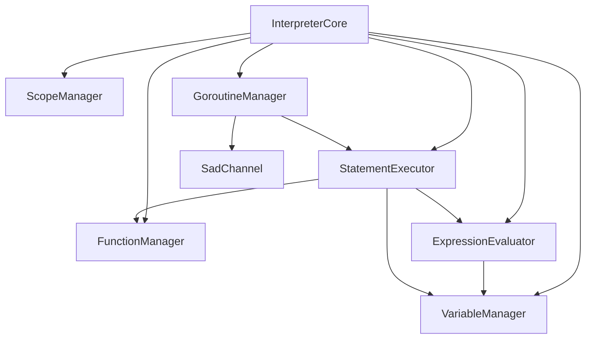

# تحليل شجرة المصدر — لغة ص

> **تاريخ التوليد**: 17 أبريل 2026  
> **نوع التحليل**: شامل (Exhaustive)

---

## ملخص الهيكل

```
s-programming-language/
├── shared/              # النواة المشتركة (Lexer, Parser, AST, Types)
├── interpreter_new/     # المفسر الشجري
├── compiler_new/        # المترجم (SIR → LLVM)
├── stdlib/              # المكتبة القياسية
├── tools/               # أدوات التطوير
├── vm/                  # الآلة الافتراضية
├── runtime_new/         # وقت التشغيل (FFI)
├── graphics/            # مكتبة الرسوميات
├── network/             # مكتبة الشبكات
├── tests/               # الاختبارات
├── docs/                # الوثائق
├── examples/            # الأمثلة
└── cmake/               # وحدات CMake
```

---

## 1. النواة المشتركة (`shared/`)

### 1.1 المحلل المعجمي (`shared/lexer/`)

المسؤول عن تحويل النص إلى رموز (tokens):

```
shared/lexer/
├── include/
│   ├── token.h              # تعريف TokenType و Position
│   ├── lexer_core.h         # واجهة المحلل
│   └── keyword_table.h      # جدول الكلمات المفتاحية
└── src/
    ├── lexer_core.cpp       # التنفيذ الرئيسي
    ├── lexer_keywords.cpp   # تسجيل 40 كلمة محجوزة
    └── lexer_numbers.cpp    # تحليل الأرقام
```

**الوظائف الرئيسية:**

| الملف | الوظيفة |
|-------|---------|
| `token.h` | `enum class TokenType` — 40 كلمة محجوزة + سياقية + أنواع |
| `lexer_core.h` | `LexerCore::tokenize()` — تحويل النص لرموز |
| `lexer_keywords.cpp` | `KeywordTable::initialize()` — ربط الكلمات العربية |

### 1.2 المحلل النحوي (`shared/parser/`)

المسؤول عن بناء شجرة AST:

```
shared/parser/
├── include/
│   ├── parser_core.h        # واجهة المحلل
│   ├── parser_classes.h     # تحليل الأصناف
│   ├── parser_expressions.h # تحليل التعابير
│   └── parser_statements.h  # تحليل الجمل
└── src/
    ├── parser_core.cpp
    ├── parser_classes.cpp
    ├── parser_functions.cpp
    ├── parser_control.cpp
    ├── parser_match.cpp
    └── ...
```

**القواعد النحوية الرئيسية:**

| القاعدة | الملف | الوظيفة |
|---------|-------|---------|
| الأصناف | `parser_classes.cpp` | `parseClassDefinition()` |
| الدوال | `parser_functions.cpp` | `parseFunctionDefinition()` |
| الشروط | `parser_control.cpp` | `parseIfStatement()` |
| الحلقات | `parser_control.cpp` | `parseWhileStatement()`, `parseForEachStatement()` |
| المطابقة | `parser_match.cpp` | `parseMatchStatement()` |

### 1.3 شجرة AST (`shared/ast/`)

عقد شجرة الصيغة المجردة:

```
shared/ast/
├── include/
│   ├── ast_node.h          # العقدة الأساسية
│   ├── expressions.h       # عقد التعابير
│   ├── statements.h        # عقد الجمل
│   ├── declarations.h      # عقد الإعلانات
│   └── visitors/
│       └── ast_visitor.h   # نمط الزائر
└── src/
    ├── ast_node.cpp
    └── ast_printer.cpp
```

**تسلسل الوراثة:**

```
ASTNode (قاعدة)
├── Expression (تعبير)
│   ├── LiteralExpression
│   ├── BinaryExpression
│   ├── UnaryExpression
│   ├── CallExpression
│   ├── MemberAccessExpression
│   ├── LambdaExpression
│   └── ...
├── Statement (جملة)
│   ├── ExpressionStatement
│   ├── IfStatement
│   ├── WhileStatement
│   ├── ForEachStatement
│   ├── MatchStatement
│   ├── TryStatement
│   └── ...
└── Declaration (إعلان)
    ├── VariableDeclaration
    ├── FunctionDeclaration
    ├── ClassDeclaration
    ├── TraitDeclaration
    └── ...
```

### 1.4 نظام الأنواع (`shared/types/`)

```
shared/types/
├── include/
│   ├── value.h             # نوع القيم الموحد (std::variant)
│   ├── data_types.h        # DataType enum
│   └── sad_type_system.h   # نظام الأنواع المتقدم
└── src/
    ├── value.cpp
    └── type_checker.cpp
```

**أنواع القيم (`ValueType`):**

| النوع | الوصف | التمثيل |
|-------|-------|---------|
| `INTEGER` | رقم صحيح | `int64_t` |
| `FLOAT` | عشري | `double` |
| `STRING` | نص | `std::string` |
| `BOOLEAN` | منطقي | `bool` |
| `NULL_TYPE` | لاشيء | `std::monostate` |
| `ARRAY` | مصفوفة | `std::vector<Value>` |
| `MAP` | خريطة | `std::unordered_map<std::string, Value>` |
| `OBJECT` | كائن | `shared_ptr<ObjectInstance>` |
| `LAMBDA` | دالة مجهولة | `LambdaData` |
| `CHANNEL` | قناة | `shared_ptr<SadChannel>` |

---

## 2. المفسر (`interpreter_new/`)

```
interpreter_new/
├── include/
│   ├── core/
│   │   └── interpreter_core.h    # نقطة الدخول
│   ├── managers/
│   │   ├── variable_manager.h    # إدارة المتغيرات
│   │   ├── function_manager.h    # إدارة الدوال
│   │   ├── scope_manager.h       # إدارة النطاقات
│   │   └── ownership_manager.h   # إدارة الملكية
│   ├── visitors/
│   │   ├── expression_evaluator.h
│   │   └── statement_executor.h
│   ├── channel.h                 # القنوات
│   └── goroutine_manager.h       # الخيوط الخفيفة
└── src/
    ├── core/
    ├── managers/
    ├── visitors/
    ├── builtins/                 # الدوال المضمنة
    └── concurrency/              # التزامن
```

**الهيكل التنفيذي:**



**خيارات المفسر (`InterpreterOptions`):**

| الخيار | النوع | الافتراضي | الوصف |
|--------|-------|-----------|-------|
| `debugMode` | `bool` | `false` | وضع التصحيح |
| `ownershipCheck` | `bool` | `true` | فحص الملكية |
| `strictTypes` | `bool` | `false` | فحص الأنواع الصارم |
| `maxRecursion` | `size_t` | `1000` | الحد الأقصى للتكرار |
| `enableConcurrency` | `bool` | `true` | تفعيل التزامن |

---

## 3. المترجم (`compiler_new/`)

```
compiler_new/
├── src/
│   ├── sir/                      # SIR (تمثيل وسيط)
│   │   ├── sir_opcodes.h         # 12 عملية ملكية + 50 عملية أخرى
│   │   ├── sir_types.h           # أنواع SIR
│   │   ├── sir_module.h          # وحدة SIR
│   │   ├── sir_builder.h         # بناء SIR
│   │   ├── ast_to_sir.cpp        # AST → SIR
│   │   ├── sir_optimizer.cpp     # تحسينات
│   │   ├── sir_borrow_check.cpp  # فحص الاستعارة
│   │   └── sir_to_llvm.cpp       # SIR → LLVM IR
│   ├── codegen/                  # توليد الكود
│   │   ├── llvm_codegen.cpp
│   │   └── llvm_helpers.cpp
│   └── targets/                  # المنصات المستهدفة
│       ├── x86_64.cpp
│       ├── arm64.cpp
│       └── wasm.cpp
└── include/
    └── compiler.h                # واجهة المترجم
```

**مراحل الترجمة:**

```
AST → SIR → SIR Optimized → LLVM IR → Machine Code
     ↓          ↓              ↓           ↓
  ast_to_sir  sir_optimizer  sir_to_llvm  llc
```

**فئات عمليات SIR:**

| الفئة | العدد | الأمثلة |
|-------|-------|---------|
| الملكية | 12 | Alloc, Borrow, Move, Drop, Clone |
| الذاكرة | 5 | Load, Store, StackAlloc, HeapAlloc, Free |
| الحسابية | 7 | Add, Sub, Mul, Div, FloorDiv, Mod, Neg |
| المقارنة | 6 | Eq, Ne, Lt, Le, Gt, Ge |
| المنطقية | 8 | And, Or, Not, Xor, BitAnd, BitOr, Shl, Shr |
| التحكم | 8 | Branch, CondBranch, Call, Return, ... |
| الأنواع | 4 | Cast, TypeCheck, Box, Unbox |

---

## 4. المكتبة القياسية (`stdlib/`)

```
stdlib/
├── core/                 # الأساسيات (تلقائي)
│   ├── builtins.ص
│   └── types.ص
├── io/                   # الإدخال والإخراج
│   ├── file.ص
│   ├── stream.ص
│   └── console.ص
├── math/                 # الرياضيات
│   ├── basic.ص
│   ├── trigonometry.ص
│   └── random.ص
├── string/               # النصوص
│   ├── manipulation.ص
│   ├── format.ص
│   └── regex.ص
├── network/              # الشبكات
│   ├── http.ص
│   ├── tcp.ص
│   └── websocket.ص
├── graphics/             # الرسوميات
│   ├── canvas.ص
│   ├── shapes.ص
│   └── image.ص
├── crypto/               # التشفير
│   ├── hash.ص
│   ├── aes.ص
│   └── rsa.ص
└── database/             # قواعد البيانات
    ├── sql.ص
    └── nosql.ص
```

**الدوال المضمنة تلقائياً (بدون استيراد):**

| الفئة | الدوال |
|-------|--------|
| إخراج | `اطبع()`, `اطبع_سطر()` |
| إدخال | `اقرأ()` |
| طول/نوع | `طول()`, `نوع()` |
| تحويل | `رقم()`, `عشري()`, `نص()`, `منطقي()` |
| تزامن | `قناة()`, `انتظر_الكل()`, `مجموعة_انتظار()`, `قفل()`, `مستقبل()` |

---

## 5. الأدوات (`tools/`)

```
tools/
├── lsp/                  # خادم LSP
│   ├── server.cpp
│   ├── semantic_tokens.cpp
│   ├── completion.cpp
│   └── diagnostics.cpp
├── formatter/            # تنسيق الكود
│   ├── formatter.cpp
│   └── rules.cpp
├── pkg/                  # مدير الحزم
│   ├── pkg_manager.cpp
│   ├── registry.cpp
│   └── resolver.cpp
├── repl/                 # الطرفية التفاعلية
│   ├── repl.cpp
│   └── history.cpp
├── compiler/             # واجهة sadc
│   └── main.cpp
└── interpreter/          # واجهة sad
    └── main.cpp
```

---

## 6. الآلة الافتراضية (`vm/`)

```
vm/
├── include/
│   ├── vm_core.h         # نواة الآلة
│   ├── bytecode.h        # تعليمات البايت كود
│   └── stack.h           # المكدس
└── src/
    ├── vm_core.cpp
    ├── bytecode_compiler.cpp
    └── vm_executor.cpp
```

---

## 7. الرسوميات (`graphics/`)

```
graphics/
├── include/
│   ├── canvas.h          # اللوحة
│   ├── shapes.h          # الأشكال
│   ├── text.h            # النص
│   └── image.h           # الصور
├── src/
│   ├── sdl_backend.cpp   # خلفية SDL2
│   └── opengl_backend.cpp
└── third_party/
    └── SDL2/             # مكتبة SDL2
```

---

## 8. الاختبارات (`tests/`)

```
tests/
├── comprehensive/        # اختبارات شاملة (900+)
│   ├── lexer/
│   ├── parser/
│   ├── interpreter/
│   ├── compiler/
│   └── stdlib/
├── unit/                 # اختبارات وحدات
├── integration/          # اختبارات تكامل
├── performance/          # اختبارات أداء
└── fixtures/             # بيانات الاختبار
```

---

## 9. الوثائق (`docs/`)

```
docs/
├── SAD_LANGUAGE_COMPLETE_REFERENCE.md   # المرجع الكامل
├── 07_البرمجة_الكائنية.md                # OOP
├── project-overview.md                   # نظرة عامة
├── source-tree-analysis.md               # هذا الملف
├── هيكل_المترجم.md                       # بنية المترجم
└── api/                                  # وثائق API
    ├── lexer.md
    ├── parser.md
    └── ...
```

---

## 10. CMake (`cmake/`)

```
cmake/
├── llvm.cmake            # إعداد LLVM
├── platform.cmake        # إعداد المنصة
├── tests.cmake           # إعداد الاختبارات
└── executables.cmake     # تجميع الملفات التنفيذية
```

---

## ملخص الإحصائيات

| المكون | الملفات | الأسطر (تقريبي) |
|--------|---------|-----------------|
| shared/ | 80+ | 15,000+ |
| interpreter_new/ | 60+ | 20,000+ |
| compiler_new/ | 50+ | 25,000+ |
| stdlib/ | 100+ | 10,000+ |
| tools/ | 40+ | 8,000+ |
| tests/ | 200+ | 30,000+ |
| **المجموع** | **530+** | **108,000+** |

---

*تم توليد هذا المستند تلقائياً بواسطة نظام توثيق المشاريع*
