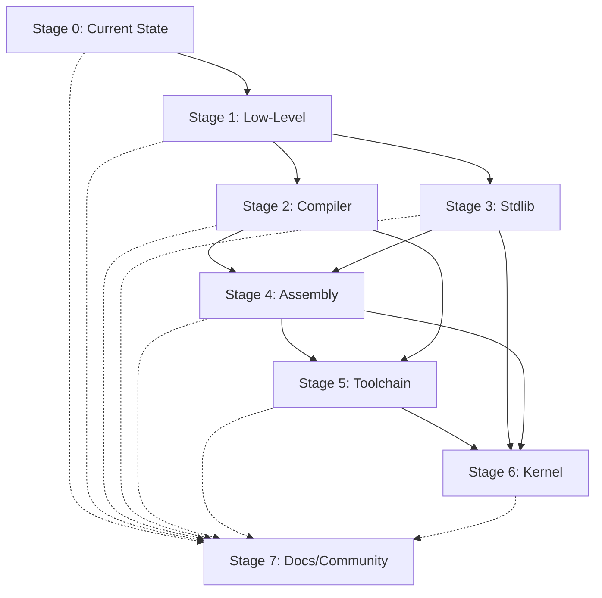

# الجدول الزمني والمراحل
# Timeline & Milestones

**آخر تحديث / Last Updated:** ديسمبر 2025 / December 2025

---

## 📅 نظرة عامة على الجدول الزمني / Timeline Overview

### العربية

المدة الإجمالية المتوقعة: **18-24 شهراً**

```
السنة 1 (Year 1)
├─ Q1: المرحلة 1 - الميزات منخفضة المستوى (3-4 أشهر)
├─ Q2: المرحلة 2 - المترجم الأصلي (4-5 أشهر)
├─ Q3: المرحلة 3 - المكتبة القياسية للنظام (3-4 أشهر)
└─ Q4: بداية المرحلة 4

السنة 2 (Year 2)
├─ Q1: إكمال المرحلة 4 - دعم التجميع (2-3 أشهر)
│      + المرحلة 5 - أدوات البناء (2-3 أشهر)
├─ Q2-Q3: المرحلة 6 - Kernel تجريبي (2-3 أشهر)
└─ Q4: اختبارات، تحسينات، توثيق

المرحلة 7: التوثيق والمجتمع (مستمر طوال المشروع)
```

### English

Total Expected Duration: **18-24 months**

```
Year 1
├─ Q1: Stage 1 - Low-Level Features (3-4 months)
├─ Q2: Stage 2 - Native Compiler (4-5 months)
├─ Q3: Stage 3 - System Stdlib (3-4 months)
└─ Q4: Start Stage 4

Year 2
├─ Q1: Complete Stage 4 - Assembly (2-3 months)
│      + Stage 5 - Toolchain (2-3 months)
├─ Q2-Q3: Stage 6 - Experimental Kernel (2-3 months)
└─ Q4: Testing, Refinements, Documentation

Stage 7: Documentation & Community (ongoing throughout)
```

---

## 📊 Gantt Chart التفصيلي / Detailed Gantt Chart

### العربية

```
المرحلة / Stage                    │ M1  M2  M3  M4  M5  M6  M7  M8  M9  M10 M11 M12 M13 M14 M15 M16 M17 M18
═══════════════════════════════════╪═════════════════════════════════════════════════════════════════════════
1. Low-Level Features              │ ████████████
   - Pointers                      │ ████
   - Bitwise Operations            │     ████
   - Memory Mapping                │         ████
   - I/O Ports                     │             ████
   - Interrupt Handling            │                 ████
───────────────────────────────────┼─────────────────────────────────────────────────────────────────────────
2. Native Compiler                 │             ████████████████
   - LLVM Integration              │             ████████
   - Binary Output                 │                     ████████
   - Cross-Compilation             │                             ████
   - Bootloader Support            │                                 ████
───────────────────────────────────┼─────────────────────────────────────────────────────────────────────────
3. System Stdlib                   │                                 ████████████
   - Memory Management             │                                 ████████
   - Process Management            │                                         ████████
   - File System                   │                                                 ████
   - Networking                    │                                                     ████
   - Device Drivers                │                                                         ████
───────────────────────────────────┼─────────────────────────────────────────────────────────────────────────
4. Assembly Support                │                                                             ████████
   - Inline Assembly               │                                                             ████
   - External ASM                  │                                                                 ████
───────────────────────────────────┼─────────────────────────────────────────────────────────────────────────
5. Build Tools                     │                                                                 ████████
   - Cross-Compiler                │                                                                 ████
   - Custom Linker                 │                                                                     ████
   - Bootloader Integration        │                                                                         ████
───────────────────────────────────┼─────────────────────────────────────────────────────────────────────────
6. Experimental Kernel             │                                                                         ████████████
   - Boot & Init                   │                                                                         ████
   - Memory Mgmt                   │                                                                             ████
   - Interrupts & Drivers          │                                                                                 ████
   - Process Mgmt & Shell          │                                                                                     ████
───────────────────────────────────┼─────────────────────────────────────────────────────────────────────────
7. Documentation & Community       │ ████████████████████████████████████████████████████████████████████████
   - Basic Docs                    │ ████████████
   - Tutorials                     │         ████████████
   - API Reference                 │                 ████████████
   - Videos                        │                         ████████████
   - Community Building            │     ████████████████████████████████████████████████████████████████
───────────────────────────────────┼─────────────────────────────────────────────────────────────────────────
Testing & QA                       │ ████████████████████████████████████████████████████████████████████████
```

### English

Same chart with progress indicators:
- `█` = Work in progress
- `░` = Planned
- `✓` = Completed

---

## 🎯 المعالم الرئيسية / Major Milestones

### Milestone 1: Low-Level Support (Month 4)

#### العربية
**التاريخ المستهدف:** نهاية الشهر 4

**الإنجازات:**
- ✅ Pointers functional
- ✅ Bitwise operations working
- ✅ Memory mapping implemented
- ✅ I/O ports accessible
- ✅ Interrupt handling ready

**Deliverables:**
- Working pointer system
- Complete bitwise ops
- Memory allocator
- I/O port library
- Interrupt framework

**Success Criteria:**
- All features tested
- Documentation complete
- Examples provided
- Performance benchmarks passed

---

### Milestone 2: Native Compiler (Month 8-9)

#### العربية
**التاريخ المستهدف:** نهاية الشهر 9

**الإنجازات:**
- ✅ LLVM backend integrated
- ✅ ELF/PE binaries produced
- ✅ Cross-compilation working
- ✅ Bootable binaries created

**Deliverables:**
- sadc compiler binary
- Cross-compiler support
- Binary output tools
- Bootloader integration

**Success Criteria:**
- Produces valid binaries
- Cross-compiles to x86-64/ARM
- Bootable on QEMU
- Performance acceptable

---

### Milestone 3: System Stdlib (Month 13)

#### العربية
**التاريخ المستهدف:** نهاية الشهر 13

**الإنجازات:**
- ✅ Memory management APIs
- ✅ Process/thread management
- ✅ File system operations
- ✅ Network stack
- ✅ Device driver framework

**Deliverables:**
- Complete stdlib modules
- API documentation
- Code examples
- Performance tests

**Success Criteria:**
- All modules functional
- APIs stable
- Good performance
- Well documented

---

### Milestone 4: Complete Toolchain (Month 16)

#### العربية
**التاريخ المستهدف:** نهاية الشهر 16

**الإنجازات:**
- ✅ Assembly support complete
- ✅ Full toolchain ready
- ✅ Build system working
- ✅ Debugging tools available

**Deliverables:**
- sadc, sad-ld, sad-mkiso
- Build scripts
- Debugger integration
- Package manager

**Success Criteria:**
- Toolchain complete
- Easy to use
- Well integrated
- Documented

---

### Milestone 5: Experimental Kernel (Month 18)

#### العربية
**التاريخ المستهدف:** نهاية الشهر 18

**الإنجازات:**
- ✅ Kernel boots
- ✅ Memory management works
- ✅ Drivers functional
- ✅ Shell responsive
- ✅ Basic multitasking

**Deliverables:**
- Bootable kernel
- ISO image
- Source code
- Documentation
- Video demo

**Success Criteria:**
- Stable boot
- No critical bugs
- Good performance
- Usable shell
- Demo-ready

---

## 🔄 الاعتماديات / Dependencies

### العربية



**Critical Path (المسار الحرج):**
```
Stage 1 → Stage 2 → Stage 4 → Stage 5 → Stage 6
        ↘ Stage 3 ↗
```

**Parallel Tracks (المسارات المتوازية):**
- Stage 3 can start during Stage 2
- Stage 7 runs continuously
- Testing happens throughout

---

## 📅 تقويم الإصدارات / Release Calendar

### العربية

#### Version 1.0 - "Foundation" (Month 4)
**المحتوى:**
- Low-level features complete
- Basic interpreter enhanced
- Pointer system
- Memory management basics

**Release Date:** شهر 4 / Month 4

---

#### Version 2.0 - "Compiler" (Month 9)
**المحتوى:**
- Native compiler (sadc)
- LLVM backend
- Binary output
- Cross-compilation

**Release Date:** شهر 9 / Month 9

---

#### Version 3.0 - "System" (Month 13)
**المحتوى:**
- System standard library
- Process management
- File I/O
- Networking

**Release Date:** شهر 13 / Month 13

---

#### Version 4.0 - "Toolchain" (Month 16)
**المحتوى:**
- Complete toolchain
- Assembly support
- Build tools
- Debugger integration

**Release Date:** شهر 16 / Month 16

---

#### Version 5.0 - "SadOS" (Month 18)
**المحتوى:**
- Experimental kernel
- Bootable OS
- Device drivers
- Shell

**Release Date:** شهر 18 / Month 18

---

## 👥 تخصيص الموارد / Resource Allocation

### العربية

#### الفريق المقترح / Suggested Team

**Core Team (6-8 أفراد):**

1. **Lead Developer (1)**
   - Overall architecture
   - Critical decisions
   - Code reviews

2. **Compiler Engineers (2)**
   - LLVM integration
   - Code generation
   - Optimization

3. **System Programmers (2)**
   - Stdlib implementation
   - Kernel development
   - Driver development

4. **Tools Developer (1)**
   - Build tools
   - Debugger
   - Package manager

5. **Documentation & Community (2)**
   - Technical writing
   - Tutorials
   - Community management

**Additional Support:**

- QA Engineers (2)
- UI/UX Designer (1)
- DevOps Engineer (1)

### English

**Team Structure:**
- 1 Lead Developer
- 2 Compiler Engineers
- 2 System Programmers
- 1 Tools Developer
- 2 Docs/Community Managers
- 2 QA Engineers
- 1 Designer
- 1 DevOps

**Total:** 10-12 people

---

## 💰 تقدير الميزانية / Budget Estimate

### العربية

#### التكاليف المتوقعة (18 شهر)

**الرواتب:**
- Core Team (8 × $5000/month × 18) = $720,000
- Support Team (4 × $4000/month × 18) = $288,000
- **Total Salaries:** $1,008,000

**البنية التحتية:**
- Servers & Cloud: $5,000/month × 18 = $90,000
- Tools & Licenses: $50,000
- **Total Infrastructure:** $140,000

**التسويق والمجتمع:**
- Website & Hosting: $10,000
- Events & Meetups: $30,000
- Marketing: $50,000
- **Total Marketing:** $90,000

**متفرقات:**
- Contingency (10%): $123,800

**الإجمالي الكلي:** ~$1,361,800

### English

**Budget Breakdown (18 months):**

1. **Personnel:** $1,008,000
2. **Infrastructure:** $140,000
3. **Marketing:** $90,000
4. **Contingency:** $123,800

**Grand Total:** ~$1,361,800

**Alternative (Smaller Team):**
- 4-5 developers: ~$600,000
- Reduced infrastructure: ~$50,000
- Minimal marketing: ~$20,000
- **Total:** ~$670,000

---

## ⚠️ المخاطر والتخفيف / Risks & Mitigation

### العربية

#### Risk 1: تأخير التطوير
**احتمالية:** متوسطة  
**التأثير:** عالي

**استراتيجية التخفيف:**
- Weekly progress reviews
- Clear milestones
- Buffer time in schedule
- Parallel development tracks

---

#### Risk 2: مشاكل تقنية (LLVM integration)
**احتمالية:** عالية  
**التأثير:** عالي

**استراتيجية التخفيف:**
- Early prototyping
- Expert consultation
- Alternative backends (QBE, Cranelift)
- Incremental integration

---

#### Risk 3: قلة المساهمين
**احتمالية:** متوسطة  
**التأثير:** متوسط

**استراتيجية التخفيف:**
- Good documentation
- Easy onboarding
- Hacktoberfest participation
- University partnerships
- Bounty programs

---

#### Risk 4: منافسة من لغات أخرى
**احتمالية:** عالية  
**التأثير:** متوسط

**استراتيجية التخفيف:**
- Unique Arabic support
- Focus on OS development
- Strong community
- Regular releases
- Innovation

---

## 📈 مؤشرات الأداء / KPIs

### العربية

**Technical KPIs:**
- Code coverage: >80%
- Build success rate: >95%
- Performance benchmarks: meet targets
- Bug fix time: <1 week

**Community KPIs:**
- GitHub stars: >1000 (6 months)
- Contributors: >50 (12 months)
- Discord members: >500 (12 months)
- Download count: >10,000 (18 months)

**Documentation KPIs:**
- Doc coverage: >90%
- Tutorial count: >50
- Video views: >10,000
- User satisfaction: >4.5/5

### English

**Track monthly:**
- Feature completion rate
- Bug count & severity
- Test coverage
- Performance metrics
- Community growth
- Documentation updates

---

## 🔄 عملية المراجعة / Review Process

### العربية

**Weekly Reviews:**
- Progress against timeline
- Blockers identification
- Resource reallocation
- Risk assessment

**Monthly Reviews:**
- Milestone progress
- Budget review
- Community feedback
- Roadmap adjustments

**Quarterly Reviews:**
- Strategic assessment
- Major decisions
- Long-term planning
- External stakeholder updates

### English

**Regular Reviews:**
- Weekly: Team sync
- Monthly: Milestone review
- Quarterly: Strategic planning
- Annual: Major assessment

---

## 📞 جهات الاتصال / Contact Points

### العربية

**Project Lead:**
- Email: lead@sadlang.org
- Discord: @sad_lead

**Technical Lead:**
- Email: tech@sadlang.org
- GitHub: @sad-tech

**Community Manager:**
- Email: community@sadlang.org
- Twitter: @sadlang

**General Inquiries:**
- Email: info@sadlang.org
- Website: https://sadlang.org

### English

**Contact Channels:**
- General: info@sadlang.org
- Technical: tech@sadlang.org
- Community: community@sadlang.org
- Press: press@sadlang.org

---

**السابق / Previous:** [المرحلة 7: التوثيق والمجتمع](07_stage7_documentation.md)  
**التالي / Next:** [المواصفات التقنية](09_technical_specs.md)
