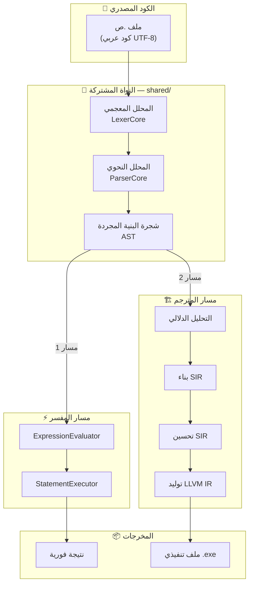
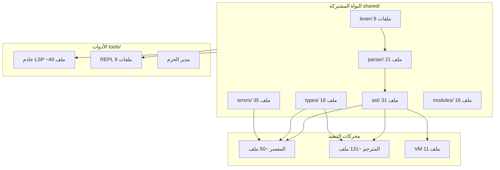

# فهرس بنية مشروع لغة ص — دليل المطوّر الشامل

> **الإصدار:** 1.0  
> **التاريخ:** يوليو 2025  
> **الغرض:** خارطة شاملة لجميع أنظمة المشروع — الملفات، المسؤوليات، مسارات البيانات، نقاط الدخول

---

## لماذا هذا التوثيق؟

مشروع لغة ص يحتوي **~250+ ملف C++** و **~105,000+ سطر كود** موزعة على 10 أنظمة رئيسية.
هذا المجلد يعمل كـ **دليل مطوّر عملي** — ليس تقريراً تحليلياً بل مرجع يومي:

- **أين** يوجد كل نظام؟ (المسارات)
- **ماذا** يفعل كل ملف؟ (المسؤوليات)
- **كيف** تتصل المكونات؟ (تدفق البيانات)
- **من أين** تبدأ عند إصلاح/إضافة ميزة؟ (نقاط الدخول)

---

## مسار البيانات الرئيسي (Pipeline)

```
ملف .ص (كود مصدري)
    │
    ▼
┌─────────────────────────────────────────────────┐
│  المحلل المعجمي (Lexer)                         │
│  shared/lexer/ → Token stream                   │
│  3 headers + 5 source files                     │
│  📄 المحلل_المعجمي.md                           │
└────────────────────┬────────────────────────────┘
                     │ std::vector<Token>
                     ▼
┌─────────────────────────────────────────────────┐
│  المحلل النحوي (Parser)                         │
│  shared/parser/ → AST                           │
│  6 headers + 4 مجلدات (15+ source files)        │
│  📄 المحلل_النحوي.md                            │
└────────────────────┬────────────────────────────┘
                     │ AST::StmtList
                     ▼
┌─────────────────────────────────────────────────┐
│  شجرة البنية المجردة (AST)                      │
│  shared/ast/ → ASTNode hierarchy                │
│  20 headers + 11 source files                   │
│  📄 شجرة_البنية_المجردة.md                      │
└────────────┬───────────────────┬────────────────┘
             │                   │
     ┌───────▼──────┐    ┌──────▼───────────────┐
     │   المفسر     │    │   المترجم (sadc)     │
     │ interpreter  │    │   compiler_new       │
     │   _new/      │    │                      │
     └───────┬──────┘    └──────┬───────────────┘
             │                   │
             ▼                   ▼
     ┌──────────────┐    ┌──────────────────────┐
     │  تنفيذ مباشر │    │  AST → SIR → LLVM   │
     │  + VM بايتكود│    │  → ملف تنفيذي .exe  │
     └──────────────┘    └──────────────────────┘
```

---

## خريطة الأنظمة (10 أنظمة)

### النواة المشتركة — `shared/`
مكونات مشتركة بين المفسر والمترجم وجميع الأدوات.

| # | النظام الفرعي | المجلد | الملفات | ملف التوثيق |
|---|--------------|--------|---------|------------|
| 1 | المحلل المعجمي | `shared/lexer/` | 8 | [المحلل_المعجمي.md](المحلل_المعجمي.md) |
| 2 | المحلل النحوي | `shared/parser/` | 21+ | [المحلل_النحوي.md](المحلل_النحوي.md) |
| 3 | شجرة البنية المجردة | `shared/ast/` | 31 | [شجرة_البنية_المجردة.md](شجرة_البنية_المجردة.md) |
| 4 | نظام الأنواع | `shared/types/` | 18 | [نظام_الأنواع.md](نظام_الأنواع.md) |
| 5 | نظام الأخطاء | `shared/errors/` | 35 | [نظام_الأخطاء.md](نظام_الأخطاء.md) |
| 6 | نظام الوحدات | `shared/modules/` | 16 | [نظام_الوحدات.md](نظام_الوحدات.md) |

### المفسر — `interpreter_new/`
مفسر شجري (tree-walking) ينفذ AST مباشرة.

| # | النظام الفرعي | المجلد | الملفات | ملف التوثيق |
|---|--------------|--------|---------|------------|
| 7 | النواة | `interpreter_new/src/core/` | 3 | [المفسر_النواة.md](المفسر_النواة.md) |
| 8 | الزوار | `interpreter_new/src/visitors/` | 10 | [المفسر_الزوار.md](المفسر_الزوار.md) |
| 9 | المديرون | `interpreter_new/src/managers/` | 6 | [المفسر_المديرون.md](المفسر_المديرون.md) |
| 10 | الدوال المدمجة | `interpreter_new/src/builtins/` | 31 | [المفسر_الدوال_المدمجة.md](المفسر_الدوال_المدمجة.md) |

### المترجم — `compiler_new/`
يحوّل AST إلى SIR ثم LLVM IR ثم ملف تنفيذي أصلي.

| # | النظام الفرعي | المجلد | الملفات | ملف التوثيق |
|---|--------------|--------|---------|------------|
| 11 | واجهة SIR | `compiler_new/src/frontend/` | 41 | [المترجم_واجهة_SIR.md](المترجم_واجهة_SIR.md) |
| 12 | خلفية LLVM | `compiler_new/src/backend/llvm/` | 55 | [المترجم_خلفية_LLVM.md](المترجم_خلفية_LLVM.md) |
| 13 | التحليل الدلالي | `compiler_new/src/semantic/` | 10 | [المترجم_التحليل_الدلالي.md](المترجم_التحليل_الدلالي.md) |
| 14 | المحسنات | `compiler_new/src/optimizer/` + `middle/` | 25 | [المترجم_المحسنات.md](المترجم_المحسنات.md) |

### أنظمة مساعدة

| # | النظام | المجلد | ملف التوثيق |
|---|--------|--------|------------|
| 15 | الآلة الافتراضية | `vm/` | [الآلة_الافتراضية.md](الآلة_الافتراضية.md) |
| 16 | الأدوات | `tools/` | [الأدوات.md](الأدوات.md) |
| 17 | المكتبة القياسية | `stdlib/` | [المكتبة_القياسية.md](المكتبة_القياسية.md) |
| 18 | وقت التشغيل | `runtime_new/` | [وقت_التشغيل.md](وقت_التشغيل.md) |
| 19 | نظام البناء | `cmake/` | [نظام_البناء.md](نظام_البناء.md) |
| 20 | نظام الاختبارات | `tests/` | [نظام_الاختبارات.md](نظام_الاختبارات.md) |
| 12 | خلفية LLVM | `compiler_new/src/backend/llvm/` | 55 | [المترجم_خلفية_LLVM.md](المترجم_خلفية_LLVM.md) |
| 13 | التحليل الدلالي | `compiler_new/src/semantic/` | 10 | [المترجم_التحليل_الدلالي.md](المترجم_التحليل_الدلالي.md) |
| 14 | المحسنات | `compiler_new/src/optimizer/` + `middle/` | 19 | [المترجم_المحسنات.md](المترجم_المحسنات.md) |

### أنظمة مساعدة

| # | النظام | المجلد | ملف التوثيق |
|---|--------|--------|------------|
| 15 | الآلة الافتراضية | `vm/` | [الآلة_الافتراضية.md](الآلة_الافتراضية.md) |
| 16 | الأدوات | `tools/` | [الأدوات.md](الأدوات.md) |
| 17 | المكتبة القياسية | `stdlib/` | [المكتبة_القياسية.md](المكتبة_القياسية.md) |
| 18 | وقت التشغيل | `runtime_new/` | [وقت_التشغيل.md](وقت_التشغيل.md) |
| 19 | نظام البناء | `cmake/` | [نظام_البناء.md](نظام_البناء.md) |
| 20 | نظام الاختبارات | `tests/` | [نظام_الاختبارات.md](نظام_الاختبارات.md) |

---

## الأسماء الفرعية (Namespaces)

```
Sad::
├── Lexer::          ← shared/lexer/     (LexerCore, Token, Position, KeywordTable)
├── Parser::         ← shared/parser/    (ParserCore)
├── AST::            ← shared/ast/       (ASTNode, جميع عقد التعابير والجمل)
├── Data::           ← shared/types/     (Value, ObjectInstance, ClassType, FunctionRef)
├── Types::          ← shared/types/     (SadTypeSystem, SadTypeKind, DataType)
├── Errors::         ← shared/errors/    (ErrorManager, SmartErrors, TeacherMode)
├── Modules::        ← shared/modules/   (ModuleLoader, ModuleResolver, SymbolResolver)
├── Interpreter::    ← interpreter_new/  (InterpreterCore, ExpressionEvaluator, StatementExecutor)
├── Compiler::       ← compiler_new/
│   ├── SIR::        ← src/sir/          (SIRModule, SIROpcode, SIRInstruction)
│   └── LLVM::       ← src/backend/llvm/ (LLVMCodeGen)
└── VM::             ← vm/               (VMExecutor, VMCompiler, JIT)
```

---

## كيف تبحث عن شيء محدد؟

| أريد أن... | ابدأ من |
|------------|--------|
| أضيف كلمة مفتاحية محجوزة | `shared/lexer/include/token.h` → `shared/lexer/src/lexer_keywords.cpp` → parser |
| أضيف كلمة سياقية | `token.h` (enum فقط) → parser بنمط التحقق المزدوج |
| أصلح خطأ في التحليل النحوي | `shared/parser/src/` → حسب نوع العقدة (declarations/ أو statements/ أو core/) |
| أصلح خطأ وقت التشغيل | `interpreter_new/src/visitors/` → expression_evaluator أو statement_executor |
| أصلح خطأ في المترجم (SIR) | `compiler_new/src/frontend/sir_builder_*.cpp` |
| أصلح خطأ في LLVM IR | `compiler_new/src/backend/llvm/llvm_codegen_*.cpp` |
| أضيف دالة مدمجة | `interpreter_new/src/builtins/builtin_registry.cpp` + ملف الوحدة |
| أضيف نوع AST جديد | `shared/ast/include/` (header) + `shared/ast/src/` (cpp) + visitors |
| أعدّل نظام الأنواع | `shared/types/include/value.h` + `sad_type_system.h` |
| أضيف اختبار dual | `tests/dual_execution/core/` |
| أعدّل LSP | `tools/lsp/` |

---

## ملفات يجب قراءتها أولاً (Top 10)

1. **`shared/lexer/include/token.h`** — جميع أنواع الرموز و Position
2. **`shared/types/include/value.h`** — نوع القيم الموحد في وقت التشغيل
3. **`shared/ast/include/ast_node.h`** — الصنف الأساسي لجميع عقد AST
4. **`shared/parser/include/parser_core.h`** — واجهة المحلل النحوي
5. **`interpreter_new/include/core/interpreter_core.h`** — نقطة دخول المفسر
6. **`interpreter_new/include/visitors/statement_executor.h`** — منفذ الجمل
7. **`interpreter_new/include/visitors/expression_evaluator.h`** — مقيّم التعابير
8. **`compiler_new/src/frontend/sir_builder_module.cpp`** — نقطة دخول بناء SIR
9. **`compiler_new/src/sir/sir_opcodes.h`** — تعليمات SIR الـ 12
10. **`compiler_new/src/backend/llvm/llvm_codegen_instructions.cpp`** — ترجمة SIR→LLVM

---

## الاعتمادات بين الأنظمة

```
shared/lexer ──→ shared/parser ──→ shared/ast
     │                │                │
     └────────────────┴────────────────┤
                                       ├──→ interpreter_new (تنفيذ مباشر)
                                       │        │
                                       │        ├──→ shared/types (Value)
                                       │        ├──→ shared/errors (ErrorManager)
                                       │        └──→ shared/modules (ModuleLoader)
                                       │
                                       └──→ compiler_new (تجميع)
                                                │
                                                ├──→ frontend/ (AST→SIR)
                                                ├──→ semantic/ (فحص أنواع+ملكية)
                                                ├──→ optimizer/ (تحسين SIR)
                                                └──→ backend/llvm/ (SIR→LLVM IR→exe)
```

---

## المخططات البصرية

### مسار البيانات الرئيسي (Pipeline)



### خريطة العلاقات بين الأنظمة



📄 للمخططات التفصيلية ومسار الكود الكامل على كل المنصات: [مسار_الكود_والمنصات.md](مسار_الكود_والمنصات.md)

---

## اصطلاحات هذا التوثيق

- **📁** = مجلد
- **📄** = ملف header (.h / .hpp)
- **📝** = ملف تنفيذ (.cpp)
- **🔗** = يعتمد على
- **⚡** = نقطة دخول رئيسية
- **⚠️** = ملاحظة مهمة
- كل ملف توثيق يتبع نفس البنية: نظرة عامة → جدول الملفات → الدوال الرئيسية → العلاقات → نقاط الامتداد
