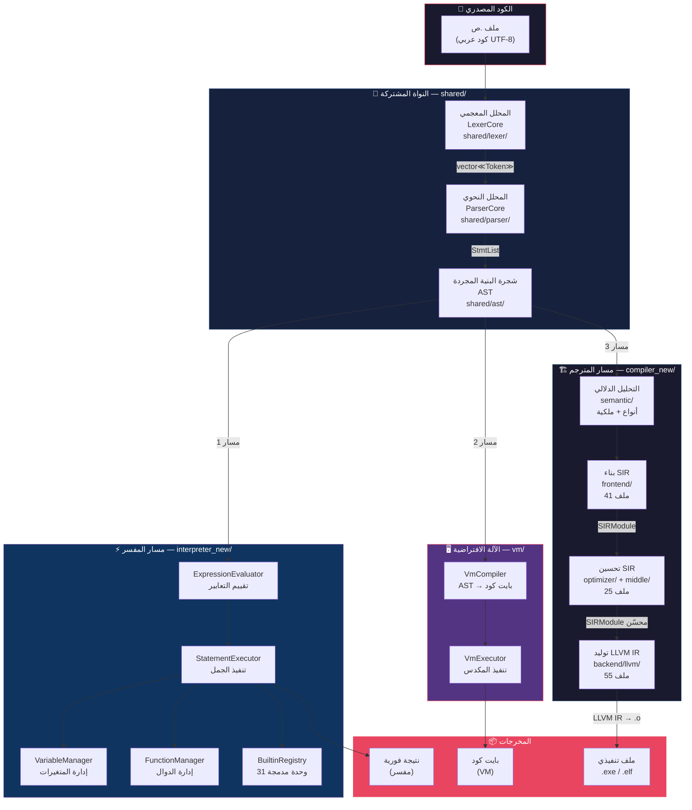

```mermaid
flowchart TB
    subgraph SRC["📝 الكود المصدري"]
        A["ملف .ص\n(كود عربي UTF-8)"]
    end

    subgraph SHARED["🔧 النواة المشتركة — shared/"]
        B["المحلل المعجمي\nLexerCore\nshared/lexer/"]
        C["المحلل النحوي\nParserCore\nshared/parser/"]
        D["شجرة البنية المجردة\nAST\nshared/ast/"]
    end

    subgraph INTERP["⚡ مسار المفسر — interpreter_new/"]
        E["ExpressionEvaluator\nتقييم التعابير"]
        F["StatementExecutor\nتنفيذ الجمل"]
        G["VariableManager\nإدارة المتغيرات"]
        H["FunctionManager\nإدارة الدوال"]
        I["BuiltinRegistry\n31 وحدة مدمجة"]
    end

    subgraph VM_PATH["🖥️ الآلة الافتراضية — vm/"]
        J["VmCompiler\nAST → بايت كود"]
        K["VmExecutor\nتنفيذ المكدس"]
    end

    subgraph COMPILER["🏗️ مسار المترجم — compiler_new/"]
        L["التحليل الدلالي\nsemantic/\nأنواع + ملكية"]
        M["بناء SIR\nfrontend/\n41 ملف"]
        N["تحسين SIR\noptimizer/ + middle/\n25 ملف"]
        O["توليد LLVM IR\nbackend/llvm/\n55 ملف"]
    end

    subgraph OUTPUT["📦 المخرجات"]
        P["نتيجة فورية\n(مفسر)"]
        Q["بايت كود\n(VM)"]
        R["ملف تنفيذي\n.exe / .elf"]
    end

    A --> B
    B -->|"vector≪Token≫"| C
    C -->|"StmtList"| D

    D -->|"مسار 1"| E
    E --> F
    F --> G
    F --> H
    F --> I
    F --> P

    D -->|"مسار 2"| J
    J --> K
    K --> Q

    D -->|"مسار 3"| L
    L --> M
    M -->|"SIRModule"| N
    N -->|"SIRModule محسّن"| O
    O -->|"LLVM IR → .o"| R

    style SRC fill:#1a1a2e,stroke:#e94560,color:#fff
    style SHARED fill:#16213e,stroke:#0f3460,color:#fff
    style INTERP fill:#0f3460,stroke:#533483,color:#fff
    style VM_PATH fill:#533483,stroke:#e94560,color:#fff
    style COMPILER fill:#1a1a2e,stroke:#0f3460,color:#fff
    style OUTPUT fill:#e94560,stroke:#fff,color:#fff
```
