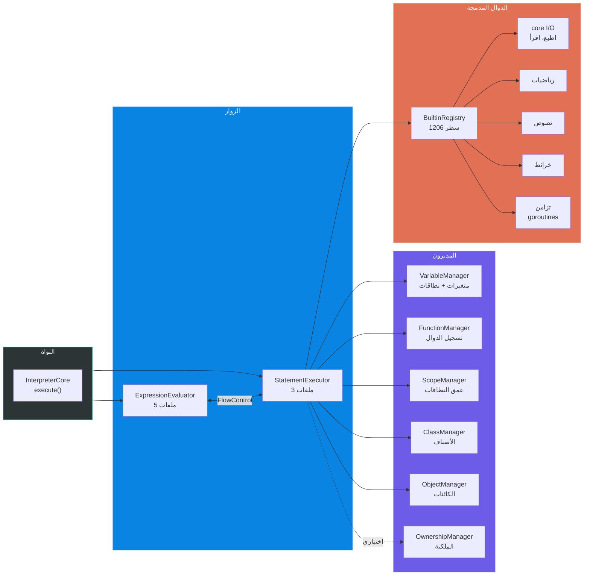

```mermaid
flowchart LR
    subgraph INTERP_CORE["النواة"]
        IC["InterpreterCore\nexecute()"]
    end

    subgraph VISITORS["الزوار"]
        EE["ExpressionEvaluator\n5 ملفات"]
        SE["StatementExecutor\n3 ملفات"]
    end

    subgraph MANAGERS["المديرون"]
        VM["VariableManager\nمتغيرات + نطاقات"]
        FM["FunctionManager\nتسجيل الدوال"]
        SM["ScopeManager\nعمق النطاقات"]
        CM["ClassManager\nالأصناف"]
        OM["ObjectManager\nالكائنات"]
        OWN["OwnershipManager\nالملكية"]
    end

    subgraph BUILTINS["الدوال المدمجة"]
        BR["BuiltinRegistry\n1206 سطر"]
        B1["core I/O\nاطبع، اقرأ"]
        B2["رياضيات"]
        B3["نصوص"]
        B4["خرائط"]
        B5["تزامن\ngoroutines"]
    end

    IC --> EE
    IC --> SE
    EE <-->|"FlowControl"| SE
    SE --> VM
    SE --> FM
    SE --> SM
    SE --> CM
    SE --> OM
    SE -.->|"اختياري"| OWN
    SE --> BR
    BR --> B1
    BR --> B2
    BR --> B3
    BR --> B4
    BR --> B5

    style INTERP_CORE fill:#2d3436,stroke:#00b894,color:#fff
    style VISITORS fill:#0984e3,stroke:#74b9ff,color:#fff
    style MANAGERS fill:#6c5ce7,stroke:#a29bfe,color:#fff
    style BUILTINS fill:#e17055,stroke:#fab1a0,color:#fff
```
