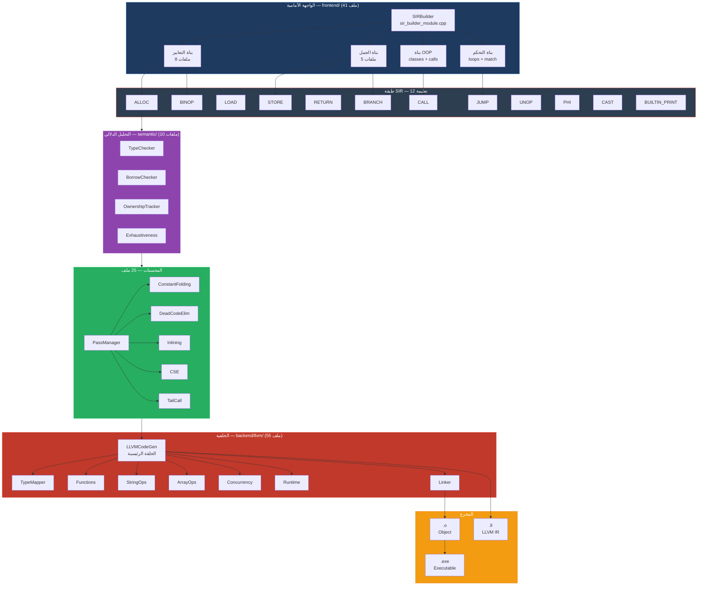

```mermaid
flowchart TB
    subgraph FRONTEND["الواجهة الأمامية — frontend/ (41 ملف)"]
        SB["SIRBuilder\nsir_builder_module.cpp"]
        EXPR["بناة التعابير\n8 ملفات"]
        STMT["بناة الجمل\n5 ملفات"]
        OOP_B["بناة OOP\nclasses + calls"]
        CTRL["بناة التحكم\nloops + match"]
    end

    subgraph SIR_LAYER["طبقة SIR — 12 تعليمة"]
        S1["ALLOC"]
        S2["STORE"]
        S3["LOAD"]
        S4["CALL"]
        S5["RETURN"]
        S6["BRANCH"]
        S7["JUMP"]
        S8["BINOP"]
        S9["UNOP"]
        S10["PHI"]
        S11["CAST"]
        S12["BUILTIN_PRINT"]
    end

    subgraph SEMANTIC["التحليل الدلالي — semantic/ (10 ملفات)"]
        TC["TypeChecker"]
        BC["BorrowChecker"]
        OT["OwnershipTracker"]
        EX["Exhaustiveness"]
    end

    subgraph OPTIMIZER["المحسنات — 25 ملف"]
        PM["PassManager"]
        CF["ConstantFolding"]
        DCE["DeadCodeElim"]
        INL["Inlining"]
        CSE["CSE"]
        TC2["TailCall"]
    end

    subgraph BACKEND["الخلفية — backend/llvm/ (55 ملف)"]
        CG["LLVMCodeGen\nالحلقة الرئيسية"]
        TM["TypeMapper"]
        FN["Functions"]
        STR["StringOps"]
        ARR["ArrayOps"]
        CON["Concurrency"]
        RT["Runtime"]
        LNK["Linker"]
    end

    subgraph OUT["المخرج"]
        IR[".ll\nLLVM IR"]
        OBJ[".o\nObject"]
        EXE[".exe\nExecutable"]
    end

    SB --> EXPR
    SB --> STMT
    SB --> OOP_B
    SB --> CTRL

    EXPR --> S1
    EXPR --> S8
    STMT --> S2
    STMT --> S6
    OOP_B --> S4
    CTRL --> S7

    S1 --> SEMANTIC
    SEMANTIC --> OPTIMIZER
    PM --> CF
    PM --> DCE
    PM --> INL
    PM --> CSE
    PM --> TC2

    OPTIMIZER --> CG
    CG --> TM
    CG --> FN
    CG --> STR
    CG --> ARR
    CG --> CON
    CG --> RT
    CG --> LNK

    CG --> IR
    LNK --> OBJ
    OBJ --> EXE

    style FRONTEND fill:#1e3a5f,stroke:#4a90d9,color:#fff
    style SIR_LAYER fill:#2c3e50,stroke:#e74c3c,color:#fff
    style SEMANTIC fill:#8e44ad,stroke:#9b59b6,color:#fff
    style OPTIMIZER fill:#27ae60,stroke:#2ecc71,color:#fff
    style BACKEND fill:#c0392b,stroke:#e74c3c,color:#fff
    style OUT fill:#f39c12,stroke:#e67e22,color:#fff
```
