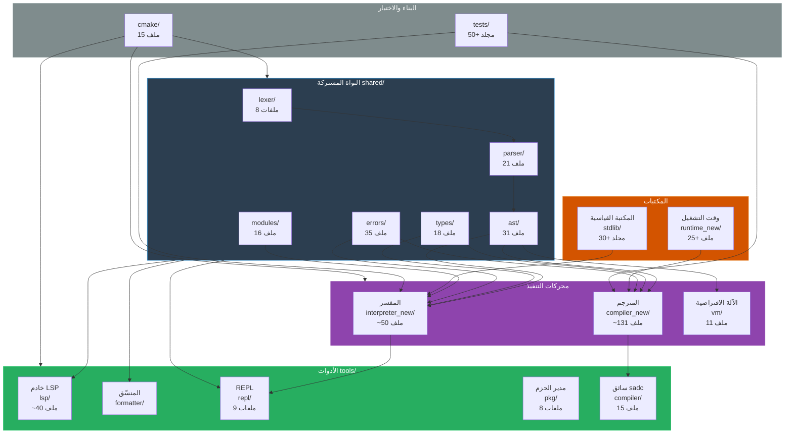

```mermaid
graph TB
    subgraph CORE["النواة المشتركة shared/"]
        LEX["lexer/\n8 ملفات"]
        PAR["parser/\n21 ملف"]
        AST_N["ast/\n31 ملف"]
        TYP["types/\n18 ملف"]
        ERR["errors/\n35 ملف"]
        MOD["modules/\n16 ملف"]
    end

    subgraph ENGINES["محركات التنفيذ"]
        INT["المفسر\ninterpreter_new/\n~50 ملف"]
        COMP["المترجم\ncompiler_new/\n~131 ملف"]
        VMA["الآلة الافتراضية\nvm/\n11 ملف"]
    end

    subgraph TOOLS_G["الأدوات tools/"]
        LSP["خادم LSP\nlsp/\n~40 ملف"]
        FMT["المنسّق\nformatter/"]
        REPL_T["REPL\nrepl/\n9 ملفات"]
        PKG["مدير الحزم\npkg/\n8 ملفات"]
        DRIV["سائق sadc\ncompiler/\n15 ملف"]
    end

    subgraph LIBS["المكتبات"]
        STD["المكتبة القياسية\nstdlib/\n30+ مجلد"]
        RUN["وقت التشغيل\nruntime_new/\n25+ ملف"]
    end

    subgraph BUILD["البناء والاختبار"]
        CMAKE["cmake/\n15 ملف"]
        TEST["tests/\n50+ مجلد"]
    end

    LEX --> PAR
    PAR --> AST_N
    AST_N --> INT
    AST_N --> COMP
    AST_N --> VMA
    TYP --> INT
    TYP --> COMP
    ERR --> INT
    ERR --> COMP
    MOD --> INT

    CORE --> LSP
    CORE --> FMT
    CORE --> REPL_T
    INT --> REPL_T
    COMP --> DRIV
    STD --> INT
    RUN --> COMP

    CMAKE --> CORE
    CMAKE --> ENGINES
    CMAKE --> TOOLS_G
    TEST --> INT
    TEST --> COMP

    style CORE fill:#2c3e50,stroke:#3498db,color:#fff
    style ENGINES fill:#8e44ad,stroke:#9b59b6,color:#fff
    style TOOLS_G fill:#27ae60,stroke:#2ecc71,color:#fff
    style LIBS fill:#d35400,stroke:#e67e22,color:#fff
    style BUILD fill:#7f8c8d,stroke:#95a5a6,color:#fff
```
