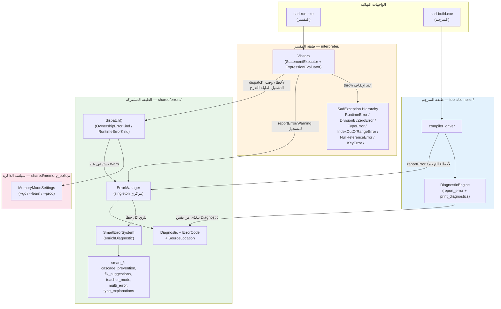
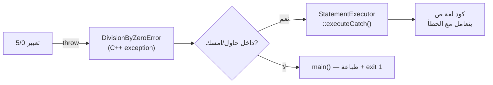
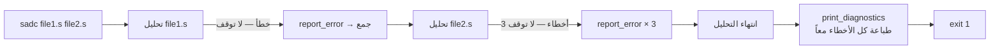
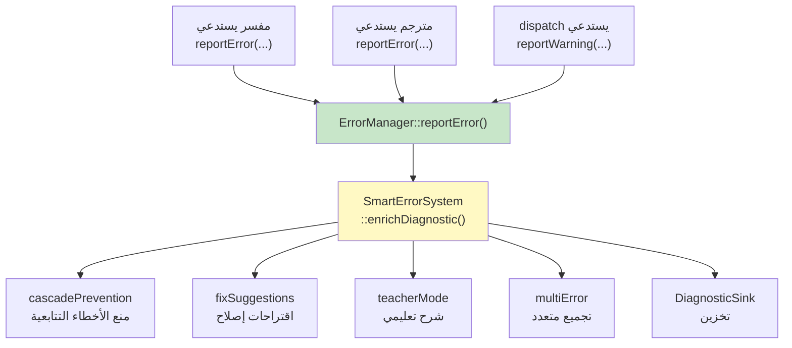
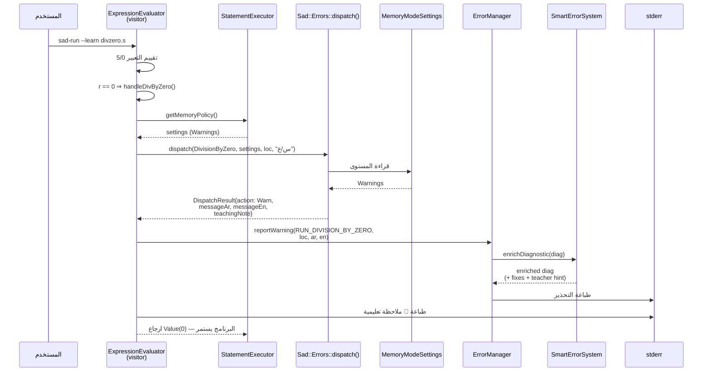
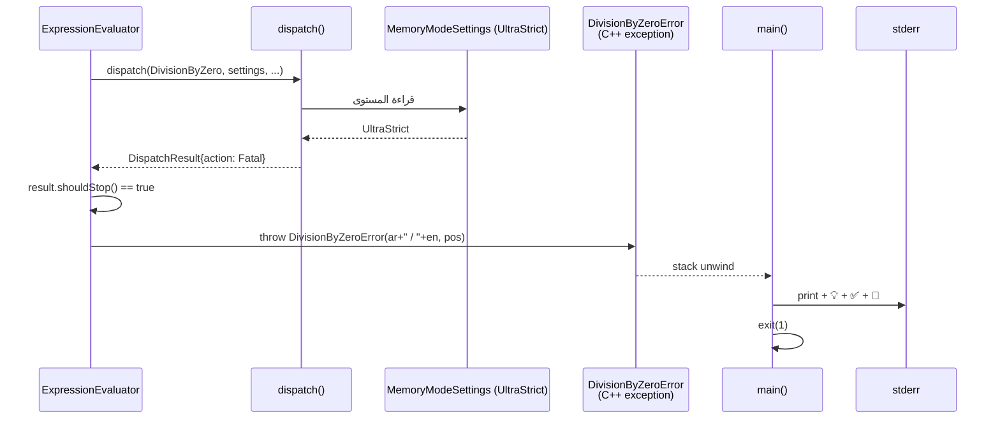
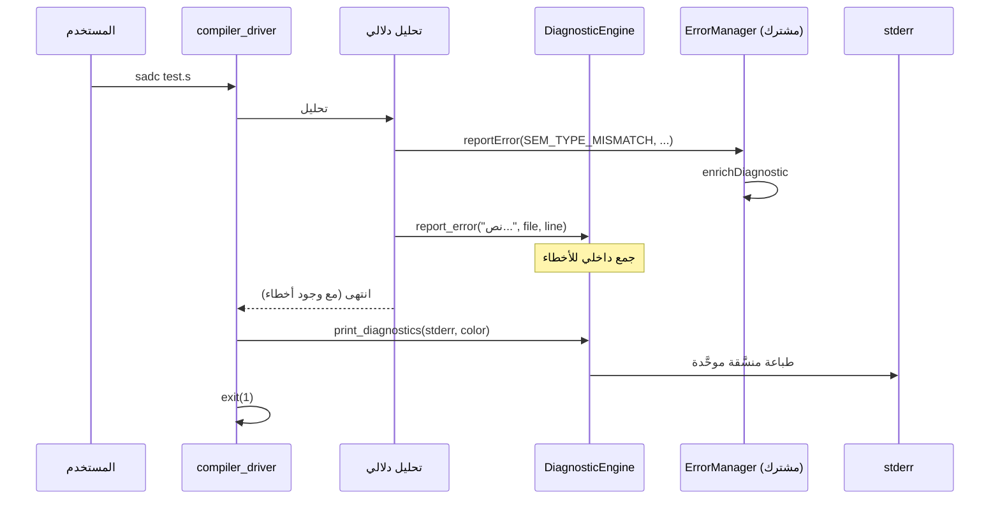
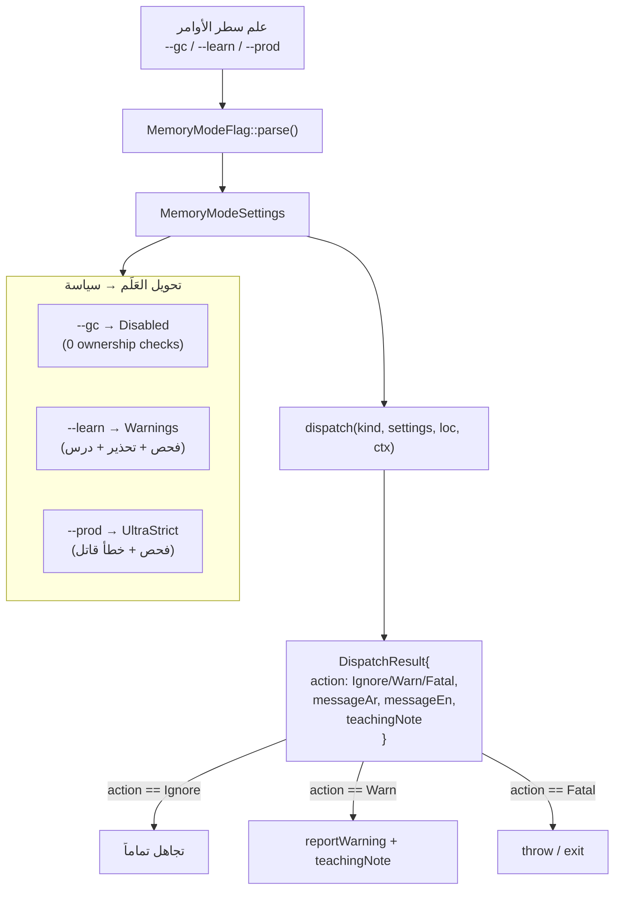

# معمارية نظام الأخطاء في لغة ص — نظرة شاملة

> **الإجابة المختصرة على السؤال:** نعم، يوجد **3 أنظمة أخطاء متمايزة** تعمل بالتوازي،
> لكنها **ليست مكرَّرة** — كل واحد يخدم طبقة مختلفة وله مسؤولية محدَّدة، وجميعها
> تلتقي عند **مدير مركزي واحد** (`Sad::Errors::ErrorManager`) في الطبقة المشتركة.

---

## 1. الأنظمة الثلاثة في لمحة

| النظام | الموقع | الطبقة | المهمة الأساسية |
|---|---|---|---|
| **`Sad::Errors`** (المركزي) | `shared/errors/` | الطبقة المشتركة | تجميع التشخيصات + إثراؤها (Smart) + التوجيه (Dispatch) + الطباعة الموحَّدة |
| **`SadException` hierarchy** | `interpreter/include/exception.h` | المفسر فقط | إيقاف التنفيذ فوراً (control flow عبر `try/catch` C++) ودعم `حاول/امسك` لغة ص |
| **`DiagnosticEngine`** | `tools/compiler/compiler_driver*.cpp` | المترجم sadc فقط | جمع أخطاء وقت الترجمة + تنسيق إخراج المستخدم في CLI |

**العلاقة الجوهرية:** الأنظمة الثلاثة **تتغذى** كلها من نفس البنى الأساسية في
`shared/errors`:
- نفس `ErrorCode` (التعداد المركزي للأكواد)
- نفس `Diagnostic` (هيكل التشخيص)
- نفس `SourceLocation` (موقع الخطأ)
- نفس `dispatch()` (نقطة قرار `--gc/--learn/--prod`)

---

## 2. مخطط الطبقات الكلي



**التفسير:**
- `shared/errors` هي **النواة المركزية** — الجميع يصدر/يستهلك منها.
- المفسر يضيف فوقها طبقة **استثناءات C++** لأنه يحتاج "إيقاف فوري" لتدفق التنفيذ.
- المترجم يضيف فوقها **DiagnosticEngine** خاص لأنه يحتاج تنسيق CLI ومعالجة batch لعدة ملفات.
- `dispatch` هو **بوابة قرار موحَّدة** يستخدمها كلاهما لاتخاذ قرار "تجاهل / حذّر / أوقف"
  وفق علم سطر الأوامر (`--gc/--learn/--prod`).

---

## 3. لماذا 3 أنظمة وليس واحد؟

### 3.1 لماذا هرمية `SadException` في المفسر؟

المفسر يحتاج **آلية إيقاف فوري** لتدفق تنفيذ كود لغة ص:

```cpp
// مثال: عند 5/0 في المفسر — يجب أن يتوقف تنفيذ التعبير الحالي فوراً
if (r == 0) throw DivisionByZeroError("...", pos);
```

السبب: لغة ص تدعم `حاول/امسك` (try/catch بالعربية). يجب أن يكون
الخطأ **قابلاً للالتقاط في وقت التشغيل**، وأقصر طريق إلى ذلك هو ربطه باستثناء C++
يلتقطه `StatementExecutor::executeTry()`.



### 3.2 لماذا `DiagnosticEngine` منفصل في المترجم؟

المترجم لا يستطيع استخدام `throw` لكل خطأ لأنه يجب أن يستمر في **جمع كل الأخطاء**
في الملف (وفي عدة ملفات) قبل الخروج، حتى يرى المستخدم القائمة كاملة:



`DiagnosticEngine` يضيف:
- ترتيب الأخطاء بحسب الملف ثم السطر/العمود
- ترقيمها (`error[E001]`, `warning[W042]`)
- تلوين CLI (إن `--color=on`)
- حدّ أقصى للأخطاء (`-ferror-limit=N`)

كل هذا فوق `shared/errors::Diagnostic` — لا يكرّره.

### 3.3 لماذا `Sad::Errors::ErrorManager` المركزي؟

هو **مستودع التشخيصات الموحَّد** + **محرك الإثراء الذكي**:



كل خطأ — أينما حدث — يمر عبر هذه السلسلة، فيخرج للمستخدم برسالة عربي/إنجليزي
+ ملاحظات مدرّس + اقتراحات إصلاح، **بشكل موحَّد بين المفسر والمترجم**.

---

## 4. تدفق خطأ كامل: مثال `5 / 0` في المفسر تحت `--learn`



**النتيجة على الشاشة:**
```
⚠️ تحذير: قسمة على صفر في `س / ع`
📖 القسمة على صفر غير معرَّفة رياضياً.
   الحل: تحقق أن المقسوم عليه ≠ 0 قبل العملية...
0
بعد القسمة
```

---

## 5. تدفق خطأ كامل: نفس المثال تحت `--prod`



---

## 6. تدفق خطأ في المترجم sadc



ملاحظة: المترجم يستخدم **كلا** الواجهتين أحياناً — `EM::reportError` للسجل المركزي
الذي يفهمه LSP، و`DE::report_error` لإخراج CLI المنسَّق. هذا ليس تكراراً — كل واحد
يخدم مستهلكاً مختلفاً.

---

## 7. خريطة الأنماط: متى يُستخدم كل نظام؟

| الموقف | النظام المُستخدم | مثال |
|---|---|---|
| خطأ يجب أن يوقف تنفيذ المفسر فوراً ولا يتدرج | `throw SadException` فرعي | `throw RuntimeError("الصنف غير موجود", pos)` |
| خطأ في المفسر يجب أن يحترم `--gc/--learn/--prod` | `dispatch(RuntimeErrorKind, ...)` ثم throw مشروط | `handleDivByZero(...)` |
| خطأ ملكية (compile-time-ish) في المفسر/المترجم | `dispatch(OwnershipErrorKind, ...)` | `use after move` |
| خطأ في تحليل/ترجمة sadc يحتاج تجميع batch | `DiagnosticEngine::report_error(...)` | type mismatch في 3 ملفات |
| خطأ في الطبقة المشتركة (lexer/parser/sema) | `ErrorManager::reportError(...)` مباشرة | `LEX_INVALID_TOKEN` |
| تحذير عام يحتاج إثراء ذكي + ملاحظة معلم | `ErrorManager::reportWarning(...)` | استخدام متغير غير مُهيَّأ |

**القاعدة الذهبية:**
1. هل تحتاج إيقاف فوري لتدفق التنفيذ في المفسر؟ → `throw SadException`.
2. هل القرار يعتمد على وضع الذاكرة؟ → `dispatch()` أولاً، ثم `throw` فقط إن `shouldStop()`.
3. غير ذلك (تسجيل + إثراء + طباعة موحَّدة) → `ErrorManager::reportError/Warning`.

---

## 8. مكوّنات `shared/errors/` بالتفصيل (بعد تنظيف Phase F)

### الرؤوس الحيّة (12)
| الملف | الفئة | الدور |
|---|---|---|
| `error_manager.h` | `ErrorManager` | المدير المركزي (singleton) |
| `error_codes.h` | `enum ErrorCode` | كود رقمي لكل خطأ (LEX_*, PARSE_*, SEM_*, RUN_*, OWN_*) |
| `error_types.h` | `DiagnosticSeverity`, `Language` | تعدادات أساسية |
| `source_location.h` | `SourceLocation` | (file, line, column) |
| `diagnostic.h` | `Diagnostic` | هيكل التشخيص الأساسي |
| `enhanced_diagnostic.h` | `EnhancedDiagnostic` | تشخيص + fix-its + notes |
| `error_recovery.h` | `ErrorRecovery` | استرداد parser من الأخطاء |
| `suggestions.h` | `SuggestionProvider` | اقتراحات أسماء (Levenshtein) |
| `error_hints.h` | hints عامة | تلميحات سياق |
| `smart_errors.h` | `SmartErrorSystem` | بوابة الإثراء الذكية |
| `teacher_mode.h` | `TeacherMode` | شرح تعليمي مفصَّل |
| `cascade_prevention.h` | `CascadePrevention` | منع أخطاء وهمية تتابعية |
| `multi_error.h` | `MultiError` | تجميع أخطاء متعددة |
| `fix_suggestions.h` | `FixSuggestionEngine` | اقتراحات `fix-it` |
| `type_explanations.h` | `TypeExplainer` | (عضو خامل — لا يُستدعى من enrichDiagnostic حالياً) |
| `builders/dispatch.h` | `dispatch(...)` | بوابة قرار `--gc/--learn/--prod` |

### الرؤوس المحذوفة (Phase F cleanup)
| الملف | السبب |
|---|---|
| ~~`constraint_errors.hpp`~~ | 0 مُستدعين، غير مُسجَّل في CMake |
| ~~`ffi_warnings.h`~~ | 0 مُستدعين، غير مُسجَّل في CMake |
| ~~`pattern_diagnostics.h`~~ | 0 مُستدعين |
| ~~`permission_diagnostics.h`~~ | 0 مُستدعين |

---

## 9. تكامل `dispatch` مع `MemoryModeSettings`



`dispatch` تطبَّق على نوعين من الأخطاء حالياً:
- **`OwnershipErrorKind`** (Phase E-3): UseAfterMove, BorrowConflict, Lifetime, ...
- **`RuntimeErrorKind`** (Phase F-1): DivisionByZero, ModuloByZero, IndexOutOfBounds, ...

---

## 10. لماذا لم يُوحَّد كل شيء في نظام واحد؟

محاولة دمج الأنظمة الثلاثة في واحد ستفشل لأسباب معمارية صلبة:

1. **`SadException` لا يمكن استبداله بـ`reportError`**
   لأن `reportError` يُسجِّل ويعود؛ بينما المفسر يحتاج إيقاف فوري لتدفق التنفيذ.
   إزالته تعني إعادة كتابة كل visitor ليتحقق من `hasErrors()` بعد كل عملية — كارثة أداء.

2. **`DiagnosticEngine` لا يمكن استبداله بـ`ErrorManager` فقط**
   لأن المترجم يحتاج تنسيق CLI خاص (ألوان، ترقيم، حدود) لا يخص بقية الاستهلاكات
   (LSP مثلاً يستهلك `Diagnostic` خام).

3. **`ErrorManager` لا يستطيع استبدال الاثنين**
   لأنه مصمَّم كـ"سجل تشخيصات" وليس مصمَّماً للتحكم في تدفق أو لتنسيق طرفية.

**التصميم الحالي = فصل اهتمامات صحيح:**
- المفسر يستخدم `throw` للتدفق، و`reportError` للتسجيل، و`dispatch` للقرار.
- المترجم يستخدم `report_error` للجمع، و`reportError` للسجل المركزي، و`print_diagnostics` للطباعة.
- الطبقة المشتركة تملك القاعدة (Diagnostic + ErrorCode + SmartErrors + dispatch).

---

## 11. خلاصة الإجابة على السؤال الأصلي

> **هل يوجد عدة أنظمة في الطبقات الثلاث؟**

نعم، **3 أنظمة متمايزة** لكنها **متكاملة وغير مكرَّرة**:

| الطبقة | النظام | متى يُستخدم |
|---|---|---|
| المفسر | `SadException` | للإيقاف الفوري + ربط بـ`حاول/امسك` |
| المترجم | `DiagnosticEngine` | لتجميع batch + تنسيق CLI |
| المشتركة | `ErrorManager + SmartErrorSystem + dispatch` | كقاعدة موحَّدة + إثراء + قرار |

**كيف تُدار؟**
- كل خطأ مهما كان مصدره يَمر بـ`ErrorManager::reportError()` في النهاية.
- `SmartErrorSystem::enrichDiagnostic()` يضيف تلقائياً: fix-its، شرح تعليمي،
  اقتراحات أسماء، منع التتابع.
- `dispatch()` بوابة قرار جديدة (Phase E-3 + F-1) تحدد سلوك أخطاء الملكية
  وأخطاء وقت التشغيل وفق `--gc/--learn/--prod`.

**لا يوجد تكرار حقيقي** — كل ملف في `shared/errors` بعد تنظيف Phase F:
- إما مُستدعى مباشرة من المفسر/المترجم (`error_manager`, `dispatch`, `error_codes`, ...),
- أو مُستدعى ضمن سلسلة `enrichDiagnostic` (`teacher_mode`, `fix_suggestions`,
  `cascade_prevention`, `multi_error`),
- أو مُهيَّأ كعضو لكن لم يُفعَّل بعد (`type_explanations` — مرشَّح إما للحذف أو
  للربط الفعلي).

---

## 12. مراجع متقاطعة

- **الملفات الأساسية:**
  - `shared/errors/include/error_manager.h` — المدير المركزي
  - `shared/errors/include/builders/dispatch.h` — نقطة القرار الموحَّدة
  - `shared/errors/src/smart_errors.cpp` — الإثراء الذكي
  - `interpreter/include/exception.h` — هرمية استثناءات المفسر
  - `tools/compiler/compiler_driver_diagnostics.cpp` — `DiagnosticEngine`
  - `shared/memory_policy/include/memory/policy/gc_mode.h` — أوضاع الذاكرة

- **مراحل التطوير:**
  - **Phase E-3:** توحيد dispatch لأخطاء الملكية (`OwnershipErrorKind`)
  - **Phase F-1:** توسيع dispatch لأخطاء وقت التشغيل (`RuntimeErrorKind` — DivByZero/ModuloByZero)
  - **Phase F (مستقبل):** IndexOutOfBounds + NullMemberAccess + UndefinedVariable

- **وثائق ذات صلة:**
  - [نظام_الأخطاء.md](نظام_الأخطاء.md) — الجرد التفصيلي للملفات والفئات
  - [docs/خطة_توحيد_التنفيذ_والأعلام_الثلاثة.md](../خطة_توحيد_التنفيذ_والأعلام_الثلاثة.md) — خطة التوحيد الكلية
