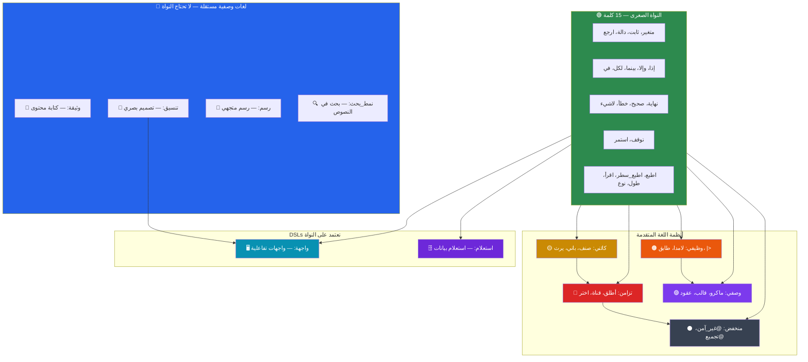
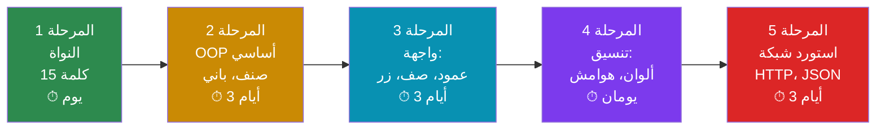
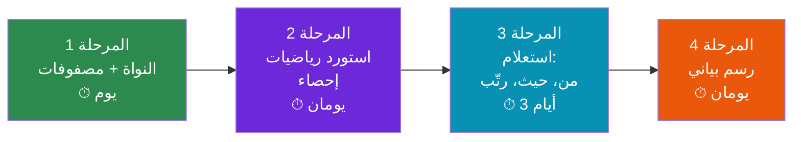
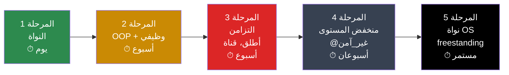
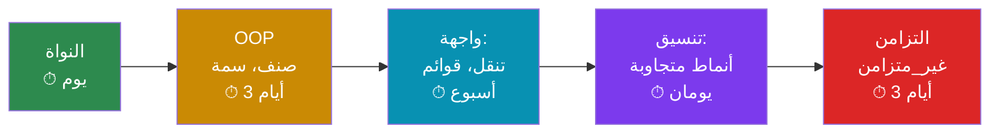
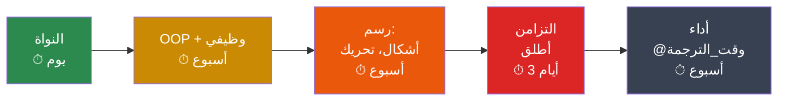
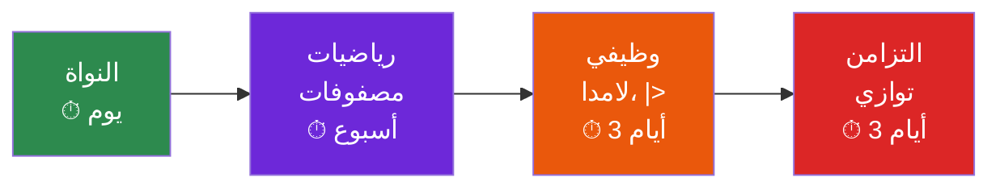
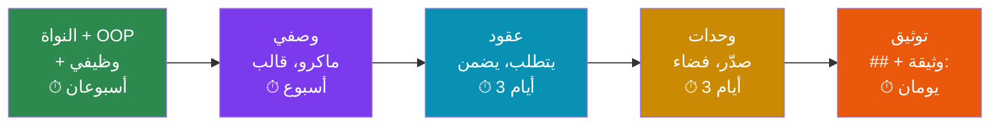

# خريطة تعلم لغة ص — المسارات التخصصية

> **الفلسفة:** لغة ص مصممة بنظام **الإفصاح التدريجي** (Progressive Disclosure) —
> الأشياء البسيطة بسيطة، والأشياء المعقدة ممكنة.
> كل مطور يتعلم فقط ما يحتاجه لتخصصه.

---

## البنية الطبقية للغة ص

```
┌─────────────────────────────────────────────────────────────┐
│          الطبقة 5: المجالات التخصصية                           │
│   ويب │ موبايل │ بيانات │ نظم │ ألعاب │ ذكاء │ IoT │ محتوى  │
├─────────────────────────────────────────────────────────────┤
│          الطبقة 4: اللغات الوصفية المدمجة (DSLs)               │
│   واجهة: │ تنسيق: │ رسم: │ وثيقة: │ استعلام: │ نمط_بحث:    │
├─────────────────────────────────────────────────────────────┤
│          الطبقة 3: المكتبة القياسية                             │
│   رياضيات│نصوص│ملفات│شبكة│json│تشفير│إحصاء│صوت│صورة│نظام    │
├─────────────────────────────────────────────────────────────┤
│          الطبقة 2: أنظمة اللغة المتقدمة                        │
│   OOP│وظيفي│تزامن│أنماط│ماكرو│قوالب│عقود│أخطاء│ملكية│توجيهات │
├─────────────────────────────────────────────────────────────┤
│          الطبقة 1: النواة الصغرى (15 كلمة)                     │
│   متغير│ثابت│دالة│ارجع│إذا│وإلا│بينما│لكل│في│نهاية          │
│   صحيح│خطأ│لاشيء│توقف│استمر                                  │
│   + دوال مدمجة: اطبع│اطبع_سطر│اقرأ│طول│نوع                  │
└─────────────────────────────────────────────────────────────┘
```

---

## المخطط العام لمسارات التعلم



---

## الطبقة 0: اللغات الوصفية المستقلة (بدون برمجة)

> **الابتكار الأهم:** بعض قدرات لغة ص لا تتطلب أي معرفة بالبرمجة.
> كاتب المحتوى أو المصمم يتعلم فقط أسماء العناصر التي يحتاجها.

### لماذا هذا مهم؟

في العالم الغربي، كتابة وثيقة تتطلب Markdown أو HTML — لغات إنجليزية.
في عالم لغة ص، كاتب المحتوى العربي يكتب وثائقه **بكلمات عربية فقط** بدون أي سطر برمجة.

---

## المسار 1: 📝 كاتب المحتوى والتوثيق

### المتطلبات المسبقة
**لا شيء** — هذا المسار لا يحتاج أي معرفة بالبرمجة.

### ما يتعلمه

| العنصر | الوصف | مثال |
|---|---|---|
| `وثيقة:` | يفتح كتلة الوثيقة | `وثيقة: ... نهاية` |
| `عنوان_رئيسي()` | عنوان كبير | `عنوان_رئيسي("الفصل الأول")` |
| `عنوان_فرعي()` | عنوان صغير | `عنوان_فرعي("المقدمة")` |
| `فقرة()` | نص فقرة | `فقرة("شرح الموضوع...")` |
| `قائمة:` | قائمة نقطية | `قائمة: عنصر("أ") نهاية` |
| `قائمة_مرقمة:` | قائمة مرقمة | `قائمة_مرقمة: عنصر("أ") نهاية` |
| `جدول:` | جدول | `جدول: رأس("أ"، "ب") صف("1"، "2") نهاية` |
| `كود()` | كتلة كود | `كود("ص"): ... نهاية` |
| `رابط()` | رابط | `رابط("عنوان"، "رابط://...")` |
| `صورة()` | صورة | `صورة("وصف"، "مسار.png")` |
| `اقتباس()` | اقتباس | `اقتباس("نص الاقتباس")` |
| `فاصل()` | خط فاصل | `فاصل()` |
| `تحذير()` | مربع تحذير | `تحذير("انتبه!")` |
| `ملاحظة()` | مربع ملاحظة | `ملاحظة("معلومة مفيدة")` |
| `نهاية` | إغلاق أي كتلة | `نهاية` |

### مثال كامل

```sad
وثيقة:
    عنوان_رئيسي("دليل استخدام نظام أُفُق")
    
    فقرة("نظام أُفُق هو أول نظام تشغيل عربي مبني بالكامل بلغة ص.")
    
    عنوان_فرعي("متطلبات التشغيل")
    قائمة:
        عنصر("معالج x86_64 أو ARM")
        عنصر("ذاكرة 256 ميغابايت على الأقل")
        عنصر("قرص 2 جيجابايت")
    نهاية
    
    عنوان_فرعي("الأوامر الأساسية")
    جدول:
        رأس("الأمر"، "الوصف"، "مثال")
        صف("اطبع"، "طباعة نص"، "اطبع(\"مرحبا\")")
        صف("اقرأ"، "قراءة إدخال"، "اقرأ(\"اسمك:\")")
    نهاية
    
    عنوان_فرعي("مثال برمجي")
    كود("ص"):
        دالة تحية(اسم)
            ارجع "مرحباً " + اسم
        نهاية
    نهاية
    
    تحذير("هذا النظام قيد التطوير — لا تستخدمه في بيئة إنتاجية")
    
    ملاحظة("للمساهمة في التطوير، راجع دليل المساهمة")
    
    فاصل()
    
    فقرة("© 2026 مشروع لغة ص — جميع الحقوق محفوظة")
نهاية
```

### الخرج المتوقع
يُنتج ملف HTML/PDF بتنسيق عربي جاهز للنشر — بدون أي أداة خارجية.

### المدة المقدرة: **ساعتان**

---

## المسار 2: 🎨 المصمم (تنسيق + رسم)

### المتطلبات المسبقة
**لا شيء** — لا يحتاج برمجة.

### ما يتعلمه

#### تنسيق (بديل CSS):

| الخاصية | الوصف | مثال |
|---|---|---|
| `لون_خلفية` | لون الخلفية | `لون_خلفية: "#f0f0f0"` |
| `لون_نص` | لون النص | `لون_نص: "أبيض"` |
| `حجم_خط` | حجم الخط | `حجم_خط: 16` |
| `نوع_خط` | عائلة الخط | `نوع_خط: "الكوفي"` |
| `هامش` | هامش خارجي | `هامش: 10` |
| `حشوة` | هامش داخلي | `حشوة: 8` |
| `حدود` | إطار | `حدود: 1` |
| `حدود_مدورة` | زوايا مدورة | `حدود_مدورة: 8` |
| `ظل` | ظل العنصر | `ظل: (2، 2، 5، "رمادي")` |
| `تراصف` | محاذاة النص | `تراصف: "يمين"` |
| `عرض` / `ارتفاع` | الأبعاد | `عرض: 200` |
| `شفافية` | الشفافية | `شفافية: 0.8` |

#### رسم متجهي (بديل SVG):

| العنصر | الوصف | مثال |
|---|---|---|
| `دائرة()` | رسم دائرة | `دائرة(س: 100، ص: 100، نصف_قطر: 50)` |
| `مستطيل()` | رسم مستطيل | `مستطيل(س: 0، ص: 0، عرض: 100، ارتفاع: 50)` |
| `خط()` | رسم خط | `خط(س1: 0، ص1: 0، س2: 100، ص2: 100)` |
| `مضلع()` | رسم مضلع | `مضلع(نقاط: [(0،0)، (50،100)، (100،0)])` |
| `قوس()` | رسم قوس | `قوس(مركز_س: 50، مركز_ص: 50، نصف_قطر: 40، بداية: 0، نهاية: 180)` |
| `نص_رسمي()` | نص داخل الرسم | `نص_رسمي(س: 50، ص: 50، محتوى: "عنوان")` |
| `مجموعة:` | تجميع عناصر | `مجموعة: ... نهاية` |
| `تحريك()` | تحريك عنصر | `تحريك(مدة: 1000، نوع: "انسيابي")` |

### مثال كامل — شعار

```sad
متغير شعار = رسم(عرض: 300، ارتفاع: 300):
    # خلفية دائرية
    دائرة(س: 150، ص: 150، نصف_قطر: 140، تعبئة: "#1a5276")
    
    # حرف ص بالعربية
    نص_رسمي(س: 150، ص: 170، محتوى: "ص"، حجم: 120، لون: "أبيض"، خط: "الكوفي")
    
    # خط زخرفي
    قوس(مركز_س: 150، مركز_ص: 150، نصف_قطر: 120، بداية: 30، نهاية: 330)
        سمك: 3
        لون: "#f39c12"
    نهاية
    
    # نجمة صغيرة
    مضلع(نقاط: [(150،30)، (160،60)، (190،60)، (165،80)، (175،110)، (150،90)، (125،110)، (135،80)، (110،60)، (140،60)])
        تعبئة: "#f1c40f"
    نهاية
نهاية
```

### المدة المقدرة: **نصف يوم**

---

## المسار 3: 🌐 مطور الويب

### المتطلبات المسبقة
لا شيء — يبدأ من الصفر.

### مراحل التعلم



### المرحلة 1: النواة (يوم واحد)

**الكلمات:** `متغير`، `ثابت`، `دالة`، `ارجع`، `إذا`، `وإلا`، `بينما`، `لكل`، `في`، `نهاية`، `صحيح`، `خطأ`، `لاشيء`، `توقف`، `استمر`

**الدوال المدمجة:** `اطبع`، `اطبع_سطر`، `اقرأ`، `طول`، `نوع`، `رقم()`، `نص()`

```sad
# أول برنامج
اطبع_سطر("مرحباً بالعالم")

# متغيرات وعمليات
متغير اسم = "أحمد"
ثابت عمر = 25
متغير مجموع = 0

# شروط
إذا (عمر >= 18)
    اطبع_سطر(اسم + " بالغ")
وإلا
    اطبع_سطر(اسم + " قاصر")
نهاية

# حلقات
لكل ع في [1، 2، 3، 4، 5]
    مجموع = مجموع + ع
نهاية
اطبع_سطر("المجموع: " + مجموع)

# دوال
دالة تحية(اسم)
    ارجع "مرحباً يا " + اسم + "!"
نهاية

اطبع_سطر(تحية("سارة"))

# مصفوفات وخرائط
متغير فواكه = ["تفاح"، "موز"، "برتقال"]
فواكه.اضف("عنب")

متغير درجات = {"أحمد": 90، "سارة": 95، "خالد": 85}
اطبع_سطر("درجة أحمد: " + درجات["أحمد"])
```

### المرحلة 2: OOP أساسي (3 أيام)

**كلمات جديدة:** `صنف`، `باني`، `هذا`، `يرث`، `عام`، `خاص`، `جديد`

```sad
صنف مستخدم
    متغير عام الاسم
    متغير عام البريد
    متغير خاص _كلمة_السر

    باني(هذا.الاسم، هذا.البريد، كلمة_سر)
        هذا._كلمة_السر = كلمة_سر
    نهاية

    دالة عام تحقق(كلمة_سر)
        ارجع هذا._كلمة_السر == كلمة_سر
    نهاية

    دالة عام وصف()
        ارجع هذا.الاسم + " (" + هذا.البريد + ")"
    نهاية
نهاية

صنف مشرف يرث مستخدم
    متغير عام الصلاحيات

    باني(اسم، بريد، كلمة_سر، صلاحيات)
        الأساس(اسم، بريد، كلمة_سر)
        هذا.الصلاحيات = صلاحيات
    نهاية
نهاية

متغير م = مشرف("أحمد"، "a@b.com"، "1234"، ["تعديل"، "حذف"])
اطبع_سطر(م.وصف())
```

### المرحلة 3: واجهة المستخدم — DSL الواجهات (3 أيام)

**كلمات جديدة:** `واجهة:`، مكونات الواجهة (عمود، صف، نص، زر، حقل_نص...)

```sad
# صفحة تسجيل دخول
متغير شاشة_دخول = واجهة:
    عمود(محاذاة: وسط، حشوة: 20)
        صورة(مصدر: "شعار.png"، عرض: 100، ارتفاع: 100)
        
        نص("تسجيل الدخول")
            حجم_خط: 24
            وزن_خط: "عريض"
        نهاية
        
        حقل_نص(تلميح: "البريد الإلكتروني")
            ربط: @بريد
            نوع: "بريد"
        نهاية
        
        حقل_نص(تلميح: "كلمة المرور")
            ربط: @كلمة_سر
            نوع: "سري"
        نهاية
        
        زر("دخول")
            عند_الضغط: لامدا() => تسجيل_دخول()
            لون_خلفية: "#007AFF"
            لون_نص: "أبيض"
        نهاية
        
        زر("إنشاء حساب جديد")
            عند_الضغط: لامدا() => انتقل("تسجيل")
            نوع: "نصي"
        نهاية
    نهاية
نهاية
```

### المرحلة 4: التنسيق (يومان)

**كلمات جديدة:** خصائص التنسيق (لون، هامش، حدود...)

```sad
# تعريف أنماط قابلة لإعادة الاستخدام
متغير نمط_بطاقة = تنسيق:
    لون_خلفية: "أبيض"
    حدود_مدورة: 12
    ظل: (0، 2، 8، "rgba(0،0،0،0.1)")
    حشوة: 16
    هامش: 8
نهاية

متغير نمط_عنوان = تنسيق:
    حجم_خط: 20
    وزن_خط: "عريض"
    لون_نص: "#1a1a1a"
    هامش_سفلي: 8
نهاية

# استخدام الأنماط
متغير بطاقة_منتج = واجهة:
    حاوية(نمط: نمط_بطاقة)
        صورة(مصدر: @صورة_المنتج، عرض: "100%"، ارتفاع: 200)
        نص(@اسم_المنتج، نمط: نمط_عنوان)
        نص(@سعر_المنتج + " ر.س."، لون: "#27ae60"، حجم_خط: 18)
        زر("أضف للسلة")
            عند_الضغط: لامدا() => اضف_للسلة(@معرف)
        نهاية
    نهاية
نهاية
```

### المرحلة 5: الشبكة (3 أيام)

**وحدات جديدة:** `استورد شبكة`، `استورد json`

```sad
استورد شبكة
استورد json

# جلب بيانات من API
دالة غير_متزامن جلب_مستخدمين()
    متغير استجابة = انتظر شبكة.طلب_جلب("https://api.example.com/users")
    
    إذا (استجابة.حالة == 200)
        متغير بيانات = json.حلل(استجابة.جسم)
        ارجع بيانات
    وإلا
        ارمي "فشل الجلب: " + استجابة.حالة
    نهاية
نهاية

# إرسال بيانات
دالة غير_متزامن انشئ_مستخدم(اسم، بريد)
    متغير جسم = json.نصّص({"اسم": اسم، "بريد": بريد})
    
    متغير استجابة = انتظر شبكة.طلب_ارسال(
        "https://api.example.com/users"،
        جسم: جسم،
        ترويسات: {"Content-Type": "application/json"}
    )
    
    ارجع json.حلل(استجابة.جسم)
نهاية
```

### ما **لا يحتاجه** مطور الويب
- ❌ التزامن المتقدم (goroutines، channels)
- ❌ البرمجة المنخفضة المستوى (@غير_آمن، @تجميع)
- ❌ الماكروز والقوالب
- ❌ العقود البرمجية
- ❌ أنظمة التشغيل

### المدة الإجمالية: **~12 يوم عمل**

---

## المسار 4: 📊 محلل البيانات

### المتطلبات المسبقة
لا شيء.

### مراحل التعلم



### المرحلة 1: النواة + المصفوفات (يوم)

```sad
# العمل مع البيانات
متغير أرقام = [23، 45، 12، 67، 34، 89، 56، 78، 90، 11]

# طرق المصفوفة المدمجة
متغير مرتبة = أرقام.رتب()
متغير كبيرة = أرقام.رشح(لامدا(ر) => ر > 50)
متغير مجموع = أرقام.اختزل(لامدا(م، ر) => م + ر، 0)
متغير متوسط = مجموع / أرقام.الطول()

اطبع_سطر("المتوسط: " + متوسط)
اطبع_سطر("أكبر من 50: " + كبيرة)

# خرائط
متغير طلاب = {
    "أحمد": {"رياضيات": 90، "علوم": 85، "عربي": 95}،
    "سارة": {"رياضيات": 95، "علوم": 92، "عربي": 88}،
    "خالد": {"رياضيات": 78، "علوم": 80، "عربي": 85}
}

لكل اسم، درجات في طلاب
    متغير مج = درجات.قيم().اختزل(لامدا(م، ق) => م + ق، 0)
    اطبع_سطر(اسم + ": معدل = " + (مج / 3))
نهاية
```

### المرحلة 2: المكتبات الرياضية (يومان)

```sad
استورد رياضيات
استورد إحصاء

متغير بيانات = [23، 45، 12، 67، 34، 89، 56، 78، 90، 11]

# إحصاءات أساسية
اطبع_سطر("المتوسط: " + إحصاء.متوسط(بيانات))
اطبع_سطر("الوسيط: " + إحصاء.وسيط(بيانات))
اطبع_سطر("الانحراف: " + إحصاء.انحراف_معياري(بيانات))
اطبع_سطر("أقل: " + إحصاء.أدنى(بيانات))
اطبع_سطر("أعلى: " + إحصاء.أقصى(بيانات))

# رياضيات متقدمة
اطبع_سطر("جذر 144: " + رياضيات.جذر(144))
اطبع_سطر("π: " + رياضيات.ط)
اطبع_سطر("لوغ طبيعي 100: " + رياضيات.لوغاريتم(100))
```

### المرحلة 3: الاستعلامات — DSL الاستعلامات (3 أيام)

```sad
# بيانات
متغير موظفون = [
    {"اسم": "أحمد"، "قسم": "تقنية"، "راتب": 8000، "عمر": 30}،
    {"اسم": "سارة"، "قسم": "تسويق"، "راتب": 7000، "عمر": 28}،
    {"اسم": "خالد"، "قسم": "تقنية"، "راتب": 9000، "عمر": 35}،
    {"اسم": "فاطمة"، "قسم": "إدارة"، "راتب": 12000، "عمر": 40}،
    {"اسم": "عمر"، "قسم": "تقنية"، "راتب": 7500، "عمر": 25}
]

# استعلام بسيط
متغير تقنيون = استعلام من موظفون:
    حيث قسم == "تقنية"
    رتّب تصاعدياً حسب راتب
    اختر اسم، راتب
نهاية

# استعلام متقدم مع تجميع
متغير ملخص = استعلام من موظفون:
    جمّع حسب قسم
    احسب:
        العدد: عدد()
        متوسط_الراتب: متوسط(راتب)
        أعلى_راتب: أقصى(راتب)
    نهاية
    رتّب تنازلياً حسب متوسط_الراتب
نهاية

لكل قسم في ملخص
    اطبع_سطر(قسم.قسم + ": " + قسم.العدد + " موظفين، متوسط: " + قسم.متوسط_الراتب)
نهاية
```

### المرحلة 4: الرسم البياني (يومان)

```sad
# رسم بياني عمودي
متغير رسم_أقسام = رسم(عرض: 600، ارتفاع: 400، نوع: "عمودي"):
    عنوان("توزيع الرواتب حسب القسم")
    محور_س: ملخص.خريطة(لامدا(ق) => ق.قسم)
    محور_ص: ملخص.خريطة(لامدا(ق) => ق.متوسط_الراتب)
    تسمية_ص: "متوسط الراتب (ر.س.)"
    ألوان: ["#3498db"، "#e74c3c"، "#2ecc71"]
نهاية

# رسم بياني دائري
متغير رسم_نسب = رسم(عرض: 400، ارتفاع: 400، نوع: "دائري"):
    عنوان("نسب الموظفين حسب القسم")
    بيانات: ملخص.خريطة(لامدا(ق) => {"تسمية": ق.قسم، "قيمة": ق.العدد})
    ألوان: ["#3498db"، "#e74c3c"، "#2ecc71"]
    إظهار_نسب: صحيح
نهاية
```

### ما لا يحتاجه محلل البيانات
- ❌ OOP المتقدم (سمات، خصائص، عوامل)
- ❌ واجهات المستخدم التفاعلية
- ❌ البرمجة المنخفضة
- ❌ التزامن المتقدم

### المدة الإجمالية: **~8 أيام عمل**

---

## المسار 5: ⚙️ مطور النظم ونواة نظام التشغيل

### المتطلبات المسبقة
لا شيء — لكن هذا هو المسار الأطول والأشمل.

### مراحل التعلم



### المرحلة 1-2: النواة + OOP + وظيفي (أسبوع)

نفس ما في المسارات السابقة، بالإضافة إلى:

**البرمجة الوظيفية:**
```sad
# مطابقة الأنماط — أساسية لبرمجة النظم
دالة وصف_خطأ(كود)
    طابق (كود)
        عندما 0:
            ارجع "نجاح"
        عندما 1..10:
            ارجع "خطأ إدخال/إخراج"
        عندما 11..20:
            ارجع "خطأ ذاكرة"
        عندما 21..30:
            ارجع "خطأ صلاحيات"
        افتراضي:
            ارجع "خطأ غير معروف: " + كود
    نهاية
نهاية

# نتيجة/اختياري — معالجة أخطاء بدون exceptions
تعداد نتيجة
    نجاح(قيمة)
    خطأ(رسالة)
نهاية

دالة اقرأ_ملف(مسار)
    # ...
    ارجع نتيجة.نجاح(محتوى)
نهاية

متغير م = انشر اقرأ_ملف("بيانات.txt")   # ينشر الخطأ تلقائياً إذا فشل
```

### المرحلة 3: التزامن (أسبوع)

**كلمات جديدة:** `أطلق`، `قناة()`، `اختر`، `قفل()`، `مجموعة_انتظار()`، `مستقبل()`

```sad
# goroutines + channels — نموذج Go
متغير ق = قناة(10)

أطلق
    لكل ع في [1، 2، 3، 4، 5]
        ق.أرسل(ع * ع)
    نهاية
    ق.أغلق()
نهاية

لكل نتيجة في ق
    اطبع_سطر("النتيجة: " + نتيجة)
نهاية

# select — الاختيار بين قنوات
متغير ق1 = قناة(5)
متغير ق2 = قناة(5)

اختر
    عندما ق1.حاول_استقبل():
        اطبع_سطر("ق1 جاهزة")
    عندما ق2.حاول_استقبل():
        اطبع_سطر("ق2 جاهزة")
    افتراضي:
        اطبع_سطر("لا شيء جاهز")
نهاية
```

### المرحلة 4: البرمجة المنخفضة المستوى (أسبوعان)

**كلمات جديدة:** `@غير_آمن`، `@تجميع`، `@متطاير`، `@حجم`، `@ذري`، `خارجي`

```sad
# تجميع مضمن
@غير_آمن
دالة قراءة_منفذ(منفذ: رقم)
    متغير قيمة: رقم = 0
    @تجميع("inb %1, %0" : "=a"(قيمة) : "Nd"(منفذ))
    ارجع قيمة
نهاية

# متغير متطاير (لا يُحسّن)
@متطاير متغير حالة_المقاطعة = 0

# دالة خارجية (FFI)
خارجي("C") دالة memcpy(هدف: رقم، مصدر: رقم، حجم: رقم)
خارجي("C") دالة malloc(حجم: رقم) رقم

# حجم النوع
متغير حجم = @حجم(رقم)   # → 8 بايت

# عمليات ذرية
@ذري(تخزين، عداد_المقاطعات، 0)
@ذري(إضافة_جلب، عداد_المقاطعات، 1)
```

### المرحلة 5: تطوير نواة نظام التشغيل (مستمر)

```sad
# نقطة الدخول — وضع freestanding (بدون مكتبة قياسية)
@هدف("x86_64-freestanding")

خارجي("C") دالة kernel_main()
    # كتابة مباشرة في ذاكرة الفيديو
    @غير_آمن
        متغير فيديو = @مؤشر(0xB8000)
        @كتابة(فيديو، 0x0F41)      # حرف 'A' بلون أبيض على أسود
    نهاية
    
    # إعداد GDT
    أعد_جدول_الواصفات()
    
    # إعداد المقاطعات
    أعد_المقاطعات()
    
    # تشغيل المجدول
    ابدأ_المجدول()
نهاية

دالة معالج_المقاطعة(رقم_المقاطعة: رقم)
    طابق (رقم_المقاطعة)
        عندما 0:
            # قسمة على صفر
            هلع("قسمة على صفر!")
        عندما 14:
            # خطأ صفحة
            متغير عنوان = قراءة_سجل_خطأ()
            عالج_خطأ_صفحة(عنوان)
        عندما 32:
            # مؤقت النظام
            علامة_المؤقت()
        افتراضي:
            # مقاطعة غير معالجة
            سجّل_تحذير("مقاطعة غير معالجة: " + رقم_المقاطعة)
    نهاية
نهاية
```

### ما يتعلمه مطور النظم: **كل شيء**

هذا هو المسار الوحيد الذي يتطلب تعلم جميع طبقات اللغة.

### المدة الإجمالية: **~5 أسابيع + تطوير مستمر**

---

## المسار 6: 📱 مطور الموبايل

### مراحل التعلم



### مثال — تطبيق موبايل

```sad
# تطبيق قائمة مهام للموبايل
صنف مهمة
    متغير عام العنوان: نص
    متغير عام مكتملة: منطقي = خطأ
    
    باني(هذا.العنوان)
    نهاية
نهاية

# حالة التطبيق
متغير مهام = [
    مهمة("شراء الخبز")،
    مهمة("مراجعة الكود")،
    مهمة("الاتصال بأحمد")
]

# الواجهة
متغير شاشة_مهام = واجهة:
    هيكل:
        # شريط العنوان
        صف(لون_خلفية: "#007AFF"، حشوة: 16)
            نص("مهامي"، لون: "أبيض"، حجم_خط: 20، وزن: "عريض")
        نهاية
        
        # قائمة المهام
        عمود_كسول(بيانات: @مهام)
            لكل مهمة في مهام
                صف(حشوة: 12، حدود_سفلية: 1)
                    تبديل(قيمة: !!مهمة.مكتملة)
                    نص(مهمة.العنوان)
                        يتوسطه_خط: @مهمة.مكتملة
                    نهاية
                نهاية
            نهاية
        نهاية
        
        # زر إضافة
        زر(أيقونة: "+"، شكل: "دائري"، موضع: "عائم")
            عند_الضغط: لامدا() =>
                متغير عنوان = اقرأ("عنوان المهمة:")
                مهام.اضف(مهمة(عنوان))
            نهاية
        نهاية
    نهاية
نهاية
```

### المدة الإجمالية: **~12 يوم عمل**

---

## المسار 7: 🎮 مطور الألعاب

### مراحل التعلم



### مثال — لعبة بسيطة

```sad
# لعبة بونغ بسيطة
صنف كرة
    متغير عام س: عشري = 150.0
    متغير عام ص: عشري = 150.0
    متغير عام سرعة_س: عشري = 3.0
    متغير عام سرعة_ص: عشري = 2.0
    ثابت عام نصف_قطر = 8
    
    دالة عام تحديث()
        هذا.س = هذا.س + هذا.سرعة_س
        هذا.ص = هذا.ص + هذا.سرعة_ص
        
        # ارتداد من الحواف
        إذا (هذا.ص <= 0 أو هذا.ص >= 300)
            هذا.سرعة_ص = -هذا.سرعة_ص
        نهاية
    نهاية
    
    دالة عام ارسم()
        ارجع رسم(عرض: 0، ارتفاع: 0):
            دائرة(س: هذا.س، ص: هذا.ص، نصف_قطر: نصف_قطر، تعبئة: "أبيض")
        نهاية
    نهاية
نهاية

صنف مضرب
    متغير عام س: عشري
    متغير عام ص: عشري = 130.0
    ثابت عام عرض = 10
    ثابت عام ارتفاع = 60
    
    باني(هذا.س)
    نهاية
    
    دالة عام ارسم()
        ارجع رسم(عرض: 0، ارتفاع: 0):
            مستطيل(س: هذا.س، ص: هذا.ص، عرض: عرض، ارتفاع: ارتفاع، تعبئة: "أبيض")
        نهاية
    نهاية
نهاية
```

### المدة الإجمالية: **~3 أسابيع**

---

## المسار 8: 🤖 مطور الذكاء الاصطناعي

### مراحل التعلم



### مثال — شبكة عصبية بسيطة

```sad
استورد رياضيات

# طبقة شبكة عصبية
صنف طبقة
    متغير عام أوزان: مصفوفة
    متغير عام انحياز: مصفوفة
    
    باني(مدخلات: رقم، مخرجات: رقم)
        # تهيئة عشوائية
        هذا.أوزان = رياضيات.عشوائي_مصفوفة(مخرجات، مدخلات)
        هذا.انحياز = رياضيات.أصفار(مخرجات)
    نهاية
    
    دالة عام تقدم(مدخل: مصفوفة)
        # y = sigmoid(W·x + b)
        متغير ناتج = رياضيات.ضرب_مصفوفات(هذا.أوزان، مدخل)
        ناتج = رياضيات.جمع_متجهات(ناتج، هذا.انحياز)
        ارجع ناتج.خريطة(لامدا(ق) => سيغمويد(ق))
    نهاية
نهاية

دالة سيغمويد(س)
    ارجع 1.0 / (1.0 + رياضيات.أس(رياضيات.هـ، -س))
نهاية

# تدريب
متغير طبقة1 = طبقة(2، 4)
متغير طبقة2 = طبقة(4، 1)

# سلسلة الأنابيب لمعالجة البيانات
متغير نتائج = بيانات_التدريب
    |> تقسيم_دفعات(32)
    |> خريطة(لامدا(دفعة) => تدريب_دفعة(دفعة))
    |> اختزل(لامدا(مج، خ) => مج + خ، 0)
```

### المدة الإجمالية: **~2 أسابيع**

---

## المسار 9: 🔧 مطور المكتبات والأطر

### المتطلبات المسبقة
هذا المسار للمطورين المتقدمين — يحتاج إلمام بمعظم أنظمة اللغة.

### مراحل التعلم



### مثال — مكتبة بنظام عقود وقوالب

```sad
## مكتبة ترتيب عامة — تدعم أي نوع قابل للمقارنة
فضاء ترتيب

صدّر دالة ترتيب_سريع(مصفوفة عناصر)
    حيث ت: قابل_للمقارنة
    يتطلب عناصر.الطول() >= 0
    يضمن النتيجة.الطول() == عناصر.الطول()
    
    إذا (عناصر.الطول() <= 1)
        ارجع عناصر
    نهاية
    
    متغير محور = عناصر[عناصر.الطول() / 2]
    متغير أصغر = عناصر.رشح(لامدا(ع) => ع < محور)
    متغير مساوي = عناصر.رشح(لامدا(ع) => ع == محور)
    متغير أكبر = عناصر.رشح(لامدا(ع) => ع > محور)
    
    ارجع ترتيب_سريع(أصغر) + مساوي + ترتيب_سريع(أكبر)
نهاية

## ماكرو لإنشاء دوال ترتيب مخصصة
ماكرو ترتيب_حسب(حقل)
    لامدا(أ، ب) => أ.حقل < ب.حقل
نهاية

نهاية_فضاء
```

### المدة الإجمالية: **~4 أسابيع**

---

## جدول المقارنة الشامل — ماذا يتعلم كل تخصص

| المفهوم | محتوى | مصمم | ويب | بيانات | نظم | موبايل | ألعاب | AI | مكتبات |
|:-:|:-:|:-:|:-:|:-:|:-:|:-:|:-:|:-:|:-:|
| **النواة** (15 كلمة) | ❌ | ❌ | ✅ | ✅ | ✅ | ✅ | ✅ | ✅ | ✅ |
| **OOP** (صنف، يرث) | ❌ | ❌ | ✅ | ❌ | ✅ | ✅ | ✅ | ⚠️ | ✅ |
| **وظيفي** (لامدا، طابق) | ❌ | ❌ | ⚠️ | ⚠️ | ✅ | ❌ | ⚠️ | ✅ | ✅ |
| **تزامن** (أطلق، قناة) | ❌ | ❌ | ⚠️ | ❌ | ✅ | ✅ | ✅ | ✅ | ⚠️ |
| **منخفض** (@غير_آمن) | ❌ | ❌ | ❌ | ❌ | ✅ | ❌ | ⚠️ | ❌ | ❌ |
| **وصفي** (ماكرو، قالب) | ❌ | ❌ | ❌ | ❌ | ⚠️ | ❌ | ❌ | ❌ | ✅ |
| **وثيقة:** | ✅ | ❌ | ❌ | ❌ | ❌ | ❌ | ❌ | ❌ | ✅ |
| **تنسيق:** | ❌ | ✅ | ✅ | ❌ | ❌ | ✅ | ❌ | ❌ | ❌ |
| **رسم:** | ⚠️ | ✅ | ❌ | ✅ | ❌ | ❌ | ✅ | ❌ | ❌ |
| **واجهة:** | ❌ | ❌ | ✅ | ❌ | ❌ | ✅ | ⚠️ | ❌ | ❌ |
| **استعلام:** | ❌ | ❌ | ⚠️ | ✅ | ❌ | ❌ | ❌ | ⚠️ | ❌ |
| **نمط_بحث:** | ❌ | ❌ | ⚠️ | ⚠️ | ❌ | ❌ | ❌ | ❌ | ⚠️ |

**الرموز:** ✅ يتعلمه كاملاً | ⚠️ أساسياته فقط | ❌ لا يحتاجه

---

## ملخص المدد الزمنية

| المسار | المدة | ما يتعلمه |
|---|---|---|
| 📝 كاتب محتوى | **ساعتان** | `وثيقة:` فقط |
| 🎨 مصمم | **نصف يوم** | `تنسيق:` + `رسم:` |
| 🌐 ويب | **~12 يوم** | نواة + OOP + واجهة + تنسيق + شبكة |
| 📊 بيانات | **~8 أيام** | نواة + رياضيات + استعلام + رسم بياني |
| ⚙️ نظم | **~5 أسابيع** | **كل شيء** |
| 📱 موبايل | **~12 يوم** | نواة + OOP + واجهة + تزامن أساسي |
| 🎮 ألعاب | **~3 أسابيع** | نواة + OOP + وظيفي + رسم + تزامن |
| 🤖 AI | **~2 أسابيع** | نواة + رياضيات + وظيفي + تزامن |
| 🔧 مكتبات | **~4 أسابيع** | نواة + OOP + وظيفي + وصفي + عقود |

---

## المبدأ الذهبي

> **"تعلم فقط ما تحتاجه — اللغة لن تجبرك على تعلم ما لا يخصك"**

كاتب المحتوى لا يرى كلمة `@غير_آمن` أبداً.
مطور النظم لا يرى كلمة `واجهة:` أبداً.
كل مطور يعيش في عالمه الخاص داخل نفس اللغة.

---

> **تاريخ التوليد:** أبريل 2026
> **المرجع:** `docs/قواعد_لغة_ص_من_المحلل_النحوي.md`
