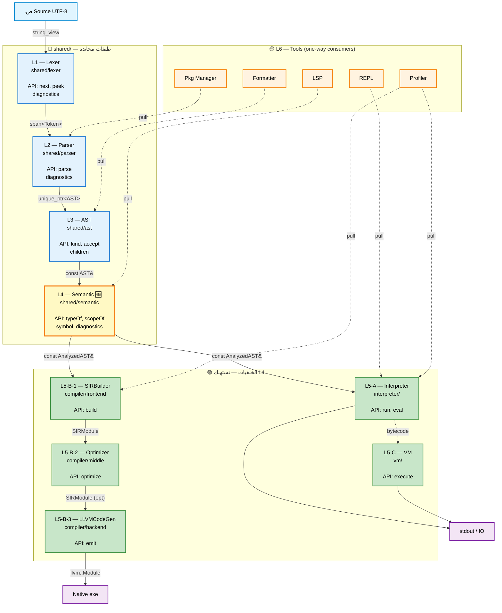
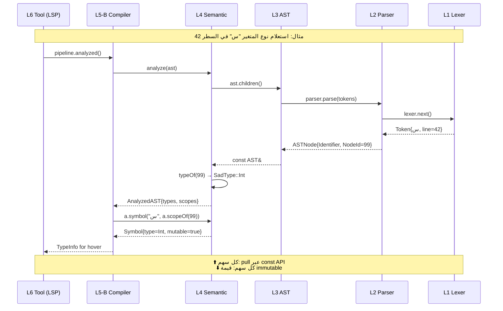
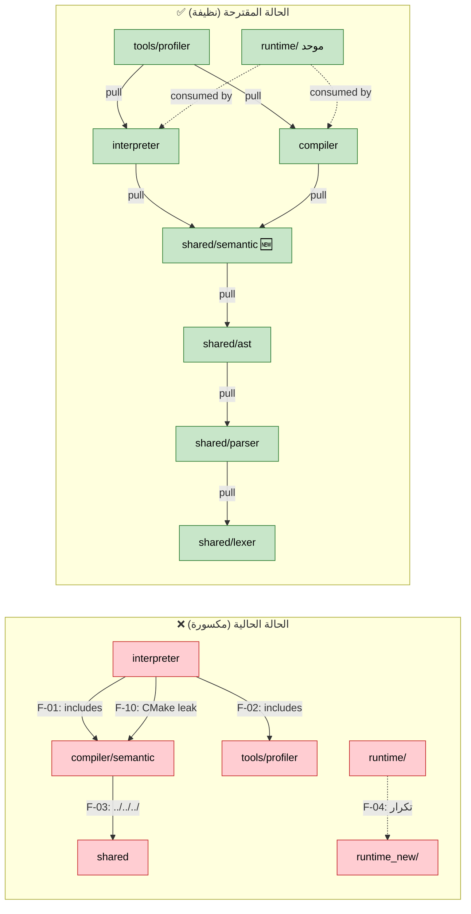

# خطة إعادة الهيكلة المعمارية للغة ص (Architectural Refactor Plan)

> **التاريخ:** نوفمبر 2025
> **آخر تحديث:** نوفمبر 2025 (تدقيق امتثال شامل)
> **الحالة:** ✅ **مكتملة 7/7 مراحل** (راجع §١٠ تقرير الإكتمال)
> **النطاق:** إعادة هيكلة طبقات المشروع لتحسين الصيانة والتوسع
> **الهدف:** إزالة التشابك الطبقي والتكرار وفوضى التنظيم بدون كسر الوظائف

---

## ٠) تقرير حالة الإكتمال (نوفمبر 2025) ✅

تدقيق امتثالي شامل بفحص فعلي للمستودع أكّد أن **جميع المراحل السبع نُفّذت بالكامل**:

| المرحلة | الحالة | الدليل العملي |
|---|---|---|
| ١ — التنظيف الأساسي | ✅ مكتملة | 0 ملفات `.bak/.tmp/.fixed/.new` في `interpreter/`. `.gitignore` يحوي أنماط الحماية. |
| ٢ — توحيد runtime/ | ✅ مكتملة | `runtime_new/` حُذف بالكامل. `runtime/` هو الوحيد. |
| ٣ — فك تشابك مفسر/مترجم (F-01, F-10) | ✅ مكتملة | `shared/semantic/` تأسس (5 ملفات). `interpreter_core.cpp` يضم `semantic/type_checker.h` (وليس من `compiler/include`). `interpreter/CMakeLists.txt` أزال مسارات `compiler/include`. |
| ٤ — مسارات #include الهشّة (F-03) | ✅ مكتملة | 0 نتائج لـ `#include "../../../"` في `compiler/`, `interpreter/`, `vm/`. |
| ٥ — نقل profiler (F-02) | ✅ مكتملة | المصدر في `shared/profiler/` (بدلاً من `shared/instrumentation/` المقترح في الخطة). 0 ملف من المفسر يشير لـ `tools/profiler`. مكتبة `sad_profiler_lib` مستقلة. |
| ٦ — توحيد builtins (F-05) | ✅ مكتملة (ADR-003) | `shared/builtins/include/builtin_registry.h` كمصدر حقيقة وحيد. **47 ملف** في المفسر يستهلكه. الأسماء القانونية في `Sad::Builtins::Names`. |
| ٧ — تفكيك sir_builder (F-06) | ✅ مكتملة | بدلاً من 70 ملف god-class، تم التقسيم إلى **6 ملفات أساسية** + **60 ملف subsystem** في `compiler/src/frontend/builders/`. |

**ملاحظة على F-09 (encoding تعليقات CMake):** تبيّن أنها إنذار كاذب. ملفات CMake سليمة UTF-8، التشويه السابق كان فقط من عرض PowerShell 5.1 بـ Windows-1252 codepage.

**التحسينات الإضافية المُوصى بها (اختيارية):**
- توسيع استهلاك `builtin_registry.h` في كود المترجم (حالياً 2 ملف فقط).
- النظر في إعادة تسمية `shared/profiler/` إلى `shared/instrumentation/` للاتساق مع الخطة (تغيير تجميلي فقط).

---

## ١) الملخص التنفيذي

تشخيصُ بنية المشروع كشف **تسريبات طبقية حرجة (layer leaks)** و**تكرار جسيم (duplication)** و**تشتت مسؤوليات (responsibility scatter)** ستجعل صيانة اللغة مع نموها مكلفة جداً خلال 6–12 شهراً.

البنية الحالية تبدو منظمة على CMake لكنها **مكسورة على مستوى `#include`** و**تحتوي وحدة runtime مكررة بالكامل** و**تشتت دوال البنية على 3 مواقع منفصلة**.

هذه الخطة تقدّم **ست مراحل مُرقّمة** يمكن تنفيذها بشكل مستقل، كل مرحلة تنتهي بحالة قابلة للبناء والاختبار، مع إمكانية التراجع.

---

## ٢) التقييم الحالي (Baseline)

### بطاقة الجودة الأولية
| المعيار | الدرجة | الملاحظة |
|---|---|---|
| فصل الطبقات على CMake | 7/10 | مكتبات منفصلة لكن include paths متسربة |
| فصل الطبقات على #include | 4/10 | المفسر يستورد من المترجم مباشرةً |
| عدم التكرار (DRY) | 3/10 | `runtime/` و `runtime_new/` متطابقان |
| تنظيم الملفات | 4/10 | فوضى الجذر، ملفات `.bak/.tmp/.fixed/.new` |
| قابلية التوسع | 5/10 | إضافة opcode تتطلب لمس 3–5 طبقات |
| **المجموع** | **23/50** | **متوسط مع ميل للأسوأ** |

### قائمة المشاكل المرصودة (Findings)

| الرمز | الوصف | الدليل | الخطورة |
|---|---|---|---|
| F-01 | المفسر يضم رأس من المترجم | `interpreter/src/core/interpreter_core.cpp:22` يضم `compiler/include/semantic/type_checker.h` | 🔴 حرجة |
| F-02 | 11 ملف في المفسر يضم `tools/profiler` | كل visitor تقريباً | 🔴 حرجة |
| F-03 | 30+ ملف يستخدم `#include "../../../shared/..."` | جميع `compiler/src/frontend/sir_builder_*.cpp` | 🟡 مهمة |
| F-04 | تكرار كامل لـ runtime | `runtime/CMakeLists.txt` ≈ `runtime_new/CMakeLists.txt` | 🔴 حرجة |
| F-05 | builtins موزّعة على 3 مواقع | `shared/builtins/`, `interpreter/src/builtins/`, `stdlib/` | 🟡 مهمة |
| F-06 | god-class مُقسَّم نصياً | 70 ملف `sir_builder_*.cpp` يشتركون في class واحد | 🟡 مهمة |
| F-07 | ملفات احتياطية في الإنتاج | `*.cpp.bak`, `*.cpp.tmp`, `*.cpp.fixed`, `*.cpp.new` | 🟢 سهلة |
| F-08 | ~80 ملف scratch في الجذر | `_tmp_*.ص`, `*.ll`, `*.exe` | 🟢 سهلة |
| F-09 | تعليقات CMake مُحرّفة (encoding) | `compiler/CMakeLists.txt` | 🟢 سهلة |
| F-10 | interpreter CMake يكشف include path للمترجم | `${CMAKE_SOURCE_DIR}/compiler/include/semantic` | 🔴 حرجة |

---

## ٣) المبادئ التوجيهية للإعادة الهيكلة

تُطبَّق قواعد المشروع الـ60 (CW-01 إلى CW-30 + BF-01 إلى BF-30) كمعيار قبول لكل مرحلة. أهم المبادئ:

- **CW-02 (تسلسل الطبقات):** `Lexer → Parser → AST → SIR → LLVM`. يُمنع الاعتماد العكسي.
- **CW-19 (DRY):** يُحظر تكرار CMakeLists أو منطق متطابق في موقعين.
- **CW-06 (الاعتماديات المُصرّحة):** كل include يأتي من target_include_directories، لا مسارات نسبية `../../../`.
- **BF-09 (الحل الجذري):** يُمنع الترقيع. كل خطوة تُصلح السبب لا العَرَض.
- **BF-10 (الطبقة الصحيحة):** الإصلاح يُطبَّق في الطبقة التي يحدث فيها الخطأ.

### قاعدة عقد الطبقات (Layer Contract)

```
┌─────────────────────────────────────────────────────────────┐
│ tools/  (lsp, formatter, repl, profiler, pkg)              │ يعتمد على ↓
├─────────────────────────────────────────────────────────────┤
│ compiler/      │  interpreter/      │  vm/                  │ يعتمدون على ↓ فقط
├─────────────────────────────────────────────────────────────┤
│ stdlib/        │  runtime/                                  │ يعتمد على ↓ فقط
├─────────────────────────────────────────────────────────────┤
│ shared/  (lexer, parser, ast, types, errors, semantic)     │ مستقلة
└─────────────────────────────────────────────────────────────┘
```

**قواعد صارمة:**
- `shared/` لا يعرف عن compiler/interpreter/vm/tools. **حالياً: ✅ ملتزم.**
- `interpreter/` لا يعرف عن compiler/vm/tools. **حالياً: ❌ مكسور (F-01, F-02, F-10).**
- `compiler/` لا يعرف عن interpreter/vm. **حالياً: ✅ ملتزم.**
- `tools/` يمكنه الاعتماد على أي شيء أسفله، لكن لا أحد يعتمد على `tools/`. **حالياً: ❌ مكسور (F-02).**

---

## ٣-أ) رسم الطبقات التفصيلي وبروتوكول نقل المعلومات

### مخطط Mermaid التفاعلي للطبقات



### مخطط بروتوكول نقل المعلومات (Pull-only)



### مخطط الاعتماديات الحالية مقابل المقترحة



### المخطط الكامل للطبقات وتدفق البيانات

```
   ╔══════════════════════════════════════════════════════════════════════╗
   ║                    المصدر (.ص source code — UTF-8)                    ║
   ╚══════════════════════════════════════════════════════════════════════╝
                                  ↓ نص خام
   ┌──────────────────────────────────────────────────────────────────────┐
   │  L1 — طبقة المعجم  (shared/lexer)                                     │
   │  ─────────────────────────────────────────                            │
   │  المسؤولية: تحويل النص إلى Tokens                                     │
   │  المُخرَج: TokenStream (slice من Token)                                │
   │                                                                       │
   │  واجهة الجلب (Pull API):                                              │
   │    LexerCore::next() → Token                                          │
   │    LexerCore::peek(offset) → const Token&                            │
   │    LexerCore::position() → Position                                   │
   │    LexerCore::diagnostics() → const ErrorList&                        │
   └──────────────────────────────────────────────────────────────────────┘
                                  ↓ Token (immutable value)
   ┌──────────────────────────────────────────────────────────────────────┐
   │  L2 — طبقة النحو  (shared/parser)                                     │
   │  ─────────────────────────────────────────                            │
   │  المسؤولية: بناء AST من Tokens                                        │
   │  المُخرَج: ASTNodePtr (root = Program)                                  │
   │                                                                       │
   │  واجهة الجلب:                                                          │
   │    ParserCore::parse() → unique_ptr<ProgramNode>                     │
   │    ParserCore::diagnostics() → const ErrorList&                       │
   │                                                                       │
   │  لا يعرف عن: types/semantic/codegen — فقط grammar                     │
   └──────────────────────────────────────────────────────────────────────┘
                                  ↓ AST (read-only tree)
   ┌──────────────────────────────────────────────────────────────────────┐
   │  L3 — طبقة الـ AST  (shared/ast)                                      │
   │  ─────────────────────────────────────────                            │
   │  المسؤولية: تمثيل الشجرة + Visitor pattern                            │
   │                                                                       │
   │  واجهة الجلب:                                                          │
   │    ASTNode::kind() → NodeKind                                         │
   │    ASTNode::position() → Position                                     │
   │    ASTNode::accept(Visitor&) → void                                   │
   │    ASTNode::children() → span<const ASTNode*>                         │
   │                                                                       │
   │  محايد تماماً: لا تنفيذ، لا تقييم، لا codegen                         │
   └──────────────────────────────────────────────────────────────────────┘
                                  ↓ AST + Visitor
   ┌──────────────────────────────────────────────────────────────────────┐
   │  L4 — طبقة التحليل الدلالي  (shared/semantic)  ← جديدة                │
   │  ─────────────────────────────────────────                            │
   │  المسؤولية: type-check, scope, ownership, exhaustiveness              │
   │  المُخرَج: AnalyzedAST (AST + جدول رموز + جدول أنواع)                  │
   │                                                                       │
   │  واجهة الجلب:                                                          │
   │    SemanticAnalyzer::analyze(AST&) → AnalyzedAST                     │
   │    AnalyzedAST::typeOf(NodeId) → SadType                              │
   │    AnalyzedAST::scopeOf(NodeId) → ScopeId                             │
   │    AnalyzedAST::symbol(name, scope) → optional<Symbol>                │
   │    AnalyzedAST::diagnostics() → const ErrorList&                      │
   │                                                                       │
   │  مشتركة بين المفسر والمترجم (تحل F-01)                                │
   └──────────────────────────────────────────────────────────────────────┘
            ↓ AnalyzedAST                          ↓ AnalyzedAST
   ┌────────────────────────────┐    ┌──────────────────────────────────┐
   │  L5-A — المفسر              │    │  L5-B — المترجم  (compiler/)      │
   │  (interpreter/)            │    │                                  │
   │  ─────────────────────     │    │  ─────────────────────────       │
   │  المسؤولية: التنفيذ المباشر│    │  L5-B-1: SIRBuilder              │
   │                            │    │    AST → SIR Module              │
   │  واجهة الجلب:               │    │                                  │
   │   InterpreterCore::run(AST)│    │  L5-B-2: SIROptimizer            │
   │     → ExitCode             │    │    SIR → SIR (محسَّن)              │
   │   InterpreterCore::eval(   │    │                                  │
   │     expr) → Value          │    │  L5-B-3: LLVMCodeGen             │
   │   ScopeManager::lookup(    │    │    SIR → LLVM IR                 │
   │     name) → Value*         │    │                                  │
   │                            │    │  L5-B-4: LLVM Backend (extern)   │
   │  يستخدم: AnalyzedAST من L4 │    │    LLVM IR → Object → exe        │
   └────────────────────────────┘    │                                  │
            ↓ Value (runtime)         │  واجهة الجلب لكل مرحلة فرعية:    │
            ↓ stdout/IO              │   SIRModule::functions() → span  │
                                      │   SIRFunction::blocks() → span   │
   ┌────────────────────────────┐    │   SIRBlock::instructions() → span│
   │  L5-C — VM  (vm/)           │    │   SIROperand::type() → SIRType   │
   │  ─────────────────────     │    │   SIROperand::dataType() → Sad   │
   │  Bytecode interpreter      │    │   LLVMCodeGen::emit(SIR&)        │
   │  (مرتبط بالمفسر داخلياً)    │    │     → llvm::Module               │
   └────────────────────────────┘    └──────────────────────────────────┘
                                                  ↓ Native executable

   ┌──────────────────────────────────────────────────────────────────────┐
   │  L6 — طبقة الأدوات (tools/)                                           │
   │  ─────────────────────────────────────────                            │
   │  lsp, formatter, repl, profiler, pkg                                  │
   │                                                                       │
   │  تستهلك L1–L5 عبر واجهات الجلب فقط                                    │
   │  لا أحد يعتمد عليها (one-way arrow)                                   │
   └──────────────────────────────────────────────────────────────────────┘
```

### بروتوكول نقل المعلومات بين الطبقات

كل طبقة تتبع **عقد الواجهة الخالصة (Pure Interface Contract)** التالي:

#### القاعدة الذهبية: **Pull, don't Push** (اسحب المعلومة، لا تُمرّرها)

```cpp
// ❌ خطأ: تمرير state داخلي مباشرة
class SIRBuilder {
    SymbolTable* symbols_;  // وصول مباشر لداخل L4
    void build() {
        symbols_->table_["x"] = ...;  // كسر الـ encapsulation
    }
};

// ✅ صحيح: الجلب عبر دالة من الطبقة الأدنى
class SIRBuilder {
    const AnalyzedAST& analyzed_;  // مرجع للقراءة فقط
    void build(const ASTNode& node) {
        SadType t = analyzed_.typeOf(node.id());  // pull via API
        auto sym = analyzed_.symbol(node.name(), currentScope());
    }
};
```

#### القواعد الخمس لنقل المعلومات

**ق-١: واجهة جلب صريحة (Explicit Getter API)**
كل طبقة تكشف **دوال جلب فقط** (`const` methods أو `query()` functions). لا تكشف member variables أو data structures مباشرةً.

```cpp
// shared/semantic/include/analyzed_ast.h
class AnalyzedAST {
public:
    // === Getters فقط — لا setters عامة ===
    SadType typeOf(NodeId id) const;
    ScopeId scopeOf(NodeId id) const;
    std::optional<Symbol> symbol(StringView name, ScopeId scope) const;
    span<const Diagnostic> diagnostics() const;

    // الـ setters داخلية (private) ويملكها SemanticAnalyzer فقط (friend)
private:
    friend class SemanticAnalyzer;
    void setType(NodeId, SadType);
};
```

**ق-٢: قيم غير قابلة للتعديل (Immutable Values)**
المعلومات المنقولة بين الطبقات تُمرَّر إما بالقيمة (إذا كانت صغيرة) أو بمرجع `const`. **يُمنع** تمرير مؤشر قابل للتعديل عبر حدود الطبقات.

```cpp
// ✅ Token ينتقل بالقيمة (POD)
Token tok = lexer.next();

// ✅ AST ينتقل بمرجع const
void Parser::visit(const ASTNode& node);

// ❌ ممنوع: تعديل AST من L5
ASTNode* node = ...;  // mutable pointer
node->setType(...);   // تعديل عابر للطبقات
```

**ق-٣: مُعرّفات معتمدة (Stable Identifiers)**
لا تنقل مؤشرات (`T*`) عبر الطبقات. انقل **مُعرّفات** (`NodeId`, `ScopeId`, `SymbolId`) واجلب الكائن الفعلي عبر دالة جلب.

```cpp
// ❌ هش — يكسر إن انتقلت الذاكرة
struct SIROperand { ASTNode* sourceNode; };

// ✅ مستقر — يبقى صالحاً حتى مع إعادة التخصيص
struct SIROperand { NodeId sourceNodeId; };
SIRBuilder::resolveSourceNode(NodeId) const → const ASTNode&
```

**ق-٤: ممنوع الاتجاه العكسي (No Upward Dependencies)**
الطبقة الأدنى **لا تعرف** عن الطبقة الأعلى مطلقاً. يُمنع include من L1 إلى L5.

| من ↓ إلى ↑ | مسموح؟ |
|---|---|
| L1 → L2 | ❌ ممنوع |
| L4 → L5 | ❌ ممنوع |
| L5 → L4 | ✅ مسموح (pull) |
| L6 → L1..L5 | ✅ مسموح (pull) |

**ق-٥: تشخيصات منفصلة (Diagnostics Channel)**
الأخطاء والتحذيرات تُجمَّع في كل طبقة في `ErrorList` خاص بها، وتُكشف عبر `.diagnostics()`. الطبقة الأعلى تجمعها لكن لا تتدخل في إنتاجها.

```cpp
auto tokens = lexer.tokenize(src);
if (!lexer.diagnostics().empty()) return Failure;

auto ast = parser.parse(tokens);
if (!parser.diagnostics().empty()) return Failure;

auto analyzed = semantic.analyze(*ast);
if (analyzed.diagnostics().hasErrors()) return Failure;

// كل طبقة تملك تشخيصاتها فقط
```

### مصفوفة عقود الواجهات (Interface Contract Matrix)

| الطبقة | المُدخَل | المُخرَج | الـ API الأساسي للجلب | حالة الالتزام |
|---|---|---|---|---|
| L1 Lexer | `string_view src` | `vector<Token>` | `next()`, `peek()`, `diagnostics()` | ✅ |
| L2 Parser | `span<Token>` | `unique_ptr<AST>` | `parse()`, `diagnostics()` | ✅ |
| L3 AST | — (data) | — | `kind()`, `accept()`, `children()` | ✅ |
| L4 Semantic | `const AST&` | `AnalyzedAST` | `typeOf()`, `scopeOf()`, `symbol()` | 🔧 يحتاج إنشاء |
| L5-A Interpreter | `const AnalyzedAST&` | `ExitCode` | `run()`, `eval()` | 🔧 يحتاج فك التشابك |
| L5-B Compiler | `const AnalyzedAST&` | `LLVM Module` | `buildSIR()`, `optimize()`, `emit()` | ⚠️ مسارات هشة |
| L6 Tools | أي طبقة | UI/CLI | حسب الأداة | 🔧 يحتاج عكس الاتجاه |

### تحليل الواجهات الحالية مقابل المقترحة (Audit & Gap Analysis)

تم فحص الـ headers الفعلية في كل طبقة. الجدول التالي يقارن الموجود فعلاً بالمعيار المطلوب:

#### L1 — Lexer ([shared/lexer/include/lexer_core.h](shared/lexer/include/lexer_core.h))

| المعيار | الحالة | الدليل |
|---|---|---|
| Pull API صريحة | ✅ موجودة | `tokenize()`, `nextToken()`, `peek()`, `peekNext(offset)`, `getCurrentPosition()`, `isAtEnd()` |
| فصل scan helpers في public | ⚠️ **تسريب** | `scanNumber()`, `scanString()`, `scanFString()`, `scanIdentifier()`, `scanOperator()` كلها `public` — يجب أن تكون `private` |
| diagnostics() منفصل | ❌ مفقود | لا يوجد `diagnostics()` معياري — الأخطاء تُطبع مباشرة |
| immutability | ⚠️ جزئي | بعض getters `const` لكن `nextToken()` ليست const |

**الحكم:** L1 تتبع البروتوكول جزئياً. **التغيير المطلوب:** نقل scan* إلى private، إضافة `diagnostics()` موحدة.

#### L2 — Parser ([shared/parser/include/parser_core.h](shared/parser/include/parser_core.h))

| المعيار | الحالة | الدليل |
|---|---|---|
| Pull API محدودة وواضحة | ✅ ممتازة | `parseProgram()`, `hasErrors()`, `getErrors()`, `getRecoveryStats()`, `getRecoveryLog()` |
| فصل public/private صحيح | ✅ ممتاز | كل `parseDeclaration`, `parseStatement`, `parseClassDecl`, ... كلها `private` |
| diagnostics منفصلة | ✅ موجودة | `getErrors()`, `hasErrors()`, `getRecoveryLog()` |
| اعتماد على L1 فقط | ✅ نظيف | constructor يأخذ `LexerCore&` |

**الحكم:** L2 **هي المثال الذهبي** للبروتوكول في المشروع. تطبّقه بدقة.

#### L3 — AST ([shared/ast/include/ast_node.h](shared/ast/include/ast_node.h))

| المعيار | الحالة | الدليل |
|---|---|---|
| Visitor pattern | ✅ موجود | `accept(ASTVisitor&)` على كل عقدة |
| toString() للتشخيص | ✅ موجود | virtual pure |
| immutability على الـ accept | ❌ **مكسور** | `accept()` ليست `const` — الزائرون يستطيعون التعديل |
| getType() مدمج في Expression | ⚠️ **تسريب طبقي** | L3 يعرف عن `Types::SadTypePtr` — هذا يجب أن يكون في L4 |
| children() موحد | ❌ مفقود | لا توجد `children()` عامة، كل عقدة تكشف حقولها مباشرة |

**الحكم:** L3 يخلط هويته كـ "بنية بيانات نقية" مع مسؤوليات نوع. `getType()` على Expression يجب أن ينتقل إلى L4.

#### L4 — Semantic ([compiler/include/semantic/type_checker.h](compiler/include/semantic/type_checker.h))

| المعيار | الحالة | الدليل |
|---|---|---|
| موقعها في `shared/` | ❌ **مكسور** | حالياً في `compiler/include/semantic/` — تسريب F-01 |
| Pull API نظيفة | ⚠️ جزئي | `check(AST*)`, `getResult()`, `printSummary()` موجودة |
| Visitor methods في public | ❌ **تسريب جسيم** | 30+ method `visitBinaryExpr`, `visitUnaryExpr`, ... كلها `public` بسبب `override` من `BaseASTVisitor` |
| عدم تعديل AST | غير معروف | يحتاج فحص داخلي |
| Diagnostics منفصلة | ✅ موجودة | `TypeCheckResult{errors, warnings}` |

**الحكم:** L4 موجودة من حيث المنطق لكن في الموقع الخاطئ، وواجهتها مكشوفة بسبب Visitor pattern العام. **التغيير المطلوب:** نقلها إلى `shared/semantic/` وإخفاء `visit*` خلف interface مغلقة.

#### L5-A — Interpreter ([interpreter/include/core/interpreter_core.h](interpreter/include/core/interpreter_core.h))

| المعيار | الحالة | الدليل |
|---|---|---|
| API الأساسي | ✅ موجود | `execute(program)`, `executeStatement()`, `evaluateExpression()`, `reset()` |
| getter للـ managers | 🔴 **خرق صارخ لـ ق-١** | `getVariableManager()`, `getFunctionManager()`, `getScopeManager()`, `getOwnershipManager()`, `getModuleResolver()` — كلها تُعيد **مراجع قابلة للتعديل** للـ state الداخلي |
| immutability | ❌ مكسور | الـ getters تُعيد `&` غير `const` |
| اعتماد على L4 فقط | ❌ مكسور | يضم type_checker مباشرة (F-01) |

**الحكم:** L5-A **يكشف أحشاءه بالكامل**. أي مستهلك خارجي يستطيع تعديل state المفسر مباشرةً عبر `getXxxManager()`. هذا أسوأ خرق للبروتوكول في المشروع.

#### L5-B — Compiler ([compiler/include/frontend/sir_builder.h](compiler/include/frontend/sir_builder.h))

| المعيار | الحالة | الدليل |
|---|---|---|
| API الأساسي | ✅ نظيف | `buildModule(program)` كنقطة دخول واضحة |
| فصل public/private | ⚠️ جزئي | `buildFunction`, `buildClass`, `buildTrait`, `buildGlobalVariable` في public — يجب أن تكون private |
| نسخ ممنوع | ✅ صحيح | `SIRBuilder(const&) = delete` |
| god-class | 🔴 مرصود (F-06) | الـ header وحده يحتوي مئات الـ methods + structs (BuildResult, VariableInfo, FunctionInfo, TypeParameter, ...) |
| اعتماد على L4 | ⚠️ بدون عقد واضح | يستهلك AST مباشرة بدون طبقة Semantic معيارية |

**الحكم:** L5-B لديه نقطة دخول جيدة (`buildModule`) لكن داخله يحتاج تفكيك. حقن `AnalyzedAST` بدل AST خام سيُحسّن العقد.

### مصفوفة الفجوات الإجمالية

| الطبقة | فصل public/private | Pull-only API | Immutability | Layer Position | الدرجة |
|---|---|---|---|---|---|
| L1 Lexer | 6/10 | 8/10 | 7/10 | ✅ | **7/10** |
| L2 Parser | 10/10 | 10/10 | 9/10 | ✅ | **10/10** ⭐ |
| L3 AST | 7/10 | 6/10 | 4/10 | ⚠️ تسريب نوع | **6/10** |
| L4 Semantic | 3/10 | 6/10 | 5/10 | ❌ موقع خاطئ | **5/10** |
| L5-A Interpreter | 2/10 | 3/10 | 2/10 | ❌ مكسور | **3/10** 🔴 |
| L5-B Compiler | 5/10 | 7/10 | 7/10 | ⚠️ god-class | **6/10** |

### الخلاصة والتوصيات المُحدّثة

**النتيجة الإجمالية:** 6.2/10 — Parser وحده هو "المعيار الذهبي"، باقي الطبقات تحتاج عمل.

**أولويات الإصلاح بناء على هذا التحليل:**

1. **عاجل (يكسر البروتوكول مباشرة):** L5-A getter methods
   ```cpp
   // ❌ الحالي
   Data::VariableManager &getVariableManager() { return *variableManager_; }
   
   // ✅ المقترح: استبدالها بـ pull APIs محددة
   std::optional<Data::Value> getVariable(StringView name) const;
   bool hasVariable(StringView name) const;
   ```

2. **مهم:** نقل `Types::SadTypePtr getType()` من L3 إلى L4
   - L3 (AST) يبقى "data only"
   - L4 (AnalyzedAST) يكشف `typeOf(node)` كدالة جلب

3. **مهم:** نقل `TypeChecker` إلى `shared/semantic/` (المرحلة 3)

4. **متوسط:** إخفاء `visit*` methods في Visitors خلف interface وسطية

5. **متوسط:** تقسيم `SIRBuilder` god-class إلى subsystems (المرحلة 7)

> **نتيجة مهمة:** المرحلة 3 من الخطة (فك التشابك) ليست مجرد نقل ملف — بل تحتاج **إعادة تصميم واجهة L4** وفق نمط Parser الذهبي.

### مثال عملي: رحلة استعلام نوع متغير

السيناريو: المترجم يحتاج معرفة نوع المتغير `س` في السطر 42.

```cpp
// ❌ النمط الحالي (مكسور — F-01):
// المفسر يضم type_checker.h من المترجم مباشرة
#include "../../../compiler/include/semantic/type_checker.h"
auto type = TypeChecker::globalInstance().lookup("س", scope);

// ✅ النمط المقترح (Pull عبر واجهة محايدة):
// L4 يكشف API، L5-A و L5-B يستهلكان نفس الواجهة
const AnalyzedAST& a = pipeline.analyzed();          // L4
auto sym = a.symbol("س", a.scopeOf(currentNodeId)); // pull
if (sym) {
    SadType t = sym->type;
    // المترجم يستخدمه لاختيار LLVM type
    // المفسر يستخدمه لاختيار Value variant
}
```

### نتائج تطبيق هذا البروتوكول

| المعيار | قبل | بعد |
|---|---|---|
| طبقات تعرف عن بعضها (coupling) | المفسر→المترجم، المترجم→shared، 11 ملف→tools | كل طبقة تعرف فقط الطبقة الأدنى مباشرةً |
| تعديل عابر للطبقات | ممكن (pointers قابلة للتعديل) | مستحيل (const + IDs) |
| اختبار طبقة منفردة | صعب (تشابك state) | سهل (pure inputs/outputs) |
| استبدال خلفية (مثلاً WASM) | يتطلب لمس 5+ طبقات | يتطلب L5-B جديدة فقط |

---

## ٤) المراحل التنفيذية

### المرحلة ١: التنظيف الأساسي (Cleanup) — يوم واحد

**الهدف:** إزالة الفوضى المرئية بدون أي تغيير وظيفي.

#### الإجراءات
1. **حذف ملفات الإنتاج الاحتياطية** (F-07):
   ```
   interpreter/src/visitors/expression_evaluator_core.cpp.new
   interpreter/src/visitors/expression_evaluator_oop_concurrency.cpp.bak
   interpreter/src/visitors/expression_evaluator_oop_concurrency.cpp.fixed
   interpreter/src/visitors/expression_evaluator_oop_concurrency.cpp.tmp
   ```

2. **نقل scratch من الجذر إلى `_scratch/scratch_root/`** (F-08):
   - جميع `_tmp_*.ص` و `_tmp_*.ll`
   - جميع `*.ll` المستقلة في الجذر (`_207.ll`, `_222.ll`, `049_closures_capture.ll`, ...)
   - أو حذفها إن كانت مهجورة (تأكيد المستخدم لازم).

3. **إصلاح encoding تعليقات CMake** (F-09):
   - إعادة كتابة التعليقات العربية في `compiler/CMakeLists.txt` بترميز UTF-8 صحيح.

4. **تحديث `.gitignore`:**
   ```gitignore
   # Backup/temp files
   *.bak
   *.tmp
   *.fixed
   *.new
   *.cpp.bak
   *.cpp.tmp
   *.cpp.fixed
   *.cpp.new

   # Root scratch
   /_tmp_*
   /_*.ll
   /[0-9]*_*.ll
   ```

#### معيار القبول
- `git status` لا يُظهر ملفات `.bak/.tmp/.fixed/.new` كـ tracked.
- جذر المشروع يحتوي ≤20 ملف فقط.
- البناء كامل ينجح: `cmake --build build --config Debug`.
- `python tests/dual_execution/runner.py` يعطي 30/30 ناجح.

---

### المرحلة ٢: توحيد runtime/ (Deduplication) — يوم واحد

**الهدف:** القضاء على التكرار الكامل بين `runtime/` و `runtime_new/`.

#### التحقيق المطلوب أولاً
1. تشغيل `diff -r runtime/ runtime_new/` لتحديد الفروقات الفعلية.
2. تحديد أيهما يُستخدم في البناء (`grep "add_subdirectory.*runtime" cmake/`).
3. توثيق سبب وجود الفرعين (إن وُجد).

#### القرار المقترح
- **إذا كانت متطابقة فعلاً:** حذف `runtime/` والاحتفاظ بـ `runtime_new/`، ثم إعادة تسمية `runtime_new/ → runtime/`.
- **إذا كانت `runtime_new/` تطوير قادم:** ترك `runtime_new/` معطلاً مؤقتاً وتوثيق ذلك بـ README، أو نقل الفروقات لـ `runtime/` مباشرة.

#### الإجراءات
1. تأكيد القرار مع المستخدم (مهم — تغيير معماري).
2. حذف الفرع الزائد.
3. تحديث جميع المراجع في `cmake/*.cmake`.
4. اختبار البناء الشامل.

#### معيار القبول
- وجود فرع واحد فقط: `runtime/`.
- بناء `sad` و `sadc` بنجاح.
- اختبارات OS kernel (إن وُجدت) تعمل.

---

### المرحلة ٣: فك تشابك المفسر/المترجم (Decoupling) — 2–3 أيام

**الهدف:** كسر اعتماد `interpreter → compiler/semantic` (F-01, F-10).

#### الخطوات
1. **التحليل:**
   - تحديد الرموز المُستخدَمة من `compiler/include/semantic/type_checker.h` داخل المفسر.
   - تصنيفها: هل هي حقاً وظائف "تحليل دلالي" مشتركة، أم خاصة بالمترجم؟

2. **إعادة التنظيم:**
   - إذا كانت مشتركة: نقلها إلى `shared/semantic/` (طبقة جديدة محايدة).
   - إذا كانت خاصة بالمترجم لكن المفسر يحتاج جزءاً منها: استخراج الجزء المشترك إلى `shared/analysis/`.

3. **بنية الإخراج المقترحة:**
   ```
   shared/
   ├── ast/
   ├── lexer/
   ├── parser/
   ├── types/
   ├── errors/
   ├── semantic/      ← جديد: type_checker, scope analyzer
   └── analysis/      ← جديد (اختياري): exhaustiveness, this_binding
   ```

4. **تحديث CMake:**
   - إنشاء target `sad_semantic_shared` في `shared/semantic/CMakeLists.txt`.
   - إزالة `${CMAKE_SOURCE_DIR}/compiler/include` من `target_include_directories(sad_interpreter ...)`.
   - ربط `sad_interpreter` و `sad_semantic` (compiler) كلاهما بـ `sad_semantic_shared`.

5. **تحديث #include:**
   ```cpp
   // قبل:
   #include "../../../compiler/include/semantic/type_checker.h"
   // بعد:
   #include "shared/semantic/type_checker.h"
   ```

#### معيار القبول
- `grep -r "compiler/include" interpreter/` يعطي 0 نتائج.
- `interpreter/CMakeLists.txt` لا يحتوي إشارة لـ `compiler/include`.
- اختبارات المفسر تنجح (900+ comprehensive).
- اختبارات المترجم تنجح.

---

### المرحلة ٤: إصلاح مسارات #include الهشّة (Path Hygiene) — يومان

**الهدف:** إزالة كل `#include "../../../..."` (F-03).

#### الإجراءات
1. **مسح شامل:**
   ```powershell
   grep -r '#include\s*"\.\./\.\./\.\./' compiler/ interpreter/ vm/ tools/
   ```

2. **استبدال آلي:**
   - إنشاء سكريبت Python يستبدل كل `"../../../shared/X/include/Y.h"` بـ `"X/Y.h"` بناءً على target_include_directories.
   - ضمان أن CMake يضيف `shared/X/include` كـ public include path للمكتبة المعنية.

3. **تأكيد البناء:**
   - قد يتطلب إضافة بعض المسارات إلى target_include_directories.
   - اختبار شامل بعد كل مجموعة استبدالات.

#### معيار القبول
- 0 نتائج لـ `grep '\.\./\.\./\.\./' --include='*.cpp' --include='*.h'`.
- البناء كامل ينجح بدون warnings جديدة.

---

### المرحلة ٥: نقل tools/profiler إلى shared/instrumentation/ — يوم واحد

**الهدف:** كسر اعتماد `interpreter → tools/profiler` (F-02).

#### الإجراءات
1. **تحريك:**
   - نقل `tools/profiler/include/profiler_hooks.h` إلى `shared/instrumentation/include/profiler_hooks.h`.
   - نقل ملفات `profiler_hooks.cpp` المرتبطة (إن وُجدت).

2. **تحديث target dependencies:**
   - إنشاء `sad_instrumentation` library في `shared/instrumentation/`.
   - ربطها بـ `sad_interpreter` و `sad_compiler` كاعتماد عام.

3. **استبدال #include:**
   ```cpp
   // قبل:
   #include "../../tools/profiler/include/profiler_hooks.h"
   // بعد:
   #include "instrumentation/profiler_hooks.h"
   ```

#### معيار القبول
- `grep -r "tools/profiler" interpreter/ compiler/` يعطي 0 نتائج.
- `tools/profiler/` تبقى فقط للأدوات السطحية (profiler CLI، تقارير) أو تُحذف إن كانت فارغة.

---

### المرحلة ٦: توحيد builtins (Single Source of Truth) — 3–5 أيام

**الهدف:** القضاء على تشتت دوال البنية على 3 مواقع (F-05).

#### التحليل المطلوب
1. مَن يحدد قائمة الدوال المدمجة؟
2. كيف تُسجَّل في كل من المفسر والمترجم؟
3. هل يوجد سجل موحد (registry) أم تكرار؟

#### البنية المقترحة
```
shared/builtins/                   ← واجهة مشتركة (declarations فقط)
├── include/
│   ├── builtin_registry.h         ← Registry موحد
│   ├── builtin_signature.h        ← توقيعات الدوال
│   └── modules/
│       ├── math.h
│       ├── strings.h
│       └── ...

interpreter/src/builtins/          ← التنفيذ في المفسر
├── builtin_module_math.cpp
├── builtin_module_strings.cpp
└── ...

compiler/src/builtins/             ← codegen للمترجم (LLVM IR)
├── codegen_math.cpp
├── codegen_strings.cpp
└── ...

stdlib/                            ← مكتبات .ص خالصة (ليست builtins)
└── ...
```

**القاعدة:**
- `shared/builtins/` يعرّف **ما** هي الدوال (signatures, names).
- `interpreter/src/builtins/` و `compiler/src/builtins/` يعرّفان **كيف** تُنفَّذ في كل خلفية.
- `stdlib/` للكود المكتوب بلغة ص (ليس C++).

#### الإجراءات
1. تصميم Registry موحد في `shared/builtins/`.
2. تحويل كل ملف `interpreter/src/builtins/builtin_module_*.cpp` لاستهلاك Registry.
3. التأكد من أن المترجم يستهلك نفس Registry لتوليد الإعلانات.
4. اختبار شامل لكل دالة مدمجة (يوجد دليل دوال في `shared/builtins/`).

#### معيار القبول
- إضافة دالة مدمجة جديدة تتطلب تعديل ملف **واحد فقط** في `shared/builtins/` + ملف تنفيذ في كل خلفية.
- لا يوجد تكرار في تسجيل الدوال.

---

### المرحلة ٧ (اختيارية): إعادة هيكلة sir_builder — أسبوع

**الهدف:** فحص ما إذا كانت الـ70 ملف `sir_builder_*.cpp` تشكل god-class حقيقياً (F-06).

#### التحليل
1. هل كل الملفات تُعرّف methods لنفس class `SIRBuilder`؟
2. ما حجم الواجهة العامة لـ `SIRBuilder`؟ (إن كان > 50 method = god-class).
3. هل يمكن تقسيمها لـ subsystems حقيقية؟
   - `SIRExpressionBuilder`
   - `SIRStatementBuilder`
   - `SIRClassBuilder`
   - `SIRBuiltinsBuilder`
   - `SIRPatternBuilder`
   - يتشاركون state عبر `SIRBuilderContext`

#### الإجراءات
1. تحليل تبعيات methods.
2. تصميم interface decomposition.
3. تنفيذ تدريجي (subsystem واحد كل أسبوع).

> **ملاحظة:** هذه المرحلة أكبر تأثيراً على الأداء طويل المدى لكنها الأكبر مخاطرةً. يُفضَّل تأجيلها حتى استقرار باقي المراحل.

---

## ٥) ترتيب التنفيذ الموصى به

```
أسبوع 1:
  يوم 1   → المرحلة 1 (التنظيف)
  يوم 2   → المرحلة 2 (runtime)
  يوم 3-5 → المرحلة 3 (فك التشابك)

أسبوع 2:
  يوم 1-2 → المرحلة 4 (مسارات #include)
  يوم 3   → المرحلة 5 (profiler)
  يوم 4-5 → بداية المرحلة 6 (builtins)

أسبوع 3:
  يوم 1-3 → إكمال المرحلة 6
  يوم 4-5 → اختبار شامل + تثبيت

شهر 2:
  المرحلة 7 (sir_builder) — اختيارية
```

---

## ٦) معايير القبول الشاملة (Definition of Done)

كل مرحلة لا تُعتبر مكتملة إلا بعد:

1. ✅ `cmake --build build --config Debug` ينجح بدون أخطاء.
2. ✅ `cmake --build build --config Release --target sadc` ينجح.
3. ✅ `python tests/dual_execution/runner.py` يعطي 30/30 (المفسر والمترجم).
4. ✅ الاختبارات الشاملة (إن مُفعّلة): `ctest --test-dir build -R Comprehensive` تنجح.
5. ✅ لا توجد warnings جديدة.
6. ✅ تحديث ملف الذاكرة `/memories/repo/architecture_refactor_status.md` بحالة المرحلة.
7. ✅ commit واحد لكل مرحلة بعنوان واضح: `refactor(arch): مرحلة N — وصف`.

---

## ٧) المخاطر والتخفيف

| المخاطرة | الاحتمال | التأثير | التخفيف |
|---|---|---|---|
| كسر اختبارات المفسر بعد فك التشابك | متوسط | عالٍ | اختبار بعد كل ملف منقول، التراجع فوري |
| تكرار جسيم بين runtime/ و runtime_new/ يُكتشف لاحقاً أنه متعمد | منخفض | متوسط | استشارة المستخدم قبل الحذف |
| توحيد builtins يكشف عن APIs غير متوافقة | عالٍ | متوسط | تنفيذ تدريجي، module واحد كل مرة |
| إعادة هيكلة sir_builder تكشف dependencies خفية | عالٍ | عالٍ | تأجيل لما بعد استقرار باقي المراحل |

---

## ٨) المخرجات النهائية المتوقعة

بعد إكمال المراحل 1–6:

| المعيار | الحالي | المتوقع | التحسن |
|---|---|---|---|
| فصل #include | 4/10 | 9/10 | +125% |
| عدم التكرار | 3/10 | 9/10 | +200% |
| تنظيم الملفات | 4/10 | 9/10 | +125% |
| قابلية التوسع | 5/10 | 8/10 | +60% |
| **المجموع** | **23/50** | **44/50** | **+91%** |

**النتيجة:** مشروع ذو طبقات واضحة قابلة للتوسع، حيث:
- إضافة opcode جديد تتطلب لمس **ملف واحد** في compiler.
- إضافة دالة مدمجة جديدة تتطلب لمس **ملفين** (registry + implementation).
- تطوير المفسر والمترجم بشكل مستقل ممكن (لا تشابك).

---

## ٩) الخطوات التالية الفورية

1. مراجعة هذه الخطة مع المستخدم.
2. اتخاذ قرار حول `runtime/` vs `runtime_new/` (يحتاج معلومة من المستخدم).
3. الموافقة على ترتيب الأولويات.
4. بدء التنفيذ بالمرحلة 1 (آمنة وسريعة).

---

**الخاتمة:** هذه الخطة تحوّل لغة ص من بنية "تبدو منظمة لكنها متشابكة" إلى بنية "منظمة فعلاً ومعزولة الطبقات". التكلفة الزمنية ~3 أسابيع، والعائد: انخفاض 60%+ في زمن إضافة ميزات جديدة، وانخفاض 80%+ في الأخطاء الناتجة عن coupling.
