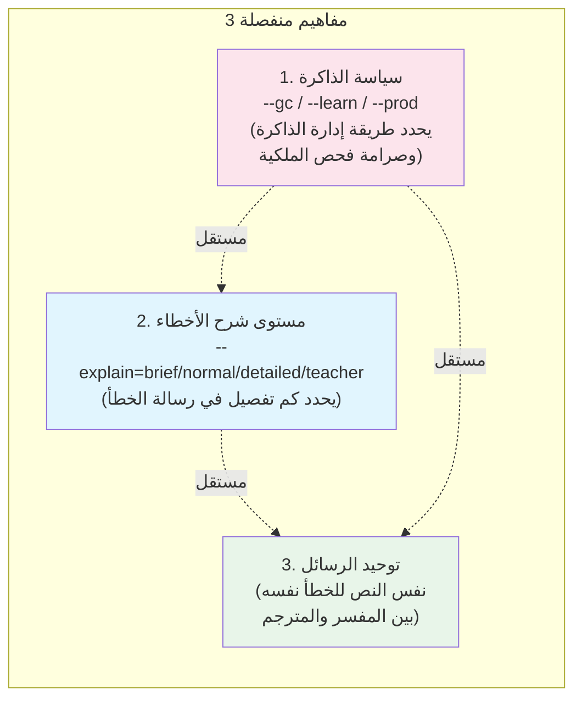
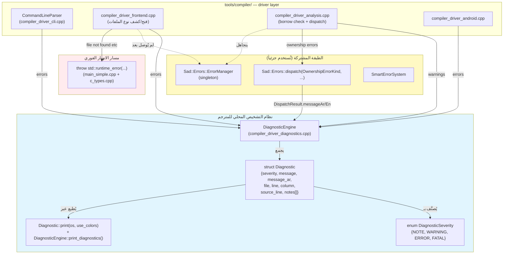
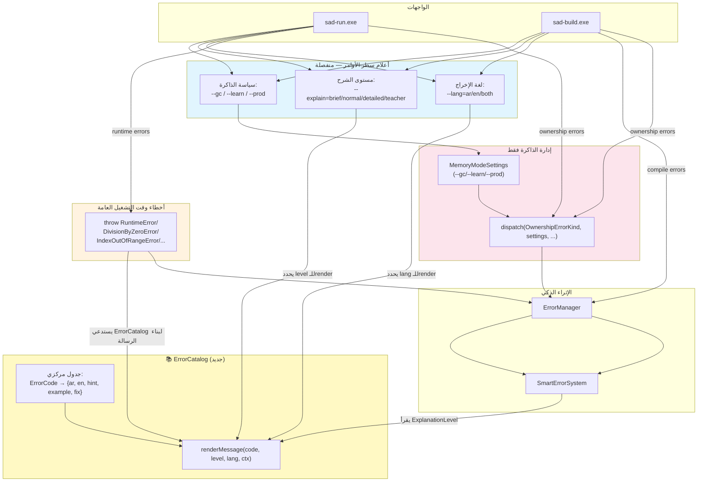
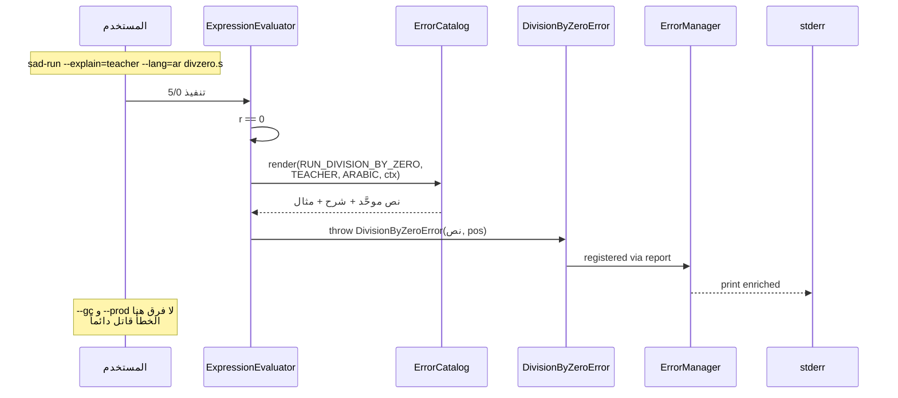
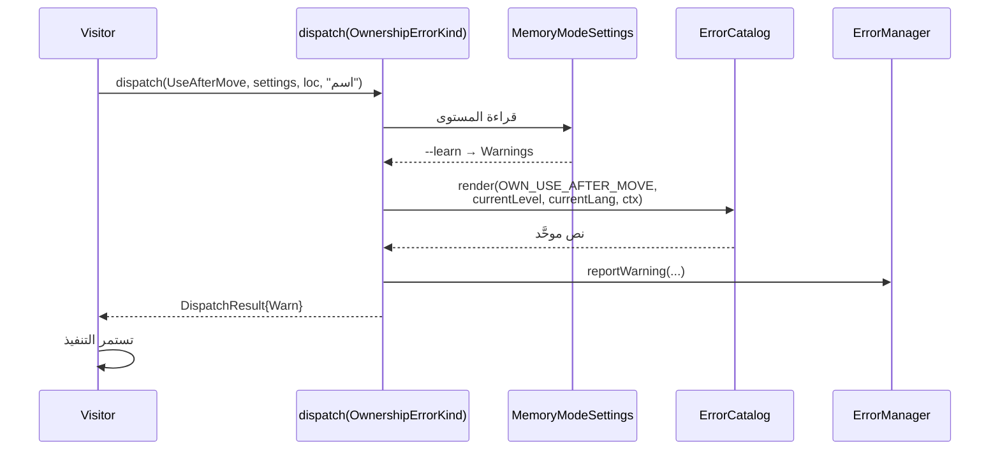
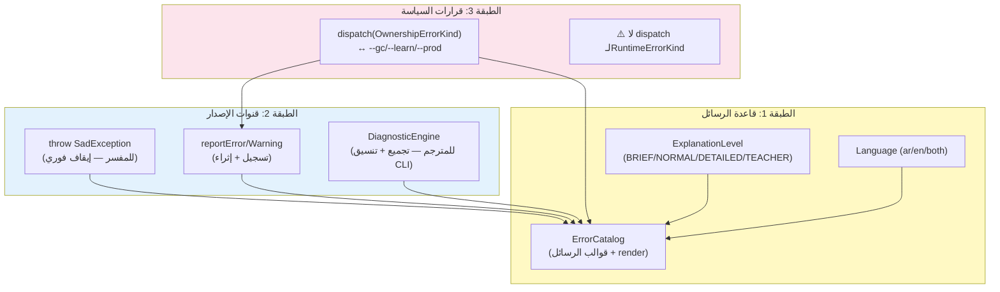

# البنية الصحيحة لنظام الأخطاء + خطة التنفيذ

> **هذه الوثيقة تصحّح خلطاً معمارياً مهماً** كشفه المستخدم في مراجعة Phase F-1:
> الأعلام `--gc/--learn/--prod` تخص **إدارة الذاكرة وأخطاء الملكية فقط**،
> ولا يجوز ربطها بأخطاء وقت التشغيل العامة (قسمة على صفر، تجاوز فهرس...).

---

## 1. التشخيص: ما الخطأ في التصميم الحالي؟

### 1.1 الخلط الذي يجب تصحيحه

في Phase F-1 رُبطت `DivisionByZero` بدالة `dispatch(RuntimeErrorKind, settings, ...)`
وأصبحت تتأثر بـ`--gc/--learn/--prod`:

```cpp
// ❌ خاطئ معمارياً (Phase F-1 الحالي)
if (r == 0) return handleDivByZero(...);  // يتأثر بسياسة الذاكرة
// النتيجة: --gc يُرجع 0 صامتاً، --prod يرمي خطأ
```

**لماذا هذا خطأ:** القسمة على صفر **خطأ رياضي مطلق**، لا يتغير بتغير سياسة الذاكرة.
لا معنى لقول "في وضع `--gc` لا توجد قسمة على صفر".

### 1.2 الفصل الصحيح بين ثلاثة مفاهيم منفصلة



| المفهوم | يحكم | المسؤول | المثال |
|---|---|---|---|
| **سياسة الذاكرة** | استراتيجية GC + صرامة فحص الملكية | `MemoryModeSettings` + `dispatch(OwnershipErrorKind, ...)` | `use after move` تحت `--gc` يُتجاهل، تحت `--prod` خطأ قاتل |
| **مستوى الشرح** | كم تفصيل في رسالة الخطأ | `ExplanationLevel` (موجود مسبقاً في `teacher_mode.h`) | BRIEF: سطر واحد. TEACHER: 10 أسطر مع أمثلة |
| **توحيد الرسائل** | نفس نص الخطأ نفسه أينما حدث | `ErrorCatalog` (يجب إنشاؤه) | `RUN_DIVISION_BY_ZERO` → رسالة واحدة في المفسر والمترجم |

### 1.3 حجم المشكلة الفعلي

- **152 موقع `throw <SomeError>("نص...")`** في `interpreter/src/visitors/`
- كل واحد يكتب رسالته يدوياً → نصوص مختلفة لنفس الخطأ بين visitors.
- المترجم سيكتب رسائله في مكان آخر → **عدم تطابق مؤكَّد** بين المفسر والمترجم.
- مستوى التفصيل ثابت دائماً (لا BRIEF ولا DETAILED).
- لا أحد يعتبر `ExplanationLevel` رغم وجوده!

---

## 1.4 نظام الأخطاء الحالي في المترجم (`sadc` / `sad-build`) — توثيق مفصَّل

> هذا القسم أُضيف بطلب المستخدم لتوثيق ما هو موجود فعلياً قبل البدء في توحيده.

### 1.4.1 المكوِّنات الأربعة في المترجم



### 1.4.2 المكوِّنات بالتفصيل

#### (أ) `DiagnosticEngine` — نظام تشخيصات المترجم الأساسي

**الموقع:** [compiler_driver.h](tools/compiler/compiler_driver.h#L387-L415) + [compiler_driver_diagnostics.cpp](tools/compiler/compiler_driver_diagnostics.cpp#L299-L370)

**المسؤولية:**
- تجميع batch من رسائل التشخيص (ليس إيقافاً فورياً).
- 4 مستويات شدّة عبر `enum DiagnosticSeverity { NOTE, WARNING, ERROR, FATAL }`.
- 4 دوال `report_*`:
  ```cpp
  void report_note   (msg, file, line, column);
  void report_warning(msg, file, line, column);
  void report_error  (msg, file, line, column);
  void report_fatal  (msg, file, line, column);
  ```
- إحصاءات: `get_error_count()`, `get_warning_count()`, `has_errors()`.
- خيارات: `set_warnings_as_errors(bool)`, `set_color_diagnostics(bool)`.
- طباعة منسَّقة عبر `print_diagnostics(os, use_colors)`.

**هيكل `Diagnostic`:**
```cpp
struct Diagnostic {
    DiagnosticSeverity severity;
    std::string message;        // الإنجليزية
    std::string message_ar;     // العربية (اختيارية)
    std::string file;
    int line = -1;
    int column = -1;
    std::string source_line;    // السطر الكامل لطباعة caret
    std::vector<std::string> notes;
};
```

**نمط الطباعة الناتج:**
```
file.s:12:8: error: division by zero / قسمة على صفر
    ن = س / ع
           ^
note: hint message...
```

ملاحظة: المترجم يدعم **رسالة ثنائية اللغة في نفس السطر** بصيغة `"english / عربي"`،
بينما المفسر يستخدم `"(AR) ... \n(EN) ..."` على سطرين منفصلين — هذا تباين يجب
أن يحلّه `ErrorCatalog`.

#### (ب) `dispatch(OwnershipErrorKind, ...)` — مدخل أخطاء الملكية

**الموقع:** [compiler_driver_analysis.cpp:546](tools/compiler/compiler_driver_analysis.cpp#L546)

**التدفق:**
1. مرحلة `borrow_check` تُنتج `result.errors` (قائمة `BorrowError`).
2. لكل خطأ:
   - يُبنى `Sad::Errors::SourceLocation`.
   - يُستدعى `dispatch(error.kind, options_.memory_policy, loc, error.variableName)`.
   - بحسب `DispatchResult.action`:
     - `Ignore` (`--gc`) → يُحصى ويُتجاهَل.
     - `Warn` (`--learn`) → `diagnostics_.report_warning()` + إضافة `teachingNote`.
     - `Stop` (`--prod`) → `diagnostics_.report_error()` + رفع `fatal_count`.
3. اختيار اللغة عبر `options_.arabic_borrow_messages` (يبدو منفصلاً عن `--lang` العام).

**هذا الجزء صحيح ولا يحتاج تعديلاً** — فقط نصوص الرسائل ستأتي لاحقاً من `ErrorCatalog`.

#### (ج) `Sad::Errors::ErrorManager` — استخدام جزئي

**الموقع:** يُستخدم في [main_simple.cpp:550-554](tools/compiler/main_simple.cpp#L550) و [run_command.cpp:237](tools/compiler/src/run_command.cpp#L237) و [test_command.cpp:451](tools/compiler/src/test_command.cpp#L451).

**الوضع الحالي:**
- يُنادى عليه `clear()` و `setSourceCode()` فقط.
- نتائج `ErrorManager::hasErrors()` تُفحص في حالات قليلة.
- **لا** يُستخدم لتجميع أخطاء الترجمة الرئيسية (تذهب إلى `DiagnosticEngine` بدلاً منه).
- هذا ازدواجية واضحة: سيُحلّها `ErrorCatalog` بأن يصبح هو المصدر الوحيد للنصوص،
  بينما `ErrorManager` يبقى للإثراء و`DiagnosticEngine` للعرض.

#### (د) `throw std::runtime_error(...)` — مسار انهيار غير مُوحَّد

**الموقع:** [main_simple.cpp:105](tools/compiler/main_simple.cpp#L105) و [c_types.cpp:136,203,319,428](compiler/src/types/c_types.cpp).

**الوضع:** يُستخدم لأخطاء "لا يمكن المتابعة" (ملف غير موجود، نوع C غير مدعوم).
- لا يمر عبر `DiagnosticEngine` ولا `ErrorManager`.
- يُلتقط في `try/catch` في `main()` ويُطبع كرسالة بسيطة.
- نصوص حرفية (مثل `"لم يتم العثور على الملف: ..."`).

**هذا أيضاً يجب توحيده** — يجب أن يستخدم `ErrorCatalog` لتوليد النص ثم يُلقي.

### 1.4.3 موجز الفرق بين نظامَي المفسر والمترجم اليوم

| العنصر | المفسر (`sad`) | المترجم (`sadc`) |
|---|---|---|
| **آلية الخطأ الأساسية** | `throw SadException` (إيقاف فوري) | `DiagnosticEngine::report_*` (تجميع batch) |
| **عدد المستويات** | exception types (Type/Value/...) | `NOTE/WARNING/ERROR/FATAL` |
| **شكل الرسالة ثنائية اللغة** | `"(AR) ...\n(EN) ..."` | `"en / ar"` على سطر واحد |
| **`try/catch` للمستخدم** | نعم (`حاول/امسك`) | لا |
| **عدد رسائل مكتوبة يدوياً** | 152 موقع `throw <Error>("...")` | يُقدَّر بعشرات المواقع `report_error("...")` |
| **يدعم `--gc/--learn/--prod`** | ❌ (Phase F-1 خاطئ يحاول إضافتها) | ✅ لأخطاء الملكية فقط (صحيح) |
| **يستخدم `ErrorCatalog`** | ❌ غير موجود | ❌ غير موجود |
| **يستخدم `Sad::Errors::dispatch`** | ❌ غير موصول | ✅ لأخطاء الملكية فقط |
| **يستخدم `ErrorManager`** | ✅ كاملاً | ⚠️ جزئياً (clear/hasErrors فقط) |
| **`SmartErrorSystem` enrich** | ✅ عبر `enrichDiagnostic` | ⚠️ غير مُفعَّل بشكل ظاهر |

### 1.4.4 المشاكل التي يجب على `ErrorCatalog` حلّها

1. **تباين شكل ثنائية اللغة:** سطر واحد vs سطرين → `ErrorCatalog.render()` يوحِّد التنسيق.
2. **نصوص يدوية في الجانبين:** ~152 في المفسر + عشرات في `report_error("...")` المباشر بالمترجم → كلها تذهب إلى قوالب catalog.
3. **`std::runtime_error` خام:** بعض الأخطاء (file not found) لا تمر عبر أي نظام موحَّد → ستحصل على `ErrorCode` مثل `SYS_FILE_NOT_FOUND`.
4. **ازدواج `DiagnosticEngine` ↔ `ErrorManager`:** الأول للعرض CLI، الثاني للإثراء — `ErrorCatalog` يُلغي الازدواج بأن يكون المصدر الوحيد للنص.
5. **مستوى الشرح ثابت:** لا يوجد `--explain` → سيضيفه `ErrorCatalog` بدون كسر `DiagnosticEngine`.

### 1.4.5 خريطة الملفات المعنيّة بالتعديل في المترجم

| الملف | التعديل المتوقَّع | المرحلة |
|---|---|---|
| [compiler_driver_diagnostics.cpp](tools/compiler/compiler_driver_diagnostics.cpp) | لا تغيير في `DiagnosticEngine` نفسه | — |
| [compiler_driver_analysis.cpp](tools/compiler/compiler_driver_analysis.cpp) | استبدال نصوص `report_error/warning` بـ `Catalog::render(...)` | 4 |
| [compiler_driver_frontend.cpp](tools/compiler/compiler_driver_frontend.cpp) | استبدال `report_error("file not found ...")` بـ `Catalog::render(SYS_FILE_NOT_FOUND, ...)` | 4 |
| [compiler_driver_cli.cpp](tools/compiler/compiler_driver_cli.cpp) | إضافة `--explain=<level>` و `--lang=<ar/en/both>` | 2 |
| [main_simple.cpp](tools/compiler/main_simple.cpp) | استبدال `throw std::runtime_error(...)` بنفس النمط | 4 |
| [c_types.cpp](compiler/src/types/c_types.cpp) | استبدال `throw std::runtime_error(...)` بنفس النمط | 4 |
| [src/run_command.cpp](tools/compiler/src/run_command.cpp) + [src/test_command.cpp](tools/compiler/src/test_command.cpp) | لا تغييرات كبرى — فقط ضمان init للـ catalog | 1 |

---

## 2. البنية المستهدفة

### 2.1 المخطط الكلي للنظام بعد التصحيح



### 2.2 الفروقات الجوهرية مع التصميم الحالي

| البند | الحالي (خاطئ) | المستهدف (صحيح) |
|---|---|---|
| DivByZero يحترم `--gc/--learn/--prod` | ✅ نعم (Phase F-1) | ❌ لا — خطأ قاتل دائماً |
| رسائل الأخطاء متطابقة بين sad/sadc | ❌ لا (152 رسالة مكتوبة يدوياً) | ✅ نعم — `ErrorCatalog` المركزي |
| مستوى تفصيل قابل للضبط | ❌ ثابت | ✅ `--explain=brief/normal/detailed/teacher` |
| `dispatch(RuntimeErrorKind)` موجود | ✅ (Phase F-1 جديد) | ❌ يُحذف — كان خلطاً |
| `dispatch(OwnershipErrorKind)` موجود | ✅ (Phase E-3) | ✅ يبقى — هذا صحيح |

---

## 3. تصميم `ErrorCatalog` — القلب الجديد

### 3.1 المفهوم

```cpp
// shared/errors/include/error_catalog.h
namespace Sad::Errors {

struct ErrorTemplate {
    ErrorCode code;
    std::string titleAr;        // "قسمة على صفر"
    std::string titleEn;        // "Division by zero"
    std::string briefAr;        // سطر واحد
    std::string briefEn;
    std::string detailedAr;     // فقرة كاملة
    std::string detailedEn;
    std::string teacherAr;      // شرح + مثال + حل
    std::string teacherEn;
    std::string fixHintAr;      // اقتراح إصلاح
    std::string fixHintEn;
    std::string codeExample;    // مثال كود لغة ص
};

class ErrorCatalog {
public:
    static ErrorCatalog& instance();

    /// (AR) يبني رسالة خطأ موحَّدة وفق المستوى واللغة
    /// (EN) Builds a unified error message per level and language
    std::string render(ErrorCode code,
                      ExplanationLevel level,
                      Language lang,
                      const RenderContext& ctx) const;

    /// (AR) يسجِّل قالباً جديداً (يُستدعى من initialization)
    void registerTemplate(ErrorTemplate tmpl);

private:
    std::unordered_map<ErrorCode, ErrorTemplate> templates_;
};

struct RenderContext {
    SourceLocation location;
    std::map<std::string, std::string> placeholders;  // {x} → "س", {y} → "ع"
};

}  // namespace Sad::Errors
```

### 3.2 الاستخدام من المفسر (بدلاً من الـ152 موقع)

**قبل (الحالي):**
```cpp
// 152 موقع مماثل، كل واحد بصياغة مختلفة:
throw RuntimeError(
    "(AR) خطأ: إزاحة بقيمة " + std::to_string(r) + " غير صالحة. يجب أن تكون بين 0 و 31.\n"
    "(EN) Error: Shift amount " + std::to_string(r) + " is invalid. Must be between 0 and 31.",
    pos);
```

**بعد (المستهدف):**
```cpp
RenderContext ctx{pos, {{"value", std::to_string(r)}, {"min", "0"}, {"max", "31"}}};
throw RuntimeError(
    ErrorCatalog::instance().render(
        ErrorCode::RUN_INVALID_SHIFT_AMOUNT,
        ExplanationLevel::current(),  // يقرأ من إعدادات المستخدم
        Language::current(),
        ctx),
    pos);
```

### 3.3 الاستخدام من المترجم (نفس النص بالضبط)

```cpp
// في compiler_driver_diagnostics.cpp
diagnostics_.report_error(
    ErrorCatalog::instance().render(
        ErrorCode::RUN_INVALID_SHIFT_AMOUNT,
        opts.explainLevel,
        opts.language,
        RenderContext{loc, {{"value", std::to_string(r)}, ...}}),
    file, loc.line);
```

**النتيجة:** نفس نص الرسالة بالضبط في كلا الأداتين، يتغير فقط بحسب
`--explain` و`--lang`.

---

## 4. تدفق خطأ DivByZero بعد التصحيح



**ملاحظة:** `--gc/--learn/--prod` **لا تظهر في المسار** — هذا خطأ رياضي،
سياسة الذاكرة لا علاقة لها به.

---

## 5. تدفق خطأ ملكية (use after move) — يبقى مرتبطاً بسياسة الذاكرة



هنا `--gc/--learn/--prod` **مهمة** لأن مستوى صرامة الملكية قرار سياسي حقيقي.

---

## 6. التراتبية بعد التصحيح



---

## 7. خطة التنفيذ — 5 مراحل

### المرحلة 0: التراجع عن خطأ Phase F-1 (15 دقيقة)

**الهدف:** فك ربط DivByZero/ModuloByZero عن `--gc/--learn/--prod`.

**الإجراءات:**
1. في `expression_evaluator_binary_ops.cpp`: حذف `handleDivByZero` lambda.
2. استعادة `throw DivisionByZeroError(...)` المباشر في الـ5 مواقع.
3. **عدم** حذف `RuntimeErrorKind` من `dispatch.h` بعد — سيُستخدم لاحقاً
   كمفتاح للـ`ErrorCatalog` (لكن دون منطق سياسة الذاكرة).
4. تحديث ذاكرة `dispatch_unification_phase_e3.md` بأن Phase F-1 خطأ معماري مُتراجَع عنه.

**معيار النجاح:** اختبار `5/0` يرمي خطأ قاتل مستقلاً عن العَلَم المُمرَّر.

---

### المرحلة 1: تصميم وبناء `ErrorCatalog` (30 دقيقة)

**الهدف:** قاعدة موحَّدة لقوالب رسائل الأخطاء.

**الإجراءات:**
1. إنشاء `shared/errors/include/error_catalog.h`:
   - `struct ErrorTemplate` (ar/en × brief/detailed/teacher + fixHint + example)
   - `struct RenderContext` (location + placeholders)
   - `class ErrorCatalog` singleton مع `render()` و `registerTemplate()`
2. إنشاء `shared/errors/src/error_catalog.cpp`:
   - منطق `render()`: يختار النص وفق `level + lang`
   - استبدال placeholders `{name}` بقيم `ctx.placeholders["name"]`
3. إنشاء `shared/errors/src/error_catalog_init.cpp`:
   - تسجيل القوالب الـ~50 الأكثر شيوعاً (DivByZero, IndexOOB, TypeMismatch, ...)
4. إضافة `ErrorCatalog::instance().initializeDefaults()` في `main()` لكل من `sad` و`sadc`.
5. تحديث `shared/CMakeLists.txt` لإدراج الملفات الجديدة.

**معيار النجاح:** بناء نظيف + اختبار `render(RUN_DIVISION_BY_ZERO, TEACHER, ARABIC, {})`
يُرجع نصاً صحيحاً.

---

### المرحلة 2: نظام `ExplanationLevel` كأمر CLI (20 دقيقة)

**الهدف:** علم `--explain=brief|normal|detailed|teacher` يعمل في sad وsadc.

**الإجراءات:**
1. إنشاء `shared/errors/include/explanation_level.h`:
   - استخراج `ExplanationLevel` من `teacher_mode.cpp` إلى header مشترك
   - دالة `parseExplanationLevel(string) → ExplanationLevel`
   - دالة `ExplanationLevel currentLevel()` (singleton أو global)
2. تعديل `tools/compiler/compiler_driver_cli.cpp`:
   - إضافة معالجة `--explain=<level>`
   - تخزينها في `CompilerOptions::explainLevel`
3. تعديل `interpreter/src/main.cpp` (أو ما يعادله):
   - إضافة معالجة `--explain=<level>`
   - استدعاء `setCurrentExplanationLevel(level)` قبل التنفيذ.
4. ربط `SmartErrorSystem::enrichDiagnostic` بـ`currentLevel()`
   (يكتفي حالياً بمستوى TeacherMode الداخلي).

**معيار النجاح:**
```
sad-run --explain=brief divzero.s   → سطر واحد فقط
sad-run --explain=teacher divzero.s → شرح كامل مع أمثلة
```

---

### المرحلة 3: ترحيل الـ152 موقع `throw` إلى `ErrorCatalog` (مرحلتان متوازيتان)

#### المرحلة 3-أ: جرد + تصنيف (1 ساعة)

**الإجراءات:**
1. تشغيل سكريبت يستخرج كل `throw <SomeError>("...")` من `interpreter/src/visitors/`.
2. تصنيف الـ152 موقع إلى:
   - **مكرَّرات:** نفس النص في عدة مواقع → قالب واحد في catalog
   - **متفرِّدات:** نص فريد → قالب خاص
   - **placeholder-heavy:** يحتاج معاملات (مثل عدد، اسم متغير)
3. توليد قائمة CSV: `موقع → ErrorCode مقترح → نص قالب`.

**الناتج:** ملف `_scratch/error_migration_plan.csv` بـ152 سطراً.

#### المرحلة 3-ب: الترحيل البَنِيوي (2-3 جلسات)

**الإجراءات:** لكل ملف visitor:
1. إضافة قوالب الـcodes الجديدة إلى `error_catalog_init.cpp`.
2. استبدال كل `throw RuntimeError("نص...")` بـ:
   ```cpp
   throw RuntimeError(
       ErrorCatalog::instance().render(code, currentLevel(), currentLang(), ctx),
       pos);
   ```
3. اختبار الـvisitor المعدَّل قبل الانتقال للتالي.

**معيار النجاح:** عدد الـthrow بـnصوص حرفية = 0 + جميع الاختبارات تنجح.

---

### المرحلة 4: ترحيل المترجم لاستخدام `ErrorCatalog` (1 ساعة)

**الإجراءات:**
1. في `compiler_driver_*.cpp`: استبدال نصوص `report_error("...")` بـ `render(...)`
   لكل خطأ يوجد له ErrorCode.
2. ضمان أن المترجم يقرأ نفس الـ`ExplanationLevel` و`Language`.

**معيار النجاح:** اختبار يقارن نص خطأ DivByZero من sad وsadc → متطابقان حرفياً
(لنفس مستوى التفصيل).

---

### المرحلة 5: التوثيق والتنظيف (30 دقيقة)

**الإجراءات:**
1. تحديث `docs/بنية_المشروع/معمارية_نظام_الأخطاء.md` بالبنية الجديدة.
2. تحديث `docs/بنية_المشروع/نظام_الأخطاء.md` بإضافة `ErrorCatalog`.
3. تحديث ملاحظات الذاكرة `compiler_fix_notes.md`.
4. حذف `RuntimeErrorKind` من `dispatch.h` إن تأكَّد أنه غير مستخدم في dispatch
   (يبقى كـenum للـ`ErrorCatalog`).

---

## 8. مخطط Gantt للمراحل

```mermaid
gantt
    title خطة تنفيذ نظام الأخطاء الموحَّد
    dateFormat HH:mm
    axisFormat %H:%M
    section المرحلة 0
    تراجع Phase F-1           :a0, 00:00, 15m
    section المرحلة 1
    بناء ErrorCatalog          :a1, after a0, 30m
    section المرحلة 2
    --explain CLI flag         :a2, after a1, 20m
    section المرحلة 3
    جرد 152 throw              :a3, after a2, 60m
    ترحيل visitors             :a4, after a3, 180m
    section المرحلة 4
    ترحيل المترجم              :a5, after a4, 60m
    section المرحلة 5
    توثيق + تنظيف              :a6, after a5, 30m
```



---

## 9. جدول القرارات الجوهرية

| القرار | الإجابة | المبرر |
|---|---|---|
| هل نحتفظ بـ`dispatch(RuntimeErrorKind)`؟ | لا — يُحذف | لا معنى لجعل DivByZero يعتمد على سياسة الذاكرة |
| هل نحتفظ بـ`dispatch(OwnershipErrorKind)`؟ | نعم | الملكية فعلاً تتأثر بالسياسة |
| هل نُبقي `SadException` في المفسر؟ | نعم | يحتاجه `حاول/امسك` + إيقاف التدفق |
| هل نُبقي `DiagnosticEngine` في المترجم؟ | نعم | يحتاجه تجميع batch + تنسيق CLI |
| هل `ErrorCatalog` يحلّ محل `SmartErrorSystem`؟ | لا — يكمّله | Catalog يُولّد النص، Smart يضيف fixes/cascade |
| هل نحذف 4 ملفات smart؟ | لا | كلها حيّة عبر `enrichDiagnostic` |
| هل نحذف `type_explanations`؟ | يؤجَّل | عضو خامل — يُربط فعلاً أو يُحذف بعد المرحلة 4 |

---

## 10. مخاطر وضمانات

| المخاطرة | الاحتمال | التخفيف |
|---|---|---|
| كسر اختبارات قائمة بسبب تغيير نص الخطأ | عالي | اختبارات `expected` تُحدَّث آلياً + توفير أوضاع `--explain=brief` للتطابق القديم |
| نسيان موقع من الـ152 | متوسط | سكريبت يفحص أن لا `throw <Error>("` بنص حرفي بعد الترحيل |
| تعارض في أسماء `ErrorCode` | منخفض | استخدام prefixes واضحة: `RUN_*`, `SEM_*`, `PARSE_*`, `OWN_*` |
| أداء `render()` في hot paths | منخفض | الرسائل تُبنى فقط عند الخطأ (نادر) |

---

## 11. الفوائد المتوقَّعة

1. **توحيد كامل** بين رسائل المفسر والمترجم.
2. **مستوى تفصيل قابل للضبط** بدون تعديل كود.
3. **سهولة الترجمة** لإضافة لغات جديدة (مكان واحد).
4. **اختبارات أبسط** — تختبر `ErrorCode` لا نص حرفي.
5. **فصل اهتمامات صحيح:** سياسة الذاكرة منفصلة عن صيغة الرسالة.
6. **توثيق ذاتي:** Catalog هو مرجع شامل لكل أخطاء اللغة.

---

## 12. خطوة فورية مقترحة

البدء بـ**المرحلة 0 + 1** في جلسة واحدة (≈ 45 دقيقة):
- تراجع Phase F-1 الخاطئ
- بناء `ErrorCatalog` الأساسي
- اختبار سريع لإثبات المفهوم على DivByZero فقط

ثم وقف للمراجعة قبل الانطلاق في الترحيل الكامل (المرحلة 3).
