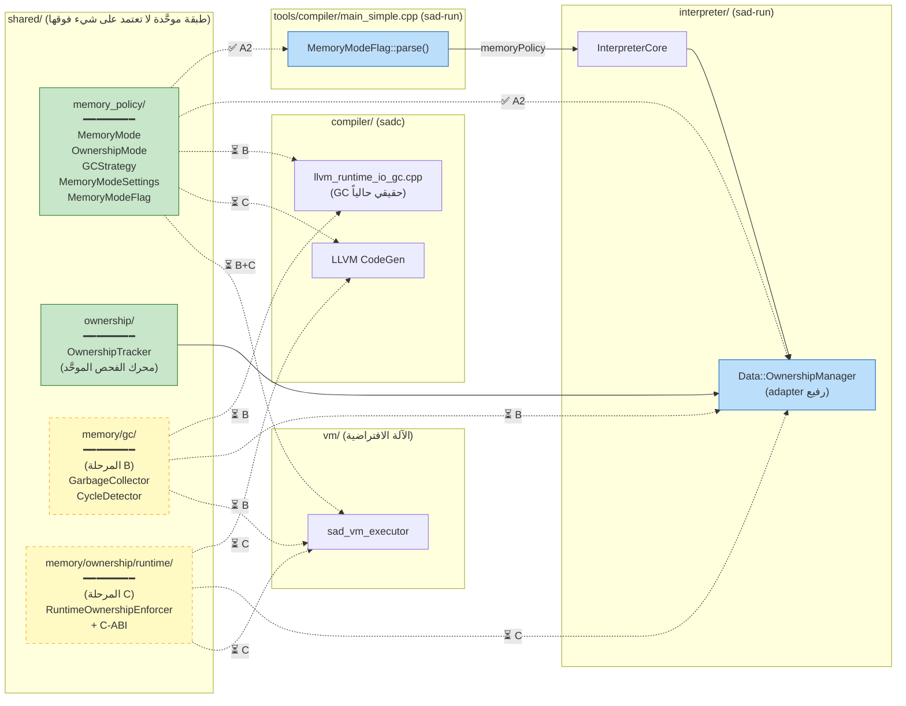
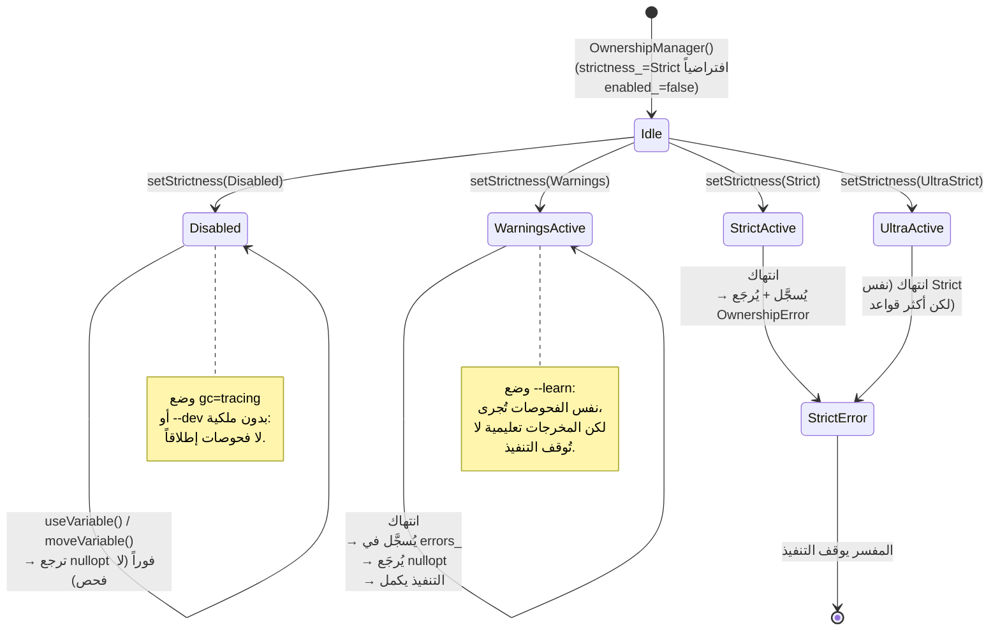
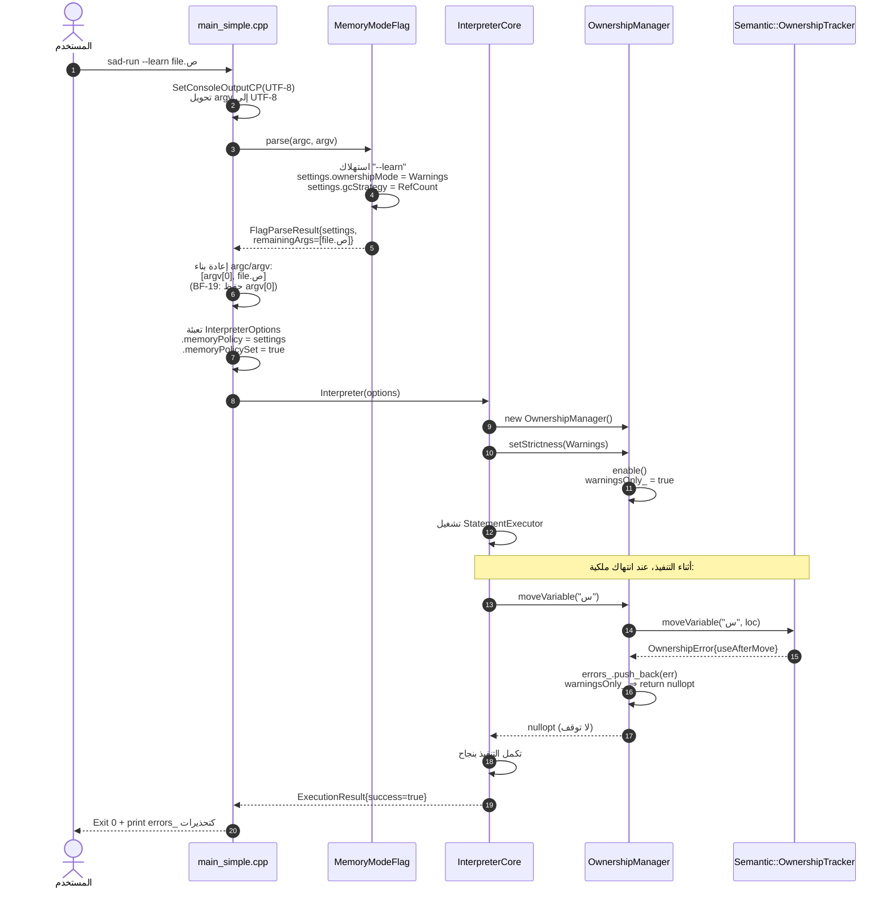

# معمارية الذاكرة الموحَّدة في لغة ص

> **الإصدار:** 1.1  
> **الحالة:** المرحلة A مكتملة (A1+A2)، B/C قيد التخطيط  
> **آخر تحديث:** بعد commit `f09f1c4f` (Phase A2)  
> **المرجع التطبيقي:** [الأمان الموحَّد](الأمان_الموحد.md)

---

## 1. المشكلة المعمارية

لغة ص توفر للمطور **نظامَيْن لإدارة الذاكرة**:

1. **نظام الملكية (Ownership)** — للأنظمة منخفضة المستوى (kernels, drivers, embedded). يفحص في وقت الترجمة و/أو وقت التشغيل عمليات move/borrow/drop.
2. **جامع القمامة (Garbage Collector)** — للتطبيقات عالية المستوى (CLI, web, scripts). يدير الذاكرة تلقائياً مع كشف الدورات.

اختيار النظام يتم عبر أوضاع المترجم:
- `--prod` → نظام الملكية صارم (لا تساهل)
- `--learn` → نظام الملكية متساهل (تحذيرات بدل أخطاء، تعليمي)
- `--dev` → جامع قمامة كامل (سهولة التطوير)

### الخرق الحرج (المُكتشَف في تدقيق `f445d6f6`)

| المسار | الملكية وقت-التشغيل | GC | يقرأ الأوضاع؟ |
|---|---|---|---|
| المفسر `sad-run` | `Data::OwnershipManager` (دائماً مُفعَّل) | لا يوجد | ❌ لا يعرفها |
| المترجم `sadc` + runtime | لا فحوصات | `llvm_runtime_io_gc.cpp` (حي) | ✅ وحده يقرأها |
| الآلة الافتراضية `vm` | لا شيء | لا شيء | ❌ |
| stdlib/runtime | لا شيء | لا شيء | ❌ |

**النتيجة:** نفس برنامج `.ص` قد:
- يعمل في المترجم بوضع `--learn` (تحذيرات فقط)
- يفشل في المفسر (الملكية مُفعَّلة دائماً وصارمة)
- يتسرب في المفسر (لا GC) بينما يُجمَع بنجاح في المترجم

هذا **خرق دلالي للغة** (BF-04: السبب الجذري = طبقة ذاكرة مفقودة في `shared/`).

---

## 2. الهدف المعماري

> **مبدأ:** أي مسار تنفيذ يجب أن يحترم نفس قواعد إدارة الذاكرة لنفس الكود.

```
                      ┌─────────────────────────────────┐
                      │  shared/memory/  (طبقة موحَّدة)  │
                      │                                  │
                      │  ┌────────────────────────────┐ │
                      │  │ policy/  (الأوضاع)         │ │
                      │  │  - MemoryMode (dev/prod/   │ │
                      │  │    learn)                   │ │
                      │  │  - MemoryModeFlag (CLI)    │ │
                      │  │  - MemoryPolicyManager      │ │
                      │  └────────────────────────────┘ │
                      │  ┌────────────────────────────┐ │
                      │  │ gc/  (جامع قمامة موحَّد)    │ │
                      │  │  - GarbageCollector        │ │
                      │  │  - CycleDetector            │ │
                      │  │  - GCRoot                   │ │
                      │  └────────────────────────────┘ │
                      │  ┌────────────────────────────┐ │
                      │  │ ownership/runtime/          │ │
                      │  │  - RuntimeOwnershipEnforcer│ │
                      │  │    (يستخدم Semantic::      │ │
                      │  │     OwnershipTracker)      │ │
                      │  └────────────────────────────┘ │
                      └─────────────────────────────────┘
                                     ▲
            ┌────────────────────────┼────────────────────────┐
            │                        │                        │
      ┌─────┴─────┐            ┌────┴────┐             ┌─────┴─────┐
      │  المفسر    │            │  المترجم │             │    VM      │
      │ sad-run   │            │  sadc   │             │           │
      │           │            │         │             │           │
      │ يستهلك:    │            │ يستهلك: │             │ يستهلك:    │
      │ Policy +  │            │ Policy +│             │ Policy +  │
      │ Ownership │            │ يولّد    │             │ Ownership │
      │ + GC      │            │ نداءات  │             │ + GC      │
      │           │            │ runtime │             │           │
      └───────────┘            └─────────┘             └───────────┘
```

---

## 3. المكونات الموحَّدة

### 3.1 `shared/memory/policy/` — سياسة اللغة

| المكون | الدور |
|---|---|
| `MemoryMode` (enum) | `DEVELOPMENT`, `PRODUCTION`, `LEARN` |
| `MemoryModeFlag` | تحليل `--dev`/`--prod`/`--learn` من `argv` |
| `MemoryPolicyManager` | مصدر الحقيقة الوحيد للوضع الحالي. يستهلكه: المفسر، المترجم، VM، sad-check، sad-fmt. |

**القواعد:**
- `--prod`: ownership صارم، لا GC. أخطاء فورية.
- `--learn`: ownership متساهل (تحذيرات)، لا GC. للتعليم.
- `--dev`: GC مفعَّل، ownership إرشادي فقط.

### 3.2 `shared/memory/gc/` — جامع القمامة الموحَّد

نقل **منطق GC الحقيقي** من `compiler/src/backend/llvm/llvm_runtime_io_gc.cpp` (~26KB) إلى `shared/memory/gc/`:

| المكون | المصدر الحالي | الوجهة |
|---|---|---|
| `GarbageCollector` (mark+sweep) | `llvm_runtime_io_gc.cpp` | `shared/memory/gc/garbage_collector.{h,cpp}` |
| `GCRoot` registration | `llvm_runtime_io_gc.cpp` | `shared/memory/gc/gc_roots.h` |
| `CycleDetector` | `compiler/src/memory/cycle_detector.cpp` | `shared/memory/gc/cycle_detector.{h,cpp}` |

**ملاحظة:** يبقى `llvm_runtime_io_gc.cpp` فقط كجسر LLVM (يستدعي `Sad::Memory::GC::*`). يُحذف `gc_fallback_mode.cpp` اليتيم.

### 3.3 `shared/memory/ownership/runtime/` — تنفيذ الملكية وقت-التشغيل

استخراج enforcement من `interpreter/src/managers/ownership_manager.cpp` (~340 سطر) إلى مكون محايد:

| المكون | الدور |
|---|---|
| `RuntimeOwnershipEnforcer` | يفوّض إلى `Semantic::OwnershipTracker` ويُترجم الأخطاء لاستثناءات قابلة للالتقاط في وقت-التشغيل. |
| `OwnershipRuntimeAPI` | C-ABI لاستهلاكه من برامج sadc المُترجَمة (`sad_check_move`, `sad_check_borrow`, `sad_drop`). |

**النتيجة:**
- المفسر: `Data::OwnershipManager` يصبح adapter رفيع فوق `RuntimeOwnershipEnforcer`.
- المترجم: يولّد نداءات إلى `OwnershipRuntimeAPI` في `--prod` mode.
- VM: تستخدم نفس `RuntimeOwnershipEnforcer` مباشرة.

---

## 4. خطة التنفيذ التدريجي

### المرحلة A — توحيد سياسة الأوضاع (الأساس)

**الهدف:** المفسر يقرأ `--dev/--prod/--learn` ويعدّل سلوكه.

**خطوات:**
1. إنشاء `shared/memory/policy/` بـ:
   - `include/memory/policy/memory_mode.h` (نقل `MemoryMode` enum)
   - `include/memory/policy/memory_mode_flag.h` (نقل `MemoryModeFlag`)
   - `include/memory/policy/policy_manager.h` (جديد: singleton موحَّد)
   - `src/*.cpp` (نقل التنفيذ)
2. تحديث `compiler/src/memory/*` لاستيراد من المسار الجديد (BF-15: لا كسر API).
3. ربط `sad_memory_policy` مكتبة بـ: `sad_interpreter`, `sad_compiler`, `sad_vm`.
4. تعديل `sad-run` لتحليل الـ flags وتمريرها إلى `InterpreterCore`.
5. تعديل `Data::OwnershipManager` لقراءة الوضع وضبط الصرامة.
6. اختبار: نفس البرنامج بـ `--learn` يعمل بنجاح في كلا المسارين.

**حجم التغيير المتوقع:** ~400 سطر، 8-12 ملف، بدون كسر.

### المرحلة B — توحيد GC

**الهدف:** GC واحد يستهلكه المترجم والمفسر والـ VM.

**خطوات:**
1. إنشاء `shared/memory/gc/` بنقل المنطق المحايد (mark/sweep, roots, cycles) من `llvm_runtime_io_gc.cpp`.
2. حذف `compiler/src/memory/gc_fallback_mode.cpp` اليتيم (CW-19).
3. حذف `compiler/src/memory/cycle_detector*` (نُقل إلى shared).
4. تحويل `llvm_runtime_io_gc.cpp` إلى جسر رفيع (يستدعي `Sad::Memory::GC::*`).
5. ربط GC بالمفسر: عند `--dev`، استخدام `GarbageCollector` بدل `shared_ptr` العادي.
6. اختبار: برنامج بدورات مرجعية يعمل في المفسر دون تسرب.

**حجم التغيير المتوقع:** ~800 سطر، 10-15 ملف.

### المرحلة C — توحيد runtime ownership enforcement

**الهدف:** المترجم يولّد فحوصات ownership وقت-التشغيل في `--prod`.

**خطوات:**
1. استخراج `RuntimeOwnershipEnforcer` من interpreter إلى `shared/memory/ownership/runtime/`.
2. تعريف C-ABI: `sad_ownership_check_move`, `sad_ownership_check_borrow`, `sad_ownership_drop`.
3. تحديث `compiler/src/backend/llvm/` لتوليد نداءات هذه الدوال عند `--prod`.
4. تعديل `interpreter` للاستهلاك من المكون الموحَّد.
5. ربط `vm` بنفس الواجهة.
6. اختبار: use-after-move يُكتشف في المفسر والبرنامج المُترجَم.

**حجم التغيير المتوقع:** ~1200 سطر، 20+ ملف.

---

## 5. الاختبارات الإلزامية لكل مرحلة

| الاختبار | المرحلة |
|---|---|
| Hub gate `ctest -L hub`: 47/47 PASS | A, B, C |
| `tests/dual_execution -L P0`: 5/5 PASS | A, B, C |
| اختبار `--learn` يعطي تحذيرات في المفسر | A |
| اختبار `--prod` يعطي خطأ use-after-move في المفسر والمُترجَم | A, C |
| اختبار دورة مرجعية تتحرر في المفسر بـ `--dev` | B |
| اختبار GC roots صحيحة عبر FFI boundary | B |

---

## 6. القواعد المُطبَّقة

- **CW-02 (طبقات):** `shared/memory/` لا يعتمد على أي طبقة أعلى.
- **CW-19 (DRY):** حذف الكود المُكرَّر (3 وحدات GC ⇒ واحدة).
- **CW-21 (واجهات واضحة):** كل مكون له header منفصل.
- **BF-04 (السبب الجذري):** نحل عزل المفسر عن أوضاع اللغة، لا نُرقِّع.
- **BF-09 (لا ترقيع):** نقل حقيقي وحذف، لا if-else خاص.
- **BF-12 (اختبار قبل الإصلاح):** كل مرحلة تنتهي باختبار يفشل قبلها وينجح بعدها.
- **BF-23 (تدريجي):** A → B → C، كل واحدة commit مستقل قابل للتراجع.

---

## 7. الملفات المرجعية الأساسية

### post-A1+A2 (الموقع الفعلي اليوم)
- [shared/memory_policy/include/memory/policy/gc_mode.h](../shared/memory_policy/include/memory/policy/gc_mode.h) — enums + `MemoryModeManager` + `MemoryModeSettings`
- [shared/memory_policy/include/memory/policy/memory_mode_flag.h](../shared/memory_policy/include/memory/policy/memory_mode_flag.h) — محلل CLI
- [shared/memory_policy/src/gc_mode.cpp](../shared/memory_policy/src/gc_mode.cpp)
- [shared/memory_policy/src/memory_mode_flag.cpp](../shared/memory_policy/src/memory_mode_flag.cpp)
- [interpreter/include/managers/ownership_manager.h](../interpreter/include/managers/ownership_manager.h) — `setStrictness()` (A2)
- [interpreter/src/managers/ownership_manager.cpp](../interpreter/src/managers/ownership_manager.cpp) — `warningsOnly_` (A2)
- [interpreter/include/core/interpreter_core.h](../interpreter/include/core/interpreter_core.h) — `InterpreterOptions::memoryPolicy`
- [tools/compiler/main_simple.cpp](../tools/compiler/main_simple.cpp) — استهلاك `MemoryModeFlag` في `sad-run`

### قيد الانتظار للمرحلة B
- [compiler/src/backend/llvm/llvm_runtime_io_gc.cpp](../compiler/src/backend/llvm/llvm_runtime_io_gc.cpp) — سيُحوَّل إلى جسر LLVM رفيع
- [compiler/src/memory/gc_fallback_mode.cpp](../compiler/src/memory/gc_fallback_mode.cpp) — سيُحذف (يتيم)
- [compiler/src/memory/cycle_detector.cpp](../compiler/src/memory/cycle_detector.cpp) — سيُنقل إلى shared/memory/gc/

### قيد الانتظار للمرحلة C
- [shared/ownership/include/ownership/ownership_tracker.h](../shared/ownership/include/ownership/ownership_tracker.h) — المحرك الذي سيُغلَّف بـ C-ABI

---

## 8. المخططات التفصيلية لتدفق الذاكرة (مُضاف في v1.1)

هذا القسم يوضح **كيف ينتقل العَلَم من سطر الأوامر إلى سلوك حقيقي** عبر الطبقات، ولماذا كل مسار (مفسّر/مترجم/VM) يستهلك نفس المصدر `shared/memory_policy/` بطريقة مختلفة قليلاً ولكن متّسقة دلالياً.

### 8.1 الصورة الكلية: من العَلَم إلى السلوك

المخطط التالي يبيّن الرحلة الكاملة لعَلَم مثل `--learn` من اللحظة التي يكتبها فيها المستخدم حتى اللحظة التي يقرر فيها `OwnershipManager` ما إذا كان سيُسجِّل خطأً أم تحذيراً:

```mermaid
flowchart TB
    user["المستخدم<br/>sad-run --learn file.ص"]
    argv["argv[]<br/>--learn / --prod / --dev / --gc=tracing"]
    parser["MemoryModeFlag::parse()<br/>shared/memory_policy/"]
    settings["MemoryModeSettings<br/>(mode, gcStrategy,<br/>ownershipMode, ...)"]
    options["InterpreterOptions<br/>.memoryPolicy<br/>.memoryPolicySet"]
    core["InterpreterCore::ctor"]
    om_set["ownershipManager_->setStrictness(<br/>policy.ownershipMode)"]
    behavior{"strictness_<br/>+ warningsOnly_"}
    err_path["خطأ صلب<br/>(يوقف التنفيذ)"]
    warn_path["تحذير فقط<br/>(يُسجَّل ويُكمل)"]
    no_check["لا فحص<br/>(disabled)"]

    user --> argv
    argv --> parser
    parser -->|consume| settings
    parser -->|remainingArgs<br/>(argv بدون أعلام الذاكرة)| options
    settings --> options
    options --> core
    core --> om_set
    om_set --> behavior
    behavior -->|Strict / UltraStrict| err_path
    behavior -->|Warnings| warn_path
    behavior -->|Disabled| no_check

    style parser fill:#e1f5ff,stroke:#0288d1
    style om_set fill:#fff3e0,stroke:#f57c00
    style err_path fill:#ffebee,stroke:#c62828
    style warn_path fill:#fff8e1,stroke:#f9a825
    style no_check fill:#eeeeee,stroke:#616161
```

**المفتاح الذهبي:** `shared/memory_policy/` هو **مصدر الحقيقة الوحيد**. كل من المفسّر والمترجم وVM يستوردون نفس الـ enum (`OwnershipMode`) ونفس البنية (`MemoryModeSettings`)، فيستحيل أن "يفهم" مسار العَلَم بطريقة مختلفة عن مسار آخر.

---

### 8.2 الطبقات وعلاقاتها (post-A2)



**ملاحظات:**
- الأسهم الصلبة (`-->`) = اعتماد فعلي مُنفَّذ في الكود.
- الأسهم المتقطعة (`-.->`) المُعنونة بـ ✅ A2 = مكتملة في commit `f09f1c4f`.
- المُعنونة بـ ⏳ B / ⏳ C = مخطَّطة وغير منفَّذة بعد.

---

### 8.3 آلة الحالات: ماذا يحدث داخل `OwnershipManager` لكل وضع



---

### 8.4 جدول السلوك المُقابل للأوضاع (post-A2)

| الوضع CLI | `MemoryMode` | `OwnershipMode` | `GCStrategy` | سلوك المفسّر اليوم | سلوك المترجم (مُخطَّط) |
|---|---|---|---|---|---|
| (بدون عَلَم) | Development | Strict | RefCount | فحوصات صلبة + لا GC | لا تغيير |
| `--dev` / `--تطوير` | Development | Warnings | Tracing | فحوصات تحذيرية + لا GC حالياً | + GC حقيقي (B) |
| `--prod` / `--إنتاج` | Production | Strict | None | فحوصات صلبة | + توليد فحوصات runtime (C) |
| `--learn` / `--تعلم` | Learn | Warnings | RefCount | تحذيرات بدل أخطاء | تحذيرات + شرح تعليمي |
| `--auto` / `--تلقائي` | Hybrid/Auto | Strict | RefCount | كشف ذكي حسب البيئة | كشف ذكي |
| `--no-std` / `--نواة` | Production | UltraStrict | None | الأقصى صرامة + لا GC | الأقصى صرامة + freestanding |
| `--gc=tracing` | (مكمِّل) | (يبقى كما هو) | Tracing | لا تغيير حتى B | يفعّل GC وقت الترجمة |
| `--ملكية=disabled` | (مكمِّل) | Disabled | (يبقى) | يعطّل OwnershipManager بالكامل | يحذف فحوصات الملكية |

> **قاعدة:** الأعلام المكمِّلة (`--gc=`, `--ملكية=`) تُطبَّق **بعد** عَلَم الوضع الأساسي وتسمح بضبط دقيق دون كسر دلالة الوضع الكلي.

---

### 8.5 تسلسل زمني: `sad-run --learn file.ص` خطوة بخطوة



**القراءة:** نفس الخطوات تماماً مع `--prod`، باختلاف الخطوة 11: `warningsOnly_=false` فيُرجَع `OwnershipError` فعلياً ويتوقف التنفيذ.

---

### 8.6 لماذا لا يستهلك المفسّر `compiler/` مباشرة؟ (CW-02)

قبل المرحلة A، كان المنطق التالي **خطأً معمارياً**:

```
interpreter/ ──╳──▶ compiler/include/memory/   ❌ كسر طبقات
```

السبب: المفسّر طبقة أدنى من المترجم (المترجم يبني فوق نفس parser/AST). لو اعتمد المفسّر على المترجم لأصبحت الدورة:

```
parser ──▶ AST ──▶ interpreter ──▶ compiler ──▶ parser  ❌ دائرة
```

الحل المعماري الموحَّد (post-A1):

```
shared/memory_policy/  (طبقة قاعدية، 0 اعتمادات داخلية)
        ▲             ▲              ▲
        │             │              │
   interpreter/   compiler/         vm/
```

كل المسارات الثلاثة **أقران** يستهلكون نفس الطبقة القاعدية. هذا يحقق **CW-02 (تسلسل الطبقات)** و **BF-04 (السبب الجذري)** بدون أي ترقيع.

---

### 8.7 خريطة طريق المراحل المتبقية بصرياً

```mermaid
gantt
    title مراحل توحيد طبقة الذاكرة
    dateFormat X
    axisFormat %s

    section مكتمل
    A1: نقل سياسة الذاكرة إلى shared/memory_policy/      :done, a1, 0, 1
    A2: ربط --dev/--prod/--learn بـ OwnershipManager     :done, a2, 1, 2

    section قيد التخطيط
    B1: نقل GC core إلى shared/memory/gc/                :b1, 2, 4
    B2: تحويل llvm_runtime_io_gc إلى جسر LLVM رفيع       :b2, 4, 5
    B3: ربط GC بالمفسّر في وضع --dev                      :b3, 5, 6
    B4: ربط GC بالـ VM                                    :b4, 6, 7

    section مستقبلي
    C1: استخراج RuntimeOwnershipEnforcer                 :c1, 7, 9
    C2: تعريف C-ABI لاستهلاك المترجم                     :c2, 9, 10
    C3: توليد فحوصات runtime من sadc في --prod          :c3, 10, 12
    C4: ربط VM بنفس الواجهة                              :c4, 12, 13
```

---

### 8.8 ملخص الحالة الحالية (post-commit f09f1c4f)

| البند | الحالة | الموقع |
|---|---|---|
| `MemoryMode` enum (5 قيم) | ✅ موحَّد | [shared/memory_policy/include/memory/policy/gc_mode.h](../shared/memory_policy/include/memory/policy/gc_mode.h) |
| `OwnershipMode` enum (4 قيم) | ✅ موحَّد | نفس الملف |
| `GCStrategy` enum (5 قيم) | ✅ موحَّد | نفس الملف |
| `MemoryModeFlag::parse()` | ✅ يستهلك CLI | [shared/memory_policy/src/memory_mode_flag.cpp](../shared/memory_policy/src/memory_mode_flag.cpp) |
| `MemoryModeSettings` (factories) | ✅ متاحة لكل المسارات | gc_mode.h |
| المفسّر يقرأ `--dev/--prod/--learn` | ✅ A2 | main_simple.cpp + interpreter_core.cpp |
| `OwnershipManager::setStrictness()` | ✅ A2 | [interpreter/src/managers/ownership_manager.cpp](../interpreter/src/managers/ownership_manager.cpp) |
| وضع التعلم (warnings بدل errors) | ✅ A2 | useVariable/moveVariable/mutateVariable |
| GC حقيقي مشترك بين المسارات | ⏳ B | يبقى في llvm_runtime_io_gc.cpp مؤقتاً |
| فحوصات runtime مولَّدة من sadc | ⏳ C | يولّد فقط lifecycle markers حالياً |
| VM يحترم `--prod/--dev` | ⏳ B+C | لا شيء حتى الآن |

---

## 9. المراجع المرتبطة

- [الأمان الموحَّد](الأمان_الموحد.md) — نموذج توحيد سابق ناجح (`shared/security/`)
- [خريطة ميزات المترجم والأدوات](خريطة_ميزات_المترجم_والأدوات.md)
- [دليل البرمجة منخفضة المستوى](low-level-guide.md)
