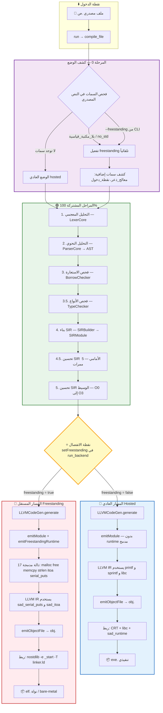

# هيكل مترجم sadc — التوثيق الشامل

> **الإصدار:** 1.1  
> **التاريخ:** يوليو 2025  
> **النطاق:** جميع ملفات المترجم في `compiler_new/` و `tools/compiler/`

---

## نظرة عامة

مترجم `sadc` يحوّل كود لغة ص (`.ص`) إلى ملف تنفيذي أصلي عبر LLVM 18.
المترجم مقسّم إلى مكونين رئيسيين:

- **النواة** (`compiler_new/`): تحويل AST → SIR → LLVM IR → كود أصلي
- **الواجهة** (`tools/compiler/`): تحليل سطر الأوامر، إدارة الربط، تشخيصات

---

## مسار التشغيل (Pipeline)

```
ملف .ص ──→ [مرحلة 0] ──→ [مرحلة 1] ──→ [مرحلة 2] ──→ [مرحلة 3] ──→ [مرحلة 4] ──→ [مرحلة 5] ──→ [مرحلة 6] ──→ .exe

المراحل:
═══════

[0] كشف الوضع (Freestanding Detection)
    المكان: compiler_driver_analysis.cpp (سطر 118-335)
    المدخل: نص مصدري خام
    المخرج: تفعيل/عدم تفعيل وضع freestanding
    ─────────────────────────────────────────
    └── فحص #![بلا_مكتبة_قياسية] أو #![no_std]
    └── كشف سمات: #[معالج_ذعر], #[نقطة_دخول], #[معالج_تخصيص]
    └── تعيين no_main, abort_on_panic, freestanding_entry

[1] التحليل المعجمي والنحوي (Lexer + Parser)
    المكان: shared/lexer/ + shared/parser/
    المدخل: كود مصدر .ص
    المخرج: شجرة AST (Abstract Syntax Tree)
    ─────────────────────────────────────────
    └── LexerCore → رموز (tokens) → ParserCore → AST

[2] فحص الاستعارة والأنواع (Semantic Analysis)
    المكان: compiler_new/src/semantic/ (10 ملفات، 7,813 سطر)
    المدخل: AST
    المخرج: AST مُفحوص + تقرير أخطاء
    ─────────────────────────────────────────
    └── borrow_checker.cpp (1,487 سطر) — فحص الملكية والاستعارة (NLL)
    └── type_checker.cpp (1,911 سطر) — فحص الأنواع المتقدم
    └── ownership_tracker, move_analyzer, lifetime_analyzer
    └── exhaustiveness.cpp — شمولية مطابقة الأنماط

[3] بناء SIR (SIR Builder)
    المكان: compiler_new/src/frontend/ (42 ملف، 27,816 سطر)
    المدخل: AST
    المخرج: وحدة SIR (Sad Intermediate Representation)
    ─────────────────────────────────────────
    └── SIRBuilder يمر على AST ويولّد تعليمات SIR
    └── SIR = تمثيل وسيط ملكي بـ 12 تعليمة أساسية
    └── الملف الرئيسي: sir_builder_module.cpp → buildModule()
    └── التعبيرات: sir_builder_expressions_dispatch.cpp + 7 ملفات expr_*
    └── الجمل: sir_builder_statements.cpp + stmt_advanced + stmt_exceptions + stmt_generators + stmt_types
    └── الأصناف: sir_builder_classes.cpp (1,947 سطر)
    └── التحكم: sir_builder_control_flow + control_branch + control_match

[4] التحسين الوسيط (Middle-End Optimization)
    المكان: compiler/src/sir_optimizer/ (13 ملف، 6,468 سطر) + src/optimizer/ (6 ملفات، 3,249 سطر)
    المدخل: SIR Module
    المخرج: SIR Module محسّن
    ─────────────────────────────────────────
    └── SIR Frontend Optimizer — 5 ممرات أمامية (sir_frontend_optimizer.cpp)
    └── SIR Optimizer — تمريرات حسب مستوى التحسين:
        ├── O0: بدون تحسين
        ├── O1: طي الثوابت + إزالة الكود الميت
        ├── O2: O1 + نشر النسخ + CSE + LICM + تخفيض القوة
        └── O3: O2 + دمج السجلات

[5] توليد LLVM IR (LLVM Code Generation)
    المكان: compiler_new/src/backend/llvm/ (55 ملف، 34,109 سطر)
    المدخل: SIR Module
    المخرج: LLVM Module (IR)
    ─────────────────────────────────────────
    └── llvm_codegen_init.cpp — التهيئة + generate() + emitModule()
    └── llvm_codegen_freestanding*.cpp — وقت تشغيل مستقل (ملفان: ذاكرة/نصوص + I/O/تحويلات)
    └── arabic_optimizer.cpp — تحسينات Unicode/عربية
    └── + تمريرات Coroutine (لدعم غير_متزامن/انتظر)
    └── ⭐ هنا ينفصل المسار العادي عن المستقل

[6] الربط (Linking)
    المكان: tools/compiler/
    المدخل: LLVM Module أو ملف .obj
    المخرج: ملف تنفيذي (.exe / .elf)
    ─────────────────────────────────────────
    └── compiler_driver_linker.cpp — ربط عبر رابط النظام
    └── compiler_driver_lld.cpp — ربط عبر LLD مدمج
    └── compiler_driver_android_linker.cpp — ربط لـ Android NDK
    └── sad_embedded_runtime.c — مكتبة وقت التشغيل المضمّنة (752 سطر)
    └── ⭐ في Freestanding: -nostdlib -nostartfiles -e _start
```

---

## هيكل المجلدات

### النواة (`compiler_new/`)

```
compiler_new/
├── include/                    # ملفات الرؤوس (128 ملف، 38,277 سطر)
│   ├── backend/llvm/           # رؤوس LLVM CodeGen
│   ├── frontend/               # رؤوس SIR Builder
│   ├── semantic/               # رؤوس التحليل الدلالي
│   ├── types/                  # نظام الأنواع المتقدم
│   ├── middle/                 # رؤوس التحسين الأوسط
│   ├── jit/                    # محرك JIT
│   ├── bytecode/               # صيغة البايت كود
│   ├── ffi/                    # واجهة C الخارجية
│   ├── memory/                 # إدارة الذاكرة
│   ├── security/               # فحص الأمان
│   ├── pipeline/               # خط الترجمة + freestanding_codegen.h
│   └── kernel/                 # دعم وضع النواة
│
├── src/                        # ملفات التنفيذ
│   ├── frontend/               # SIR Builder (42 ملف، 27,816 سطر)
│   │   ├── sir_builder_module.cpp             # نقطة الدخول — buildModule() (1,444)
│   │   ├── sir_builder_expressions_dispatch.cpp # توزيع التعبيرات (457)
│   │   ├── sir_builder_expr_*.cpp             # أنواع التعبيرات (7 ملفات)
│   │   │   ├── _collections.cpp (413)  _comprehensions.cpp (809)
│   │   │   ├── _functional.cpp (381)   _index.cpp (717)
│   │   │   ├── _lowlevel.cpp (413)     _members.cpp (251)
│   │   │   └── _nullsafety.cpp (461)
│   │   ├── sir_builder_calls.cpp              # استدعاءات الدوال العادية (1,036)
│   │   ├── sir_builder_calls_objects.cpp       # إنشاء كائنات + وصول أعضاء + طرائق (952)
│   │   ├── sir_builder_classes.cpp            # الأصناف والوراثة (1,947)
│   │   ├── sir_builder_control_*.cpp          # جمل التحكم (3 ملفات)
│   │   │   ├── _flow.cpp (1,245)  _branch.cpp (1,143)  _match.cpp (1,596)
│   │   ├── sir_builder_operators.cpp          # العوامل (1,605)
│   │   ├── sir_builder_builtins_*.cpp         # دوال مدمجة (11 ملف)
│   │   │   ├── _core.cpp  _system.cpp  _strings.cpp  _async.cpp (471)
│   │   │   ├── _os_core.cpp (226)  _os_hardware.cpp (328)
│   │   │   ├── _os_system.cpp (369)  _uefi.cpp (713)
│   │   ├── sir_builder_stmt_*.cpp             # أنواع الجمل (4 ملفات)
│   │   └── sir_frontend_optimizer.cpp         # محسّن أمامي (1,158)
│   │
│   ├── backend/                # توليد الكود (81 ملف، 50,708 سطر)
│   │   ├── llvm/               # LLVM CodeGen (55 ملف، 34,109 سطر)
│   │   │   ├── llvm_codegen_init.cpp           # المنشئ والتهيئة (1,371)
│   │   │   ├── llvm_codegen_functions.cpp      # الدوال والثوابت (924)
│   │   │   ├── llvm_codegen_instructions.cpp   # التعليمات (1,356)
│   │   │   ├── llvm_codegen_arithmetic.cpp     # الحساب والمقارنة (1,176)
│   │   │   ├── llvm_codegen_memory_control.cpp # Load/Store الأساسي (728)
│   │   │   ├── llvm_codegen_alloca_move.cpp    # Alloca/Move (597)
│   │   │   ├── llvm_codegen_store.cpp          # Store (617)
│   │   │   ├── llvm_codegen_branch_call.cpp    # Branch/Call (810)
│   │   │   ├── llvm_codegen_output.cpp         # Return/Switch/إخراج (1,631)
│   │   │   ├── llvm_codegen_hardware_ffi.cpp   # Port I/O, VGA, FFI (1,238)
│   │   │   ├── llvm_codegen_builtins.cpp       # طباعة/رياضيات (1,077)
│   │   │   ├── llvm_codegen_builtin_funcs.cpp  # دوال مدمجة إضافية (464)
│   │   │   ├── llvm_codegen_concurrency.cpp    # قنوات/mutex/خيوط (1,780)
│   │   │   ├── llvm_codegen_objects_arrays.cpp # أصناف ومصفوفات (712)
│   │   │   ├── llvm_codegen_array_ops.cpp      # عمليات المصفوفات (610)
│   │   │   ├── llvm_codegen_type_conversions.cpp # تحويلات الأنواع (473)
│   │   │   ├── llvm_codegen_enum_ops.cpp       # عمليات التعدادات (632)
│   │   │   ├── llvm_codegen_string_ops.cpp     # عمليات النصوص (982)
│   │   │   ├── llvm_codegen_array_file_coro.cpp # مصفوفات/ملفات/coroutines (1,550)
│   │   │   ├── llvm_codegen_freestanding.cpp   # ذاكرة ونصوص مستقلة (588)
│   │   │   ├── llvm_codegen_freestanding_io.cpp # I/O وتحويلات مستقلة (1,178)
│   │   │   ├── llvm_codegen_lowlevel.cpp       # عمليات منخفضة (1,382)
│   │   │   ├── arabic_optimizer.cpp            # تحسينات عربية (659)
│   │   │   ├── arabic_string_pool.cpp          # تجميع النصوص (778)
│   │   │   └── ... (32 ملف إضافي)
│   │   ├── wasm_direct/        # WebAssembly مباشر
│   │   └── ... (ملفات أخرى)
│   │
│   ├── middle/                 # التحسين الأوسط (13 ملف، 6,468 سطر)
│   ├── optimizer/              # محسّن عام (6 ملفات، 3,249 سطر)
│   ├── semantic/               # التحليل الدلالي (10 ملفات، 7,813 سطر)
│   ├── types/                  # نظام الأنواع (38 ملف، 15,452 سطر)
│   ├── sir/                    # طبقة SIR (8 ملفات، 5,279 سطر)
│   ├── jit/                    # محرك JIT (11 ملف، 7,176 سطر)
│   ├── bytecode/               # بايت كود (10 ملفات، 6,724 سطر)
│   ├── memory/                 # إدارة الذاكرة (5 ملفات، 2,918 سطر)
│   ├── borrow/                 # فحص الاستعارة (3 ملفات، 2,224 سطر)
│   ├── security/               # أمان (3 ملفات، 2,848 سطر)
│   ├── pipeline/               # خط ترجمة (5 ملفات، 4,104 سطر)
│   ├── diagnostics/            # تشخيصات (3 ملفات، 1,283 سطر)
│   ├── ffi/                    # FFI (2 ملفات، 996 سطر)
│   ├── targets/                # منصات (8 ملفات، 5,654 سطر)
│   └── ... (abstraction, comptime, format, meta)
│
└── tests/                      # اختبارات وحدة
```

### الواجهة (`tools/compiler/`)

```
tools/compiler/
├── main.cpp                        # نقطة الدخول (102 سطر)
├── compiler_driver.h               # الرأس الموحد (819 سطر)
├── compiler_driver_frontend.cpp    # الواجهة الرئيسية: run, compile, link (587 سطر)
├── compiler_driver_analysis.cpp    # تحليل أمامي: lex, parse, SIR (672 سطر)
├── compiler_driver_backend.cpp     # توليد LLVM + تحسين وسيط (592 سطر)
├── compiler_driver_cli.cpp         # تحليل سطر الأوامر (625 سطر)
├── compiler_driver_diagnostics.cpp # الألوان والتشخيصات (369 سطر)
├── compiler_driver_linker.cpp      # الربط العام (754 سطر)
├── compiler_driver_lld.cpp         # LLD مدمج (298 سطر)
├── compiler_driver_build_utils.cpp # أدوات بناء مساعدة (480 سطر)
├── compiler_driver_pkg.cpp         # مدير الحزم (770 سطر)
├── compiler_driver_ui.cpp          # توليد واجهات UI (750 سطر)
├── compiler_driver_android.cpp     # Android target (560 سطر)
├── compiler_driver_android_linker.cpp # ربط Android (395 سطر)
├── main_simple.cpp                 # نسخة مبسطة (475 سطر)
├── runtime/
│   └── sad_embedded_runtime.c      # مكتبة وقت التشغيل المضمّنة (752 سطر)
├── src/                            # أوامر CLI وأدوات (12 ملف، 9,574 سطر)
│   ├── cli_commands.cpp            # أوامر CLI الرئيسية (1,168 سطر)
│   ├── cli_mobile_manager.cpp      # إدارة مشاريع الهاتف (1,165 سطر)
│   ├── bindgen.cpp                 # توليد FFI تلقائي (1,483 سطر)
│   ├── mobile_project_gen.cpp      # مولّد مشاريع الهاتف (945 سطر)
│   ├── android_target.cpp          # هدف Android (829 سطر)
│   ├── test_command.cpp            # أمر test (778 سطر)
│   ├── ios_target.cpp              # هدف iOS (649 سطر)
│   ├── add_command.cpp             # أمر add (638 سطر)
│   ├── publish_command.cpp         # أمر publish (622 سطر)
│   ├── new_command.cpp             # أمر new (594 سطر)
│   ├── run_command.cpp             # أمر run (484 سطر)
│   └── build_command.cpp           # أمر build (219 سطر)
└── include/
    └── bindgen.h                   # رأس bindgen (647 سطر)
```

---

## SIR — التمثيل الوسيط الملكي

SIR (Sad Intermediate Representation) هو تمثيل وسيط خاص بلغة ص.
يقع بين AST (عالي المستوى) و LLVM IR (منخفض المستوى).

### لماذا SIR؟
1. **تحسينات خاصة باللغة** — يمكن تحسين أنماط عربية قبل LLVM
2. **فصل الطبقات** — تغييرات AST لا تؤثر مباشرة على LLVM CodeGen
3. **تحليلات متقدمة** — فحص الملكية والاستعارة على SIR أسهل
4. **تعدد المنصات** — SIR واحد يُترجم لـ LLVM أو WASM أو Bytecode

### تعليمات SIR الأساسية (12)
تعريفها في `compiler_new/src/sir/sir_opcodes.h` (1,040 سطر):

| التعليمة | الوصف |
|----------|-------|
| `SIR_ALLOC` | تخصيص ذاكرة |
| `SIR_LOAD` | تحميل قيمة |
| `SIR_STORE` | تخزين قيمة |
| `SIR_ADD/SUB/MUL/DIV` | عمليات حسابية |
| `SIR_CMP` | مقارنة |
| `SIR_BRANCH` | تفرع شرطي |
| `SIR_JUMP` | قفز غير شرطي |
| `SIR_CALL` | استدعاء دالة |
| `SIR_RET` | إرجاع |
| `SIR_PHI` | عقدة φ (للـ SSA) |

---

## مسارات التنفيذ — عادي vs. مستقل (Freestanding)

المترجم يدعم وضعين رئيسيين للتنفيذ:
- **الوضع العادي (Hosted)**: يعتمد على مكتبة C القياسية (libc) ونظام التشغيل
- **الوضع المستقل (Freestanding)**: بدون أي مكتبة قياسية — لأنوية أنظمة التشغيل والأنظمة المدمجة

### تفعيل الوضع المستقل

يُفعَّل بإحدى الطرق:
1. **من سطر الأوامر**: `sadc --freestanding program.ص` أو `sadc --no-std program.ص`
2. **من الكود المصدري**: سمة `#![بلا_مكتبة_قياسية]` أو `#![no_std]`

### مخطط المسارات



### النقاط الحاسمة

#### آخر نقطة مشتركة: نهاية `run_middleend()`

جميع المراحل من التحليل المعجمي حتى تحسين SIR مشتركة 100% بين الوضعين.
الوحدة SIR المحسّنة متطابقة بغض النظر عن الوضع.

#### نقطة الانفصال الرئيسية: `setFreestanding()` في `run_backend()`

الملف: `compiler_driver_backend.cpp` سطر 242:
```cpp
llvm_codegen_->setFreestanding(options_.freestanding);
```

هذا السطر يُفعّل العلم `freestanding_` في `LLVMCodeGen`، ومنه تتفرع كل قرارات توليد الكود.

#### الانفصال الأول: `emitModule()` → `emitFreestandingRuntime()`

الملف: `llvm_codegen_init.cpp` سطر 830:
```cpp
if (freestanding_) {
    emitFreestandingRuntime();  // يولّد 17 دالة C مدمجة في LLVM IR
}
```

#### دوال Freestanding المدمجة (17 دالة)

| الفئة | الدوال | البديل في الوضع العادي |
|-------|--------|------------------------|
| ذاكرة | `malloc`, `free`, `realloc`, `calloc`, `memcpy`, `memset` | libc |
| نصوص | `strlen`, `strcmp`, `strcpy`, `strcat` | libc |
| تحويل | `__sad_itoa`, `__sad_ftoa`, `__sad_xtoa` | `sprintf` |
| إخراج | `__sad_serial_puts`, `__sad_serial_putint` | `printf` |
| رياضيات | `pow` | libm |

#### التفرعات داخل توليد الكود

| الملف | ماذا يتغيّر |
|-------|-------------|
| `llvm_codegen_builtins.cpp` | `اطبع()` → `__sad_serial_puts` بدل `printf` |
| `llvm_codegen_type_conversions.cpp` | تحويل رقم→نص: `__sad_itoa` بدل `sprintf` |
| `llvm_codegen_output.cpp` | الطباعة الداخلية: نفس التبديل |
| `llvm_codegen_freestanding.cpp` | كل التطبيقات المدمجة |

#### الانفصال الثاني: مرحلة الربط

| الوضع العادي | الوضع المستقل |
|-------------|---------------|
| يربط مع libc, CRT, المكتبات | `-nostdlib -nostartfiles -nodefaultlibs` |
| نقطة الدخول: `main()` | نقطة الدخول: `_start` (أو مخصصة) |
| لا يحتاج linker script | يدعم `-T <script>` لتخطيط الذاكرة |

#### سمات Freestanding الإضافية

| السمة | الوظيفة |
|-------|---------|
| `#![بلا_مكتبة_قياسية]` / `#![no_std]` | تفعيل الوضع المستقل |
| `#![بلا_رئيسية]` | تعطيل `main()` بشكل مستقل |
| `#![نقطة_دخول="kernel_main"]` | نقطة دخول مخصصة |
| `#[معالج_ذعر]` | دالة معالجة الذعر (مطلوبة) |
| `#[معالج_تخصيص]` | دالة معالجة فشل التخصيص (مع `--allow-alloc`) |
| `#[معالج_مقاطعة]` | معالج مقاطعات (ISR) |

---

## أوامر البناء

```powershell
# بناء sadc (يتطلب LLVM 18)
cmake -S . -B build -DENABLE_LLVM_BACKEND=ON
cmake --build build --config Release --target sad-build

# استخدام sadc
sadc program.ص -o program.exe           # ترجمة عادية
sadc program.ص -O3 -o program.exe       # مع تحسينات
sadc program.ص --emit-llvm -o out.ll    # إخراج LLVM IR
sadc program.ص -c -o out.obj            # ترجمة بدون ربط
sadc program.ص --freestanding -o kernel  # بدون مكتبة قياسية
```

---

## الإحصائيات (يوليو 2025 — مُحدَّث بعد تقسيم 3 ملفات كبيرة)

### النواة (`compiler_new/`)

| المكون | المجلد | الملفات | الأسطر |
|--------|--------|---------|--------|
| الرؤوس | `include/` | 128 | 38,277 |
| SIR Builder | `src/frontend/` | 42 | 27,816 |
| LLVM CodeGen | `src/backend/llvm/` | 55 | 34,109 |
| Backend (كل) | `src/backend/` | 81 | 50,708 |
| التحسين الوسيط | `src/middle/` | 13 | 6,468 |
| المحسّن العام | `src/optimizer/` | 6 | 3,249 |
| التحليل الدلالي | `src/semantic/` | 10 | 7,813 |
| نظام الأنواع | `src/types/` | 38 | 15,452 |
| طبقة SIR | `src/sir/` | 8 | 5,279 |
| JIT | `src/jit/` | 11 | 7,176 |
| بايت كود | `src/bytecode/` | 10 | 6,724 |
| الذاكرة | `src/memory/` | 5 | 2,918 |
| الاستعارة | `src/borrow/` | 3 | 2,224 |
| الأمان | `src/security/` | 3 | 2,848 |
| خط الترجمة | `src/pipeline/` | 5 | 4,104 |
| التشخيصات | `src/diagnostics/` | 3 | 1,283 |
| FFI | `src/ffi/` | 2 | 996 |
| المنصات | `src/targets/` | 8 | 5,654 |
| **المجموع (src)** | | **~252** | **~149,271** |
| **المجموع (include + src)** | | **~380** | **~187,548** |

### الواجهة (`tools/compiler/`)

| المكون | الملفات | الأسطر |
|--------|---------|--------|
| Driver (رئيسي) | 15 | 8,248 |
| CLI + أوامر | 12 | 9,574 |
| Runtime مضمّن | 1 | 752 |
| **المجموع** | **28** | **18,574** |

### الإجمالي

| | الملفات | الأسطر |
|---|---------|--------|
| compiler_new/ | ~380 | ~187,548 |
| tools/compiler/ | ~28 | ~18,574 |
| **المجموع الكلي** | **~408** | **~206,122** |

---

## ملاحظات مهمة

1. **LLVM اختياري** — يُفعّل بـ `ENABLE_LLVM_BACKEND=ON`، محميّ بـ `#ifdef HAS_LLVM`
2. **ملف الرأس الرئيسي** `llvm_codegen.h` يحتوي صف `LLVMCodeGen` بكل الواجهات
3. **sadc يُبنى بـ Release فقط** — مكتبات LLVM متوفرة فقط في Release
4. **sad_embedded_runtime.c** يُضمّن في sadc عبر `cmake/embed_runtime.cmake`
5. **نظام الأنواع** غني جداً (38 ملف): generics, traits, unions, optional, future, generator
6. **CMake يستخدم `file(GLOB)`** — يجب تشغيل `cmake -S . -B build` بعد إضافة ملفات جديدة
7. **الملفات الكبيرة** — تم تقسيم جميع الملفات >2000 سطر. أكبر ملفات الـ backend حالياً:
   - `llvm_codegen_concurrency.cpp` (1,780)
   - `llvm_codegen_output.cpp` (1,631)
   - `llvm_codegen_freestanding_io.cpp` (1,178)
8. **وحدة `runtime_new/`** نشطة ومستخدمة — توفر ABI/FFI المستقل + ربط VM، تُفعَّل بـ `HAS_RUNTIME_NEW` (مسجلة في cmake/sources.cmake وcmake/libraries.cmake)
9. **الوضع المستقل (freestanding)** يولّد 18 دالة C مدمجة في LLVM IR بدلاً من الاعتماد على libc (مقسمة على ملفين: ذاكرة/نصوص + I/O/تحويلات)
