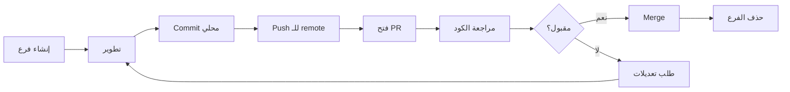

# 🔄 دليل سير العمل والمراجعة

**تاريخ الإنشاء:** 4 نوفمبر 2025  
**آخر تحديث:** 4 نوفمبر 2025

---

## 📋 جدول المحتويات

1. [سياسة الفروع](#سياسة-الفروع)
2. [معايير الـ Commits](#معايير-الـ-commits)
3. [عملية Pull Request](#عملية-pull-request)
4. [مراجعة الكود](#مراجعة-الكود)
5. [الدمج (Merge)](#الدمج-merge)
6. [حل النزاعات](#حل-النزاعات)

---

## 🌿 سياسة الفروع

### الفروع الرئيسية

```
main (أو master)
  ├── develop (فرع التطوير الرئيسي)
  ├── feat/... (فروع الميزات)
  ├── fix/... (فروع الإصلاحات)
  ├── docs/... (فروع التوثيق)
  └── test/... (فروع الاختبارات)
```

### قواعد تسمية الفروع

#### 1. فروع الميزات (Features)
```
feat/<component>/<short-description>
```

**أمثلة:**
- `feat/parser/ast-nodes`
- `feat/interpreter/eval-expressions`
- `feat/stdlib/math-library`
- `feat/lexer/utf8-support`

#### 2. فروع الإصلاحات (Bug Fixes)
```
fix/<component>/<issue-description>
```

**أمثلة:**
- `fix/lexer/string-escape`
- `fix/parser/operator-precedence`
- `fix/interpreter/variable-scope`

#### 3. فروع التوثيق (Documentation)
```
docs/<topic>
```

**أمثلة:**
- `docs/api-reference`
- `docs/tutorial-basics`
- `docs/architecture-update`

#### 4. فروع الاختبارات (Testing)
```
test/<component>/<test-type>
```

**أمثلة:**
- `test/lexer/unit-tests`
- `test/parser/integration-tests`

---

### دورة حياة الفرع



---

### أوامر إنشاء الفرع

#### من main/develop:
```powershell
# تحديث الفرع الأساسي
cd C:\s\s_language
git checkout develop
git pull origin develop

# إنشاء فرع جديد
git checkout -b feat/parser/ast-nodes

# التأكد من الفرع الحالي
git branch --show-current
```

#### التبديل بين الفروع:
```powershell
# حفظ التغييرات الحالية
git stash

# التبديل لفرع آخر
git checkout feat/lexer/keywords

# استرجاع التغييرات
git stash pop
```

---

## 💬 معايير الـ Commits

### تنسيق رسالة Commit القياسي

```
[component] Short description (≤50 chars)

Detailed explanation (optional):
- What was changed
- Why it was changed
- Any breaking changes

Related: #issue-number
```

### أمثلة صحيحة:

✅ **جيد:**
```
[lexer] add UTF-8 support for Arabic identifiers

- Implement isArabicLetter() helper
- Update scanIdentifier() to handle UTF-8
- Add tests for Arabic variable names

Related: #23
```

✅ **جيد (بسيط):**
```
[parser] fix operator precedence for multiplication
```

✅ **جيد (بالعربية):**
```
[مفسر] إضافة دعم الدوال المتداخلة
```

### أمثلة خاطئة:

❌ **سيء:**
```
fixed bug
```

❌ **سيء:**
```
[lexer] update lexer_core.cpp and add new features and fix some bugs and refactor code
```

---

### أنواع Commits

| النوع | الوصف | مثال |
|-------|-------|------|
| `[feat]` | ميزة جديدة | `[feat] add while loop support` |
| `[fix]` | إصلاح خطأ | `[fix] handle division by zero` |
| `[docs]` | توثيق | `[docs] update API reference` |
| `[test]` | اختبارات | `[test] add parser unit tests` |
| `[refactor]` | إعادة هيكلة | `[refactor] simplify Value class` |
| `[style]` | تنسيق | `[style] apply clang-format` |
| `[perf]` | تحسين أداء | `[perf] optimize tokenize loop` |
| `[chore]` | صيانة | `[chore] update CMakeLists` |

---

### أوامر Commit

#### Commit بسيط:
```powershell
git add src/parser/parser_core.cpp
git commit -m "[parser] implement peek() and advance()"
```

#### Commit مع وصف مفصل:
```powershell
git add include/lexer/*.h src/lexer/*.cpp
git commit
# سيفتح محرر نصي لكتابة رسالة مفصلة
```

#### تعديل آخر commit:
```powershell
# إضافة ملفات نسيتها
git add forgotten_file.cpp
git commit --amend --no-edit

# تعديل الرسالة
git commit --amend -m "[parser] new message"
```

#### Commit تفاعلي:
```powershell
# استعراض التغييرات قبل الـ commit
git add -p
# ثم commit
git commit -m "[lexer] add number parsing"
```

---

## 🔀 عملية Pull Request

### خطوات فتح PR

#### 1. التأكد من جاهزية الكود
```powershell
# تشغيل الاختبارات محلياً
cd C:\s\s_language\build
cmake .. -DCMAKE_BUILD_TYPE=Debug -DDEBUG=ON
cmake --build . --config Debug
ctest --output-on-failure -C Debug

# التأكد من التنسيق
Get-ChildItem -Path ..\src,..\include -Recurse -Include *.cpp,*.h | 
    ForEach-Object { clang-format -i $_.FullName }

# التأكد من عدم وجود أخطاء
# (إذا كان clang-tidy مُثبت)
clang-tidy src/**/*.cpp -- -I include/
```

#### 2. Push الفرع
```powershell
# تحديث من develop أولاً
git checkout develop
git pull origin develop

# العودة لفرعك
git checkout feat/parser/ast-nodes

# Rebase على develop (اختياري)
git rebase develop

# Push
git push origin feat/parser/ast-nodes

# أو إذا كانت أول مرة
git push --set-upstream origin feat/parser/ast-nodes
```

#### 3. فتح PR على GitHub

انتقل إلى:
```
https://github.com/<username>/s_language/compare/develop...feat/parser/ast-nodes
```

املأ:
- **العنوان:** `[Parser] Add AST base nodes`
- **الوصف:** استخدم [قالب PR](06_TEMPLATES.md#قالب-pull-request)

---

### معايير PR المقبول

#### ✅ Checklist قبل فتح PR:

- [ ] جميع الاختبارات تمر محلياً
- [ ] الكود منسق (clang-format)
- [ ] التوثيق محدث (Doxygen)
- [ ] DEBUG_PRINT مضاف في الدوال الرئيسية
- [ ] لا توجد تحذيرات compiler
- [ ] PR مرتبط بـ issue (إن وُجد)
- [ ] الوصف واضح وشامل
- [ ] لقطات شاشة/لوج مرفقة (إن لزم)

#### 📏 حجم PR المثالي:

| الحجم | الملفات | الأسطر | التقييم |
|-------|---------|--------|----------|
| صغير | 1-3 | <200 | ✅ ممتاز |
| متوسط | 4-8 | 200-500 | ✅ جيد |
| كبير | 9-15 | 500-1000 | ⚠️ مقبول |
| ضخم | >15 | >1000 | ❌ قسّمه |

💡 **نصيحة:** PRs الصغيرة تُراجع أسرع وتُدمج بسهولة أكبر!

---

### Labels (تصنيفات)

| Label | الوصف | متى تستخدمه |
|-------|-------|-------------|
| `priority: high` | أولوية عالية | ميزة أساسية أو إصلاح حرج |
| `priority: medium` | أولوية متوسطة | ميزة مهمة |
| `priority: low` | أولوية منخفضة | تحسينات أو ميزات إضافية |
| `type: feature` | ميزة جديدة | إضافة وظيفة جديدة |
| `type: bugfix` | إصلاح خطأ | إصلاح bug |
| `type: docs` | توثيق | تحديث توثيق |
| `type: test` | اختبارات | إضافة/تحسين اختبارات |
| `component: lexer` | المحلل المعجمي | تعديلات على Lexer |
| `component: parser` | المحلل النحوي | تعديلات على Parser |
| `component: interpreter` | المفسر | تعديلات على Interpreter |
| `status: needs-review` | يحتاج مراجعة | جاهز للمراجعة |
| `status: work-in-progress` | قيد العمل | غير جاهز بعد |
| `status: blocked` | محظور | ينتظر PR آخر |

---

## 👀 مراجعة الكود

### دور المراجع (Reviewer)

#### المسؤوليات:
1. ✅ التحقق من صحة الكود
2. ✅ فحص الجودة والتنسيق
3. ✅ التأكد من وجود اختبارات
4. ✅ مراجعة التوثيق
5. ✅ اقتراح تحسينات

#### ما الذي يُفحص:

##### 1. الصحة الوظيفية
```cpp
// ❌ سيء - لا يعالج حالة القسمة على صفر
Value Value::operator/(const Value& other) const {
    return Value(this->toDouble() / other.toDouble());
}

// ✅ جيد
Value Value::operator/(const Value& other) const {
    if (other.toDouble() == 0.0) {
        throw std::runtime_error("Division by zero");
    }
    return Value(this->toDouble() / other.toDouble());
}
```

##### 2. جودة الكود
```cpp
// ❌ سيء - أسماء غير واضحة
int x = 5;
for (int i = 0; i < x; i++) {
    // ...
}

// ✅ جيد
const int MAX_ITERATIONS = 5;
for (int iteration = 0; iteration < MAX_ITERATIONS; iteration++) {
    // ...
}
```

##### 3. التوثيق
```cpp
// ❌ سيء - بدون توثيق
Token advance();

// ✅ جيد
/**
 * @brief (AR) التقدم للرمز التالي
 * @brief (EN) Advance to next token
 * @return (Token) الرمز الحالي قبل التقدم / Current token before advancing
 * @throws std::out_of_range إذا وصلنا لنهاية الملف / If at end of file
 */
Token advance();
```

##### 4. الاختبارات
```cpp
// ❌ سيء - اختبار واحد فقط
TEST(LexerTest, BasicTest) {
    // ...
}

// ✅ جيد - اختبارات شاملة
TEST(LexerTest, TokenizeInteger) { /* ... */ }
TEST(LexerTest, TokenizeDouble) { /* ... */ }
TEST(LexerTest, TokenizeString) { /* ... */ }
TEST(LexerTest, TokenizeStringWithEscape) { /* ... */ }
TEST(LexerTest, HandleUnclosedString) { /* ... */ }
```

---

### عملية المراجعة

#### 1. استلام PR للمراجعة
```powershell
# Fetch الفرع
git fetch origin feat/parser/ast-nodes

# Checkout للمراجعة
git checkout feat/parser/ast-nodes

# البناء والاختبار
cd build
cmake .. -DCMAKE_BUILD_TYPE=Debug -DDEBUG=ON
cmake --build . --config Debug
ctest --output-on-failure
```

#### 2. مراجعة على GitHub

**أنواع التعليقات:**

| النوع | الوصف | مثال |
|-------|-------|------|
| 💬 **Comment** | ملاحظة عامة | "هل فكرت في استخدام std::optional هنا؟" |
| ✅ **Approve** | موافقة | "LGTM (Looks Good To Me)" |
| 🔄 **Request Changes** | طلب تعديلات | "يرجى إضافة معالجة الأخطاء" |
| 💡 **Suggestion** | اقتراح | "يمكن تبسيط هذا باستخدام range-for loop" |

#### 3. صيغ التعليقات

**✅ تعليقات بناءة:**
```
# جيد
"يمكن تحسين الأداء هنا باستخدام unordered_map بدلاً من map"

# جيد
"هل يمكن إضافة اختبار لحالة الإدخال الفارغ؟"

# جيد
"التوثيق ممتاز! فقط صغيّر مثال الاستخدام قليلاً"
```

**❌ تعليقات سيئة:**
```
# سيء
"هذا الكود سيء"

# سيء
"لماذا فعلت هكذا؟ استخدم طريقتي"

# سيء
"غيّر كل شيء"
```

---

### Reviewer Checklist

#### قبل الموافقة:

- [ ] الكود يبني بدون أخطاء
- [ ] جميع الاختبارات تمر
- [ ] التوثيق موجود وواضح
- [ ] لا توجد مشاكل أمنية
- [ ] الكود يتبع نمط المشروع
- [ ] الأسماء واضحة ومعبرة
- [ ] معالجة الأخطاء مناسبة
- [ ] لا توجد code smells
- [ ] الأداء مقبول
- [ ] DEBUG_PRINT في الأماكن المناسبة

---

## ✅ الدمج (Merge)

### شروط الدمج

يجب أن يُستوفى **جميع** الشروط التالية:

1. ✅ موافقة مراجع واحد على الأقل
2. ✅ CI يمر بنجاح
3. ✅ لا توجد merge conflicts
4. ✅ الفرع محدث من develop
5. ✅ جميع المحادثات مُحَلّة (resolved)

---

### استراتيجيات الدمج

#### 1. Merge Commit (مفضل)
```powershell
git checkout develop
git merge --no-ff feat/parser/ast-nodes
git push origin develop
```

**متى تستخدمه:**
- للميزات الكبيرة
- للحفاظ على تاريخ الفرع

**الشكل:**
```
  A---B---C feat/parser/ast-nodes
 /         \
D---E---F---G develop
```

#### 2. Squash and Merge
```powershell
git checkout develop
git merge --squash feat/parser/ast-nodes
git commit -m "[parser] Add AST nodes (squashed)"
git push origin develop
```

**متى تستخدمه:**
- للـ PRs الصغيرة
- لتنظيف commits كثيرة

**الشكل:**
```
  A---B---C feat/parser/ast-nodes
 /
D---E---F---G develop
            (A+B+C مدموجة في G)
```

#### 3. Rebase and Merge
```powershell
git checkout feat/parser/ast-nodes
git rebase develop
git push origin feat/parser/ast-nodes --force
# ثم merge من GitHub
```

**متى تستخدمه:**
- لتاريخ خطي نظيف
- للـ PRs المتوسطة

**الشكل:**
```
D---E---F---A'---B'---C' develop
```

---

### بعد الدمج

#### 1. حذف الفرع
```powershell
# حذف محلياً
git branch -d feat/parser/ast-nodes

# حذف من remote
git push origin --delete feat/parser/ast-nodes

# تنظيف الفروع المحذوفة من remote
git fetch --prune
```

#### 2. تحديث develop محلياً
```powershell
git checkout develop
git pull origin develop
```

#### 3. إغلاق الـ Issue المرتبط
إذا كان PR يحل issue:
```
Closes #23
```
أو
```
Fixes #23
```

---

## 🔧 حل النزاعات (Merge Conflicts)

### سيناريو Conflict

```
<<<<<<< HEAD (develop)
    std::cout << "من develop" << std::endl;
=======
    std::cout << "من feat/my-branch" << std::endl;
>>>>>>> feat/my-branch
```

---

### خطوات الحل

#### 1. تحديث develop
```powershell
git checkout develop
git pull origin develop
```

#### 2. Rebase فرعك
```powershell
git checkout feat/parser/ast-nodes
git rebase develop
```

#### 3. حل النزاعات يدوياً
افتح الملفات المتعارضة وحرر:
```cpp
// اختر ما تريد الإبقاء عليه
std::cout << "النسخة النهائية الصحيحة" << std::endl;
```

#### 4. إكمال Rebase
```powershell
git add <resolved-files>
git rebase --continue
```

#### 5. Force Push
```powershell
git push origin feat/parser/ast-nodes --force
```

---

### نصائح تجنب Conflicts

1. **Pull من develop بانتظام**
```powershell
git checkout develop
git pull
git checkout feat/your-branch
git rebase develop
```

2. **عمل PRs صغيرة**
- أقل ملفات = أقل احتمال للـ conflicts

3. **التواصل مع الفريق**
- أخبر الفريق إذا كنت تعمل على ملف كبير

4. **Commit بانتظام**
- Commits صغيرة أسهل في حل conflicts

---

## 📊 مقاييس الجودة

### Code Review Metrics

| المقياس | الهدف | الحالي |
|---------|-------|--------|
| وقت المراجعة | <24 ساعة | - |
| حجم PR | <500 سطر | - |
| Approval Rate | >80% | - |
| Rework Rate | <20% | - |

---

## 🎯 أفضل الممارسات

### للمطور (Author)

1. ✅ اجعل PR صغيرة ومركزة
2. ✅ اكتب وصف واضح
3. ✅ أضف لقطات شاشة/لوج
4. ✅ رد على التعليقات بسرعة
5. ✅ احترم آراء المراجعين
6. ✅ اختبر محلياً قبل Push

### للمراجع (Reviewer)

1. ✅ راجع بسرعة (خلال 24 ساعة)
2. ✅ كن بناءً ومحترماً
3. ✅ اشرح سبب التعديلات المطلوبة
4. ✅ ركز على الأمور المهمة
5. ✅ اقترح بدائل إن أمكن
6. ✅ اختبر الكود محلياً

---

## 📞 الحصول على المساعدة

### إذا واجهت مشكلة:

1. **راجع الوثائق:**
   - [الخطة الرئيسية](00_MASTER_PLAN.md)
   - [القوالب](06_TEMPLATES.md)

2. **اسأل في PR:**
   - ضع تعليق في PR
   - أو mention reviewer مباشرة: `@reviewer`

3. **افتح Issue:**
   - للأسئلة العامة
   - للمشاكل التقنية

---

**آخر تحديث:** 4 نوفمبر 2025  
**المرجع:** [الخطة الرئيسية](00_MASTER_PLAN.md)
